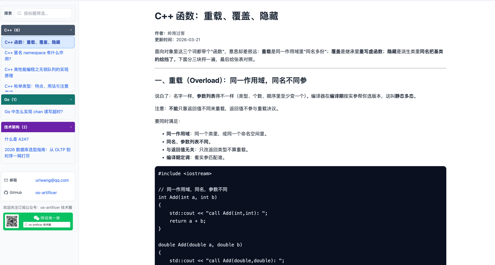

# ebooks 是什么？
算是我的知识沉淀与分享平台吧。

# ebooks 项目背景？
从2010年大学毕业开始就一直从事软件开发的工作，此前虽然一直忙忙碌碌，但是感觉什么也没有留下。

如今终于有些时间了，于是就希望把自己学到的知识进行记录沉淀。

此前也用过其他平台进行内容分享与展示，但是体验总是与自己想要的差一点，于是便有了本项目。

本项目不会有特别复杂的功能，仅聚焦于内容展示和内容检索。

# 如何写文章？
在drafts目录内进行内容创作，创作中仅需要写Markdown文件就可以。

# 如何发布？
当文章在drafts目录内创作完毕后，可以执行以下命令将其转换为html文件进行发布.
``` shell
# 仅发布一篇
python3 tools/publish_article.py drafts/cpp/某篇.md

# 发布全部
python3 tools/publish_article.py
```

文章发布时会自动更新导航栏：`web/articles/nav.json`。

# 项目运行效果


# 订阅更新？

官网：https://os-artificer.com/

