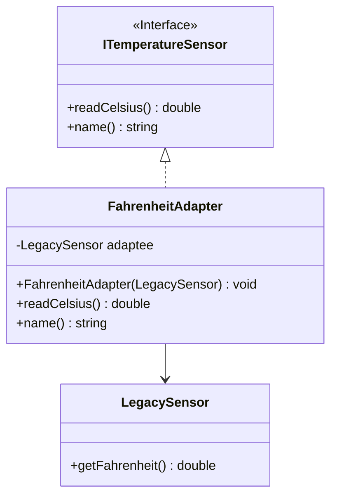
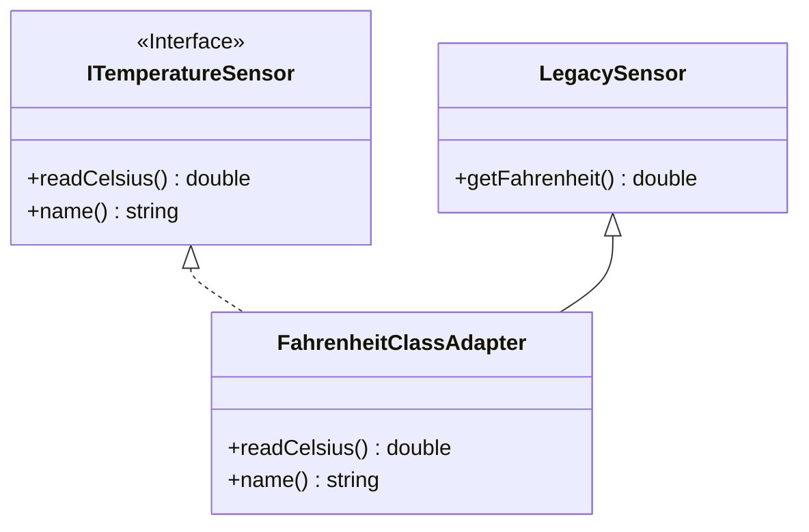

## C++ 设计模式实践：适配器模式——让不兼容的接口握手言和

作者：Artificer老王  |  更新时间：2026-07-26  |  阅读时长：约 13 分钟

你有没有接过这种活：Leader 说"把那个开源库接进来"，你一看它的 API——方法名不一样、参数顺序反了、单位还对不上（华氏度 vs 摄氏度），跟项目里现有的接口八竿子打不着。

你有没有写过这样的代码：为了用上这个库，在十几个调用点各包一层转换——传参前先 `toFahrenheit()`，拿到结果再 `toCelsius()`，方法名不对就写个 inline lambda 兜底……改一处接口，全项目跟着抖。

**适配器模式（Adapter Pattern）** 就是专门收拾这种"接口不对付"场面的——它在不修改双方代码的前提下，把一个类的接口转换成客户端期望的另一个接口，让原本因为接口不兼容而没法一起工作的类，能愉快协作。

---

## 🕳️ 先看问题：接口不兼容的尴尬

假设你项目里统一用 `ITemperatureSensor`（返回摄氏度），现在要接一个遗留的老传感器 `LegacySensor`，它只提供 `getFahrenheit()`（华氏度），方法名、单位都不对。

```cpp
// 反面教材：在调用方硬塞转换逻辑
class LegacySensor {
public:
    double getFahrenheit() const { return _f; }  // 只懂华氏度
};

void clientCode(LegacySensor& legacy) {
    // 每处调用都要手写单位换算，还得记住它叫 getFahrenheit（而不是项目里的 readCelsius）
    double c = (legacy.getFahrenheit() - 32.0) * 5.0 / 9.0;
    std::cout << "温度: " << c << " °C\n";
}
```

问题在哪儿？

- **转换逻辑散落调用方**：换算、改名散在十几个地方，重复且易错。
- **客户端被迫知道 Adaptee 细节**：本该面向统一接口，现在却耦合了老传感器的华氏度 API。
- **换实现要改客户端**：哪天换成另一个老库（返回开尔文），所有调用点重写。
- **无法面向抽象编程**：`clientCode` 直接依赖具体类，没法和多态、依赖注入搭配。

问题的本质：**客户端**和一个**接口不匹配的具体实现**耦合在了一起。适配器模式要做的，就是加一层"翻译"，把它们隔开。

---

## 🧩 适配器模式是什么

### 核心思想

**把一个类的接口，转换成客户端期望的另一种接口。适配器让原本因接口不兼容而无法协作的类，能一起工作。**

**"不改双方，加一层翻译"——客户端面向 Target，适配器在中间做桥。**

对比一下：

| 做法          | 本质        | 加新实现的代价        |
| ----------- | --------- | --------------- |
| 调用方硬转换      | 改客户端代码去迎合 Adaptee | 每处调用都要改（N 处）    |
| 适配器模式       | 加一个 Adapter 做翻译 | 只加一个适配器类（1 处）   |

### 适配器的三个核心角色

适配器模式只有三个角色，关系非常清晰：

- **Target（目标接口）**：客户端期望的接口。客户端只认它，不认 Adaptee。
- **Adapter（适配器）**：实现 Target 接口，内部持有/继承 Adaptee，把 Target 的调用"翻译"成对 Adaptee 的调用。
- **Adaptee（被适配者）**：已经存在、能干活、但接口不对的那个类。通常不能或不应修改（第三方库、遗留代码）。

关键点：**客户端完全不知道 Adaptee 的存在**——它以为自己在跟 Target 打交道，实际干活的是被 Adapter 包起来的 Adaptee。

---

## 🗺️ UML 类关系图

下面是对象适配器（组合方式）的类关系图。

`Adapter` 实现 `Target`，并持有 `Adaptee` 的引用；客户端面向 `Target` 调用，Adapter 在内部转发给 `Adaptee`。



再看类适配器（多继承方式）——Adapter 同时继承 Target 和 Adaptee，无需持有引用：



两张图配合看：对象适配器靠"组合 + 转发"，类适配器靠"多继承 + 直接调用"。

后者更紧凑，但侵入性更强。

---

## 🎯 能解决什么问题

### 复用现成实现，不改动双方

这是适配器的核心价值。

你有一个能干活但接口不对的类（第三方 SDK、遗留模块），**既不改它的代码（可能改不了），也不改客户端代码**，加一层 Adapter 就把它接进来了。

### 隔离变化，抵御接口漂移

Adaptee 升级、换供应商、方法改名？只要适配器这层翻译跟着改，客户端一行不动。

适配器是客户端与不稳定实现之间的"缓冲垫"。

### 统一接口，面向抽象编程

所有适配后的实现都露出同一个 Target 接口，客户端可以放心用多态、依赖注入、工厂模式。

想换实现？换一个 Adapter 实例即可。

### 单一职责，关注点分离

翻译逻辑（单位换算、参数重排、方法名映射）集中在一个 Adapter 类里，而不是散在调用方。

客户端只管业务，Adapter 只管翻译，各司其职。

---

## 🌐 典型应用场景

适配器模式适用于"手上已有能干活的类，但它的接口和你需要的不一致，且你不想/不能改它"的场景。

| 场景         | 典型 Target（你要的）      | 典型 Adaptee（现有的）       |
| ---------- | -------------------- | --------------------- |
| **第三方库接入**  | 项目统一日志接口 `ILogger`    | 某开源库只有 `logToFile(msg)` |
| **遗留系统对接**  | 现代仓储接口 `IRepository`   | 老系统 `LegacyDb.query(sql)` |
| **单位/格式互转** | 统一摄氏度接口              | 只给华氏度的老传感器            |
| **设备/驱动抽象** | 统一 `IDevice` 控制接口     | 厂商私有 SDK 的奇怪 API       |
| **统一支付/短信网关** | 内部 `IPayment`         | 微信/支付宝各自不同的 API       |
| **测试替身**    | 业务依赖的 `IExternalService` | 测试用的 Mock/Fake 实现      |

📌 **判断要不要用适配器模式，可以试着问自己三个问题**：

1. 是否已有一个能干活、但接口不对的现成类？—— 没有就直接写新类，别硬套适配器。
2. 能否改被适配方或客户端的接口？—— 能直接改就改，适配器是"改不了时的桥"。改一方往往比加一层更省事。
3. 是否需要多套适配（一对多 / 多对一）？—— 一个 Adaptee 适配给多个 Target、或多个 Adaptee 适配给一个 Target 时，适配器的复用价值才真正凸显；只接一次的话，inline 转换通常更轻。

三问里"接口不对 + 改不了 + 值得复用"，才上适配器。

---

## 💻 C++ 实现实践

### 场景设定：老式温度传感器接入统一摄氏度接口

我们用温度传感器做演示——项目统一接口 `ITemperatureSensor` 返回**摄氏度**，但手上有个遗留 `LegacySensor` 只给**华氏度**。

我们加一个适配器，让老传感器"假装"是个现代传感器。

接口与角色：

| 角色                              | 类型     | 说明                              |
| ------------------------------- | ------ | ------------------------------- |
| **ITemperatureSensor**（Target） | 接口     | 客户端期望：`readCelsius()` 返回摄氏度       |
| **LegacySensor**（Adaptee）       | 遗留类    | 只有 `getFahrenheit()`，返回华氏度，不可修改     |
| **FahrenheitAdapter**（Adapter）  | 适配器    | 实现 Target，内部持有 LegacySensor，做 F→C 换算  |
| **ModernSensor**                 | 原生实现   | 直接实现 Target，用于对比"原生 vs 适配"         |

### 伪代码骨架

先看骨架，理解结构：

```cpp
// ---- 目标接口 ----
class ITemperatureSensor {
public:
    virtual double readCelsius() const = 0;
};

// ---- 被适配者（已存在，不可改）----
class LegacySensor {
public:
    double getFahrenheit() const;   // 只懂华氏度
};

// ---- 适配器（对象适配器：组合持有 Adaptee）----
class FahrenheitAdapter : public ITemperatureSensor {
    const LegacySensor* _legacy;
public:
    FahrenheitAdapter(const LegacySensor* l) : _legacy(l) {}
    double readCelsius() const override {
        return (_legacy->getFahrenheit() - 32.0) * 5.0 / 9.0;  // 翻译
    }
};

// ---- 客户端：只面向 Target ----
void report(ITemperatureSensor& s) {
    std::cout << s.readCelsius() << " °C\n";  // 根本不知道背后是 LegacySensor
}
```

核心模式就这几行：**Target 定义契约、Adapter 实现契约、Adapter 持有 Adaptee 并把调用翻译过去**。

### 关键实现决策

在写完整代码之前，有几个工程决策值得展开讲。

**🔧 决策：对象适配器还是类适配器？**

- **对象适配器（组合）**：`Adapter` 持有 `Adaptee*`/引用，转发调用。灵活——运行时可换 Adaptee、可适配 Adaptee 的子类。C++ 里首选。
- **类适配器（多继承）**：`Adapter` 同时继承 `Target` 和 `Adaptee`，直接调继承来的方法。省一次间接、无需持有引用，但侵入性强：`Adaptee` 必须可继承（非 `final`）、且把 Adaptee 的接口"暴露"进了 Adapter（私有继承可缓解），还不支持适配 Adaptee 的子类。

**🔧 决策：适配器怎么持有 Adaptee？**

- **裸指针/引用**：最轻，但生命周期由外部保证（Adaptee 必须比 Adapter 活得久）。上面 demo 用 `const LegacySensor*`。
- **智能指针 / 值成员**：Adapter 自己管理 Adaptee 生命周期，更独立、更安全，适合 Adaptee 是 Adapter 私有、随 Adapter 一起生死的场景。

**🔧 决策：单向适配还是双向适配？**

绝大多数是**单向**：Target 调用 → 翻译成 Adaptee 调用。少数场景（两个遗留系统要互操作）需要**双向适配器**——同时实现两套接口、互相翻译。双向适配器本质是两个单向适配器的叠加，注意别让两套语义在翻译中"串味"。

**🔧 决策：适配器只转发，还是要做数据转换？**

- **纯转发**：双方语义一致、只是方法名/参数顺序不同（如 `close()` ↔ `shutdown()`）。适配器只做"改名/重排"，无数据加工。
- **带转换**：双方语义或单位不同（华氏度↔摄氏度、XML↔JSON、坐标系统不同）。适配器在这里承担真正的"翻译"职责——也是它最有价值的地方。转换逻辑要集中、可单测，别在翻译里夹带业务判断。

### 完整代码

完整可编译代码在 `src/cpp/design-mode/adapter_demo.cpp`，核心结构如下：

```cpp
#include <iostream>
#include <string>

// ---- Target：客户端期望的统一接口 ----
class ITemperatureSensor {
public:
    virtual ~ITemperatureSensor() = default;
    virtual double readCelsius() const = 0;
    virtual std::string name() const = 0;
};

// ---- 原生实现：现代传感器，直接输出摄氏度 ----
class ModernSensor : public ITemperatureSensor {
    double _c = 0;
public:
    explicit ModernSensor(double c) : _c(c) {}
    double readCelsius() const override { return _c; }
    std::string name() const override { return "ModernSensor"; }
};

// ---- Adaptee：被适配者（遗留传感器，只给华氏度，不可修改）----
class LegacySensor {
    double _f = 0;
public:
    explicit LegacySensor(double f) : _f(f) {}
    double getFahrenheit() const { return _f; }
};

// ---- Adapter（对象适配器）：组合持有 Adaptee，做 F->C 换算 ----
class FahrenheitAdapter : public ITemperatureSensor {
    const LegacySensor* _legacy;
public:
    explicit FahrenheitAdapter(const LegacySensor* l) : _legacy(l) {}
    double readCelsius() const override {
        return (_legacy->getFahrenheit() - 32.0) * 5.0 / 9.0;
    }
    std::string name() const override { return "FahrenheitAdapter(Legacy)"; }
};

// ---- Adapter（类适配器）：多继承方式（进阶演示）----
class FahrenheitClassAdapter
    : public ITemperatureSensor
    , private LegacySensor {
public:
    explicit FahrenheitClassAdapter(double f) : LegacySensor(f) {}
    double readCelsius() const override {
        return (getFahrenheit() - 32.0) * 5.0 / 9.0;  // 直接调继承来的方法
    }
    std::string name() const override { return "FahrenheitClassAdapter(Legacy)"; }
};

// ---- 客户端：只面向 Target，不关心背后是原生/对象适配/类适配 ----
void report(ITemperatureSensor& s) {
    std::cout << "  " << s.name() << " 读数: "
              << s.readCelsius() << " °C\n";
}

int main() {
    ModernSensor modern(37.0);
    LegacySensor legacy(98.6);          // 华氏 98.6 ≈ 摄氏 37.0
    FahrenheitAdapter adapter(&legacy);
    FahrenheitClassAdapter classAdapter(98.6);

    std::cout << "--- 客户端统一用 readCelsius()，三种实现无感知切换 ---\n";
    report(modern);
    report(adapter);
    report(classAdapter);
    return 0;
}
```

运行输出：

```
--- 客户端统一用 readCelsius()，三种实现无感知切换 ---
  ModernSensor 读数: 37 °C
  FahrenheitAdapter(Legacy) 读数: 37 °C
  FahrenheitClassAdapter(Legacy) 读数: 37 °C
```

看，客户端拿到的已经是摄氏度了，完全不知道背后是个只懂华氏度的老传感器。这正是适配器的意义：**对客户端透明**。

---

## 🚀 进阶：现代 C++ 的改进方向

上面的实现是经典写法（继承 + 虚函数），已经覆盖绝大多数场景。但适配器在 C++ 里还有几条更现代、更轻量的路。

### 类适配器：多继承的代价与取舍

前面提过——类适配器靠 `Adapter : public Target, private Adaptee` 直接继承：

```cpp
class FahrenheitClassAdapter
    : public ITemperatureSensor
    , private LegacySensor {
public:
    double readCelsius() const override {
        return (getFahrenheit() - 32.0) * 5.0 / 9.0;  // 直接调继承来的方法
    }
    std::string name() const override { return "FahrenheitClassAdapter(Legacy)"; }
};
```

好处：无间接、不持有引用、代码更短。

代价：侵入性强——`LegacySensor` 必须可继承（非 `final`）、其公有接口被"吸"进 Adapter（私有继承能挡掉一部分）、且**无法适配 `LegacySensor` 的子类**（继承在编译期钉死类型）。大多数 C++ 项目里，对象适配器（组合）更受青睐。

### 用模板 + 概念做"无继承适配"（C++20）

如果 Target 只是一组函数签名（不是必须是个基类），可以用模板让任何"长得像"的类直接当 Target 用，连 Adapter 类都不用写：

```cpp
template <typename Sensor>
requires requires(Sensor s) { s.getFahrenheit(); }   // 只要有 getFahrenheit() 即可
double toCelsius(const Sensor& s) {
    return (s.getFahrenheit() - 32.0) * 5.0 / 9.0;
}
```

好处：零虚函数、零继承、编译期多态、无任何运行时开销。
代价：失去了"统一基类接口"（不能把不同传感器塞进同一个 `vector<ITemperatureSensor*>`），适合不需要运行时多态的轻量场景。

### 适配器与"外观""桥接"的边界

容易和适配器混淆的两个模式，记住区别：

- **外观（Facade）**：给**一群**子系统提供一个简化接口，目的是"简化"；适配器是给**一个**类换接口，目的是"兼容"。
- **桥接（Bridge）**：把"抽象"和"实现"在两头都设成可扩展，目的是"运行时可换实现"；适配器是事后补救"已有接口不兼容"，桥接是事先就设计成可插拔。

心法口诀：适配器是**接旧账**，桥接是**铺新路**，外观是**包大块**。

### 适配器链（Adapter Chain）

多个不兼容层叠在一起时，可以把适配器串成链：A 的 Target 接口由适配器 B 实现，B 内部又适配 C……每层只翻译自己那一段。

注意链别太长（超过 3 层就该怀疑是不是设计错了），否则排查翻译错误会非常痛苦。

---

## 📌 小结

- **是什么**：把类的接口转换成客户端期望的另一种接口，让因接口不兼容而无法协作的类能一起工作。**"不改双方，加一层翻译"。**
- **解决什么**：复用现成实现（不改 Adaptee/客户端）、隔离接口变化、统一接口面向抽象编程、翻译逻辑集中单一职责。
- **什么时候用**：手上有能干活但接口不对的现成类、且改不了它；需要一对多/多对一复用适配。三问"接口不对 + 改不了 + 值得复用"才上。
- **怎么实现**：Target 抽象接口 + Adapter 实现 Target 并持有/继承 Adaptee + Adaptee 原有实现。C++ 里**对象适配器（组合）**最常用，类适配器（多继承）在紧凑场景可选。
- **进阶**：类适配器省间接但侵入；模板+概念可做无继承的编译期适配；分清它与外观/桥接的边界；适配器链别超过三层。

如果你正打算"为了接个库改一堆调用方"，先停一下——多半加一个 Adapter 类，就能让客户端继续面向统一接口、安稳睡觉。

---

**完整可运行示例代码**：本文所有代码均已上传至 GitHub 仓库 [os-artificer/ebooks](https://github.com/os-artificer/ebooks)，位于 `src/cpp/design-mode/` 目录。
进入 `src/cpp/` 目录执行 `make bin/adapter_demo` 即可编译本示例（或执行 `make` 编译全部示例）。
文中的代码片段为**说明原理的伪代码**，正式可编译版本请查看 `src/cpp/design-mode/` 下对应的 `.cpp` 文件。

本文首发于公众号 **Artificer老王的学习笔记**，转载请注明出处。
