## C++ 多字节编码：从字符集历史到跨平台实战

<p align="center"><strong>作者：</strong>Artificer老王 &nbsp;&nbsp;|&nbsp;&nbsp; <strong>更新时间：</strong>2026-07-21 &nbsp;&nbsp;|&nbsp;&nbsp; <strong>阅读时长：</strong>约 18 分钟</p>

📦 **完整可运行示例代码**：本文所有代码均已上传至 GitHub 仓库 [os-artificer/ebooks](https://github.com/os-artificer/ebooks)，位于 `src/cpp/cpp-multibyte-encoding/` 目录，在仓库根目录执行 `make` 即可一键编译。下文中的片段为**说明原理的伪代码**，正式可编译版本请查看 `src/cpp/cpp-multibyte-encoding/` 下对应的 `.cpp` 文件。

---

你写的 `"中文"` 在同事的 Windows 上变成了 `"涓枃"`，在 Linux 服务器日志里又成了 `"中文"`，上线后某个含 emoji 的文件名让程序直接崩在 `string[3]`。

很多人知道"中文要用 UTF-8"、"乱码是编码不对"，但真要细问：

**`std::string::size()` 返回的是字符数还是字节数？**  
**为什么 `s[1]` 取出来的不是一个汉字？**  
**`wchar_t` 在 Windows 和 Linux 上为什么不是一回事？**  
**同一份代码，为什么在 Linux 好好的，到 Windows 就满屏乱码？**

这些问题，其实都是编解码不统一导致的。

今天我们就把"字节怎么变成字符"这件事，以及 **C++ 里如何处理多字节编码**，彻底搞懂。

---

## 字节编码的历史：什么是编码，为什么这么多

### 编码到底是什么

简言之：**编码是"字符集合"到"字节序列"的双向映射规则**。


- **字符**：人眼看到的抽象符号，比如 `A`、`中`、`😀`。
- **码点（code point）**：字符在字符集中的编号，例如 Unicode 里 `中` 是 `U+4E2D`。
- **字节**：计算机真正存储和传输的东西（8 位）。

编码要解决的就是：`U+4E2D` 这个编号，落到磁盘上到底是哪几个字节，解码就是当读到的 `E4 B8 AD` 三个字节时该显示成什么字？

### 起点：ASCII 与它的 128 个格子

最早的共识是 **ASCII**：用 1 个字节的**低 7 位**表示 128 个字符，覆盖了英文字母、数字、标点和控制符（`A=0x41`、`a=0x61`、换行 `0x0A`）。

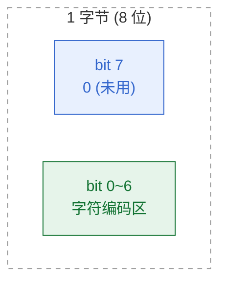

| | 范围 | 容量 |
|---|------|------|
| **ASCII** | 仅 `bit 0~6`（最高位固定为 0） | 128 个字符 |
| **扩展编码**（ISO-8859-1 / Windows-1252 等） | `bit 7` 也参与编码 → 全部 8 位可用 | 256 个字符 |

问题：1 个字节有 8 位，剩下的最高位空着，而世界上远不止 256 个符号，于是各家开始用最高位扩展，出现了"一个字符占 1 字节或 2 字节"的**多字节编码**。

### 常见的单字节 / 多字节区域编码

| 编码 | 覆盖 | 字节长度 | 备注 |
|------|------|----------|------|
| ASCII | 英文字符 | 1 字节（7 位） | 事实基准，所有编码都兼容它 |
| ISO-8859-1 (Latin-1) | 西欧语言 | 1 字节 | 直接把字节值当字符，无变换 |
| Windows-1252 | 西欧（含弯引号、€ 等） | 1 字节 | 与 ISO-8859-1 仅在 0x80–0x9F 区间不同（用可打印字符替换控制字符），Windows 上最常见 |
| GB2312 / GBK / GB18030 | 简体中文 | 1~2 字节（GB18030 可达 4） | GBK 兼容 GB2312，GB18030 兼容 GBK |
| Big5 | 繁体中文 | 1~2 字节 | 港台地区常用 |
| Shift-JIS (SJIS) | 日文 | 1~2 字节 | 与 ASCII 区有重叠位，解析要小心 |
| EUC-KR | 韩文 | 1~2 字节 | 韩国常用 |

💡 **小知识**：这些"用 1 或 2 个字节表示一个字符"的方案，就是前面提到的**多字节编码（multi-byte encoding）**：同一个字符可能占 1 字节也可能占 2 字节，长度不固定。

### 统一的尝试：Unicode 与 UTF-8 / UTF-16 / UTF-32

Unicode 试图把全人类字符放进**一个统一字符集**（给每个字符一个唯一码点）。

但"Unicode 怎么存成字节"又分化出三种编码：

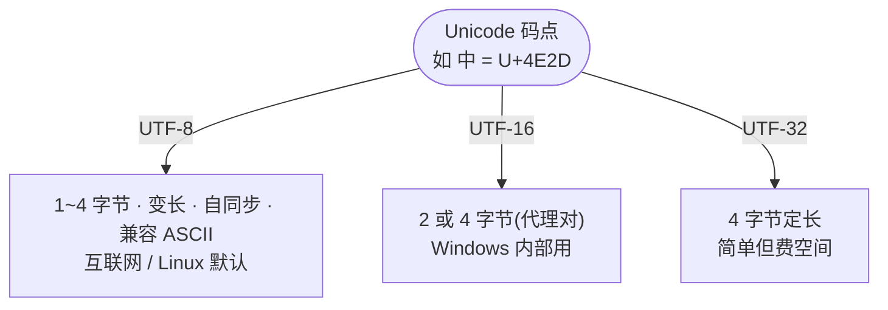

UTF-8 的编码规则（按码点范围选模板）很规整：

| 码点范围 | 字节数 | 编码模板（x 是码点二进制位） |
|----------|--------|------------------------------|
| U+0000 ~ U+007F | 1 | `0xxxxxxx` |
| U+0080 ~ U+07FF | 2 | `110xxxxx 10xxxxxx` |
| U+0800 ~ U+FFFF | 3 | `1110xxxx 10xxxxxx 10xxxxxx` |
| U+10000 ~ U+10FFFF | 4 | `11110xxx 10xxxxxx 10xxxxxx 10xxxxxx` |

⚠️ **RFC 3629 红线**：UTF-8 的合法码点范围是 `U+0000 ~ U+10FFFF`；**代理区 `U+D800 ~ U+DFFF` 不能用 UTF-8 编码**（它们仅服务于 UTF-16 的代理对，不代表字符）。解码器**必须拒绝**过长的编码（例如用 2 字节表示本可 1 字节的 ASCII 字符）以及超出 `U+10FFFF` 的序列，否则可能造成安全隐患（如绕过输入过滤）。这也是后文 `iconv` 代码要处理 `EILSEQ`/`EINVAL` 的原因。

以 `中`（U+4E2D）为例，它的二进制是 `0100 1110 0010 1101`，按 3 字节模板拆成 `4+6+6` 位，得到 `E4 B8 AD`——这正是后文验证示例里的真实字节。

### 为什么会有这么多编码

不是谁故意制造混乱，而是历史使然：

1. **先有英文，后有本地化**：ASCII 只够英语，各国只能自己在第 8 位上"各自填空"。
2. **没有统一的国际组织协调**：在标准统一前，厂商和国家标准各自发布（GB 是国标、Big5 是台湾业界标准、Shift-JIS 来自日本工业标准）。
3. **向后兼容的惯性**：已有的文档、系统、字体都基于旧编码，谁也不愿一次性推倒重来。
4. **Unicode 出现后仍分化**：即便有了统一字符集，"怎么存字节"又分出 UTF-8/16/32，编码家族反而更多了。

📊 **小结**：编码多，是因为**"先分后统"**的历史；而今天最该记住的，是 **UTF-8 正在成为事实上的统一方案**。

---

## 各编码方案的使用场景与典型问题

### 单字节区域编码（ISO-8859-1 / Windows-1252）

适用于**纯英文或西欧文本**、老系统对接、网络协议里那些"只传字节、语义由上层约定"的场景。

它们最大的"优点"是：**字节数 = 字符数，每个字节独立、可随机访问、可直接当下标**。

但此类编码的问题在于：碰到中文、日文就完全失效，因为超出 0~255 范围的字符根本表示不了。

### 多字节区域编码（GBK / Big5 / SJIS）的坑

在**只面向单一语种、且历史系统已基于该编码**的场景下仍有大量存量（很多老 Windows 中文软件、银行/政企内网系统仍默认 GBK）。

它们带来三个经典坑：

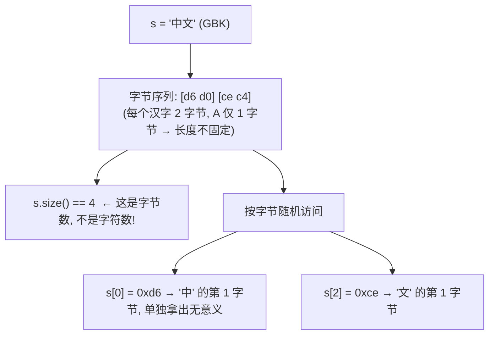

- **长度不固定**：`strlen` 返回的是**字节数不是字符数**。
- **不能按字节随机访问**：`s[1]` 很可能落在某个汉字的第 2 个字节上。
- **标准库字符函数集体失灵**：`toupper`、`isspace`、甚至 `std::regex` 默认按单字节处理，遇到多字节会"认错字"。

### 跨平台交换的致命问题：乱码

同一串字节在不同代码页下解释成不同字符。比如字节 `D6 D0`：

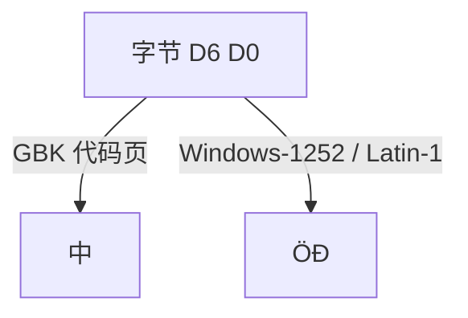

这就是"乱码"的本质：**字节没变，解释规则变了**。

Windows 上"ANSI 代码页"会随系统区域设置而变，更放大了这种不确定性。

文章开头看到的 `"中文"`，正是 UTF-8 字节被当成 Windows-1252（或兼容其扩展区间的单字节编码）逐字节显示的结果——注意其中 `–`（来自字节 0x96）和 `‡`（来自字节 0x87）是 Windows-1252 扩展区间独有的字符，纯 ISO-8859-1/Latin-1 在此范围为控制字符，不会显示成可打印字形。

⚠️ **注意**：乱码不是"数据损坏"，而是"用错了解码规则"，用正确的编码重新解码，数据通常能完整还原——这也是后文"边界转换"的意义。

### 应对方向一览

| 问题 | 方向 |
|------|------|
| 多编码并存、互相误解 | 需统一内部编码（如 UTF-8），只在边界做转换 |
| `strlen` 不等于字符数 | 不能用字节数代替字符数，需单独计算 |
| 按字节下标截断字符 | 不能直接按字节偏移切片，需按码点迭代 |
| 标准库函数不认多字节 | 需设置正确 locale 或使用 Unicode 库 |
| 与外部系统对接 | 必须明确约定接口编码，不能"猜" |

具体的 C++ 实现方式（`iconv` / Win32 API / `std::filesystem::path` 等）将在下一节「C++ 如何处理多字节编码：Windows 与 Linux 实战」中展开。

---

## 多字节编码给 C++ 编程实践带来的真实影响

C++ 把"字节"几乎原样交给你，`std::string` 本质上是一个 **`char` 字节容器，对编码一无所知**。

这个设计带来一连串的实际影响。

### `char` 只是字节，`std::string` 只是字节串

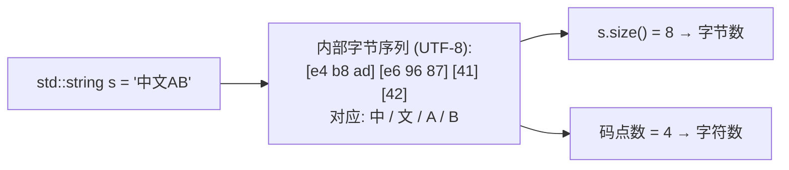

下面用一段**伪代码**点出核心原理（完整可运行程序与实测输出见 `src/cpp/cpp-multibyte-encoding/utf8_basics.cpp`）：

```cpp
// 伪代码：UTF-8 中"字节数 ≠ 字符数"（完整可运行见 src/cpp/cpp-multibyte-encoding/utf8_basics.cpp）
string s = "中文AB";              // 内部字节序列：2 汉字×3 + 2 字母 = 8 字节
s.size();                         // → 8（字节数，不是字符数）
utf8_codepoint_count(s);          // → 4（码点：中、文、A、B）

s.substr(1);                      // 从"中"的第 2 字节切 → 半截序列 → 乱码
```

实测输出（来自 `src/cpp/cpp-multibyte-encoding/utf8_basics.cpp`）：

```
字符串内容: 中文AB
std::string::size() 字节数: 8
UTF-8 码点数: 4
s[0] 单独打印(截断的字节): \xe4
s.substr(1) 结果(出现乱码/替换符): ��文AB
```

`s.substr(1)` 把 `中` 这个完整的 UTF-8 三字节序列从中间切断，得到的已经不是合法字符，输出自然变成替换符（�）。

**提示**：凡是把 `std::string::size()` 当"字符个数"、把 `s[i]` 当"第 i 个字符"的代码，碰到多字节必错。要"字符数"请单独算码点（见 `utf8_basics.cpp` 里的 `utf8_codepoint_count`）。

### 源文件编码 ≠ 运行期编码（一个常被忽视的坑）

源码里写的 `"中文"` 到底是什么字节，取决于**源文件本身以什么编码保存**，以及**编译器是否按该编码解读**：

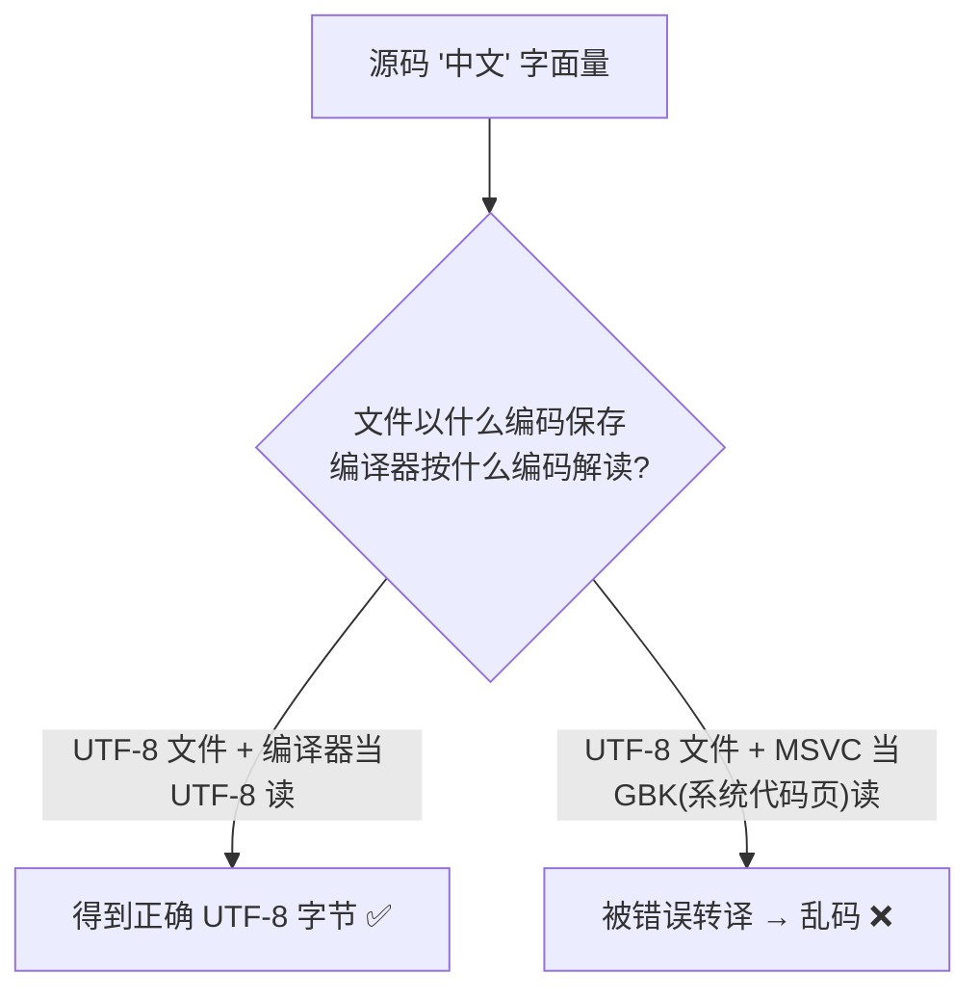

- GCC / Clang：默认把源文件当 UTF-8 解读字面量字节。
- MSVC：默认按**系统代码页**解读，中文 Windows 上常是 GBK；若源文件其实是 UTF-8，字面量就会被"错误转译"。

⚠️ **注意**：团队统一"源码以 UTF-8 保存"，MSVC 加编译选项 **`/utf-8`**（同时指定源编码与执行编码为 UTF-8），GCC/Clang 默认即 UTF-8——能从源头避免"UTF-8 文件被当 GBK 读"这类乱码。

### `wchar_t` 在跨平台时是"陷阱"而非"银弹"

很多人以为"用宽字符 `wchar_t` 就统一了"。

其实 `wchar_t` 的宽度由实现定义：

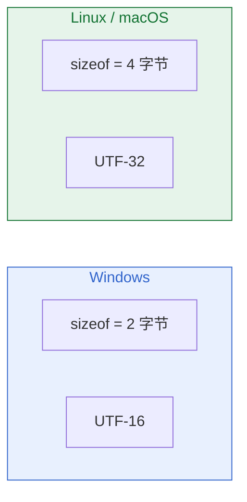

同一段 `std::wstring` 代码，在两边底层字节布局完全不同，`sizeof(wchar_t)` 也各异。实测如下（`src/cpp/cpp-multibyte-encoding/locale_codecvt.cpp` 在 macOS 输出）：

```
sizeof(wchar_t) = 4 字节
Linux/macOS 上 wchar_t 是 UTF-32(4 字节)
UTF-8 字节数   : 7
宽字符串码点数 : 3  (每个码点 = 1 个 wchar_t)
往返结果: 中文A  一致: 是
```

💡 **结论**：不要把 `wchar_t` 当作"可移植的 Unicode 类型"。真正跨平台时，要么统一用 UTF-8 的 `char`/`std::string`，要么用 `char16_t`(UTF-16) / `char32_t`(UTF-32) 这类**宽度确定**的类型。

### 控制台、文件、路径：处处是边界

- **控制台输出**：Windows 经典控制台默认代码页不是 UTF-8，直接 `std::cout << "中文"` 可能乱码；需要 `SetConsoleOutputCP(CP_UTF8)`（见后文）。
- **文件名 / 路径**：非 ASCII 文件名在不同系统走不同编码，`std::filesystem::path` 提供了 `string()`、`u8string()`、`wstring()` 三种视图，选错就可能"文件存在却打不开"。

---

## C++ 如何处理多字节编码：Windows 与 Linux 实战

下面用一套**同一份源码、按平台分支**的示例（`src/cpp/cpp-multibyte-encoding/encoding_convert.cpp`）说明两边的差异。

先给出实际运行的 POSIX 侧结果：

```
UTF-8 原文  (len=6): e4 b8 ad e6 96 87
GBK 编码    (len=4): d6 d0 ce c4
转回 UTF-8: 中文
往返一致: 是
```

可以看到 `"中文"` 的 UTF-8 是 6 字节 `e4 b8 ad e6 96 87`，转成 GBK 后变成 4 字节 `d6 d0 ce c4`，再转回 UTF-8 完全一致——这就是"边界转换"的正确范式。

### POSIX / Linux：UTF-8 原生，用 `iconv` 做转换

Linux（以及 macOS）上**文件系统、终端、多数库默认就是 UTF-8**，所以 `char*`/`std::string` 通常直接就是 UTF-8，最省心。

真正的"多字节"需求，往往发生在**和旧系统 / 旧文件（GBK、Shift-JIS…）对接**时，这时用 POSIX 标准的 `iconv` 做转码：

```cpp
// 伪代码：POSIX 下用 iconv 做 UTF-8 ⇄ GBK（完整可运行见 src/cpp/cpp-multibyte-encoding/encoding_convert.cpp）
cd = iconv_open("GBK", "UTF-8")
while 还有输入字节:
    r = iconv(cd, &in, &out)
    if r == -1:
        if E2BIG:           继续            // 输出缓冲满，循环再写
        if EILSEQ/EINVAL:   严格模式应直接报错（文中为演示做了"跳 1 字节"的兜底）
iconv_close(cd)
```

转换流程示意：

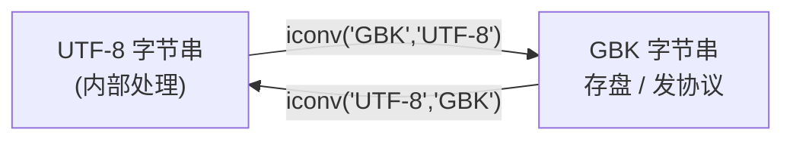

注意点：

- `iconv_open` 的编码名是**平台相关的字符串**（常见 `"UTF-8"`、`"GBK"`、`"SHIFT-JIS"`），不同系统支持的别名略有差异。
- 一定要处理 `E2BIG`（输出缓冲不够，循环继续）和非法/不完整字节，否则遇到坏数据会死循环或丢信息。
- 编译需链接 `libiconv`：例如 `g++ -std=c++17 src/cpp/cpp-multibyte-encoding/encoding_convert.cpp -o demo -liconv`。

💡 **命令行也能直接转**（排查/预处理很方便）：
```bash
# 查看文件编码
file -i suspect.txt
# GBK -> UTF-8
iconv -f GBK -t UTF-8 suspect.txt > ok.txt
# 查看当前环境 locale（决定 C 标准库函数如何解释多字节）
locale
```

### Windows：UTF-16 原生，用 `MultiByteToWideChar` 中转

Windows 内部原生是 **UTF-16**，所有"宽字符 API"（名字带 `W` 后缀，如 `CreateFileW`）收 `wchar_t*`。

而传统 `char*` 的 "A"（ANSI）版 API 走**当前系统代码页**，这正是乱码重灾区。

Windows 上的转码要用 Win32 提供的 `MultiByteToWideChar` / `WideCharToMultiByte`，通常 **UTF-8 ⇄ UTF-16（宽字符）⇄ ANSI 代码页** 三步完成：

```cpp
// 伪代码：Windows 下 UTF-8 ⇄ 本机 ANSI 代码页（经 UTF-16 中转，见 src/cpp/cpp-multibyte-encoding/encoding_convert.cpp）
utf8_to_wide(s) = MultiByteToWideChar(CP_UTF8, s)    // UTF-8  → UTF-16
wide_to_ansi(w) = WideCharToMultiByte(CP_ACP, w)     // UTF-16 → ANSI 代码页
utf8_to_ansi(s) = wide_to_ansi(utf8_to_wide(s))      // 组合
```

Windows 侧转换流程：

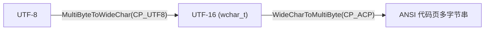

说明：Windows 分支使用标准 Win32 API，与 POSIX 分支一一对应；作者的开发机为 macOS，因此仅验证了 POSIX 分支，Windows 侧代码需以微软官方文档为准。

### Windows 控制台输出 UTF-8（常见必做项）

在 Windows 上想让 `std::cout` / `printf` 正确打印 UTF-8 中文，经典做法是切换控制台输出代码页：

```cpp
// 伪代码：Windows 控制台按 UTF-8 输出（完整可运行见 src/cpp/cpp-multibyte-encoding/encoding_convert.cpp）
SetConsoleOutputCP(CP_UTF8)   // 输出代码页设为 UTF-8
SetConsoleCP(CP_UTF8)         // 输入代码页设为 UTF-8
// 并配合 /utf-8 编译选项，保证源码与执行编码一致
```

```text
Windows 控制台代码页速查:
  chcp 65001   → UTF-8  (推荐)
  chcp 936     → GBK    (中文系统默认 ANSI 代码页)
  chcp 437     → 美式英文 OEM
```

### C++ 标准库方案：`<codecvt>` 与 `std::filesystem::path`

C++11 起标准库提供过 `std::wstring_convert` + `std::codecvt_utf8` 做 UTF-8 ⇄ 宽字符转换（见源码文件 `src/cpp/cpp-multibyte-encoding/locale_codecvt.cpp`）。
但**它在 C++17 被正式标为 deprecated**，主流编译器会给出弃用警告，新项目不建议继续依赖：

```cpp
// 伪代码：<codecvt> 已废弃，仅作原理了解（完整程序见 src/cpp/cpp-multibyte-encoding/locale_codecvt.cpp）
cvt.from_bytes(u8)   // UTF-8 → 宽字符
cvt.to_bytes(w)      // 宽字符 → UTF-8
```

更现代、且**跨平台一致性最好**的是 `std::filesystem::path`：它内部按"本机原生编码"保存路径，但允许你用不同视图取出，避免手动拼接导致的编码错误：

```cpp
// 伪代码：std::filesystem::path 的多种编码视图（完整可运行见 src/cpp/cpp-multibyte-encoding/filesystem_path.cpp）
p.string()                       // 原生格式（Windows=ANSI 代码页，POSIX=UTF-8）
p.u8string()                     // 永远以 UTF-8 返回
p.wstring()                      // 宽字符（Windows=UTF-16，POSIX=UTF-32）
parent_path() / "子目录" / "x"   // 用 / 拼路径，别手拼分隔符
```

本机运行输出印证了 POSIX 下 `string()` 与 `u8string()` 一致：

```
原生格式  string() : 文档/报告.txt
UTF-8     u8string(): 文档/报告.txt
POSIX: 原生即 UTF-8，string() 与 u8string() 一致
拼接结果: 文档/子目录/结果.txt
```

### 网络编程：客户端与服务端通信的编码陷阱

以下讨论适用于**所有平台**（不仅限于 Windows/Linux），因为网络协议层的编码约定是跨平台的。

网络通信是编码问题的"重灾区"。

通信的双方可能运行在不同操作系统、不同语言环境、甚至不同编程语言上，任何一方的编码假设不一致都会导致数据错乱。

#### 常见场景与坑

下面这张 **UML 顺序图** 展示了一个典型的乱码事故：客户端内部是 GBK，但发出的字节被服务端当成 UTF-8 解读。

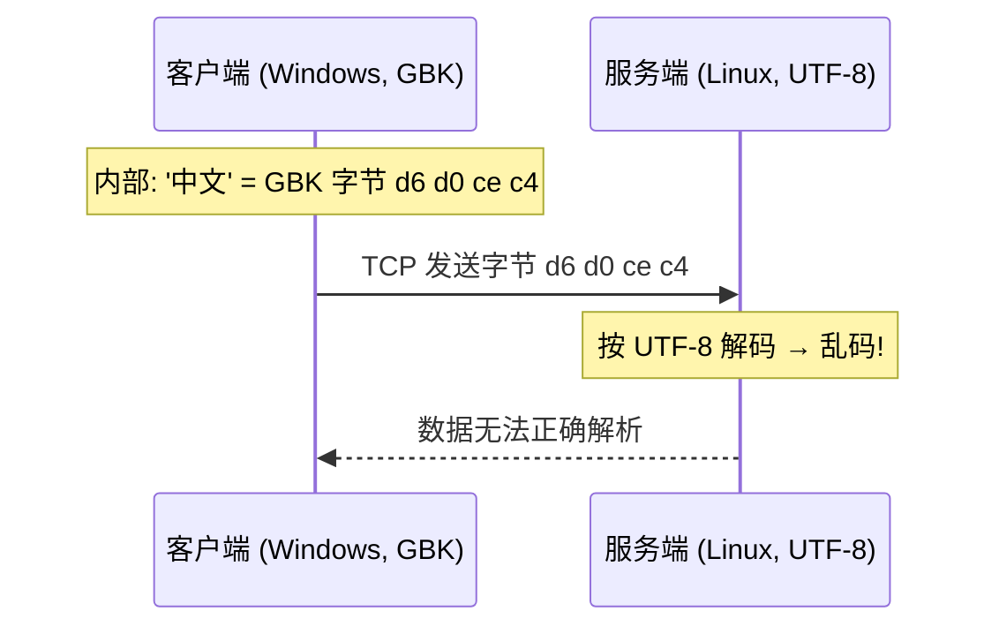

**典型问题清单：**

| 场景 | 问题 | 后果 |
|------|------|------|
| HTTP 接口未声明 `Content-Type: charset` | 未声明 charset 时接收方**不应假定任何默认编码**（RFC 7231/9110 已删除历史上 RFC 2616 的 ISO-8859-1 默认）；实践中服务器常按 ISO-8859-1 发送、浏览器对 `text/html` 常默认探测为 Windows-1252 | 中文变 `ÖÐ` 或问号 |
| TCP 自定义协议用 `strlen` 算消息长度 | 多字节字符的字节数 ≠ 字符数 | 消息截断或越界读取 |
| JSON 里直接塞 GBK 字节 | RFC 8259 §8.1：跨系统交换的 JSON **MUST** 为 UTF-8（仅闭合生态可例外），解析器拒绝非 UTF-8 输入 | 解析失败抛异常 |
| WebSocket 文本帧发非 UTF-8 数据 | RFC 6455 要求文本帧必须是合法 UTF-8 | 连接被服务端强制关闭 |
| 数据库存的是 GBK，API 直接吐给前端 | 前端按 UTF-8 渲染 | 页面显示乱码 |

#### 正确做法：约定优先 + 边界转换

正确的交互方式如下图所示——**客户端和服务端各自在自己的一侧完成编码转换，中间的传输层只认 UTF-8**：

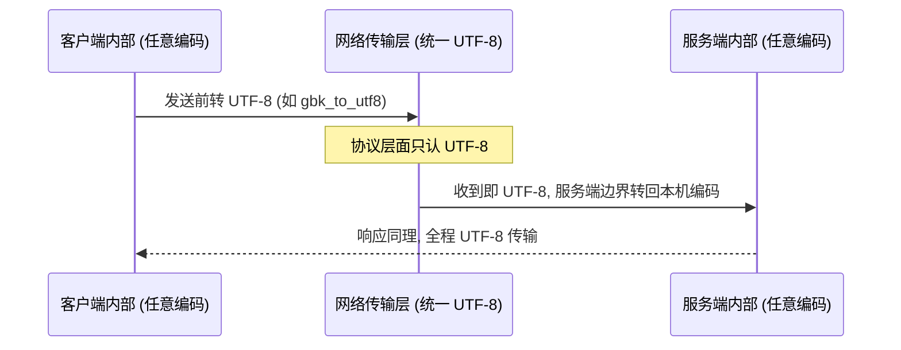

实践中应遵守的核心原则：**网络传输层统一用 UTF-8，各自在 I/O 边界做转换**。

**HTTP 的做法值得借鉴**：`Content-Type: text/plain; charset=UTF-8` 这个头就是双方约定的"解码规则说明书"。

自定义 TCP/UDP 协议也应该在握手阶段或消息头里明确声明编码。

#### 代码示例：带编码声明的 TCP 消息帧

下面用**伪代码**给出帧设计的核心思路（完整可运行程序见 `src/cpp/cpp-multibyte-encoding/network_encoding.cpp`）：

```cpp
// 伪代码：自定义 TCP 文本帧（完整可运行见 src/cpp/cpp-multibyte-encoding/network_encoding.cpp）
// 帧格式: [4 字节长度前缀(字节数, 大端)] [UTF-8 载荷]

build_frame(text):                 // text 必须是 UTF-8
    len = htonl(byte_length(text)) // 长度 = 字节数，不是字符数
    return len ‖ text

parse_frame(buf):
    if buf 长度 < 4:               return 不完整   // 长度字段都不够
    payload_len = ntohl(buf[0..4])
    if buf 长度 < 4 + payload_len: return 不完整   // 帧未收全
    return buf[4 .. 4+payload_len]                // 提取 UTF-8 载荷
```

实测输出（来自 `src/cpp/cpp-multibyte-encoding/network_encoding.cpp`）：

```
发送帧 (22 bytes): 00 00 00 12 e4 bd a0 e5 a5 bd ef bc 8c e6 9c 8d e5 8a a1 e5 99 a8 
解析出文本: 你好，服务器
消耗字节数: 22
不完整帧解析: "", 消耗=0
```

关键点：

- **`payload_len` 记录的是字节数而非字符数**——这就是为什么必须用 UTF-8 且在边界处转换。
- **帧不完整时返回 `{ "", 0 }`**，调用方应继续 `recv` 直到攒够一整帧（典型的 TCP 流式读取模式）。
- **`build_frame` 的入参必须是 UTF-8**——如果客户端内部是 GBK，应在调用前先 `gbk_to_utf8()`。

⚠️ **重点提醒**：
 - **永远不要把 `strlen` / `size()` 当作"字符数"来算协议字段长度**——它永远是字节数。如果协议需要传"字符数"，必须单独计算码点数。
 - **二进制安全**：如果你的协议可能携带任意字节（如图片、加密数据），不要用文本帧；改用纯二进制帧，并在应用层自行管理编码语义。
 - **WebSocket / HTTP/2 已经帮你做了这些事**——它们的文本帧强制 UTF-8、有明确的帧边界。只有自定义 TCP/UDP 协议才需要自己处理。

---

## 现实案例复盘：来自社区的真实踩坑

前面讲的全是"原理"，下面用社区里反复被踩的真实案例，把抽象规则"钉"到具体事故上。

每个案例都给出 **事故现象 → 根因 → C++ 启示**。

### 案例 1. "锟斤拷" 是怎么炼成的（乱码与替换符）

你在网上一定见过连片的 `锟斤拷`，它几乎成了"乱码"的代名词。

其根因正是前文说的**"字节没变，解释规则变了"**——只是多了一道"替换符"环节：

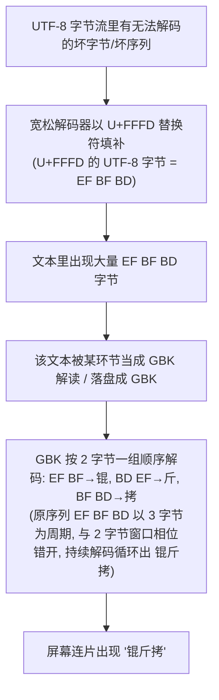

关键点：**`锟斤拷` 三个字本身不是原数据，而是连续的 `EF BF BD`（U+FFFD 的 UTF-8 字节）被 GBK 每 2 字节一组顺序解码后的字形**：`EF BF→锟`、`BD EF→斤`、`BF BD→拷`。由于原序列是每 3 字节重复一次的 `EF BF BD`，而 GBK 按每 2 字节一组顺序解码，两个窗口相位错开，持续解码便循环出 锟斤拷（锟→斤→拷→锟→…）。源头通常是"UTF-8 被当成 GBK 解，又用 GBK 重新编码"的二次转码——坏字节被一次性替换成 `U+FFFD`，再经 GBK 渲染就成了这三个字。

💡 **C++ 启示**：这正解释了前文 `iconv` 代码为什么要处理 `EILSEQ`——遇到非法字节别"硬填替换符再往外传"，能拒绝就拒绝、能记录就记录，否则坏数据会在系统间反复转码、越滚越乱。

### 案例 2. MySQL 的 `utf8` 存不了 emoji（字节数假设陷阱）

很多人的第一反应是"我都用 UTF-8 了怎么还会丢字符"，坑在 **MySQL 的 `utf8` 实际上是 `utf8mb3`——最多只支持 3 字节，而 emoji 落在辅助平面（`U+10000` 以上）需要 4 字节**：

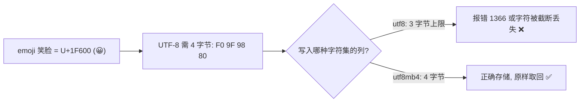

💡 **C++ 启示**：这和本文 `std::string` 的字节陷阱同源——`😀` 在 UTF-8 下 `size()` 返回 **4**，不是 1。任何"假设一个字符 ≤ 3 字节""按固定宽度切片"的写法，遇到辅助平面字符都会崩。要么用 `utf8mb4`（数据库侧），要么用码点计数 / `char32_t`（代码侧）。

### 案例 3. 按字节数截断，截在码点中间 → 制造非法 UTF-8（切片陷阱）

下面这起事故和前文 `s.substr(1)` 同源，但后果更严重：截断产生的"半截序列"会一路毒到下游解析器。

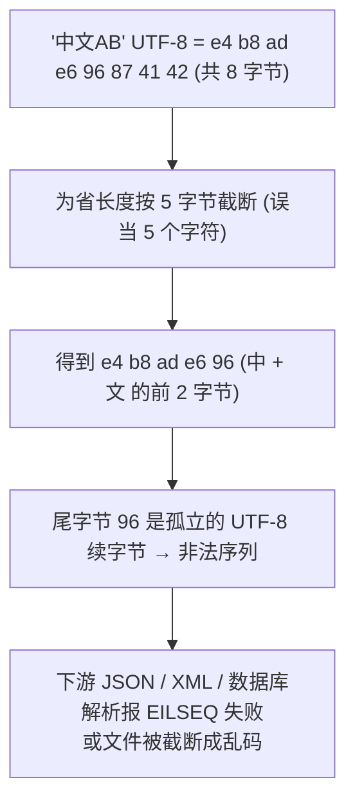

💡 **C++ 启示**：切片必须"按码点迭代"而非 `substr(n)`（见 `utf8_basics.cpp` 的 `utf8_codepoint_count`）。更危险的是：被截断的半截序列若又被某个宽松解码器接受，可能拼出预期之外的字符——这正是**案例 4**要讲的攻击面。

### 案例 4. UTF-8 过长短编码（Overlong）绕过校验 —— 呼应 RFC 3629 红线（安全攻击面①）

前文提到 RFC 3629 **禁止过长短编码**（例如用 2 字节 `C0 AF` 表示本该 1 字节的 `/`）。

若解码器太"宽容"接受了它，攻击者就能"走私"字符绕过基于字符串的过滤：

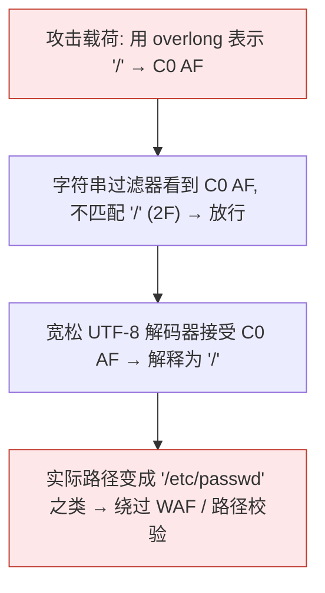

⚠️ **C++ 启示**：这正印证了前文 `iconv` 处理 `EILSEQ`/`EINVAL` 的必要性——**严格拒绝过长短序列**才是安全做法。自己手写 UTF-8 解析器时，务必按 RFC 3629 校验：每个码点必须用最短字节表示，且代理区 `U+D800~U+DFFF` 不可编码。

**动手验证案例 4（完整程序见 `src/cpp/cpp-multibyte-encoding/utf8_strict_check.cpp`）**：下面给出核心校验逻辑的伪代码，它把 RFC 3629 红线逐条编码成拒绝条件。注意 `C0/C1` 起点被整体排除，于是 `C0 AF` 在首字节判定处即被拒：

```cpp
// 伪代码：严格 UTF-8 校验（RFC 3629 红线，完整可运行见 src/cpp/cpp-multibyte-encoding/utf8_strict_check.cpp）
for 每个首字节 c:
    按 c 确定所需续字节数 n，并还原码点 cp
    if c 是 C0/C1 起点:            拒绝   // 1 字节字符的 overlong 起点
    if 续字节不是 10xxxxxx:        拒绝
    if cp 未用最短字节数表示:      拒绝   // overlong
    if cp ∈ 代理区 D800~DFFF:     拒绝
    if cp > 10FFFF:               拒绝
通过 → 合法 UTF-8（iconv 默认即如此，遇 C0 AF 返回 EILSEQ）
```

一个"宽松"解码器若跳过上述最短形式（`n==1 && cp<0x80` 等）检查、直接把 `C0 AF` 还原成 `/`，就构成了**案例 4**的走私漏洞。**生产环境应一律用严格校验**：`iconv` 默认即严格，遇到 `C0 AF` 返回 `EILSEQ`。

### 案例 5. Unicode 规范化攻击：同一字符、多种字节序列绕过过滤（安全攻击面②）

一个"看起来一样"的字符，在 Unicode 里可能有**多种字节表示**：合成态（`é` = `U+00E9`，UTF-8 `C3 A9`）与分解态（`e` + ́ = `U+0065 U+0301`，UTF-8 `65 CC 81`）。

它们视觉相同、字节却不同，于是只认一种形式的黑名单就被绕过：

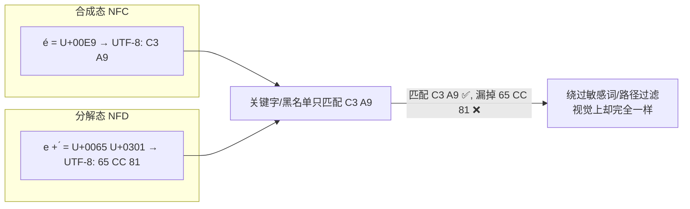

💡 **C++ 启示**：比较或存储字符串前，先**统一做 Unicode 规范化（通常用 NFC）**。标准库没这能力，`std::string` 更不懂——需要 ICU（见参考资源）的 `Normalizer2`（旧 `Normalizer` 自 ICU 56 起已废弃）。这再次提醒：`std::string` 只是字节串，"相等"与否取决于你是否先规范化、是否用同一套规则解释字节。

**动手验证案例 5（完整程序见 `src/cpp/cpp-multibyte-encoding/c2_normalize.cpp`，需 ICU 开发库）**：下面给出核心逻辑的伪代码，用 ICU 的 `Normalizer2`（现代 API，旧 `Normalizer` 已废弃）把分解态（NFD）规范化为合成态（NFC），两种写法就字节一致，黑名单只需认一种形式。下面用码点拼接构造字符串，完全不依赖源文件编码：

```cpp
// 伪代码：用 ICU 的 Normalizer2 把 NFD 规范化为 NFC（完整可运行见 src/cpp/cpp-multibyte-encoding/c2_normalize.cpp）
nfd = 构造 "é" 的分解态: U+0065 + U+0301   // 用码点拼接，不依赖源文件编码
nfc = Normalizer2::getNFCInstance()
out = nfc.normalize(nfd)                    // 合成态 U+00E9
// 之后用 out(UTF-8) 做匹配 / 入库，黑名单只需认一种形式
```

📝 **注意**：NFC 只合并"合成/分解等价"字符（如 `é` 的两种写法）。全角/半角、罗马数字、连字等"兼容等价"需要 **NFKC**，按业务需求选择；规范化也解决不了"视觉混淆字符"（如 Cyrillic `а` 与 Latin `a`），那是另一个层面的问题。

---

## 注意事项与编程原则

把上面所有坑收敛成一份"C++ 多字节处理原则清单"，照着做能避开 90% 的乱码与越界事故。

```
✅ 内部统一 UTF-8
✅ 字节数 ≠ 字符数，单独算码点
✅ 切片要按码点，别从字节中间切
✅ wchar_t 不可移植，用 char16_t/char32_t 或统一 UTF-8
✅ <codecvt> 已废弃，用 filesystem/iconv/Win32/ICU
✅ 路径用 std::filesystem::path，别手拼字符串
✅ 控制台/终端明确设编码
✅ 源码编码与编译选项对齐 (/utf-8)
✅ 转换必须处理错误字节
✅ Windows 与 Linux 各测一遍
✅ 网络协议统一 UTF-8，在 I/O 边界做转换
✅ 协议长度字段是字节数不是字符数，二进制安全帧不假设文本编码
```

⚠️ **重点提醒**：多字节问题往往"本地好好的一到对方平台就炸"。UTF-8/GBK 互转、含 emoji 的文件名、非 ASCII 命令行参数，最好在 Windows 与 Linux 各跑一遍。

最后用一张表把"编码 → 在 C++ 里意味着什么"钉死：

| 认知 | 在 C++ 里的正确姿势 |
|------|---------------------|
| `char` 是字节 | `std::string` 是字节串，编码由你约定，类型本身不保证 |
| `size()` 是字节数 | 字符数请单独算（码点计数），别混用 |
| `wchar_t` 不可移植 | 用 `char16_t`/`char32_t` 或统一 UTF-8 |
| UTF-8 是默认 | 内部统一 UTF-8，边界才转码 |
| 标准库 `codecvt` 已弃用 | 用 `filesystem`/`iconv`/Win32/ICU |
| 转换会遇坏数据 | 必须处理错误字节，别裸奔 |
| 网络传输层 | **统一 UTF-8**，在 I/O 边界做转换；协议长度字段=字节数≠字符数 |
| 自定义 TCP/UDP 帧载荷 | 若可能携带非文本数据（图片/加密），不要假设文本编码；用纯二进制帧 |

---

## 参考资源

- The Unicode Standard — https://unicode.org/standard/
- RFC 3629 - UTF-8, a transformation format of ISO 10646（UTF-8 编码标准，含代理区/过长短序列约束）
- RFC 8259 - The JSON Data Interchange Format（§8.1：跨系统交换的 JSON 必须 UTF-8）
- RFC 9110 - HTTP Semantics（§8.3.1 定义 `charset` 参数；现行标准不再为 `text/*` 规定默认 charset，历史上 RFC 2616 曾写 ISO-8859-1，此默认已在 RFC 7231/9110 中删除）
- ICU — International Components for Unicode（严肃文本处理库）— https://icu.unicode.org/
- Microsoft Docs - `MultiByteToWideChar` / `WideCharToMultiByte` / `SetConsoleOutputCP`
- cppreference - `std::filesystem::path`（string/u8string/wstring 视图）
- cppreference - `std::codecvt` / `std::wstring_convert`（C++17 起 deprecated）
- GNU libiconv — https://www.gnu.org/software/libiconv/
- C++ 标准 - `char16_t` / `char32_t` / `u8` 字符串字面量（C++20 起 `u8` 为 `char8_t[]`）
- UAX #15 - Unicode Normalization Forms（NFC/NFD/NFKC/NFKD，**案例 5** 规范化攻击的根因与解法）
- MySQL Reference - `utf8mb3` vs `utf8mb4`（**案例 2**：MySQL `utf8` 实为 3 字节上限，emoji 需 `utf8mb4`）
- 离别歌 - UTF-8 Overlong Encoding 导致的安全问题（**案例 4**：过长短编码绕过 WAF/反序列化过滤）— https://www.leavesongs.com/PENETRATION/utf-8-overlong-encoding.html
- Unicode 安全考量 - "ASCII 兼容"的过长短编码与替换符误用（**案例 1/案例 4** 的相关风险）

**本文首发于公众号「Artificer老王的学习笔记」，转载请注明出处。**
