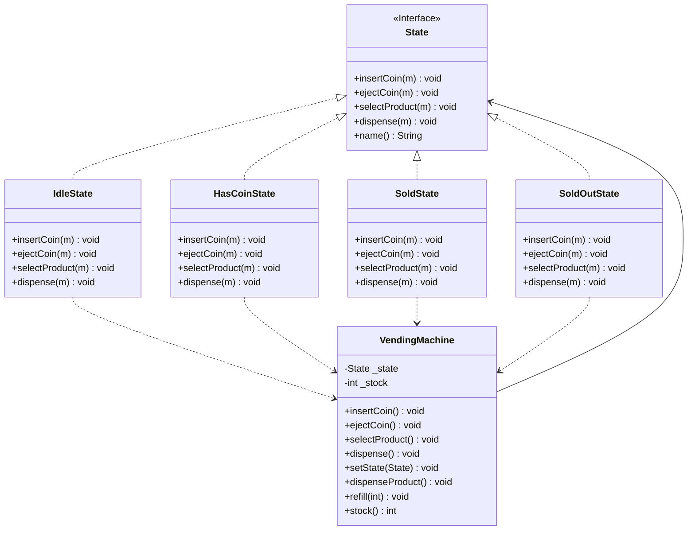
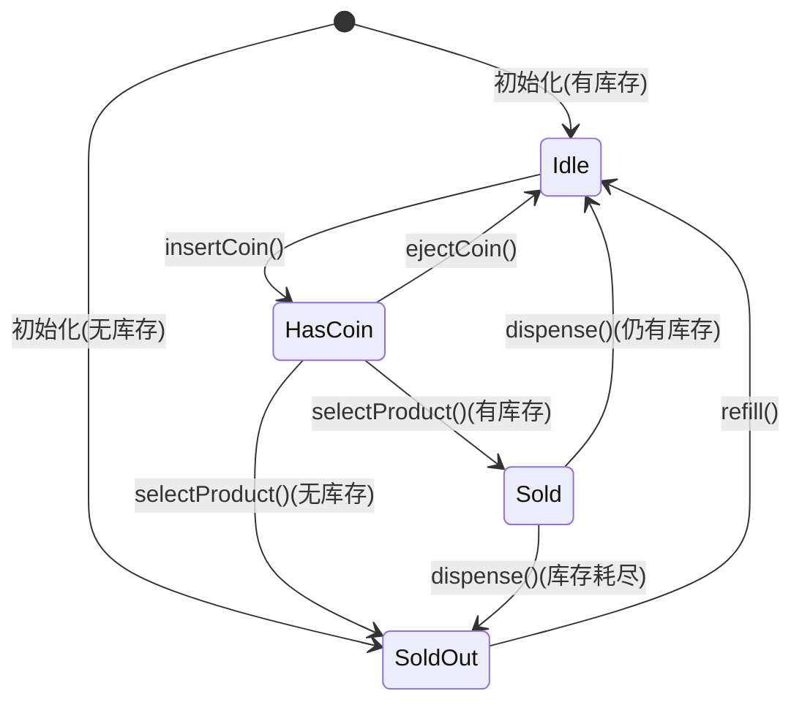

## C++ 设计模式实践：状态机模式——从 if-else 地狱到优雅的状态封装

作者：Artificer老王  |  更新时间：2026-07-26  |  阅读时长：约 15 分钟

你有没有写过这样的代码：一个类里塞了七八个 `if` 分支判断当前是什么状态，每次新增一个状态，就得在十几个函数里各加一个分支？

你有没有改过这样的 bug：某条状态转换路径漏了一处检查，导致用户在"已支付"状态下又触发了一次"下单"？

**状态机模式（State Pattern）** 就是干掉这类问题的利器——它把"状态 + 行为"封装成独立对象，让对象在运行时切换状态时，行为也随之改变。

---

## 🕳️ 先看问题：if-else 地狱长什么样

先看一个反面教材。

假设你在写一台自动售货机，用枚举记录状态：

```cpp
// 反面教材：枚举 + switch 硬写
enum class VendingState { IDLE, HAS_COIN, SOLD, SOLD_OUT };

class NaiveVendingMachine {
    VendingState _state = VendingState::IDLE;
    int _stock = 0;

public:
    void insertCoin() {
        switch (_state) {
        case VendingState::IDLE:
            _state = VendingState::HAS_COIN;
            std::cout << "投入硬币\n";
            break;
        case VendingState::HAS_COIN:
            std::cout << "已经投过币了\n";
            break;
        case VendingState::SOLD:
            std::cout << "正在出货，请稍候\n";
            break;
        case VendingState::SOLD_OUT:
            std::cout << "已售罄\n";
            break;
        }
    }

    void ejectCoin() {
        // 又一坨一模一样的 switch...
    }

    void selectProduct() {
        // 又一坨 switch，里面还要嵌 if 判断库存...
    }
};
```

问题在哪儿？

- **每加一个状态**，就得在 `insertCoin`、`ejectCoin`、`selectProduct`……每个方法里各加一个 `case`。改 N 处，漏一处就是 bug。
- **每加一个操作**，又得在所有状态里各写一遍分支逻辑。
- **状态转换逻辑散落各处**：看代码时你没法一眼知道"从 A 状态能转到哪些状态"，得把所有 `switch` 读一遍拼出来。
- **测试难写**：想单独测"HasCoin 状态下 ejectCoin 的行为"，得先把机器状态设对、跑完逻辑、再检查状态是否正确切换，耦合度高。

本质上，这是因为**状态判断**和**行为实现**耦合在了一起。状态机模式要做的，就是把它们拆开。

---

## 🧩 状态机模式是什么

### 核心思想

**把每个状态封装成独立的类，让上下文对象把操作委托给当前状态对象。**

**"对象的行为随状态而变"——不改状态判断，改委托对象。**

对比一下：

| 做法          | 状态切换的本质 | 加新状态的代价            |
| ----------- | ------- | ------------------ |
| 枚举 + switch | 改一个枚举值  | 改每个方法的 switch（N 处） |
| 状态机模式       | 换一个委托对象 | 只加一个新类（仅改动 1 处）    |

### 状态机模式的三个核心角色

状态机模式只有三个角色，关系非常清晰：

- **State（抽象状态接口）**：声明所有事件方法。每个具体状态各自实现"在我这个状态下，这个事件该怎么处理"。
- **ConcreteState（具体状态）**：实现 State 接口，封装该状态下的行为和状态转换逻辑。它知道自己能转到哪些状态、转过去的条件是什么。
- **Context（上下文）**：持有当前状态对象的引用，把所有客户端请求**委托**给当前状态。提供 `setState()` 供具体状态调用以完成切换。

关键点：**状态转换逻辑不在 Context 里，而在具体状态类里**。Context 只管"我现在持有哪个状态"，不管"什么时候该转"。

---

## 🗺️ UML 类关系图

下面是状态机模式的类关系图。

Context 持有 State 指针，具体状态类实现 State 接口，并通过调用 Context 的 `setState()` 完成状态切换。



再看状态转换图——这才是状态机最直观的视图。

每个箭头标注触发转换的事件：



两张图配合着看：类图回答"谁持有谁、谁实现谁"，状态转换图回答"什么事件触发什么转换"。

---

## 🎯 能解决什么问题

### 消灭巨型条件分支

这是最直接的收益。原来每个方法里一个 `switch(state)`，现在每个状态类只管自己的逻辑，没有 `switch`、没有 `if` 判断当前状态。

### 开闭原则

加新状态时，只需新建一个类实现 State 接口，在需要转换的地方调用 `setState()`。**不修改任何已有状态类的代码**——对扩展开放、对修改关闭。

### 状态转换集中管理

每条转换规则写在**触发它的那个具体状态类里**。比如"从 HasCoin 到 Sold"的转换写在 `HasCoinState::selectProduct()` 里，"从 Sold 到 Idle/SoldOut"的转换写在 `SoldState::dispense()` 里。你想知道从 A 能转到哪，看 A 的代码就行，不用满项目搜。

### 单元测试友好

每个状态类是独立的、可实例化的对象。测 `HasCoinState` 在 `selectProduct` 时的行为，直接构造一个 `VendingMachine`（或 mock），设成 `HasCoin` 状态，调用方法，断言结果。不需要先走一遍"从 Idle 到 HasCoin"的前置流程。

---

## 🌐 典型应用场景

状态机模式适用于"一个对象在生命周期内会在几种状态间切换，且不同状态下对同一事件的响应不同"的场景。

| 场景                 | 典型状态                                          | 典型事件                               |
| ------------------ | --------------------------------------------- | ---------------------------------- |
| **网络协议**（如 TCP 连接） | CLOSED、LISTEN、SYN_SENT、ESTABLISHED、CLOSE_WAIT | open、connect、accept、send、close     |
| **订单/工单流转**        | 待支付、已支付、已发货、已签收、已取消                           | pay、ship、confirm、cancel            |
| **游戏 AI**          | 巡逻、追击、攻击、逃跑、死亡                                | seePlayer、takeDamage、heal          |
| **媒体播放器**          | 停止、播放、暂停                                      | play、pause、stop、seek               |
| **自动售货机**          | 待机、已投币、出货中、售罄                                 | insertCoin、ejectCoin、selectProduct |
| **审批流程**           | 草稿、待审、审核中、通过、驳回                               | submit、approve、reject、publish      |

📌 **判断要不要用状态机模式，可以试着问自己三个问题**：

1. 对象是否有**多个明确的状态**？—— 如果只有"开/关"两态，一个 `bool` 就够了，别上模式。
2. 不同状态下**对同一操作的响应不同**？—— 如果行为一致，只是数据不同，状态模式就是过度设计。
3. 状态转换是否**有规则、有约束**？—— 状态模式的核心价值，是显式建模"哪些跳转合法"、从而挡住非法转换。若状态之间可以随意互转、毫无约束，那就没有需要被拦截的非法跳转，状态模式也就没有用武之地。

三个都"是"，就值得上。

---

## 💻 C++ 实现实践

### 场景设定：自动售货机

我们用自动售货机做演示——它有 4 个状态、3 个用户操作、1 个内部出货操作，足够展示模式精髓又不会太复杂。

状态定义：

| 状态               | 含义       | 允许的操作                                         |
| ---------------- | -------- | --------------------------------------------- |
| **Idle**（待机）     | 等待投币     | insertCoin → HasCoin                          |
| **HasCoin**（已投币） | 等待选商品    | ejectCoin → Idle；selectProduct → Sold/SoldOut |
| **Sold**（出货）     | 正在出货（瞬时） | dispense → Idle/SoldOut                       |
| **SoldOut**（售罄）  | 无库存      | refill → Idle                                 |

### 伪代码骨架

先看骨架，理解结构：

```cpp
// 前向声明
class VendingMachine;

// ---- 抽象状态接口 ----
class State {
public:
    virtual ~State() = default;
    virtual void insertCoin(VendingMachine& m) = 0;
    virtual void ejectCoin(VendingMachine& m) = 0;
    virtual void selectProduct(VendingMachine& m) = 0;
    virtual void dispense(VendingMachine& m) = 0;
};

// ---- 上下文 ----
class VendingMachine {
    std::shared_ptr<State> _state;  // 当前状态
    int _stock;                     // 库存
public:
    void insertCoin()    { _state->insertCoin(*this); }    // 委托
    void ejectCoin()     { _state->ejectCoin(*this); }     // 委托
    void selectProduct() { _state->selectProduct(*this); } // 委托
    void dispense()      { _state->dispense(*this); }      // 委托
    void setState(std::shared_ptr<State> s) { _state = s; }
    int stock() const { return _stock; }
    void dispenseProduct() { --_stock; }
};

// ---- 具体状态（以 HasCoinState 为例）----
class HasCoinState : public State {
public:
    void selectProduct(VendingMachine& m) override {
        if (m.stock() > 0) {
            m.setState(m.soldState());  // 转到出货状态
            m.dispense();                // 委托给 SoldState 处理出货
        } else {
            m.setState(m.soldOutState()); // 无库存，转到售罄
        }
    }
    // ... 其他方法
};
```

核心模式就这几行：**Context 委托、State 实现、具体状态调用 `setState()` 切换**。

### 关键实现决策

在写完整代码之前，有几个工程决策值得展开讲。

**🔧 决策：状态对象是否共享？**

具体状态类通常**没有数据成员**（状态机的数据全在 Context 里），因此一个状态实例可以被多次复用。用 `shared_ptr` 持有共享实例，避免每次切换都 `make_shared` 分配内存：

```cpp
class VendingMachine {
    // 共享状态实例（无数据成员，可复用）
    std::shared_ptr<State> _idleState;
    std::shared_ptr<State> _hasCoinState;
    // ...
};
```

**🔧 决策：状态方法怎么拿到 Context？**

有两种常见写法：

- **参数传递**：`void insertCoin(VendingMachine& m)` —— 每次调用传引用，状态对象本身不持有 Context。**推荐**，因为状态是无状态的、可共享的。
- **状态对象持有 Context 指针**：`State` 构造时传入 `Context*` —— 状态与 Context 绑定，不能共享。适合状态需要长期跟踪 Context 变化的场景。

**🔧 决策：状态切换由谁触发？**

由**具体状态类**触发。比如 `HasCoinState::selectProduct()` 里调 `m.setState(m.soldState())`。Context 不参与决策，只提供 `setState()` 接口。这是 State 模式与 Strategy 模式的关键区别——Strategy 的策略切换由客户端控制，State 的状态切换由状态自身驱动。

**🔧 决策：`dispense()` 是用户操作吗？**

不是。用户只有 `insertCoin`、`ejectCoin`、`selectProduct` 三个操作。`dispense()` 是内部方法，由 `HasCoinState::selectProduct()` 在切换到 `SoldState` 后自动触发。把它也放进 State 接口，是因为不同状态对"意外出货"的响应不同（大多数状态应拒绝），让状态自己判断更内聚。

### 完整代码

完整可编译代码在 `src/cpp/design-mode/state_machine_demo.cpp`，核心结构如下：

```cpp
#include <iostream>
#include <memory>
#include <string>

class VendingMachine;

// ---- 抽象状态接口 ----
class State {
public:
    virtual ~State() = default;
    virtual void insertCoin(VendingMachine& m) = 0;
    virtual void ejectCoin(VendingMachine& m) = 0;
    virtual void selectProduct(VendingMachine& m) = 0;
    virtual void dispense(VendingMachine& m) = 0;
    virtual std::string name() const = 0;
};

// ---- 上下文 ----
class VendingMachine {
public:
    explicit VendingMachine(int stock);
    void insertCoin()    { _state->insertCoin(*this); }
    void ejectCoin()     { _state->ejectCoin(*this); }
    void selectProduct() { _state->selectProduct(*this); }
    void dispense()      { _state->dispense(*this); }

    void setState(std::shared_ptr<State> s) {
        std::cout << "  [状态切换] " << _state->name()
                  << " -> " << s->name() << "\n";
        _state = std::move(s);
    }
    void dispenseProduct() { --_stock; }
    int stock() const { return _stock; }
    void refill(int n) {
        _stock += n;
        if (_stock > 0 && _state == _soldOutState)
            setState(_idleState);
    }

    std::shared_ptr<State> idleState()    const { return _idleState; }
    std::shared_ptr<State> hasCoinState() const { return _hasCoinState; }
    std::shared_ptr<State> soldState()    const { return _soldState; }
    std::shared_ptr<State> soldOutState() const { return _soldOutState; }

private:
    std::shared_ptr<State> _state;
    int _stock;
    std::shared_ptr<State> _idleState, _hasCoinState, _soldState, _soldOutState;
};

// ---- IdleState：投币 -> HasCoin ----
class IdleState : public State {
public:
    void insertCoin(VendingMachine& m) override {
        std::cout << "  投入硬币，等待选择商品\n";
        m.setState(m.hasCoinState());
    }
    void ejectCoin(VendingMachine&) override {
        std::cout << "  当前没有投币，无法退币\n";
    }
    void selectProduct(VendingMachine&) override {
        std::cout << "  请先投币再选择商品\n";
    }
    void dispense(VendingMachine&) override {
        std::cout << "  待机状态不支持出货\n";
    }
    std::string name() const override { return "待机(Idle)"; }
};

// ---- HasCoinState：选商品 -> Sold/SoldOut ----
class HasCoinState : public State {
public:
    void insertCoin(VendingMachine&) override {
        std::cout << "  已经投过币了\n";
    }
    void ejectCoin(VendingMachine& m) override {
        std::cout << "  退回硬币\n";
        m.setState(m.idleState());
    }
    void selectProduct(VendingMachine& m) override {
        if (m.stock() > 0) {
            std::cout << "  选择商品，准备出货\n";
            m.setState(m.soldState());
            m.dispense();
        } else {
            m.setState(m.soldOutState());
        }
    }
    void dispense(VendingMachine&) override {
        std::cout << "  已投币状态不支持直接出货\n";
    }
    std::string name() const override { return "已投币(HasCoin)"; }
};

// ---- SoldState：出货 -> Idle/SoldOut ----
class SoldState : public State {
public:
    void insertCoin(VendingMachine&) override {
        std::cout << "  正在出货，请稍候\n";
    }
    void ejectCoin(VendingMachine&) override {
        std::cout << "  已选择商品，无法退币\n";
    }
    void selectProduct(VendingMachine&) override {
        std::cout << "  正在出货，请稍候\n";
    }
    void dispense(VendingMachine& m) override {
        m.dispenseProduct();
        if (m.stock() > 0)
            m.setState(m.idleState());
        else
            m.setState(m.soldOutState());
    }
    std::string name() const override { return "出货(Sold)"; }
};

// ---- SoldOutState：售罄 ----
class SoldOutState : public State {
public:
    void insertCoin(VendingMachine&) override {
        std::cout << "  商品已售罄，退回硬币\n";
    }
    void ejectCoin(VendingMachine&) override {
        std::cout << "  当前没有投币，无法退币\n";
    }
    void selectProduct(VendingMachine&) override {
        std::cout << "  商品已售罄\n";
    }
    void dispense(VendingMachine&) override {
        std::cout << "  售罄状态不支持出货\n";
    }
    std::string name() const override { return "售罄(SoldOut)"; }
};

// 构造函数（在具体状态类定义之后）
VendingMachine::VendingMachine(int stock)
    : _stock(stock)
    , _idleState(std::make_shared<IdleState>())
    , _hasCoinState(std::make_shared<HasCoinState>())
    , _soldState(std::make_shared<SoldState>())
    , _soldOutState(std::make_shared<SoldOutState>())
{
    _state = (_stock > 0) ? _idleState : _soldOutState;
}
```

运行输出（精简版）：

```
--- 场景 1：正常购买 ---
  [状态切换] 待机(Idle) -> 已投币(HasCoin)
  [状态切换] 已投币(HasCoin) -> 出货(Sold)
  商品已出货，剩余库存: 1
  [状态切换] 出货(Sold) -> 待机(Idle)

--- 场景 4：买走最后一件 ---
  [状态切换] 待机(Idle) -> 已投币(HasCoin)
  [状态切换] 已投币(HasCoin) -> 出货(Sold)
  商品已出货，剩余库存: 0
  [状态切换] 出货(Sold) -> 售罄(SoldOut)

--- 场景 6：补货后恢复正常 ---
  补货 3 件，当前库存: 3
  [状态切换] 售罄(SoldOut) -> 待机(Idle)
```

---

## 🚀 进阶：现代 C++ 的改进方向

上面的实现是经典写法（继承 + 虚函数），在大多数场景已经够用。但如果你追求更高性能或更现代的表达力，还有几条路可以走。

### 表驱动状态转换

当状态多、转换规则复杂时，把转换规则抽成数据表比散落在代码里更清晰：

```cpp
// 转换表：(当前状态, 事件) -> (下一状态, 动作)
struct Transition {
    StateID from;
    EventID event;
    StateID to;
    std::function<void(VendingMachine&)> action;
};

std::vector<Transition> transitionTable = {
    {IDLE,     INSERT_COIN,    HAS_COIN, nullptr},
    {HAS_COIN, EJECT_COIN,     IDLE,     nullptr},
    {HAS_COIN, SELECT_PRODUCT, SOLD,     [](VendingMachine& m){ /* ... */ }},
    {SOLD,     DISPENSE,       IDLE,     [](VendingMachine& m){ m.dispenseProduct(); }},
    // ...
};
```

好处：所有转换规则集中一处，一目了然；新增状态/事件只改表不改代码。

⚠️ 注意：表驱动把行为从"多态分发"变成"查表 + 函数调用"，适合状态数多、转换规则复杂的场景（如协议栈）。状态只有三五个时，经典继承写法更直观。

### 用 `std::variant` 替代虚函数（C++17）

C++17 的 `std::variant` + `std::visit` 可以实现**无虚函数的状态机**——编译期多态，零虚表开销：

```cpp
struct IdleState {};
struct HasCoinState {};
struct SoldState {};
struct SoldOutState {};

using VState = std::variant<IdleState, HasCoinState, SoldState, SoldOutState>;

// 每个事件是一个 visitor；返回 std::optional<VState> 表示"是否切换"
struct InsertCoinVisitor {
    VendingMachine& machine;
    std::optional<VState> operator()(IdleState&) {
        std::cout << "投入硬币\n";
        return HasCoinState{};  // 切换到 HasCoin
    }
    std::optional<VState> operator()(HasCoinState&) {
        std::cout << "已经投过币了\n";
        return std::nullopt;    // 不切换
    }
    // ... 其他状态
};
```

好处：无虚调用、无堆分配、状态类型安全。

代价：加新状态要改 `variant` 模板参数和所有 visitor，扩展性不如继承方案。

### 状态池化与生命周期管理

经典写法用 `shared_ptr` 共享状态实例，已经避免了反复分配。进一步优化：

- **静态单例**：如果确定状态对象只读、无数据成员，可以用 `static` 单例 + 裸指针引用，零分配、零引用计数开销：
  ```cpp
  static IdleState s_idleState;
  // machine.setState(&s_idleState);
  ```
- **Arena 分配**：状态多且有数据成员时，用 Arena 一次性分配所有状态对象，避免零散堆分配。

📌 性能选择的判断标准：状态机不是热路径（大多数业务逻辑不是），经典 `shared_ptr` 写法足够。只有每秒触发百万次状态转换的场景（如网络协议栈解析），才值得上 `variant` 或静态单例。

---

## 📌 小结

- **是什么**：把每个状态封装成独立类，Context 委托当前状态处理事件，状态类自己决定是否切换、切到哪。**"改委托对象"替代"改状态判断"。**
- **解决什么**：消灭巨型 `switch/if-else`，遵守开闭原则（加状态不改旧代码），状态转换集中可追溯，单元测试独立友好。
- **什么时候用**：对象有多个明确状态、不同状态对同一操作响应不同、转换有规则约束。三问全"是"才上。
- **怎么实现**：State 抽象接口 + ConcreteState 具体实现 + Context 委托持有。C++ 中用 `shared_ptr` 管理共享状态实例，状态转换由具体状态类调用 `Context::setState()` 触发。
- **进阶**：表驱动适合复杂转换图、`std::variant` 适合追求零开销的热路径、静态单例适合确定性状态机。按场景选，别过度设计。

如果你手头有具体场景（例如"TCP 连接 11 状态 + 6 个事件"或"订单 8 状态流转"），可以先把状态转换图画出来，再决定用经典继承还是表驱动——图清晰了，实现方式就是水到渠成的事。

---

**完整可运行示例代码**：本文所有代码均已上传至 GitHub 仓库 [os-artificer/ebooks](https://github.com/os-artificer/ebooks)，位于 `src/cpp/design-mode/` 目录。进入 `src/cpp/` 目录执行 `make bin/state_machine_demo` 即可编译本示例（或执行 `make` 编译全部示例）。文中的代码片段为**说明原理的伪代码**，正式可编译版本请查看 `src/cpp/design-mode/` 下对应的 `.cpp` 文件。

本文首发于公众号 **Artificer老王的学习笔记**，转载请注明出处。
