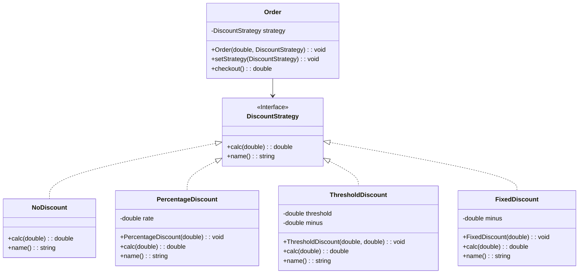
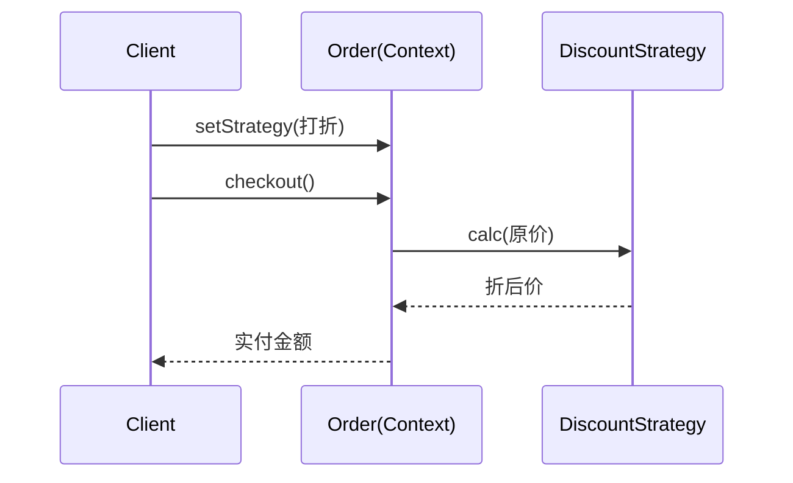

## C++ 设计模式实践：策略模式——把"选算法"交给运行时

作者：Artificer老王  |  更新时间：2026-07-30  |  阅读时长：约 13 分钟

你有没有写过这样的代码：一个类里根据 `type` 字段用一长串 `if-else` 或 `switch` 选不同算法——排序用快排还是堆排、压缩用 gzip 还是 zip、折扣用满减还是打折、导航用最短路径还是躲避拥堵。每加一种算法，就得在十几个函数里各加一个分支？

你有没有遇过这种尴尬：算法实现散落在 N 个分支里，测试要覆盖每种组合，改一个算法怕牵动其他分支，加一个新算法得翻遍整个类。

**策略模式（Strategy Pattern）** 就是专门收拾这种"一族算法要可互换、可切换"场面的——它把一族算法分别封装成独立、可互换的策略对象，让算法的变化独立于使用它的客户端，客户端要换算法时，只换一个策略对象即可。

---

## 🕳️ 先看问题：用 if-else 选算法

假设订单要根据不同促销类型算最终价格。最直接的写法，是在 `Order` 里用 `if-else` 硬选：

```cpp
// 反面教材：在 Context 里用 if-else 硬选行为
class Order {
    double _amount;
    std::string _promoType; // "none" / "percent" / "threshold" / "fixed"
    double _rate, _threshold, _minus;
public:
    double checkout() const {
        if (_promoType == "none")         return _amount;
        else if (_promoType == "percent") return _amount * _rate;
        else if (_promoType == "threshold")
            return _amount >= _threshold ? _amount - _minus : _amount;
        else if (_promoType == "fixed")
            return _amount > _minus ? _amount - _minus : 0.0;
        return _amount;
    }
};
```

问题在哪儿？

- **违反开闭原则**：加一种新促销（如"拼团价"），必须改 `checkout()` 这个大函数，改动面大、易错。
- **算法与数据耦合在一个类**：行为（`percent`/`threshold` 的算法）和状态（`_rate`/`_threshold` 参数）全塞进 `Order`，类越来越胖。
- **分支爆炸**：每加一个算法，所有用到促销的地方都要同步加分支，测试组合指数级增长。
- **无法独立测试算法**：想单测"满减"逻辑，得构造一个 `Order` 并设对它的一堆字段，不能单独拎出来测。

问题的本质：**一个会变化的"行为/算法"，被钉死在 `if-else` 里、和 Context 绑在一起了**。策略模式要做的，就是把这族行为"拎出来"封装成独立对象，让 Context 只持有"当前用的那个"，随时可换。

---

## 🧩 策略模式是什么

### 核心思想

**定义一族算法，把它们各自封装成可互换的策略对象，让算法的变化独立于使用它的客户端。**

**"把选算法的决定，从一长串 if-else，变成一个可替换的对象。"——Context 持有策略，运行时换策略，不用改 Context 一行代码。**

对比一下：

| 做法          | 本质        | 加新算法的代价        |
| ----------- | --------- | --------------- |
| 调用方 if-else  | 把行为写死在 Context 的分支里 | 改 Context 大函数（N 处分支） |
| 策略模式        | 把每个行为封装成独立策略类 | 只加一个策略类（1 处），Context 不动 |

### 策略模式的三个核心角色

策略模式只有三个角色，关系非常清晰：

- **Strategy（策略接口）**：定义这族算法的统一接口（一个纯虚函数，比如 `calc()`）。所有具体算法都实现它。
- **ConcreteStrategy（具体策略）**：实现 `Strategy` 接口的具体算法，比如"打折""满减""直减"。各自独立、互不相识。
- **Context（上下文）**：持有一个 `Strategy` 引用，把"需要算法"的请求委派给它；自身不关心算法细节，只管换策略、调策略。

关键点：**具体策略之间互不相识、互不依赖**——它们不知道彼此存在，也不知道自己会被谁用。Context 或客户端负责"选哪个"，策略只管"把这一件事做好"。

---

## 🗺️ UML 类关系图

下面是策略模式的结构类图。

`Order`（Context）持有 `DiscountStrategy`（Strategy）的引用；四个具体策略各自实现 `Strategy`；运行时 `Order` 把 `checkout()` 委派给当前持有的策略。



再看一张时序图，看清"委派"是怎么发生的——客户端调 Context，Context 把活儿转给当前策略：



两张图配合看：类图是"静态结构"——谁持有谁、谁实现谁；时序图是"动态行为"——一次 `checkout()` 如何穿过 Context 落到具体策略上。

---

## 🎯 能解决什么问题

### 消除巨型条件分支，符合开闭原则

新增一种算法 = 新增一个 ConcreteStrategy 类，Context 一行不动。加算法不碰老代码，符合"对扩展开放、对修改关闭"。

### 算法可独立测试、独立复用

每个策略是自包含的纯函数式对象，可以脱离 Context 单独单测、单独复用（同一个"满减"策略，订单、购物车、营销活动都能用）。

### 运行时自由切换

策略对象可以在运行时替换（用户切换优惠、系统按配置挑压缩算法），Context 不需要重新编译、不需要改分支。

### 消除重复，避免"算法 + 数据"大杂烩

算法的参数和行为封装在策略里，Context 只保留"领域状态"（如订单金额），不再背着一堆算法参数变胖。

---

## 🌐 典型应用场景

策略模式适用于"手上有一族**可互换**的算法/行为，且需要在**运行时选择或切换**"的场景。

| 场景         | 典型 Strategy（算法族）        | 典型 Context（使用者）    |
| ---------- | ----------------------- | ------------------ |
| **排序/选择算法** | 快速排序 / 归并排序 / 堆排序        | 容器或查询引擎            |
| **压缩/序列化**  | gzip / zip / 无压缩          | 网络传输层、日志落盘        |
| **促销/计费规则** | 满减 / 打折 / 直减 / 拼团         | 订单、购物车             |
| **支付方式**    | 微信 / 支付宝 / 银行卡 / 余额       | 收银台                |
| **路由/导航**   | 最短路径 / 躲避拥堵 / 少收费        | 地图导航引擎             |
| **日志级别**    | DEBUG / INFO / ERROR 不同输出策略 | 日志框架               |

📌 **判断要不要用策略模式，可以试着问自己三个问题**：

1. 是否有一族**可互换**的算法/行为？—— 只有一种、或算法永不换，就别套策略，直接写。
2. 是否需要在**运行时切换/选择**？—— 编译期就定死（永远只用快排），策略的收益不大。
3. 是否想摆脱 `if-else` 分支、让加算法符合**开闭原则**？—— 如果算法频繁增减、且当前散落在一堆分支里，策略模式的正收益才明显；只偶尔选一次的话，一个 `if` 也挺香。

三问里"一族可互换 + 运行时切换 + 想开闭"都满足，才上策略。

---

## 💻 C++ 实现实践

### 场景设定：订单的促销折扣策略

我们用电商订单做演示——一笔订单要算最终价格，促销类型可能是"无折扣 / 打折 / 满减 / 直减"。

我们把每种促销封装成一个策略，订单（`Order`）持有当前策略，结算时委派给它。

接口与角色：

| 角色                              | 类型     | 说明                          |
| ------------------------------- | ------ | --------------------------- |
| **DiscountStrategy**（Strategy）  | 接口     | 统一算法接口：`calc(原价)` 返回折后价       |
| **NoDiscount / Percentage / Threshold / Fixed**（ConcreteStrategy） | 具体策略  | 四种折扣算法，各自独立、互不相识           |
| **Order**（Context）             | 上下文    | 持有当前策略，`checkout()` 委派给策略，可`setStrategy`运行时切换 |

### 伪代码骨架

先看骨架，理解结构：

```cpp
// ---- 策略接口 ----
class DiscountStrategy {
public:
    virtual double calc(double original) const = 0;   // 输入原价，返回折后价
};

// ---- 具体策略（各自独立）----
class PercentageDiscount : public DiscountStrategy {
    double _rate;
public:
    double calc(double original) const override { return original * _rate; }
};

// ---- 上下文：持有并委派给策略 ----
class Order {
    DiscountStrategy* _strategy;   // 持有当前策略
    double _amount;
public:
    double checkout() const {
        return _strategy->calc(_amount);   // 委派，不关心具体算法
    }
};
```

核心模式就这几行：**Strategy 定义统一接口、ConcreteStrategy 各自实现、Context 持有引用并把请求委派过去**。

### 关键实现决策

在写完整代码之前，有几个工程决策值得展开讲。

**🔧 决策：策略接口怎么设计（入参 / 返回）？**

- **纯函数式**：`calc(double) -> double`。最简单，策略无状态、像纯函数。上面 demo 用这种——折扣只看原价，不依赖订单其他字段。
- **带着上下文**：`calc(const Order&) -> double`。当算法需要订单的多种信息（商品列表、会员等级、地区）时，把 Context 传进去。代价是策略会依赖 Context 类型，耦合略升。原则：**接口只传算法真正需要的，别为了省事把整个 Context 丢进去**。

**🔧 决策：谁持有并切换策略？**

- **Context 持有（最常见）**：`Order` 内部存一个策略指针，`setStrategy()` 随时换。客户端只跟 Context 打交道。本文 demo 即此。
- **客户端持有并传入**：`checkout(DiscountStrategy& s)`，算法由调用方临时指定、用完即弃。适合"每次调用算法不同、且 Context 不该记得上次用谁"的场景。
- **工厂按配置生成**：根据配置文件 / 数据库 / UI 选项，由工厂把字符串名映射成具体策略对象。适合策略很多、由外部驱动选择的场景（见进阶）。

**🔧 决策：策略之间要不要互相知道？**

**不要。** 策略彼此独立、无状态依赖、不持有 Context，这是策略模式与状态模式的本质分水岭：

- 策略：算法之间互不相识，谁被选中由 Context / 客户端决定，策略自己不切换彼此。
- 状态：状态对象**知道下一个状态是谁**，会主动触发状态转换（详见同专栏的状态机模式一文）。

把策略写成"无状态、可自由替换的纯算法"，才能享受策略模式的最大红利——随时换、随便换。

**🔧 决策：策略对象怎么创建和复用？**

- **每次 new**：最简单，用完即弃（配合 `unique_ptr` 自动回收）。
- **共享单例 / 池化**：当策略**无状态**（如纯折扣算法），多个 Context 可共享同一个策略实例，省开销。注意：有状态的策略（内部记了计数/缓存）绝不能共享。
- **注册表 + 工厂**：把所有策略名和构造器登记到一个 map，运行时按名取。这是"配置驱动选算法"的标准做法，新增算法只需注册一行。

### 完整代码

完整可编译代码在 `src/cpp/design-mode/strategy_demo.cpp`，核心结构如下：

```cpp
#include <cmath>
#include <iostream>
#include <memory>
#include <string>

// ---- Strategy 接口：折扣策略 ----
class DiscountStrategy {
public:
    virtual ~DiscountStrategy() = default;
    virtual double calc(double original) const = 0;   // 输入原价，返回折后价
    virtual std::string name() const = 0;
};

// ---- ConcreteStrategy A：无折扣 ----
class NoDiscount : public DiscountStrategy {
public:
    double calc(double original) const override { return original; }
    std::string name() const override { return "无折扣"; }
};

// ---- ConcreteStrategy B：按比例打折（rate = 0.8 表示 8 折）----
class PercentageDiscount : public DiscountStrategy {
    double _rate;
public:
    explicit PercentageDiscount(double rate) : _rate(rate) {}
    double calc(double original) const override { return original * _rate; }
    std::string name() const override {
        int pct = static_cast<int>(std::lround(_rate * 100.0));
        return "打折(" + std::to_string(pct) + "%)";
    }
};

// ---- ConcreteStrategy C：满减（满 threshold 减 minus）----
class ThresholdDiscount : public DiscountStrategy {
    double _threshold;
    double _minus;
public:
    ThresholdDiscount(double threshold, double minus)
        : _threshold(threshold), _minus(minus) {}
    double calc(double original) const override {
        return original >= _threshold ? original - _minus : original;
    }
    std::string name() const override { return "满减"; }
};

// ---- ConcreteStrategy D：固定直减（不会减成负数）----
class FixedDiscount : public DiscountStrategy {
    double _minus;
public:
    explicit FixedDiscount(double minus) : _minus(minus) {}
    double calc(double original) const override {
        return original > _minus ? original - _minus : 0.0;
    }
    std::string name() const override { return "直减"; }
};

// ---- Context：订单，持有并委派给策略 ----
class Order {
    std::unique_ptr<DiscountStrategy> _strategy;
    double _amount;
public:
    Order(double amount, std::unique_ptr<DiscountStrategy> s)
        : _strategy(std::move(s)), _amount(amount) {}

    void setStrategy(std::unique_ptr<DiscountStrategy> s) {
        _strategy = std::move(s);   // 运行时切换策略
    }

    double checkout() const {
        double final = _strategy->calc(_amount);
        std::cout << "  [" << _strategy->name() << "] 原价 "
                  << _amount << " -> 实付 " << final << "\n";
        return final;
    }
};

int main() {
    double amount = 200.0;
    std::cout << "--- 同一笔订单(原价 " << amount << ")，切换不同促销策略 ---\n";

    Order order(amount, std::make_unique<NoDiscount>());
    order.checkout();

    order.setStrategy(std::make_unique<PercentageDiscount>(0.8));
    order.checkout();

    order.setStrategy(std::make_unique<ThresholdDiscount>(100.0, 20.0));
    order.checkout();

    order.setStrategy(std::make_unique<FixedDiscount>(30.0));
    order.checkout();

    return 0;
}
```

运行输出：

```
--- 同一笔订单(原价 200)，切换不同促销策略 ---
  [无折扣] 原价 200 -> 实付 200
  [打折(80%)] 原价 200 -> 实付 160
  [满减] 原价 200 -> 实付 180
  [直减] 原价 200 -> 实付 170
```

看，同一笔订单、同一个 `checkout()`，只是背后策略不同，算出的实付价就跟着变。新增一个"拼团价"策略，只需加一个 `ConcreteStrategy`，`Order` 一行不用改——这就是开闭原则的具体样子。

---

## 🚀 进阶：现代 C++ 的改进方向

上面的实现是经典写法（继承 + 虚函数），已经覆盖绝大多数场景。但策略在 C++ 里还有几条更现代、更轻量的路。

### 函数指针 / lambda 替代虚函数（C++11 起）

当策略只是一段"输入→输出"的逻辑、不需要携带复杂状态时，`Strategy` 接口可以退化成一个 `std::function`，具体策略退化成可调用对象——零继承、零虚函数：

```cpp
using DiscountFn = std::function<double(double)>;

double checkoutWith(double amount, DiscountFn fn) {
    return fn(amount);   // 策略就是个函数，直接调
}

// 调用方随手给一个 lambda 当策略
checkoutWith(200.0, [](double p){ return p * 0.8; });   // 8 折
checkoutWith(200.0, [](double p){ return p >= 100 ? p - 20 : p; }); // 满减
```

好处：写法极轻、无类型膨胀、lambda 捕获还能顺带带点局部状态。代价：失去了"统一基类"带来的内省（如 `name()`）、且每个 `std::function` 有轻微间接开销。

### 用 std::variant 替代虚函数（C++17）

把所有具体策略塞进一个 `std::variant`，用 `std::visit` 做编译期分派——值语义、无堆分配、无虚函数：

```cpp
struct NoDisc    { double operator()(double p) const { return p; } };
struct Percent   { double rate; double operator()(double p) const { return p * rate; } };
using Strategy = std::variant<NoDisc, Percent>;

double apply(Strategy s, double p) {
    return std::visit([p](auto&& st){ return st(p); }, s);
}
```

好处：策略是值、能放进数组/栈、拷贝便宜、编译器还能内联。代价：策略集合在编译期固定（加一个新策略要改 `using Strategy = ...` 那一行），适合"算法族有限且稳定"的场景。

### 策略与"模板方法""状态"的边界

容易和策略混淆的两个模式，记住区别：

- **模板方法（Template Method）**：算法**骨架**固定写死在父类，只把几个"步骤"留給子类重写，步骤在**编译期**就定死。策略是整个算法**整体可替换**、**运行时**切换。
- **状态（State）**：状态对象**知道下一个状态是谁**，会主动触发状态转换；策略之间**互不相识**，由 Context / 客户端选择，策略自己不切彼此。

心法口诀：策略是**选算法**，状态是**走流程**，模板方法是**填步骤**。

### 策略工厂 + 配置驱动

当策略很多、且由外部（配置文件 / 数据库 / UI 下拉框）决定用哪个时，别让客户端直接 `new` 具体类——用工厂 + 注册表映射：

```cpp
// 按名字造策略，调用方只认字符串
std::unique_ptr<DiscountStrategy> makeDiscount(const std::string& name) {
    if (name == "none")      return std::make_unique<NoDiscount>();
    if (name == "percent80") return std::make_unique<PercentageDiscount>(0.8);
    if (name == "threshold") return std::make_unique<ThresholdDiscount>(100.0, 20.0);
    return std::make_unique<NoDiscount>();   // 默认兜底
}
```

好处：新增算法只需在工厂里加一行映射，调用方完全解耦于具体类；配合上面的 `std::variant` 还能把"按名选"和"值语义"合起来用。

---

## 📌 小结

- **是什么**：定义一族算法，各自封装成可互换的策略对象，让算法的变化独立于使用它的客户端。**"把选算法，从 if-else 变成一个可替换的对象。"**
- **解决什么**：消除巨型条件分支（开闭原则）、算法独立测试与复用、运行时自由切换、避免 Context 变胖。
- **什么时候用**：手上有一族**可互换**的算法、且需要在**运行时切换/选择**、想让加算法不动老代码。三问"一族可互换 + 运行时切换 + 想开闭"都满足才上。
- **怎么实现**：Strategy 抽象接口 + 多个 ConcreteStrategy 各自实现 + Context 持有策略并把请求委派过去。C++ 里**持有用智能指针**最稳，策略写成**无状态、互不相识**的纯算法最香。
- **进阶**：轻量场景可用 `std::function` / lambda 替代虚函数；算法族稳定时用 `std::variant` + `std::visit` 值语义分派；分清它与模板方法（填步骤）/ 状态（走流程）的边界；策略多时上工厂 + 注册表做配置驱动。

如果你正盯着一段"根据 type 选算法"的 `if-else` 发愁，先想清楚这族算法会不会变、要不要换——会，就抽成策略；抽完你会发现，那个大函数瘦了，测试也好写了。

---

**完整可运行示例代码**：本文所有代码均已上传至 GitHub 仓库 [os-artificer/ebooks](https://github.com/os-artificer/ebooks)，位于 `src/cpp/design-mode/` 目录。
进入 `src/cpp/` 目录执行 `make bin/strategy_demo` 即可编译本示例（或执行 `make` 编译全部示例）。
文中的代码片段为**说明原理的伪代码**，正式可编译版本请查看 `src/cpp/design-mode/` 下对应的 `.cpp` 文件。

本文首发于公众号 **Artificer老王的学习笔记**，转载请注明出处。
