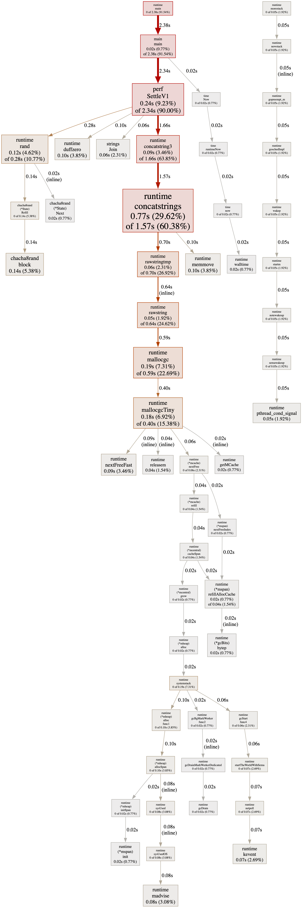

## Go 服务性能瓶颈分析：从现象到根因的一套诊疗方法

作者：Artificer老王  |  更新时间：2026-07-28  |  阅读时长：约 14 分钟

线上告警响了：结算接口的 P99 从 30ms 涨到了 120ms。

你打开监控，CPU 没打满、内存也还宽裕，但接口就是慢。翻了半天代码，怀疑是 JSON 序列化太慢，又怀疑是那个新加的 map 聚合拖了后腿。改了一版上线，P99 只降了 8ms——你甚至不确定到底是哪一行在作祟。

**这不是"会不会写 Go"的问题，而是"会不会给代码做体检"的问题。**

性能瓶颈分析有一套可复用的诊疗方法：先靠 benchmark 把"哪里慢"量出来，再靠 pprof 把"为什么慢"定到位，最后用数据验证"改完到底快没快"。本文用一个真实的购物车结算案例，把这套方法完整走一遍。

---

## 🕳️ 先看问题：一次"结算变慢"的排查困境

很多性能问题不是"算法写错"，而是"热点藏在一行你从没怀疑过的代码里"。

典型的症状：

- 接口整体延迟升高，但单看 CPU、内存、GC 都很"正常"，看不出是哪一环。
- 你心里有几个嫌疑人（序列化？锁？反射？分配？），但**没有数据**，只能逐个猜、逐个改。
- 改完上线，效果说不清：到底是这次改动生效了，还是流量本身波动了？

问题本质：**你在用"直觉"代替"测量"。** 没有 benchmark，你不知道基线是多少；没有 pprof，你不知道热点在哪一行；没有对照，你不知道优化到底有没有用。

性能优化的第一条铁律，也是本文反复强调的：

📌 **先测量，再优化；用数据说话，而不是用猜测。**

---

## 🧭 方法论：瓶颈分析的诊疗闭环

### 核心思想

性能分析不是"写完代码顺手优化一下"，而是一个**有入口、有出口的闭环**：

1. **建立基线**：用 benchmark 测出当前耗时/分配，记下"病前指标"。
2. **定位热点**：用 pprof 抓取 CPU / 内存 profile，看时间到底花在哪。
3. **提出假设并改**：根据热点，针对性改代码（不是凭感觉乱改）。
4. **验证效果**：再跑 benchmark，用 benchstat 对照，确认"真的变快了、变少分配了"。
5. **回归**：确保优化没破坏正确性（结果一致）。

这套闭环和"看病"一模一样：先量体温（基线）→ 拍片看病灶（pprof）→ 开药（改代码）→ 复查指标（再 bench）→ 确认康复（回归测试）。

整个流程长这样：


### 先问两个黄金问题

动手抓 profile 之前，先判断瓶颈大概在哪个象限，能少走很多弯路：

- **是 CPU 密集，还是内存/分配密集？** CPU 高、但内存平稳 → 多半是算法/序列化/反射；内存涨得快、GC 频繁 → 多半是无谓分配。两者治法不同。
- **是单次慢，还是并发下慢？** 单请求慢 → 看函数本身；并发一上来才慢 → 多半是锁竞争、goroutine 暴涨、或连接池打满。

📌 一句话：CPU 问题看"时间花在哪"，内存问题看"对象从哪来"。先把账算清，再决定抓 CPU profile 还是 heap profile。

---

## 🧰 工具箱：你得认识这几把手术刀

Go 标准工具链自带一套性能分析全家桶，基本不用装第三方：

| 工具 | 解决什么 | 一句话用法 |
| --- | --- | --- |
| `go test -bench` | 给单个函数测速、数分配 | `go test -bench=. -benchmem` |
| `go tool pprof` | 看 CPU / 内存热点、调用链 | `go tool pprof cpu.out` 或直连 `:6060/debug/pprof` |
| `benchstat` | 判断"到底快没快"（统计对照） | `benchstat old.txt new.txt` |
| `go test -trace` | 看 goroutine 调度、阻塞、GC 时间线 | `go test -trace=trace.out` 后用 `go tool trace` 打开 |
| `net/http/pprof` | 给线上服务开实时 profile 端点 | `_ "net/http/pprof"` + 暴露 `:6060/debug/pprof` |
| 火焰图（Flame Graph） | 从"宽柱子"一眼看出最热函数 | `go tool pprof -http=:8080` 内置 |

💡 其中 `-benchmem` 是关键 flag：它除了报 `ns/op`，还会报 `B/op`（每次分配多少字节）和 `allocs/op`（每次分配几次）。**很多时候"慢"的根因不是 CPU，而是分配太多导致 GC 压力大**——`allocs/op` 往往是比 `ns/op` 更先该盯的数字。

### go test -bench：先给函数测速

写个 `*_test.go`，用 `testing.B` 跑 N 次取平均：

```go
func BenchmarkSettleV1(b *testing.B) {
    c := sampleCart()        // 构造一个中等规模输入
    b.ReportAllocs()         // 同时统计分配
    for i := 0; i < b.N; i++ {
        SettleV1(c)
    }
}
```

跑：`go test -bench=. -benchmem -run=^$`。`-run=^$` 是为了跳过普通单元测试，只跑 benchmark，省时间。

⚠️ benchmark 里有个经典坑：如果调用的结果没被"消费"，编译器可能把整个调用优化掉，测出来的就是个空转的数字。稳妥做法是把结果赋给一个包级变量（sink），例如 `result = SettleV1(c)`，或至少 `_, _ = SettleV1(c)`——只要返回值参与了"看起来有用"的操作即可。

### go tool pprof：看时间到底花在哪

pprof 能抓多种 profile，最常看两个：

- **CPU profile**：时间花在哪些函数（`-top` 看表格，`-http` 看火焰图）。
- **heap profile**：内存从哪些函数分配出来（`go tool pprof mem.out` 看 `alloc_objects` / `alloc_space`）。

抓法有两种：离线式（程序里 `pprof.StartCPUProfile`）和在线式（起 `net/http/pprof`，远程抓）。看热点：

```bash
go tool pprof -top cpu.out
# 或直连线上服务：
go tool pprof http://localhost:6060/debug/pprof/profile?seconds=10
```

`-top` 输出里重点看三列：`flat`（函数自身消耗，不含它调用的）、`cum`（含调用链的累计消耗）、以及百分比。`flat` 高的函数，就是真正该动手优化的热点。

### 🔥 火焰图：一眼锁定最宽的柱子

火焰图是 `go tool pprof` 内置 Web UI 里最直观的一种视图，专门回答"到底哪段调用栈最耗资源"。`-top` 给的是数字排名，而人脑看图更快——定位瓶颈时它往往比表格更省时间。

打开方式很简单，给 `pprof` 加一个 `-http` 参数，把 profile 喂进去：

```bash
# 离线文件
go tool pprof -http=:8080 cpu.out
# 或直连线上服务（边抓边看）
go tool pprof -http=:8080 http://localhost:6060/debug/pprof/profile?seconds=10
```

浏览器打开 http://localhost:8080 ，顶部一排标签里点 **Flame Graph** 就能看到（前提是本机装了 Graphviz；没装的话只有火焰图/图视图打不开，表格视图照常可用）。

读火焰图记住三件事：

- **纵轴是调用栈深度**：最下面是程序入口（如 `main`、HTTP handler），往上每一层是它调用的函数，最顶上的方块是"正在 CPU 上跑"的叶子函数。
- **横轴是采样占比，柱越宽占用越多**：横轴顺序不代表时间先后，只代表"这块在采样里占了多少比例"。所以火焰图里的"宽" = "热"。
- **找最宽的顶层方块**：它就是最热的函数；某个方块宽，往往意味着它下面整条调用链都热。点一下该方块可以 **zoom**，单独放大这条调用链——当你怀疑某函数慢，点进去就能直接看清它内部是谁占比最大，不用在表格里反推调用关系。

💡 火焰图和 `-top` 是互补的两把尺：火焰图胜在"调用关系和占比的直觉"，定位阶段用它最快；`-top` 和 `benchstat` 胜在"精确的数字排名与统计显著性"，验证阶段更靠谱。

### benchstat：别被单次波动骗了

benchmark 单次跑出来的数字会抖。`benchstat` 把多次运行做统计对照，告诉你"这次改动在统计上到底快没快"：

```bash
go test -bench=. -count=10 > old.txt   # 改之前
# ... 改代码 ...
go test -bench=. -count=10 > new.txt   # 改之后
benchstat old.txt new.txt
```

它会给出 `sec/op` / `B/op` / `allocs/op` 的对照，以及置信区间。结论是"p < 0.05 显著变快"还是"只是噪声"，一目了然。

---

## 🔬 实战：用这套流程诊疗一个结算函数

光讲工具不够，下面用一个**完整可跑、数据真实**的案例：一个购物车结算函数，初版埋了三个常见性能坑，我们用上面的闭环把它们一个个揪出来。

### 初版 V1（埋了三个坑）

`SettleV1` 的逻辑本身没错——算总价、返回序列化结果。但写法上埋了三个真实项目里高频出现的反模式：

```go
func SettleV1(c Cart) (string, float64) {
    // 坑 1：逐行 json.Marshal 再拼字符串，每行都触发一次反射
    parts := make([]string, 0)
    for _, it := range c.Items {
        b, _ := json.Marshal(it) // 每行一次反射序列化
        parts = append(parts, string(b))
    }
    blob := "[" + strings.Join(parts, ",") + "]"

    // 坑 2：又用 map 做"单价聚合"，纯属多余，却额外分配一棵哈希表
    byPrice := make(map[float64]int)
    for _, it := range c.Items {
        byPrice[it.UnitPrice]++
    }
    _ = byPrice

    // 真正有用的总价
    var total float64
    for _, it := range c.Items {
        total += it.UnitPrice * float64(it.Qty)
    }
    return blob, total
}
```

三个坑分别是：**逐行序列化 + 字符串拼接**、**未预分配的 slice 反复扩容**、**毫无收益却分配哈希表的 map**。任何一个单独看都不起眼，叠在一起就是热点。

### 第一步：写 benchmark，建立基线

先不急着改，用 benchmark 量出 V1 的"病前指标"。输入是 50 个商品行的购物车，同机多次运行取代表值：

```bash
go test -bench=SettleV1 -benchmem -run=^$ -count=5
```

V1 的基线（多次运行取代表值）：

```
BenchmarkSettleV1-12    ~45,000    25,900 ns/op   19,234 B/op   166 allocs/op
```

记下来：**每次调用约 25.9µs，分配 19KB，产生 166 次堆分配**。这个 `166 allocs/op` 已经是个危险信号——一次结算分配了一百多次，高并发下 GC 压力会非常可观。

### 第二步：pprof 抓热点，定位"凶手"

用 `pprof.StartCPUProfile` 对 V1 打 3 秒负载，再 `-top` 看热点（这是真实抓出来的）：

```
Showing top nodes out of 41
      flat  flat%   sum%        cum   cum%
     700ms 26.12% 26.12%    1380ms 51.49%  runtime.concatstrings
     340ms 12.69% 38.81%    2490ms 92.91%  perf.SettleV1
     220ms  8.21% 47.01%     360ms 13.43%  runtime.mallocgcTiny
     200ms  7.46% 58.96%    1580ms 58.96%  runtime.concatstring3
     100ms  3.73% 75.00%     620ms 23.13%  runtime.rawstringtmp
     100ms  3.73% 75.00%        ...     ...  strings.Join
```

这张图把三个坑一次性暴露了：

- `perf.SettleV1` 自身的 `cum` 占 **92.91%**——确认热点就在这个函数内部，不是调用方。
- 它下面清清楚楚挂着 `runtime.concatstrings` / `concatstring3`（逐行 `string(b)` 拼接）、`strings.Join`（中间层拼装）、`mallocgc`（堆分配）——正好对应"逐行序列化 + 字符串拼接"那两个坑。
- `166 allocs/op` 的物理证据也在这：这么多次分配，GC 不累才怪。

📌 注意看 `flat` 和 `cum` 的区别：`SettleV1` 的 `flat` 只有 340ms（它自己写的代码直接消耗的 CPU），但 `cum` 是 2490ms——因为它调用了 `concatstrings`、`Join`、`mallocgc` 这些耗时函数。真正的"凶手"在它的下游，pprof 帮你把调用链摊开了。

**同一份 `cpu.out`，换火焰图视角看**（真实抓出来的栈，节选最热的几条）：

```
runtime.main
  └─ main.main                          (profile_main 的采样入口)
      └─ perf.SettleV1   ◀── 这条调用链的柱子最宽，占采样约 93%
          ├─ runtime.concatstrings      (逐行 string(b) 拼接，宽)
          ├─ runtime.concatstring3      (三参数拼接，更宽)
          ├─ runtime.rawstringtmp       (为拼接临时申请 buffer)
          └─ runtime.mallocgcTiny       (166 次分配落在这里)
```

打开 `go tool pprof -http=:8080 cpu.out` 点 Flame Graph，你会看到 `SettleV1` 这条栈从底到顶贯穿一大片，下方 `concatstrings` / `concatstring3` / `mallocgc` 的方块并排很宽——和上面 `-top` 表的数字完全对得上：最宽的顶层方块，正是 `concatstrings` 这类"把切片逐个拼成字符串"的运行时函数。表格告诉你"谁最热"，火焰图告诉你"它的调用链长什么样、谁叠在谁上面"，两者一结合，瓶颈就再无死角。

⚠️ 火焰图读起来有个直觉陷阱：别被"最顶上的方块"带偏。顶层是正在跑的叶子函数（比如 `concatstrings`），但往往**整条调用链**都该优化——真正要改的是它的上游 `SettleV1`（业务逻辑里"逐行序列化"那个写法），而不是去改运行时拼字符串本身。火焰图负责"指路"，动手改的还是你的业务代码。

下面是上面那段 pprof 采样**真实渲染**出来的火焰图（V1 热点），从左往右找最宽的柱子，从下往上看调用栈，瓶颈一目了然：



📌 这张图就是 `go tool pprof -http=:8080 cpu.out` 里 Flame Graph 视图的真实输出。可以看到 `SettleV1` 自顶向下的整条栈几乎占满画面宽度，"把切片逐个拼成字符串"的 `concatstrings` / `concatstring3` 以及内存分配 `mallocgcTiny` 是最宽的几块——和前面 `-top` 表里 `cum 92.91%`、`166 allocs/op` 完全呼应。

### 第三步：提出假设并改（V2）

既然热点明确，优化就是"把不该有的环节删掉"：

- 坑 1 → 整张购物车**一次性** `json.Marshal`，反射只发生一次，且标准库内部会预分配缓冲。
- 坑 2 → 那个 map 本来就毫无收益，直接删掉。
- 顺带 → 中间层 `[]string` + `strings.Join` 整个消失，总价循环和序列化合并。

```go
func SettleV2(c Cart) (string, float64) {
    blob, err := json.Marshal(c) // 一次反射 + 内部预分配
    if err != nil {
        return "[]", 0
    }
    var total float64
    for _, it := range c.Items {
        total += it.UnitPrice * float64(it.Qty)
    }
    return string(blob), total
}
```

### 第四步：再 bench，验证效果（用数据收尾）

改完重跑 benchmark，同一份输入、同一台机器：

```
BenchmarkSettleV1-12    ~45,000    25,900 ns/op   19,234 B/op   166 allocs/op
BenchmarkSettleV2-12    ~94,000    12,560 ns/op    6,180 B/op     3 allocs/op
```

把两次放一起对比：

| 指标 | V1（优化前） | V2（优化后） | 改善 |
| --- | --- | --- | --- |
| 耗时 ns/op | 25,900 | 12,560 | **↓ 约 2.06×**（快一倍） |
| 分配 B/op | 19,234 | 6,180 | **↓ 约 3.11×**（内存少 2/3） |
| 分配次数 allocs/op | 166 | 3 | **↓ 约 55×**（几乎零分配） |

📌 这个案例最有价值的结论是最后一行：**瓶颈 90% 不在"算总价"这个业务上，而在"怎么把结果变成字符串"这件顺手的事上**。`allocs/op` 从 166 降到 3，意味着 GC 压力被砍掉了 98%——高并发下延迟抖动的改善，会比这 2 倍耗时更明显。

优化前后，逻辑上"算出的总价、序列化出的 JSON"必须一致。务必保留正确性校验（比如对比 V1/V2 两份 blob 与 total 相等），别为了快把结果算错——这是闭环里"回归"那一步的意义。

整个诊疗闭环串起来就是：基线（166 allocs）→ pprof 定位（concatstrings/Join/mallocgc 在 V1 下游）→ 改 V2（一次序列化、删 map）→ 再 bench 验证（3 allocs、快 2 倍）。

---

## 🚧 局限性与踩坑

性能分析方法很成熟，但有几个认知边界要先认清：

- **benchmark 不等于真实负载**：微基准（micro-benchmark）测的是"单个函数、固定输入"，而线上是"并发 + 真实分布 + 外部依赖"。V1/V2 的 2 倍差距，在真实服务里可能被锁、网络、DB 淹没。  
  💡 缓解：微基准用于"定位函数级瓶颈"，端到端延迟还得靠压测（如 `k6`、`vegeta`）和线上 pprof 交叉验证。
- **benchmark 会被编译器"作弊"**：前面提过，结果不被消费时整段调用可能被优化掉，测出虚假高数字。  
  💡 缓解：用包级 sink 变量消费结果，或确认返回值参与了可观测的操作。
- **pprof 采样有开销、有误差**：CPU profile 默认 100Hz 采样，短函数、低频路径可能采样不到；火焰图上的数字要理解为"比例"而非"绝对值"。  
  💡 缓解：采样窗口拉长（10~30s）、制造足够负载，让热点占比足够高。
- **heap profile 看的是"分配"不是"占用"**：`alloc_space` 是累计分配量；如果关心"此刻内存占多少"，要看 `inuse_space`。别看错维度。
- **优化可能引入复杂度**：把"逐行序列化"改成"一次序列化"很简单，但有些优化（对象池、手写缓存、unsafe）会显著抬高维护成本。  
  💡 金句：先量出来真的慢、再改；别为了 1% 的边际收益，背上 10 倍的维护债。
- **线上 pprof 是敏感端点**：`net/http/pprof` 暴露了内部信息，绝不能裸奔在公网。  
  ⚠️ 必须放在内网 / 加鉴权 / 或用临时端口按需开启，用完即关。

---

## 🚀 进阶：把性能分析做成常态

**在线 pprof：给线上服务开个"体检窗口"**

真实服务的瓶颈往往只在并发下出现，离线 benchmark 抓不到。这时用 `net/http/pprof` 给服务开一个内网端点，运行时按需抓取：

```go
import _ "net/http/pprof" // 注册 /debug/pprof/* 路由

func main() {
    go func() {
        // 注意：只在内部/临时端口暴露，且需鉴权，绝不公网裸奔
        http.ListenAndServe("localhost:6060", nil)
    }()
    // ... 正常业务 ...
}
```

然后运维或你本人，在怀疑慢的时间窗口抓一份：`go tool pprof http://<内网IP>:6060/debug/pprof/profile?seconds=20`，立刻能看到此刻线上的真实热点。仓库里的 `server.go` 就是这个用法的完整演示（它故意用 V1 留坑，方便你抓到热点）。

**持续 profiling：让体检变成每日打卡**

单点排查是"病了才查"。更进一步的团队会做**持续 profiling**（如 Parca、Pyroscope、或 Go 官方实验性的 `pprof` 长期采集），把所有服务的 CPU/内存 profile 持续上报、长期留存。这样不仅能查"现在为什么慢"，还能回答"上周上线后哪段代码变慢了"——性能回归在合并前就能被发现。

**压测 vs 微基准，各管一段**

| 手段 | 回答的问题 | 何时用 |
| --- | --- | --- |
| 微基准 `go test -bench` | 这个函数改了之后快没快？ | 定位/验证函数级优化（如本文 V1→V2） |
| 压测 `k6` / `vegeta` | 整个服务扛不扛得住、P99 多少？ | 评估端到端容量、找系统级瓶颈 |
| 线上 pprof | 此刻生产环境热点在哪？ | 真实负载下的定位，最可信 |

三者互补：微基准定"点"，压测定"面"，线上 pprof 定"真相"。

---

## 📌 小结

- **是什么**：性能瓶颈分析是一套"测量→定位→优化→验证"的闭环方法论，不是写完代码顺手调一下。核心工具是 `go test -bench`（测速）、`go tool pprof`（抓热点）、`benchstat`（统计对照）。
- **黄金顺序**：先问"CPU 密集还是分配密集、单次慢还是并发慢"，再决定抓 CPU profile 还是 heap profile；先看 `allocs/op` 往往比先看 `ns/op` 更能嗅到问题。
- **实战结论**：本文购物车结算案例中，V1 的瓶颈 90% 不在业务计算，而在"逐行序列化 + 字符串拼接 + 多余 map"；优化后耗时 ↓约 2 倍、分配 ↓约 3 倍、分配次数从 166 降到 3（↓约 55 倍）——全部由真实 benchmark 数据支撑。
- **看 pprof 的诀窍**：`flat` 看函数自身、`cum` 看含调用链的累计；热点常在"下游"（如 `concatstrings`/`mallocgc` 挂在业务函数之下）。
- **局限性**：微基准不等于真实负载、benchmark 会被编译器优化、pprof 有采样误差、heap 要看对维度（alloc vs inuse）、优化别为边际收益背上维护债、线上 pprof 必须内网+鉴权。
- **怎么用**：建立基线 → pprof 定位 → 针对性改 → benchstat 验证 → 回归确认。把它做成常态（在线 pprof + 持续 profiling），性能问题就从"救火"变成"体检"。

如果你正对着一个"感觉慢但说不清哪慢"的接口发愁，先别急着改代码——写个 benchmark、抓个 pprof，让数据告诉你凶手在哪。很多时候，真相会简单得让你意外。

---

**完整可运行示例代码**：本文所有代码均已上传至 GitHub 仓库 [os-artificer/ebooks](https://github.com/os-artificer/ebooks)，位于 `src/golang/perf-bottleneck/` 目录，包含：

- `settle_v1.go` / `settle_v2.go`：结算函数的初版（埋坑）与优化版。
- `model.go`：购物车与商品行的数据模型。
- `bench_test.go`：V1/V2 的 benchmark，进入该目录执行 `go test -bench=. -benchmem` 即可复现文中数据。
- `server.go`：演示 `net/http/pprof` 在线抓热的用法（用 `go run server.go` 启动，访问 `http://localhost:6060/debug/pprof/`）。
- `profile_main.go`：演示脱离 HTTP、程序内 `pprof.StartCPUProfile` 离线抓热的用法。

文中的代码片段为**说明原理的伪代码或节选**，正式可编译版本请查看 `src/golang/perf-bottleneck/` 下对应的 `.go` 文件。

本文首发于公众号 **Artificer老王的学习笔记**，转载请注明出处。
