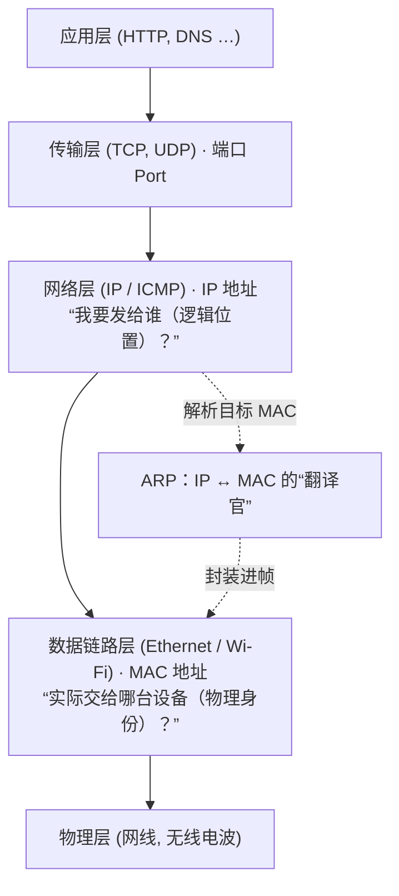
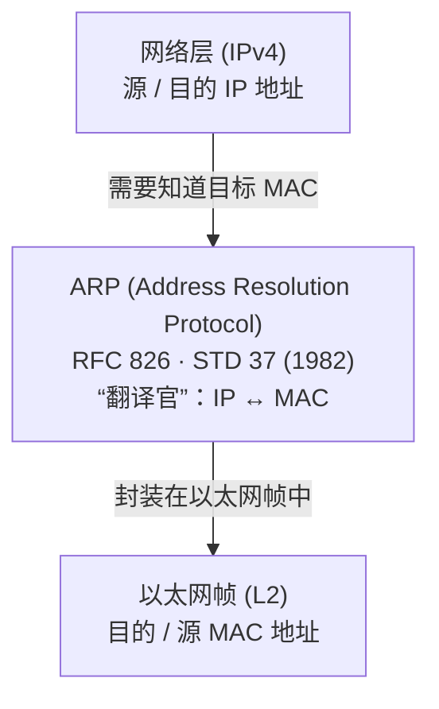
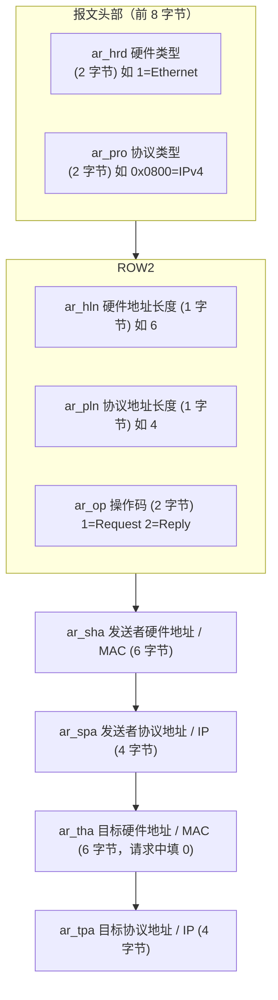
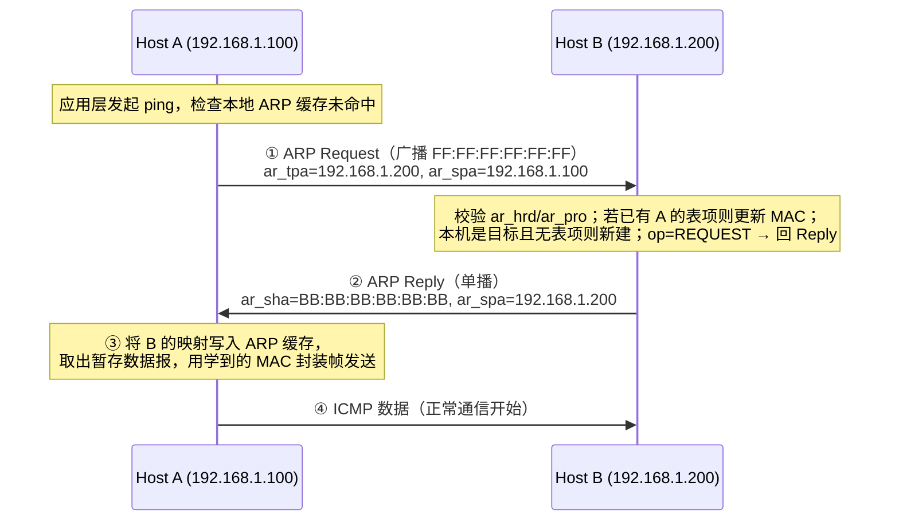
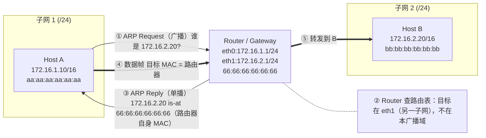
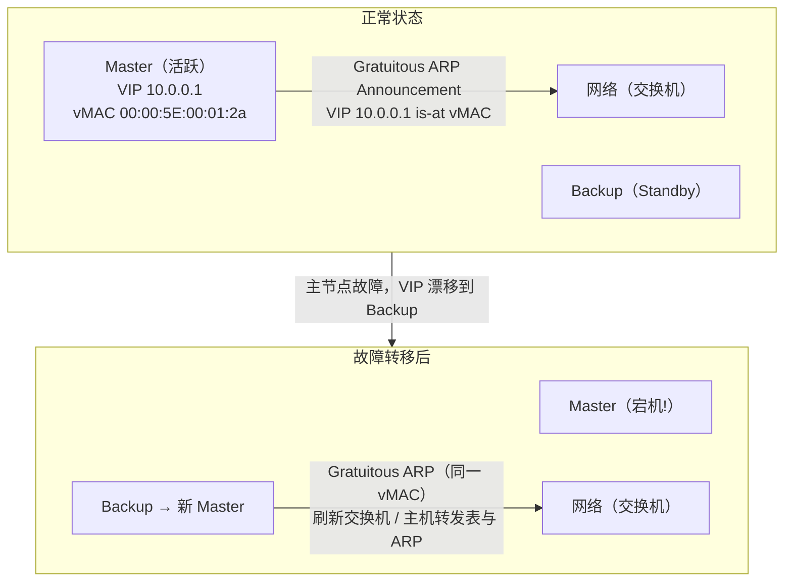
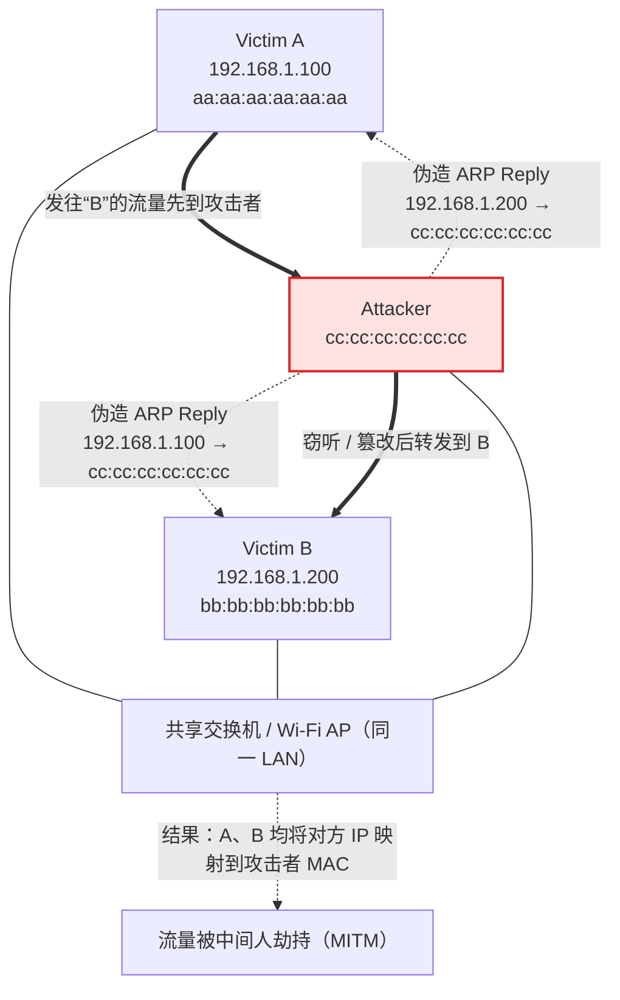
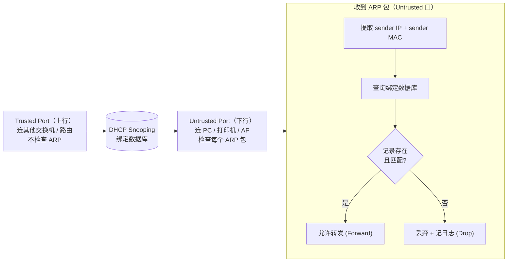
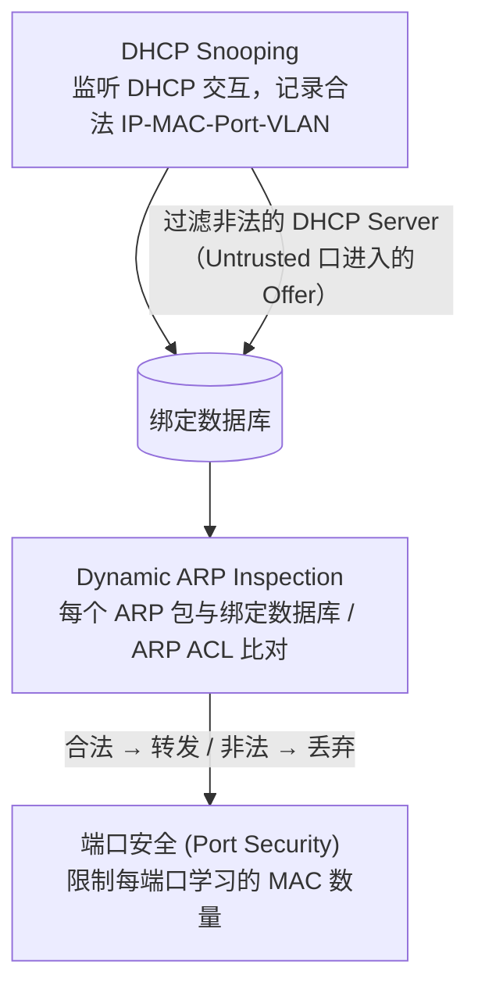
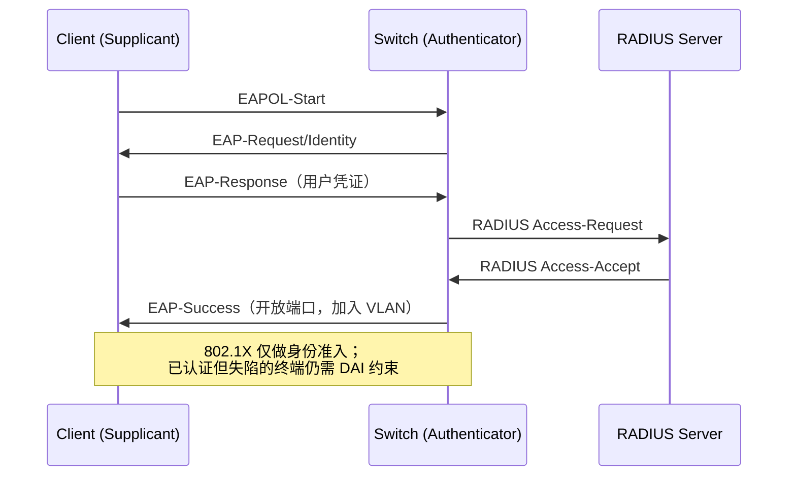

# ARP 协议深度解析：从地址解析到安全攻防的完整指南

<p align="center"><strong>作者：</strong>Artificer老王 &nbsp;&nbsp;|&nbsp;&nbsp; <strong>更新时间：</strong>2026-07-18 &nbsp;&nbsp;|&nbsp;&nbsp; <strong>阅读时长：</strong>约 20 分钟</p>

---

你有没有想过，当你在终端输入 `ping 192.168.1.1` 并按下回车后，在数据真正发送出去之前，网络底层还发生了一件“隐秘”的事？

很多人知道 **IP 地址**是逻辑地址、**MAC 地址**是物理地址，但真要细问：

**IP 地址是怎么找到对应 MAC 地址的？**  
**跨网访问时，为什么不对远端主机做 ARP，却仍要解析网关 MAC？**  
**ARP 缓存表为什么会“中毒”？如何防御？**

今天我们带着这些问题，结合 **RFC 规范**，把 ARP 的**诞生背景 → 协议定义 → 工作原理 → 应用场景 → 安全攻防**这条完整链路彻底搞清楚。

---

## ARP 诞生的背景：网络分层中的“地址断层”

### IP 与 MAC：两种完全不同的地址体系

要理解 ARP 为什么存在，先得搞清楚网络协议栈中的两层地址：



**核心矛盾**：

| 属性 | IP 地址 | MAC 地址 |
|------|---------|----------|
| **所属层级** | 网络层（第3层） | 数据链路层（第2层） |
| **长度** | 32位（IPv4）/ 128位（IPv6） | 48位（以太网） |
| **分配方式** | 可由管理员配置或 DHCP 动态分配 | 厂商获得 OUI 并分配其余地址位后写入网卡（可软件改写，也有本地管理地址） |
| **可变性** | 可变（换网段通常会变） | 通常固定于网卡，但可被操作系统/驱动修改 |
| **作用范围** | 可跨网段路由，实际可达性取决于路由和策略 | 用于本链路帧交付 |

> 💡 **关键认知**：以太网帧在本链路上的交付依据目的 MAC 地址，而不是目的 IP 地址。因此，发送 IPv4 数据报前需要得到下一跳的 MAC 地址——这就是 ARP 存在的根本原因。

### 为什么不能直接用 MAC 代替 IP？

既然每张网卡都有（设计上）全球唯一的 MAC 地址，为什么不直接用 MAC 来通信？

```text
问题 1: 移动性
━━━━━━━━━━━━━━━━━━━━━
你的笔记本带着固定的 MAC: aa:bb:cc:dd:ee:ff

今天在公司网络: 192.168.10.100
明天在家里网络: 192.168.1.50
后天在咖啡厅:    172.20.0.15

→ 同一台设备在不同网络中需要不同的“逻辑位置”
  IP 表示可路由的逻辑位置，MAC 用作本链路接口标识


问题 2: 路由效率
━━━━━━━━━━━━━━━━━━━━━
如果用 MAC 路由:
- 全球数十亿设备，路由表会爆炸
- MAC 地址无层次结构，无法聚合
- 每次换网络都要更新全球路由表

→ IP 地址有层次结构（网络号 + 主机号）
  支持子网划分和路由聚合（CIDR）


问题 3: 兼容性
━━━━━━━━━━━━━━━━━━━━━
- 不同链路层技术的地址长度不同:
  · Ethernet: 48-bit MAC
  · Wi-Fi:       48-bit MAC
  · Bluetooth:  48-bit BD_ADDR
  · Token Ring:  48-bit 或 16-bit
  · ARCNET:     8-bit
  · AX.25:       64-bit callsign

→ 需要一个统一的上层地址（IP）来屏蔽底层差异
```

### 早期方案的演进与 ARP 的诞生

在网络发展早期，工程师们尝试过多种地址映射方案：

| 方案 | 描述 | 问题 |
|------|------|------|
| **静态配置表** | 每台主机手动维护 IP-MAC 映射文件 | 规模扩大后维护噩梦；设备变动需全局更新 |
| **定期广播通告** | 所有主机周期性广播自己的 IP-MAC 对 | 网络带宽浪费严重；广播风暴风险 |
| **集中式目录服务器** | 类似 DNS 但用于二层地址解析 | 单点故障；增加部署复杂度 |

**1982 年，Xerox PARC 的 David C. Plummer 在 RFC 826 中提出了 ARP 方案**：

> **核心理念**：按需查询 + 广播请求 + 单播响应 + 本地缓存

这个设计优雅地解决了上述所有痛点：
- 不浪费带宽（只在需要时才发请求）
- 无单点故障（分布式协议）
- 通过缓存减少重复查询（后续通信直接命中缓存）

---

## ARP 协议的定义：RFC 826 标准解读

### 协议定位：连接网络层与链路层的“翻译官”

在 TCP/IP 模型中，RFC 1122 将 ARP 归入**链路层**；从功能上看，它承担 IPv4 地址到链路层地址的映射，因此常被形容为连接网络层与链路层的辅助协议：



**标准信息**：

| 项目 | 值 |
|------|-----|
| **RFC 编号** | RFC 826（1982年11月发布） |
| **标准状态** | STD 37（Internet Standard） |
| **作者** | David C. Plummer（Xerox PARC） |
| **相关规范** | RFC 5494（ARP 参数分配指南，Updates 826）；RFC 5227（IPv4 地址冲突检测，**Updates 826**：扩展探测/宣告/持续检测，但不改 826 的报文格式与 Packet Reception 规则）；RFC 1122 §2.3.2（主机侧 ARP 实现要求） |
| **EtherType** | `0x0806`（标识以太网载荷为 ARP 报文） |

### 报文格式详解（9 个字段）

ARP 报文直接封装在以太网帧的数据部分。下面是完整的报文结构：

#### A. 外层以太网帧头


对 Ethernet/IPv4 ARP，28 字节 ARP 报文需要填充 18 字节，达到 46 字节最小以太网载荷；加上 14 字节以太网头和 4 字节 FCS 后，帧长为 64 字节（不含前导码和帧间隙）。常见抓包工具不显示 FCS。

#### B. ARP 报文字段（核心）



#### 各字段详细说明

| 字段名 | 大小 | 示例值 | 含义说明 |
|--------|------|--------|----------|
| **ar_hrd** | 16 bits | `0x0001` (Ethernet) | 硬件类型。定义了链路层的硬件地址格式。常见值：1=Ethernet, 6=IEEE 802 Networks, 15=Frame Relay, 17=HDLC |
| **ar_pro** | 16 bits | `0x0800` (IPv4) | 协议类型。指示上层协议的 EtherType 值。IPv4 = 0x0800。**注意：IPv6 不使用 ARP**，地址解析由 NDP（Neighbor Discovery Protocol，ICMPv6）完成 |
| **ar_hln** | 8 bits | `6` | 硬件地址的字节长度。对于以太网 MAC 地址为 6 字节（48 位） |
| **ar_pln** | 8 bits | `4` | 协议地址的字节长度。对于 IPv4 地址为 4 字节（32 位） |
| **ar_op** | 16 bits | `1`（Request）/ `2`（Reply） | 操作码（Opcode）。`ares_op_REQUEST = 1`（请求），`ares_op_REPLY = 2`（应答）。其他值用于 RARP（3/4）、DRARP（5～7）等扩展 |
| **ar_sha** | n bytes | `aa:bb:cc:dd:ee:ff` | 当前报文发送者的硬件地址（Sender Hardware Address） |
| **ar_spa** | m bytes | `192.168.1.100` | 当前报文发送者的协议地址（Sender Protocol Address） |
| **ar_tha** | n bytes | `00:00:00:00:00:00` | 目标硬件地址（Target HW Address）。**请求报文**中通常填充全 0（表示未知）；**应答报文**中为原始请求者的 MAC |
| **ar_tpa** | m bytes | `192.168.1.1` | 目标协议地址（Target Protocol Address）。这是**想要查询的那个 IP 地址** |

> ⚠️ **注意**：ARP 报文自身没有校验和字段；链路传输差错通常由以太网 FCS 检测。普通校验和并不能阻止攻击者重新构造报文，ARP 欺骗的根因是协议没有提供发送者认证和 IP–MAC 绑定真实性验证。

### 操作码一览表

| Opcode 值 | 名称 | 含义 |
|-----------|------|------|
| **1** | ARP Request | 请求解析地址；传统首次解析通常使用广播，也可按 RFC 1122 用单播 Request 验证缓存 |
| **2** | ARP Reply | 应答地址映射；传统流程通常单播应答，RFC 5227 §2.6 也讨论广播 Reply |
| **3** | RARP Request | 反向 ARP 请求（已淘汰）：已知 MAC 求 IP |
| **4** | RARP Reply | 反向 ARP 应答（已淘汰） |
| **5** | DRARP Request | 动态 RARP 请求 |
| **6** | DRARP Reply | 动态 RARP 回复 |
| **7** | DRARP Error | 动态 RARP 错误 |
| **8** | InARP Request | 反向 ARP（用于 Frame Relay/ATM） |
| **9** | InARP Reply | 反向 ARP 应答 |
| **10～25** | ARP-NAK、MARS、MAPOS、实验值等 | 具体分配见 IANA ARP Parameters；26～65534 未分配，0/65535 保留 |

---

## ARP 工作原理：从请求到应答的完整流程

### 传统 ARP 请求-应答过程

假设主机 A（`192.168.1.100`）想给主机 B（`192.168.1.200`）发送一个 ICMP 包（比如 ping），但 A 不知道 B 的 MAC 地址。



### RFC 826 定义的缓存更新规则（重要！）

这是 ARP 协议的一个**非常关键的细节**，很多资料写成了“无条件学习”，与 RFC 826 给出的接收算法不符：

> **RFC 826 给出的算法先检查发送者协议地址（`ar_spa`）是否已有表项：有则更新 MAC；没有则仅当本机是目标协议地址（`ar_tpa`）时才新建。随后再检查操作码，对 Request 发送 Reply。该算法不验证发送者是否真的拥有相应 IP；现代实现可能采用更严格的学习策略。**

```text
RFC 826 Packet Reception Algorithm (Merge_flag 语义):

After receiving an ARP packet:
  1. Validate: Check ar_hrd / ar_pro (及可选的长度字段) 匹配本机网络类型
  2. Merge_flag := false
     If <protocol type, ar_spa> 已在缓存中:
       → UPDATE 该表项的硬件地址为 ar_sha
       → Merge_flag := true
  3. CHECK: Is ar_tpa == my protocol address?
     → NO: 结束处理 (旁观者到此为止; 若步骤 2 已更新则保留更新)
     → YES:
         If Merge_flag == false: ADD 新表项 <ar_spa, ar_sha>
         If op == REQUEST: 构造并发送 REPLY
```

**这个设计有什么影响？**

```text
场景: 主机 C 只是旁观者, 不是 ARP Request 的目标

主机 A 广播: "谁是 192.168.1.200?" (包含 A 自己的 IP+MAC)

主机 C (旁观者, ar_tpa != 自己的 IP):
  → 若缓存中已有 192.168.1.100 的表项: 用 A 的新 MAC 更新该表项
  → 若缓存中没有该表项: 按 RFC 826 不新建 (不会「顺手学会」A)

目标主机 B (ar_tpa == 自己的 IP):
  → 若尚无 A 的表项: 新建 192.168.1.100 → aa:aa:aa:aa:aa:aa
  → 再对 REQUEST 回 REPLY

好处:
  ✅ 目标主机可在一次交互中学到对端映射, 减少回程再发 ARP
  ✅ 已有表项会被刷新, 适应网卡更换等场景

隐患:
  ⚠️ 已有表项可能被符合接收条件的 ARP 报文覆盖, 且不验证发送者身份
  ⚠️ 针对自己的伪造包还可新建错误映射
     (这就是 ARP Spoofing 的协议基础; 现代 OS 策略可能更严,
      例如 Linux 默认 arp_accept=0 时, 未请求的免费 ARP 不一定新建条目)
```

### ARP 缓存表的查看与管理

**Linux/macOS 常用命令**：

```bash
# 查看 ARP 缓存表（现代 Linux 推荐）
ip neigh show
# 输出示例:
# 192.168.1.1 dev eth0 lladdr 11:22:33:44:55:66 STALE
# 192.168.1.100 dev eth0 lladdr aa:bb:cc:dd:ee:ff REACHABLE
# 192.168.1.200 dev eth0 FAILED

# 传统命令（仍广泛支持）
arp -n
# -n 参数: 不做 DNS 反向解析, 显示数字 IP, 加快输出速度

# macOS 特有命令
arp -a
```

**缓存条目状态说明**：

| 状态 | 含义 | 说明 |
|------|------|------|
| **REACHABLE** | 可达 | 条目有效，最近验证过 |
| **STALE** | 陈旧 | 映射仍可用于立即发包；使用后转入 DELAY，必要时再探测 |
| **DELAY** | 延迟确认 | 已使用 STALE 映射，等待上层协议提供可达性确认 |
| **PROBE** | 探测中 | 正在发送单播邻居探测并等待响应 |
| **FAILED** | 失败 | 探测无响应，该条目不可用 |
| **PERMANENT** | 永久 | 手动配置的静态条目，不会过期 |
| **INCOMPLETE** | 不完整 | 正在进行 ARP 解析，等待响应 |

**缓存参数（Linux 常见配置示例）**：

```bash
# 查询 eth0 的实际参数；default 目录只是新建接口时使用的模板
sysctl net.ipv4.neigh.eth0.base_reachable_time_ms
# 常见默认值为 30000 ms；实际 REACHABLE 时间随机为其 0.5～1.5 倍

sysctl net.ipv4.neigh.eth0.gc_stale_time
# 常见默认值为 60 秒；它不是 REACHABLE 状态超时

# 查询邻居表垃圾回收阈值（具体默认值随内核/发行版而异）
sysctl net.ipv4.neigh.default.gc_thresh1
sysctl net.ipv4.neigh.default.gc_thresh2
sysctl net.ipv4.neigh.default.gc_thresh3
```

> 📌 **RFC 1122 §2.3.2 对主机实现的要求**：
> - 必须能**失效过期的 ARP 缓存**（超时/主动探测等），否则错误映射会长期残留
> - 必须限制对同一目标的 ARP Request 重传，建议上限为**每个目标每秒 1 次**
> - 解析完成前应该为每个未解析目标至少保存一个（最新的）待发数据报

### 用 tcpdump 抓包观察 ARP 过程

```bash
# 终端 1: 清空 ARP 缓存后抓包
sudo ip neigh flush all
sudo tcpdump -i eth0 -nn -e arp

# 终端 2: ping 一个同网段主机
ping 192.168.1.200 -c 1
```

**抓包结果示例**：

```text
# 第一次抓到的是 ARP Request (广播)
# 时间戳     源MAC              目标MAC             类型  ARP详情
12:34:56.789012 aa:aa:aa:aa:aa:aa Broadcast    ARP, Request who-has 192.168.1.200 tell 192.168.1.100, length 28

# 第二次抓到的是 ARP Reply (单播)
12:34:56.789345 bb:bb:bb:bb:bb:bb aa:aa:aa:aa:aa:aa ARP, Reply 192.168.1.200 is-at bb:bb:bb:bb:bb:bb, length 28
```

**关键字段解释**：

```text
tcpdump ARP 输出格式:

ARP, Request who-has <target-ip> tell <sender-ip>
  → ar_op = REQUEST (1)
  → ar_tpa = target-ip (要查询的目标IP)
  → ar_spa = sender-ip (发送者的IP)
  → 目标MAC = FF:FF:FF:FF:FF:FF (广播)

ARP, Reply <sender-ip> is-at <sender-mac>
  → ar_op = REPLY (2)
  → ar_spa / ar_sha = 应答者的 IP / MAC
  → 目标MAC = 请求者的MAC (单播回送)
```

### 免费 ARP 与 RFC 5227 地址冲突检测（ACD）

RFC 5227 将传统免费 ARP 中用于地址宣告的 Request 形式定义为 **ARP Announcement**。完整的 IPv4 地址冲突检测（ACD）还包括探测阶段的 **ARP Probe**——二者不要混为一谈。

> ⚠️ RFC 5227 明确指出：仅发送传统 Gratuitous ARP **不足以**做有效的重复地址检测；规范流程是 **Probe →（等待）→ Announcement → 持续检测**。

#### 三种报文对比

```text
标准 ARP Request (解析他人地址):
  ar_spa = 本机 IP
  ar_tpa = 要查询的他人 IP   (spa ≠ tpa)
  例: "谁是 192.168.1.200?" (我是 192.168.1.100)

ARP Probe (RFC 5227 探测, 尚未宣称可用该地址):
  ar_op  = REQUEST
  ar_spa = 0.0.0.0           (全零, 避免污染他人缓存)
  ar_tpa = 待检测地址
  ar_sha = 本机 MAC
  ar_tha = 全 0              (接收方忽略该字段，规范要求 SHOULD 填 0)
  含义: "有人在用这个地址吗? 我希望用它。"

ARP Announcement / 传统 Gratuitous ARP (宣告已使用该地址):
  ar_op  = REQUEST           (不是 Reply!)
  ar_spa = 本机 IP
  ar_tpa = 本机 IP           (spa == tpa, 关键特征)
  ar_sha = 本机 MAC
  ar_tha = 全 0
  含义: "这个地址我现在正在使用。"
```

> 💡 **为什么 Announcement 用 Request 而不是 Reply？**（RFC 5227 §3）
>
> 1. **历史兼容性**：BSD Unix、Windows、macOS 等主流实现均遵循 Stevens 《TCP/IP Illustrated》的做法，使用 ARP Request
> 2. **兼容不规范实现**：部分实现认为 Reply 只能单播、忽略未请求的 Reply，或要求 Reply 的目标必须匹配本机——使用 Request 可避免这些问题

#### Announcement（免费 ARP）的主要用途

| 场景 | 说明 |
|------|------|
| **刷新邻居缓存** | 宣称地址后促使已有相关表项的邻居更新映射（ACD 宣告阶段） |
| **网卡/MAC 变更** | 更换硬件地址后主动宣告，促使邻居更新映射 |
| **虚拟 IP 迁移** | 高可用（HA）/负载均衡中 VIP 漂移时通知网络 |
| **接口 UP 通知** | 网卡激活后主动宣告，加速后续通信建立 |

> 地址是否已被占用，应靠 **ARP Probe（探测阶段）** 判断，而不是单靠 Announcement。

#### RFC 5227 定义的三阶段检测机制

```text
阶段一: Probing Phase (主动探测)
━━━━━━━━━━━━━━━━━━━━━━━━━━━━━━━━━━
触发时机 (示例):
  · 接口初始配置 IP 地址时 (手动/DHCP/其他)
  · 网络接口从非活动转为活动状态
  · 计算机从睡眠/休眠唤醒
  · 以太网链路状态变化 (link-state change)
  · Wi-Fi 关联新 AP 时

注意:
  · 主机 MUST NOT 把地址探测作为周期性例行操作

常量:
  PROBE_WAIT   = 1 秒   (初始随机延迟上限)
  PROBE_NUM    = 3     (探测包数量)
  PROBE_MIN/MAX = 1～2 秒 (探测间隔随机范围)
  ANNOUNCE_WAIT = 2 秒  (最后一次 Probe 之后、宣告之前的等待)

执行流程:
  1. 等待随机延迟 (0～PROBE_WAIT), 避免多机同时上线
  2. 发送 PROBE_NUM = 3 次 ARP Probe (spa=0.0.0.0, tpa=待测地址)
     间隔均匀随机于 PROBE_MIN～PROBE_MAX
  3. 从探测开始直到「最后一次 Probe + ANNOUNCE_WAIT」期间, 若出现:
     · 任意 ARP (Request 或 Reply), 且 spa == 待测地址
       → MUST 视为地址已被占用 ❌
     · 或 ARP Probe 的 tpa == 待测地址, 且 sha 不是本机任一接口
       → SHOULD 视为冲突 ❌
       (须排除本机广播被交换机/AP 回环的情况)
  4. 上述窗口内无冲突 → 才可进入宣告阶段


阶段二: Announcing Phase (地址宣告)
━━━━━━━━━━━━━━━━━━━━━━━━━━━━━━━━━━
参数:
  ANNOUNCE_NUM      = 2  (宣告包数量)
  ANNOUNCE_INTERVAL = 2 秒 (宣告间隔)

流程:
  1. 广播 ARP Announcement (REQUEST, spa == tpa == 新地址)
  2. 第一个 Announcement 发出后即可开始正常使用该地址
  3. 第二个 Announcement 可异步完成 (间隔 ANNOUNCE_INTERVAL)


阶段三: Ongoing Conflict Detection (持续检测)
━━━━━━━━━━━━━━━━━━━━━━━━━━━━━━━━━━
判定冲突 (使用地址期间持续生效):
  · 收到任意 ARP (Request 或 Reply), spa 是本机 IP,
    但 sha 不是本机任一接口的硬件地址

继续运行:
  · 地址投入使用后，目标地址为本机的普通 Request 和
    spa=0.0.0.0 的 Probe 都必须按 RFC 826 正常应答

主机 MUST 在下列 (a)/(b)/(c) 中择一应对 (RFC 5227 §2.4；各策略内的取舍用 MAY 表述):
┌──────────┬──────────────────────────┬──────────────────────────────────┐
│ 策略      │ 典型选择动机              │ 行为                              │
├──────────┼──────────────────────────┼──────────────────────────────────┤
│ (a)放弃  │ 可重新获取地址的主机       │ 立即停止使用, 通知配置代理重新获取 │
│ (b)单次  │ 希望尽量保住地址           │ 广播一次 Announcement 宣示主权;   │
│   防御   │ (如仍有活跃 TCP 等)        │ DEFEND_INTERVAL（10 秒）内再冲突则放弃│
│ (c)持续  │ 需稳定知名地址的设备       │ 记录日志+通知管理员; 按 DEFEND_    │
│   防御   │ (如默认路由器/DNS)         │ INTERVAL 限速, 避免防御风暴       │
└──────────┴──────────────────────────┴──────────────────────────────────┘

速率限制:
  MAX_CONFLICTS        = 10   (达到此冲突次数后触发限制)
  RATE_LIMIT_INTERVAL  = 60 秒 (此后探测新候选地址的最小尝试间隔)
  DEFEND_INTERVAL      = 10 秒 (限制防御性 Announcement 的频率)
```

### 代理 ARP（Proxy ARP）

代理 ARP（Proxy ARP，又称 **ARP hack**、**Transparent Subnet Gateway**），由 RFC 1027 定义，是一种让路由器/网关**透明地代答 ARP 请求**的技术。

#### 工作原理



#### 配置方法（Linux/Cisco）

```bash
# Linux: 启用代理 ARP (per-interface)
sysctl -w net.ipv4.conf.eth0.proxy_arp=1

# 写入配置持久化 (/etc/sysctl.conf 或 /etc/sysctl.d/*.conf):
# net.ipv4.conf.eth0.proxy_arp = 1

# Cisco IOS:
interface GigabitEthernet0/1
 ip proxy-arp    # 启用；默认状态依平台、版本和接口类型而异
 # no ip proxy-arp  # 关闭
```

#### 安全约束（RFC 1027 §2.4 Sanity checks）

| 约束条件 | 规则 | 违反后果 |
|----------|------|----------|
| **同物理网络检查** | 源和目标经同一物理接口可达时**不得**代答（原文 must not） | 可能导致 ARP 环路 |
| **跨 IP 网络检查** | 源和目标属于不同 IP network 时**通常不应**代答（原文 should not） | 可能绕过安全策略/防火墙 |
| **广播地址检查** | **绝不**代答广播地址（255.255.255.255 等） | “切尔诺贝利效应”/广播风暴 |

> ⚠️ **生产环境注意**：无明确需求时宜关闭 Proxy ARP；PPP、VPN、无线隔离和特定迁移/路由场景仍可能需要它。启用时应限制接口与路由范围，并落实上述 sanity checks。

---

## ARP 协议的应用场景

### 场景 1：同网段直接通信（最基本用途）

这是 ARP 最原始、最常用的功能：

```text
Host A (192.168.1.10) ──── ping ────► Host B (192.168.1.20)

流程:
1. A 分别将目的地址和本机地址与 255.255.255.0 按位与
   → 两者结果都是 192.168.1.0 → 同网段!
   → 需要通过 ARP 获取 B 的 MAC

2. A 发送 ARP Request: "谁是 192.168.1.20?"

3. B 应答 ARP Reply: "我是 192.168.1.20, MAC=bb:bb:bb:bb:bb:bb"

4. A 用学到的 MAC 封装以太网帧, 直接投递给 B
```

### 场景 2：默认网关 MAC 解析（跨网段通信的前提）

当访问外部网络时，虽然最终目标不在本地，但发送第一跳以太网帧前仍然需要知道默认网关的 MAC：

```text
Host (192.168.1.100) → 访问 203.0.113.10 (RFC 5737 TEST-NET-3 示例地址)

判断: 203.0.113.10 不在 192.168.1.0/24
      → 需要发给默认网关 192.168.1.1

ARP 流程:
1. "谁是 192.168.1.1?" (默认网关)
2. 网关回复: MAC = 11:22:33:44:55:66
3. 数据帧目标 MAC = 11:22:33:44:55:66
4. 网关收到后根据路由表继续转发...
```

**查看默认网关的 ARP 条目**：

```bash
# 先查看默认路由，确认网关地址和出口接口
ip -4 route show default
# 示例输出: default via 192.168.1.1 dev eth0

# 再精确查询该网关的邻居项（按实际输出替换地址和接口）
ip neigh show to 192.168.1.1 dev eth0
```

### 场景 3：地址冲突检测（RFC 5227 ACD）

每当设备接入网络时，都需要确保自己的 IP 地址不会与其他设备冲突。完整流程是 **ARP Probe → ANNOUNCE_WAIT → ARP Announcement**，而不是只发一次免费 ARP：

| 触发时机 | 具体场景 |
|----------|----------|
| **DHCP 分配后** | DHCP Server 分配地址后，客户端应进行冲突检测（部分 DHCP 实现会代为检测） |
| **手动配置 IP 时** | 管理员输入固定 IP 后立即反馈是否有冲突 |
| **设备唤醒恢复时** | 从睡眠/休眠唤醒，重新接入网络 |
| **网络切换时** | 有线↔无线切换、漫游到新的 AP |
| **虚拟机启动时** | VM 创建/克隆后首次获得 IP 地址 |

**实战抓包**：

```bash
# 仅匹配 Ethernet/IPv4 的 RFC 5227 Request 型 Announcement
# ar_pro=IPv4, hln=6, pln=4, op=Request, spa=tpa, 目的 MAC 为广播
sudo tcpdump -i eth0 -nn -e 'arp and arp[2:2] = 0x0800 and arp[4] = 6 and arp[5] = 4 and arp[6:2] = 1 and arp[14:4] = arp[24:4] and ether broadcast'

# 仅匹配 Ethernet/IPv4 ARP Probe: Request 且 spa=0.0.0.0
sudo tcpdump -i eth0 -nn -e 'arp and arp[2:2] = 0x0800 and arp[4] = 6 and arp[5] = 4 and arp[6:2] = 1 and arp[14:4] = 0'
```

### 场景 4：高可用与负载均衡（VRRP / CARP / HSRP）

在高可用架构中，多个节点共享同一个 **虚拟 IP（VIP）**，当主节点故障时 VIP 自动漂移到备用节点：



### 场景 5：网络设备发现与连通性检测

```text
用途示例:

1. 设备发现/资产盘点:
   对本地网段执行主动 ARP 扫描并汇总响应, 可获得在线设备的 IP-MAC 对照表
   (仅查看本机缓存通常只能看到近期解析或通信过的邻居)
   (常用于内网资产管理工具)

2. 故障排查:
   ping 不通时检查 ARP 缓存:
   · 如果 ARP 缓存中有记录但 ping 不通 → 可能是防火墙/ICMP 被禁
   · 如果 ARP 缓存中显示 INCOMPLETE → 对方没开机或网络不通
   · 如果 ARP 缓存中被替换成异常 MAC → 可能遭受 ARP 欺骗!

3. 双网卡绑定/桥接模式:
   Linux bond/bridge 模式下, 需要正确处理 ARP 以避免 MAC 漂移
```

---

## ARP 攻击与防御：从欺骗到中间人攻击

### ARP 欺骗攻击原理（ARP Spoofing / Cache Poisoning）

ARP 协议有一个重要的**安全局限**：

> **信任但不验证（Trust without Verification）**
>
> 按 RFC 826 给出的接收算法：若缓存中已有发送者 IP 的表项，收到相同 `ar_spa` 的 ARP 报文后会用 `ar_sha` **覆盖更新**；若本机是 `ar_tpa` 指定的目标且尚无表项，还会**新建**映射——全程不验证发送者是否真的拥有相应 IP。现代实现可能对学习条件施加额外限制。

这个特性使得攻击者可以**主动注入虚假的 ARP 报文**（常见为未请求的 Reply），优先污染受害者**已有**的缓存表项；也可在目标主机上写入新的错误映射。

#### 攻击流程详解（中间人攻击 MITM）



### 常见攻击工具

| 工具名称 | 功能特点 | 平台 |
|----------|----------|------|
| **arpspoof** (dsniff 套件) | 经典 ARP 欺骗工具，简单易用 | Linux |
| **Ettercap** | 图形化中间人攻击套件，支持插件扩展 | Linux/Windows/macOS |
| **Bettercap** | 现代、强大的网络攻击框架（Go 语言编写），支持 ARP/DNS/NDP 等欺骗 | 跨平台 |
| **Cain & Abel** | Windows 下经典的多功能渗透测试工具 | Windows |
| **Scapy** | Python 库，可自定义构造 ARP 报文 | 跨平台（Python） |

### 攻击检测方法

#### 1. 检查 ARP 缓存异常

```bash
# 方法 1: 观察关键 IP 的 MAC 是否异常或频繁变化
ip neigh show

# 方法 2: 对比多台机器的 ARP 缓存
# 在同一二层域、同一时刻且预期为稳定单一邻居时:
# 同一 IP 在不同主机上对应不同 MAC 值得调查
# 需先排除 Proxy ARP、高可用切换、迁移等合法场景

# 方法 3: 使用 arpwatch 自动监控 ARP 变化
# 安装: apt install arpwatch (Ubuntu/Debian)
# arpwatch 可记录 ARP 映射变化；邮件告警和日志位置取决于发行版配置
# systemd 系统可先查看: journalctl -u arpwatch

# 日志示例 (正常):
# hostname: ip address (MAC address) interface [new|old]

# 日志示例 (异常 - flip flop):
# hostname: ip address (MAC_A) → (MAC_B) on eth0  # MAC 反复变化!
```

#### 2. tcpdump/Wireshark 抓包分析

```bash
# 抓取全部 Ethernet/IPv4 ARP Reply
# 此过滤器本身无法判断 Reply 是否对应未决 Request，需结合时序分析
sudo tcpdump -i eth0 -nn -e 'arp and arp[6:2] = 2'

# 分析重点:
# 1. 是否有大量来自同一 MAC 的 ARP Reply?
# 2. Reply 中的 IP-MAC 映射是否合理?
# 3. 关键 IP 的 MAC 是否异常或频繁变化?
```

#### 3. 不要误用这两个 sysctl 当「ARP 欺骗检测」

```bash
# log_martians: 记录源地址非法的 IP 包 (martian), 与 ARP 欺骗无关
# sysctl net.ipv4.conf.all.log_martians=1

# arp_notify: 本机地址增删/变更时主动发免费 ARP, 用于通知邻居, 不是攻击检测开关
# sysctl net.ipv4.conf.all.arp_notify=1

# ARP 异常检测请用上文的 arpwatch / tcpdump / 多机缓存对比
```

### 防御方案

#### 方案 1：静态 ARP 绑定

最简单粗暴但有效的方案：手动将关键 IP-MAC 关系写入静态表。

```bash
# Linux: 新建或替换静态邻居条目
sudo ip neigh replace 192.168.1.1 lladdr 11:22:33:44:55:66 dev eth0 nud permanent

# 或使用传统命令
sudo arp -s 192.168.1.1 11:22:33:44:55:66

# 验证
ip neigh show
# 192.168.1.1 dev eth0 lladdr 11:22:33:44:55:66 PERMANENT
#                                              ^^^^^^^^^^
#                                           永久条目, 不会被动态覆盖

# 批量绑定脚本示例 (适合小型网络):
#!/bin/bash
# bind_arp.sh
declare -A BINDINGS=(
  ["192.168.1.1"]="11:22:33:44:55:66"  # 网关
  ["192.168.1.2"]="AA:BB:CC:DD:EE:FF"  # DNS 服务器
  ["192.168.1.3"]="33:44:55:66:77:88"  # 文件服务器
)

for ip in "${!BINDINGS[@]}"; do
  mac="${BINDINGS[$ip]}"
  ip neigh replace "$ip" lladdr "$mac" dev eth0 nud permanent
  echo "Bound $ip → $mac"
done
```

| 优点 | 缺点 |
|------|------|
| 实现简单，立竿见效 | 大型网络管理成本高 |
| 可防止该主机的指定邻居项被普通动态 ARP 覆盖 | 设备变更需同步更新所有主机 |
| 无需额外硬件/软件 | 无法防范未知设备的攻击 |

#### 方案 2：DAI 动态 ARP 检测（企业级首选）

**Dynamic ARP Inspection (DAI)** 是一种 Layer 2 安全机制，工作在**交换机**上，通过验证每个 ARP 包的合法性来阻止欺骗攻击。

##### DAI 的工作原理



##### Trusted / Untrusted 端口

| 端口类型 | DAI 处理行为 | 适用场景 |
|----------|-------------|----------|
| **Trusted（受信任）** | **不检查** ARP 包，直接转发 | 连接其他交换机、路由器、DHCP 服务器的上行端口 |
| **Untrusted（非受信任）** | **严格验证** ARP 包合法性 | 连接 PC、打印机、无线 AP 等终端设备的接入端口 |

> 💡 **设计原则**：多数终端侧威胁来自接入口，但受信任上联、恶意 AP 或被攻陷的网络设备也可能成为攻击源。Trusted 端口会绕过检查，因此信任边界应最小化并定期审计。

##### Cisco 交换机 DAI 配置实例

```cisco
! ============================================
! Step 1: 先启用 DHCP Snooping (DAI 依赖其绑定数据库)
! ============================================

Switch(config)# ip dhcp snooping
Switch(config)# ip dhcp snooping vlan 10,20,30
! 对指定 VLAN 启用 DHCP Snooping
! 接入端口默认 untrusted (不信任客户端侧的 DHCP Offer/ACK)

Switch(config)# interface gigabitethernet 0/1
Switch(config-if)# ip dhcp snooping trust
! 仅上行口设为 trusted (连接 DHCP 服务器 / 上层交换机的端口)

Switch(config)# interface range gigabitethernet 0/2-24
Switch(config-if-range)# ip dhcp snooping limit rate 15
! 接入端口限速: 每秒最多 15 个 DHCP 包 (防 DHCP 泛洪)


! ============================================
! Step 2: 启用 Dynamic ARP Inspection (DAI)
! ============================================

Switch(config)# ip arp inspection vlan 10,20,30
! 对指定 VLAN 启用 DAI

! 设置受信任端口 (通常是上联端口)
Switch(config)# interface gigabitethernet 0/1
Switch(config-if)# ip arp inspection trust
! 此端口不进行 ARP 检查 (连接上层交换机/路由器)

! 可选: 启用以太网头与 ARP 头的 MAC 一致性校验
Switch(config)# ip arp inspection validate src-mac dst-mac
! src-mac :  检查 ARP 包中的 Ethernet 源 MAC == ARP sender MAC
! dst-mac :  检查 ARP 包中的 Ethernet 目标 MAC (仅对 Reply 有效)

! 不要未经验证就追加 ip 校验:
! Cisco 的 ip 校验会把 sender IP 0.0.0.0 视为无效,
! 而 RFC 5227 ARP Probe 正常使用 0.0.0.0。
! 如需启用, 应先查阅具体平台/版本文档, 确认是否支持 allow-zeros
! 或使用 ARP ACL 放行合法 Probe。


! ============================================
! Step 3: 验证配置效果
! ============================================

! 查看 VLAN 的 DAI 状态
Switch# show ip arp inspection vlan 10

! 查看接口的信任状态
Switch# show ip arp inspection interfaces gi 0/2

! 查看 DAI 统计 (转发的包 vs 丢弃的包)
Switch# show ip arp inspection statistics vlan 10
```

> **静态 IP 主机注意**：DHCP Snooping 数据库不会自动产生静态地址绑定。对静态地址主机，应按具体 Cisco 平台配置 ARP ACL（`arp access-list` 并通过 `ip arp inspection filter ... vlan ...` 应用）或其他受支持的静态绑定机制，否则 DAI 可能丢弃合法 ARP 报文。

```cisco
! 示例：为 VLAN 10 的静态主机建立 ARP ACL
Switch(config)# arp access-list STATIC_HOSTS
Switch(config-arp-nacl)# permit ip host 192.168.1.10 mac host aabb.ccdd.eeff
Switch(config-arp-nacl)# exit
Switch(config)# ip arp inspection filter STATIC_HOSTS vlan 10
```

**DAI 统计输出示意（字段随平台/版本而异）**：

```text
Vlan      Forwarded        Dropped     DHCP Drops     ACL Drops
----      ---------        -------     ----------     ----------
10              150            47           47            0
                                          ^^^^
                                    大量丢弃 = 需调查攻击或配置错误

Vlan   DHCP Permits    ACL Permits   Source MAC Failures
----   ------------    -----------   -------------------
10             103             0                    5
                                                ^^^^^^
                                          源 MAC 不匹配的次数

Vlan   Dest MAC Failures   IP Validation Failures
----   -----------------   ----------------------
10                  0                        42
                                        ^^^^^^
                                   IP 地址无效的次数
```

#### 方案 3：DHCP Snooping + DAI 组合拳

DAI 通常与 DHCP Snooping **配合使用**形成完整的二层防护体系：



#### 方案 4：802.1X 网络准入控制

对于更高安全要求的场景，可以使用 802.1X 进行**基于身份的网络准入控制**：



### 防御方案对比总结

| 方案 | 部署复杂度 | 成本 | 与 ARP 防护的关系 | 适用场景 |
|------|-----------|------|-------------------|----------|
| **静态 ARP 绑定** | 低 | 低 | 直接保护指定邻居项 | 小型网络 / 关键服务器 |
| **DAI** | 中 | 中 | 直接检查接入口 ARP | 支持 DAI 的企业交换网络 |
| **DHCP Snooping + DAI** | 中 | 中 | 为动态地址提供绑定依据并检查 ARP | 以 DHCP 为主的企业网络 |
| **802.1X 网络准入** | 高 | 高 | 身份准入，间接补充 | 需要认证接入的网络 |
| **arpwatch 监控** | 低 | 低 | 只检测和告警，不主动阻断 | 辅助监控 |

---

## 总结

今天我们从 **RFC 官方规范出发**，系统地梳理了 ARP 协议的核心知识：

**📖 诞生的背景**：
- 网络分层模型中 IP 地址（逻辑位置）与 MAC 地址（本链路接口标识）的天然断层
- ARP 采用“按需查询 + 本地缓存”的设计解决动态地址映射问题

**📋 协议定义（RFC 826）**：
- 9 个字段的报文结构（Hardware Type / Protocol Type / Opcode ...）
- 基本地址解析使用 REQUEST（1）和 REPLY（2）；广播/单播是传统流程的常见形式，并非操作码固有属性
- **关键特性**：RFC 826 给出的接收算法允许更新已有表项、在本机为目标时新建映射，但不验证发送者身份

**⚙️ 工作原理**：
- 传统 ARP 请求-应答流程（广播 Request → 单播 Reply）
- ARP 缓存表机制（REACHABLE / STALE / FAILED 等状态）
- **RFC 5227 ACD**：ARP Probe → ANNOUNCE_WAIT → ARP Announcement（传统免费 ARP）→ 持续冲突检测/防御
- **代理 ARP（Proxy ARP，RFC 1027）**：透明子网网关，使跨子网通信对主机透明
- **RFC 1122**：主机须刷新过期 ARP、防止 ARP flood，并宜暂存未解析完成的待发包

**🎯 主要应用场景**：
- 同网段直接通信 / 默认网关解析 / 地址冲突检测
- 高可用架构（VRRP/CARP/HSRP 的 VIP 漂移通知）
- 网络设备发现 / 连通性检测 / 故障排查

**🛡️ 攻击与防御**：
- ARP 欺骗利用“信任但不验证”的安全局限实施**中间人攻击（MITM）**
- **检测方法**：arpwatch 监控、tcpdump 抓包分析、缓存对比
- **企业级防御方案**：
  - 静态绑定（简单但难维护）
  - **DAI 动态 ARP 检测**（推荐，配合 DHCP Snooping）
  - 802.1X 网络准入（身份控制的补充措施，不能替代 DAI）

> ⚠️ **核心启示**：ARP 不提供发送者认证或绑定真实性验证。高风险共享二层网络应按环境采用 DAI、静态绑定、网络分段、监控和端到端加密等组合措施。

---

## 参考资源

- **RFC 826** - An Ethernet Address Resolution Protocol（ARP 协议官方定义，STD 37）
- **RFC 5227** - IPv4 Address Conflict Detection（Updates 826；Probe / Announcement / 持续检测）
- **RFC 1027** - Using ARP to Implement Transparent Subnet Gateways（代理 ARP；§2.4 安全约束）
- **RFC 5494** - IANA Allocation Guidelines for the Address Resolution Protocol (ARP)（Updates 826）
- **RFC 2390** - Inverse Address Resolution Protocol（InARP，对应 Opcode 8/9）
- **RFC 1122** - Requirements for Internet Hosts -- Communication Layers（§2.3.2 ARP 主机要求）
- **RFC 4861** - Neighbor Discovery for IP version 6（IPv6 侧用 NDP，不用 ARP）
- **IANA ARP Parameters** - https://www.iana.org/assignments/arp-parameters/
- **Wireshark 官方文档** - https://wiki.wireshark.org/ARP
- **Linux man pages** - `man 7 arp`, `man 8 ip-neighbour`
- **Cisco DAI 配置指南** - Configuring Dynamic ARP Inspection

**本文首发于公众号「Artificer老王的学习笔记」，转载请注明出处。**
