## ARP 与 NDP 协议深度解析：从地址解析到安全攻防的完整指南

作者：Artificer老王  |  更新时间：2026-07-18  |  阅读时长：约 40 分钟

📖 **阅读地图**（建议收藏后分段读）：全文两条主线 ——  
**① ARP（IPv4）**：诞生背景 → 报文定义 → 请求应答流程 → 五大应用场景 → 欺骗攻防；  
**② NDP（IPv6）**：为什么 IPv6 不用 ARP → 五种 ICMPv6 消息 → 组播解析 / DAD / NUD / SLAAC → 与 ARP 的 16 维能力对比。  
想直接看结论，可跳到文末「⚔️ ARP vs NDP：能力对比」。

---

你有没有想过，当你在终端输入 `ping 192.168.1.1` 并按下回车后，在数据真正发送出去之前，网络底层还发生了一件“隐秘”的事？

很多人知道 **IP 地址**是逻辑地址、**MAC 地址**是物理地址，但真要细问：

**IP 地址是怎么找到对应 MAC 地址的？**  
**跨网访问时，为什么不对远端主机做 ARP，却仍要解析网关 MAC？**  
**ARP 缓存表为什么会“中毒”？如何防御？**

今天我们带着这些问题，结合 **RFC 官方规范**，把 ARP 的**诞生背景 → 协议定义 → 工作原理 → 应用场景 → 安全攻防**这条完整链路彻底搞清楚。

并进一步对照 IPv6 的 **NDP（邻居发现协议，RFC 4861）**，看清两种协议在能力上的演进与差异 —— 这也是理解现代网络「IPv4 如何平滑过渡到 IPv6」的关键一课。

---

## 🧭 ARP 诞生的背景：网络分层中的“地址断层”

### IP 与 MAC：两种完全不同的地址体系

要理解 ARP 为什么存在，先得搞清楚网络协议栈中的两层地址：

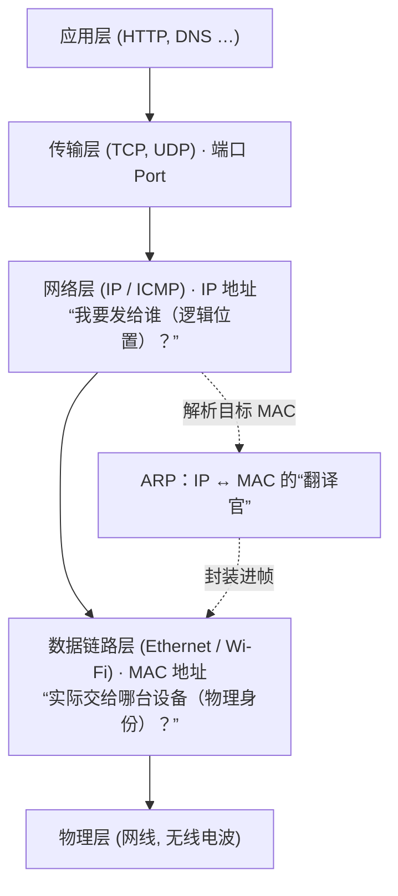
```mermaid
flowchart TB
    App["应用层 (HTTP, DNS …)"]
    Trans["传输层 (TCP, UDP) · 端口 Port"]
    Net["网络层 (IP / ICMP) · IP 地址<br/>“我要发给谁（逻辑位置）？”"]
    Link["数据链路层 (Ethernet / Wi-Fi) · MAC 地址<br/>“实际交给哪台设备（物理身份）？”"]
    Phys["物理层 (网线, 无线电波)"]
    ARP["ARP：IP ↔ MAC 的“翻译官”"]
    App --> Trans --> Net --> Link --> Phys
    Net -.->|"解析目标 MAC"| ARP
    ARP -.->|"封装进帧"| Link
```

**核心矛盾**：

| 属性       | IP 地址                 | MAC 地址                                 |
| -------- | --------------------- | -------------------------------------- |
| **所属层级** | 网络层（第3层）              | 数据链路层（第2层）                             |
| **长度**   | 32位（IPv4）/ 128位（IPv6） | 48位（以太网）                               |
| **分配方式** | 可由管理员配置或 DHCP 动态分配    | 厂商获得 OUI 并分配其余地址位后写入网卡（可软件改写，也有本地管理地址） |
| **可变性**  | 可变（换网段通常会变）           | 通常固定于网卡，但可被操作系统/驱动修改                   |
| **作用范围** | 可跨网段路由，实际可达性取决于路由和策略  | 用于本链路帧交付                               |

💡 **关键认知**：以太网帧在本链路上的交付依据目的 MAC 地址，而不是目的 IP 地址。因此，发送 IPv4 数据报前需要得到下一跳的 MAC 地址——这就是 ARP 存在的根本原因。

### 为什么不能直接用 MAC 代替 IP？

既然每张网卡都有（设计上）全球唯一的 MAC 地址，为什么不直接用 MAC 来通信？

```text
问题 1: 移动性
━━━━━━━━━━━━━━━━━━━━━
你的笔记本带着固定的 MAC: aa:bb:cc:dd:ee:ff

今天在公司网络: 192.168.10.100
明天在家里网络: 192.168.1.50
后天在咖啡厅:    172.20.0.15

→ 同一台设备在不同网络中需要不同的“逻辑位置”
  IP 表示可路由的逻辑位置，MAC 用作本链路接口标识


问题 2: 路由效率
━━━━━━━━━━━━━━━━━━━━━
如果用 MAC 路由:
- 全球数十亿设备，路由表会爆炸
- MAC 地址无层次结构，无法聚合
- 每次换网络都要更新全球路由表

→ IP 地址有层次结构（网络号 + 主机号）
  支持子网划分和路由聚合（CIDR）


问题 3: 兼容性
━━━━━━━━━━━━━━━━━━━━━
- 不同链路层技术的地址长度不同:
  · Ethernet: 48-bit MAC
  · Wi-Fi:       48-bit MAC
  · Bluetooth:  48-bit BD_ADDR
  · Token Ring:  48-bit 或 16-bit
  · ARCNET:     8-bit
  · AX.25:       56-bit（7 字节 callsign+SSID）

→ 需要一个统一的上层地址（IP）来屏蔽底层差异
```

### 早期方案的演进与 ARP 的诞生

在网络发展早期，工程师们尝试过多种地址映射方案：

| 方案           | 描述                    | 问题                     |
| ------------ | --------------------- | ---------------------- |
| **静态配置表**    | 每台主机手动维护 IP-MAC 映射文件  | 规模扩大后这是维护的噩梦；设备变动需全局更新 |
| **定期广播通告**   | 所有主机周期性广播自己的 IP-MAC 对 | 网络带宽浪费严重；广播风暴风险        |
| **集中式目录服务器** | 类似 DNS 但用于二层地址解析      | 单点故障；增加部署复杂度           |

**1982 年，David C. Plummer 在 RFC 826 中提出了 ARP 方案**（当时任职于 Symbolics，RFC 署名邮箱 DCP@MIT-MC；Xerox 是以太网的诞生地，常被误记为 ARP 出处）：

**核心理念**：按需查询 + 广播请求 + 单播响应 + 本地缓存

这个设计优雅地解决了上述所有痛点：

- 不浪费带宽（只在需要时才发请求）
- 无单点故障（分布式协议）
- 通过缓存减少重复查询（后续通信直接命中缓存）

---

## 📜 ARP 协议的定义：RFC 826 标准解读

### 协议定位：连接网络层与链路层的“翻译官”

在 TCP/IP 模型中，RFC 1122 将 ARP 归入**链路层**；从功能上看，它承担 IPv4 地址到链路层地址的映射，因此常被形容为连接网络层与链路层的辅助协议：

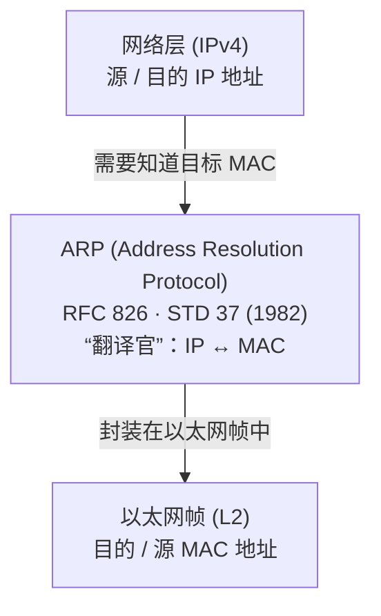
```mermaid
flowchart TB
    L3["网络层 (IPv4)<br/>源 / 目的 IP 地址"]
    ARP["ARP (Address Resolution Protocol)<br/>RFC 826 · STD 37 (1982)<br/>“翻译官”：IP ↔ MAC"]
    L2["以太网帧 (L2)<br/>目的 / 源 MAC 地址"]
    L3 -->|"需要知道目标 MAC"| ARP
    ARP -->|"封装在以太网帧中"| L2
```

### 报文格式详解（9 个字段）

ARP 报文直接封装在以太网帧的数据部分。

下面是完整的报文结构：

#### A. 外层以太网帧头


```mermaid
flowchart LR
    DST["目的 MAC<br/>(6 字节)<br/>请求时 = 广播"]
    SRC["源 MAC<br/>(6 字节)"]
    ET["EtherType<br/>(2 字节)<br/>0x0806 = ARP"]
    ARP["ARP 报文<br/>(28 字节)<br/>含 9 个字段<br/>需填充 18 字节至 46 字节最小载荷"]
    FCS["帧尾 FCS (4 字节，抓包工具通常不显示)"]
    DST --> SRC --> ET --> ARP --> FCS
```

对 Ethernet/IPv4 ARP，28 字节 ARP 报文需要填充 18 字节，达到 46 字节最小以太网载荷；加上 14 字节以太网头和 4 字节 FCS 后，帧长为 64 字节（不含前导码和帧间隙）。常见抓包工具不显示 FCS。

#### B. ARP 报文字段（核心）

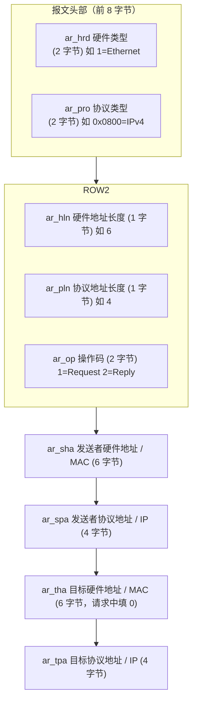
```mermaid
flowchart TB
    subgraph ROW1["报文头部（前 8 字节）"]
        direction LR
        HD["ar_hrd 硬件类型<br/>(2 字节) 如 1=Ethernet"]
        PRO["ar_pro 协议类型<br/>(2 字节) 如 0x0800=IPv4"]
    end
    subgraph ROW2
        direction LR
        HLN["ar_hln 硬件地址长度 (1 字节) 如 6"]
        PLN["ar_pln 协议地址长度 (1 字节) 如 4"]
        OP["ar_op 操作码 (2 字节) 1=Request 2=Reply"]
    end
    SHA["ar_sha 发送者硬件地址 / MAC (6 字节)"]
    SPA["ar_spa 发送者协议地址 / IP (4 字节)"]
    THA["ar_tha 目标硬件地址 / MAC (6 字节，请求中填 0)"]
    TPA["ar_tpa 目标协议地址 / IP (4 字节)"]
    ROW1 --> ROW2 --> SHA --> SPA --> THA --> TPA
```

#### 各字段详细说明

| 字段名        | 大小      | 示例值                      | 含义说明                                                                                                       |
| ---------- | ------- | ------------------------ | ---------------------------------------------------------------------------------------------------------- |
| **ar_hrd** | 16 bits | `0x0001` (Ethernet)      | 硬件类型。定义了链路层的硬件地址格式。常见值：1=Ethernet, 6=IEEE 802 Networks, 15=Frame Relay, 17=HDLC                            |
| **ar_pro** | 16 bits | `0x0800` (IPv4)          | 协议类型。指示上层协议的 EtherType 值。IPv4 = 0x0800。**注意：IPv6 不使用 ARP**，地址解析由 NDP（Neighbor Discovery Protocol，ICMPv6）完成 |
| **ar_hln** | 8 bits  | `6`                      | 硬件地址的字节长度。对于以太网 MAC 地址为 6 字节（48 位）                                                                         |
| **ar_pln** | 8 bits  | `4`                      | 协议地址的字节长度。对于 IPv4 地址为 4 字节（32 位）                                                                           |
| **ar_op**  | 16 bits | `1`（Request）/ `2`（Reply） | 操作码（Opcode）。`ares_op_REQUEST = 1`（请求），`ares_op_REPLY = 2`（应答）。其他值用于 RARP（3/4）、DRARP（5～7）等扩展                |
| **ar_sha** | n bytes | `aa:bb:cc:dd:ee:ff`      | 当前报文发送者的硬件地址（Sender Hardware Address）                                                                      |
| **ar_spa** | m bytes | `192.168.1.100`          | 当前报文发送者的协议地址（Sender Protocol Address）                                                                      |
| **ar_tha** | n bytes | `00:00:00:00:00:00`      | 目标硬件地址（Target HW Address）。**请求报文**中通常填充全 0（表示未知）；**应答报文**中为原始请求者的 MAC                                      |
| **ar_tpa** | m bytes | `192.168.1.1`            | 目标协议地址（Target Protocol Address）。这是**想要查询的那个 IP 地址**                                                        |

⚠️ **注意**：ARP 报文自身没有校验和字段；链路传输差错通常由以太网 FCS 检测。普通校验和并不能阻止攻击者重新构造报文，ARP 欺骗的根因是协议没有提供发送者认证和 IP–MAC 绑定真实性验证。

### 操作码一览表

| Opcode 值  | 名称                      | 含义                                                |
| --------- | ----------------------- | ------------------------------------------------- |
| **1**     | ARP Request             | 请求解析地址；传统首次解析通常使用广播，也可按 RFC 1122 用单播 Request 验证缓存 |
| **2**     | ARP Reply               | 应答地址映射；传统流程通常单播应答，RFC 5227 §2.6 也讨论广播 Reply       |
| **3**     | RARP Request            | 反向 ARP 请求（已淘汰）：已知 MAC 求 IP                        |
| **4**     | RARP Reply              | 反向 ARP 应答（已淘汰）                                    |
| **5**     | DRARP Request           | 动态 RARP 请求                                        |
| **6**     | DRARP Reply             | 动态 RARP 回复                                        |
| **7**     | DRARP Error             | 动态 RARP 错误                                        |
| **8**     | InARP Request           | 反向 ARP（用于 Frame Relay/ATM）                        |
| **9**     | InARP Reply             | 反向 ARP 应答                                         |
| **10～25** | ARP-NAK、MARS、MAPOS、实验值等 | 具体分配见 IANA ARP Parameters；26～65534 未分配，0/65535 保留 |

---

## ⚙️ ARP 工作原理：从请求到应答的完整流程

### 传统 ARP 请求-应答过程

假设主机 A（`192.168.1.100`）想给主机 B（`192.168.1.200`）发送一个 ICMP 包（比如 ping），但 A 不知道 B 的 MAC 地址。

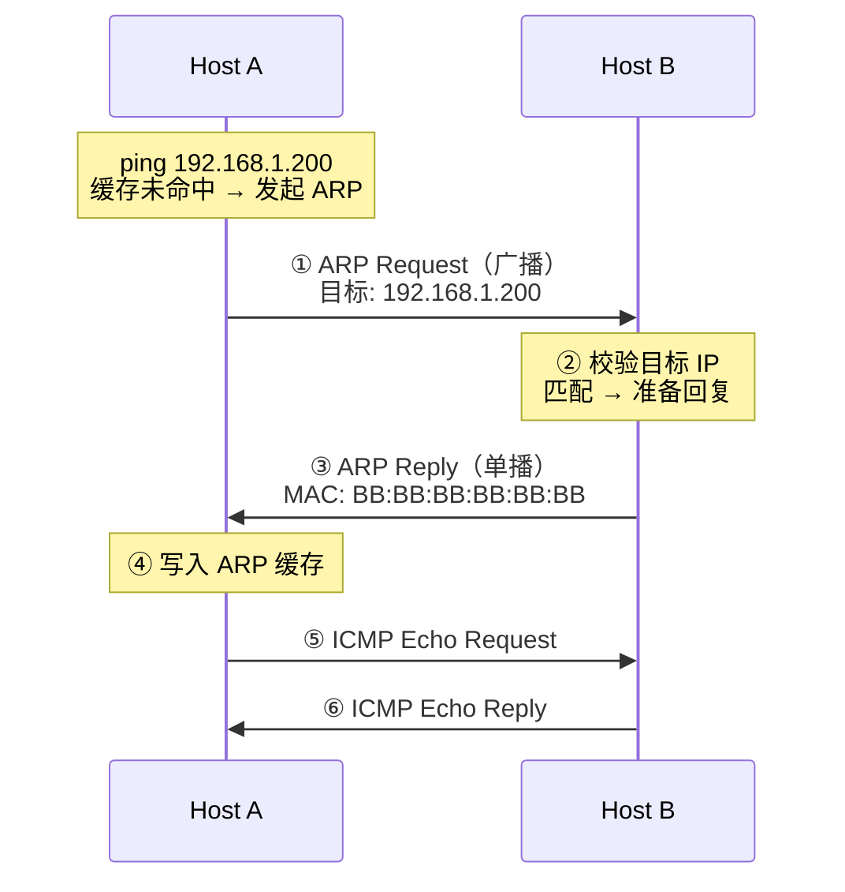
```mermaid
sequenceDiagram
    participant A as Host A
    participant B as Host B

    Note over A: ping 192.168.1.200<br/>缓存未命中 → 发起 ARP
    A->>B: ① ARP Request（广播）<br/>目标: 192.168.1.200
    Note over B: ② 校验目标 IP<br/>匹配 → 准备回复
    B->>A: ③ ARP Reply（单播）<br/>MAC: BB:BB:BB:BB:BB:BB
    Note over A: ④ 写入 ARP 缓存
    A->>B: ⑤ ICMP Echo Request
    B->>A: ⑥ ICMP Echo Reply
```

### RFC 826 定义的缓存更新规则（重要！）

这是 ARP 协议的一个**非常关键的细节**，很多资料写成了“无条件学习”，与 RFC 826 给出的接收算法不符：

**RFC 826 给出的接收算法：先检查发送者协议地址（`ar_spa`）是否已有表项——有则更新 MAC；没有则仅当本机是目标协议地址（`ar_tpa`）时才新建。**

**随后再检查操作码，对 Request 发送 Reply。该算法不验证发送者是否真的拥有相应 IP；现代实现可能采用更严格的学习策略。**

```text
RFC 826 Packet Reception Algorithm (Merge_flag 语义):

After receiving an ARP packet:
  1. Validate: Check ar_hrd / ar_pro (及可选的长度字段) 匹配本机网络类型
  2. Merge_flag := false
     If <protocol type, ar_spa> 已在缓存中:
       → UPDATE 该表项的硬件地址为 ar_sha
       → Merge_flag := true
  3. CHECK: Is ar_tpa == my protocol address?
     → NO: 结束处理 (旁观者到此为止; 若步骤 2 已更新则保留更新)
     → YES:
         If Merge_flag == false: ADD 新表项 <ar_spa, ar_sha>
         If op == REQUEST: 构造并发送 REPLY
```

**这个设计有什么影响？**

```text
场景: 主机 C 只是旁观者, 不是 ARP Request 的目标

主机 A 广播: "谁是 192.168.1.200?" (包含 A 自己的 IP+MAC)

主机 C (旁观者, ar_tpa != 自己的 IP):
  → 若缓存中已有 192.168.1.100 的表项: 用 A 的新 MAC 更新该表项
  → 若缓存中没有该表项: 按 RFC 826 不新建 (不会「顺手学会」A)

目标主机 B (ar_tpa == 自己的 IP):
  → 若尚无 A 的表项: 新建 192.168.1.100 → aa:aa:aa:aa:aa:aa
  → 再对 REQUEST 回 REPLY

好处:
  ✅ 目标主机可在一次交互中学到对端映射, 减少回程再发 ARP
  ✅ 已有表项会被刷新, 适应网卡更换等场景

隐患:
  ⚠️ 已有表项可能被符合接收条件的 ARP 报文覆盖, 且不验证发送者身份
  ⚠️ 针对自己的伪造包还可新建错误映射
     (这就是 ARP Spoofing 的协议基础; 现代 OS 策略可能更严,
      例如 Linux 默认 arp_accept=0 时, 未请求的免费 ARP 不一定新建条目)
```

### ARP 缓存表的查看与管理

**Linux/macOS 常用命令**：

```bash
# 查看 ARP 缓存表（现代 Linux 推荐）
ip neigh show
# 输出示例:
# 192.168.1.1 dev eth0 lladdr 11:22:33:44:55:66 STALE
# 192.168.1.100 dev eth0 lladdr aa:bb:cc:dd:ee:ff REACHABLE
# 192.168.1.200 dev eth0 FAILED

# 传统命令（仍广泛支持）
arp -n
# -n 参数: 不做 DNS 反向解析, 显示数字 IP, 加快输出速度

# macOS / BSD 风格命令（Linux net-tools 也支持）
arp -a
```

**缓存条目状态说明**：

| 状态             | 含义   | 说明                            |
| -------------- | ---- | ----------------------------- |
| **REACHABLE**  | 可达   | 条目有效，最近验证过                    |
| **STALE**      | 陈旧   | 映射仍可用于立即发包；使用后转入 DELAY，必要时再探测 |
| **DELAY**      | 延迟确认 | 已使用 STALE 映射，等待上层协议提供可达性确认    |
| **PROBE**      | 探测中  | 正在发送单播邻居探测并等待响应               |
| **FAILED**     | 失败   | 探测无响应，该条目不可用                  |
| **PERMANENT**  | 永久   | 手动配置的静态条目，不会过期                |
| **INCOMPLETE** | 不完整  | 正在进行 ARP 解析，等待响应              |

💡 **状态来源说明**：上表这些状态来自 **Linux 统一的邻居缓存**（`ip neigh` 对 ARP 与 NDP 条目一视同仁），底层即 **RFC 4861 的 NUD 状态机**，Linux 额外扩充了 `FAILED`/`PERMANENT` 等；**RFC 826 本身并不定义这些状态**。下文「NDP / NUD」章节会展开状态机原理。

**缓存参数（Linux 常见配置示例）**：

```bash
# 查询 eth0 的实际参数；default 目录只是新建接口时使用的模板
sysctl net.ipv4.neigh.eth0.base_reachable_time_ms
# 常见默认值为 30000 ms；实际 REACHABLE 时间随机为其 0.5～1.5 倍

sysctl net.ipv4.neigh.eth0.gc_stale_time
# 常见默认值为 60 秒；它不是 REACHABLE 状态超时

# 查询邻居表垃圾回收阈值（具体默认值随内核/发行版而异）
sysctl net.ipv4.neigh.default.gc_thresh1
sysctl net.ipv4.neigh.default.gc_thresh2
sysctl net.ipv4.neigh.default.gc_thresh3
```

📌 **RFC 1122 §2.3.2 对主机实现的要求**：

- 必须能**失效过期的 ARP 缓存**（超时/主动探测等），否则错误映射会长期残留
- 必须限制对同一目标的 ARP Request 重传，建议上限为**每个目标每秒 1 次**
- 解析完成前应该为每个未解析目标至少保存一个（最新的）待发数据报

### 用 tcpdump 抓包观察 ARP 过程

```bash
# 终端 1: 清空 ARP 缓存后抓包
sudo ip neigh flush all
sudo tcpdump -i eth0 -nn -e arp

# 终端 2: ping 一个同网段主机
ping 192.168.1.200 -c 1
```

**抓包结果示例**：

```text
# 第一次抓到的是 ARP Request (广播)
# 时间戳     源MAC              目标MAC             类型  ARP详情
12:34:56.789012 aa:aa:aa:aa:aa:aa Broadcast    ARP, Request who-has 192.168.1.200 tell 192.168.1.100, length 28

# 第二次抓到的是 ARP Reply (单播)
12:34:56.789345 bb:bb:bb:bb:bb:bb aa:aa:aa:aa:aa:aa ARP, Reply 192.168.1.200 is-at bb:bb:bb:bb:bb:bb, length 28
```

**关键字段解释**：

```text
tcpdump ARP 输出格式:

ARP, Request who-has <target-ip> tell <sender-ip>
  → ar_op = REQUEST (1)
  → ar_tpa = target-ip (要查询的目标IP)
  → ar_spa = sender-ip (发送者的IP)
  → 目标MAC = FF:FF:FF:FF:FF:FF (广播)

ARP, Reply <sender-ip> is-at <sender-mac>
  → ar_op = REPLY (2)
  → ar_spa / ar_sha = 应答者的 IP / MAC
  → 目标MAC = 请求者的MAC (单播回送)
```

### 免费 ARP 与 RFC 5227 地址冲突检测（ACD）

RFC 5227 将传统免费 ARP 中用于地址宣告的 Request 形式定义为 **ARP Announcement**。完整的 IPv4 地址冲突检测（ACD）还包括探测阶段的 **ARP Probe**——二者不要混为一谈。

⚠️ RFC 5227 明确指出：仅发送传统 Gratuitous ARP **不足以**做有效的重复地址检测；规范流程是 **Probe →（等待）→ Announcement → 持续检测**。

#### 三种报文对比

```text
标准 ARP Request (解析他人地址):
  ar_spa = 本机 IP
  ar_tpa = 要查询的他人 IP   (spa ≠ tpa)
  例: "谁是 192.168.1.200?" (我是 192.168.1.100)

ARP Probe (RFC 5227 探测, 尚未宣称可用该地址):
  ar_op  = REQUEST
  ar_spa = 0.0.0.0           (全零, 避免污染他人缓存)
  ar_tpa = 待检测地址
  ar_sha = 本机 MAC
  ar_tha = 全 0              (接收方忽略该字段，规范要求 SHOULD 填 0)
  含义: "有人在用这个地址吗? 我希望用它。"

ARP Announcement / 传统 Gratuitous ARP (宣告已使用该地址):
  ar_op  = REQUEST           (不是 Reply!)
  ar_spa = 本机 IP
  ar_tpa = 本机 IP           (spa == tpa, 关键特征)
  ar_sha = 本机 MAC
  ar_tha = 全 0
  含义: "这个地址我现在正在使用。"
```

💡 **为什么 Announcement 用 Request 而不是 Reply？**（RFC 5227 §3）

1. **历史兼容性**：BSD Unix、Windows、macOS 等主流实现均遵循 Stevens 《TCP/IP Illustrated》的做法，使用 ARP Request
2. **兼容不规范实现**：部分实现认为 Reply 只能单播、忽略未请求的 Reply，或要求 Reply 的目标必须匹配本机——使用 Request 可避免这些问题

#### Announcement（免费 ARP）的主要用途

| 场景            | 说明                             |
| ------------- | ------------------------------ |
| **刷新邻居缓存**    | 宣称地址后促使已有相关表项的邻居更新映射（ACD 宣告阶段） |
| **网卡/MAC 变更** | 更换硬件地址后主动宣告，促使邻居更新映射           |
| **虚拟 IP 迁移**  | 高可用（HA）/负载均衡中 VIP 漂移时通知网络      |
| **接口 UP 通知**  | 网卡激活后主动宣告，加速后续通信建立             |

地址是否已被占用，应靠 **ARP Probe（探测阶段）** 判断，而不是单靠 Announcement。

💡 **关联规范**：IPv4 链路本地地址（APIPA，`169.254.0.0/16`，**RFC 3927**，2005）同样要求在启用地址前做探测与宣告，并在使用期间持续检测冲突。

**RFC 5227（2008）的 ACD 机制，正是从 RFC 3927 的这段流程中提取、泛化而来**（作者同为 Cheshire，因 IETF 流程原因晚三年发布）。二者行为一致——这也是「APIPA 离不开冲突检测」的由来。

#### RFC 5227 定义的三阶段检测机制

```text
阶段一: Probing Phase (主动探测)
━━━━━━━━━━━━━━━━━━━━━━━━━━━━━━━━━━
触发时机 (示例):
  · 接口初始配置 IP 地址时 (手动/DHCP/其他)
  · 网络接口从非活动转为活动状态
  · 计算机从睡眠/休眠唤醒
  · 以太网链路状态变化 (link-state change)
  · Wi-Fi 关联新 AP 时

注意:
  · 主机 MUST NOT 把地址探测作为周期性例行操作

常量:
  PROBE_WAIT   = 1 秒   (初始随机延迟上限)
  PROBE_NUM    = 3     (探测包数量)
  PROBE_MIN/MAX = 1～2 秒 (探测间隔随机范围)
  ANNOUNCE_WAIT = 2 秒  (最后一次 Probe 之后、宣告之前的等待)

执行流程:
  1. 等待随机延迟 (0～PROBE_WAIT), 避免多机同时上线
  2. 发送 PROBE_NUM = 3 次 ARP Probe (spa=0.0.0.0, tpa=待测地址)
     间隔均匀随机于 PROBE_MIN～PROBE_MAX
  3. 从探测开始直到「最后一次 Probe + ANNOUNCE_WAIT」期间, 若出现:
     · 任意 ARP (Request 或 Reply), 且 spa == 待测地址
       → MUST 视为地址已被占用 ❌
     · 或 ARP Probe 的 tpa == 待测地址, 且 sha 不是本机任一接口
       → SHOULD 视为冲突 ❌
       (须排除本机广播被交换机/AP 回环的情况)
  4. 上述窗口内无冲突 → 才可进入宣告阶段


阶段二: Announcing Phase (地址宣告)
━━━━━━━━━━━━━━━━━━━━━━━━━━━━━━━━━━
参数:
  ANNOUNCE_NUM      = 2  (宣告包数量)
  ANNOUNCE_INTERVAL = 2 秒 (宣告间隔)

流程:
  1. 广播 ARP Announcement (REQUEST, spa == tpa == 新地址)
  2. 第一个 Announcement 发出后即可开始正常使用该地址
  3. 第二个 Announcement 可异步完成 (间隔 ANNOUNCE_INTERVAL)


阶段三: Ongoing Conflict Detection (持续检测)
━━━━━━━━━━━━━━━━━━━━━━━━━━━━━━━━━━
判定冲突 (使用地址期间持续生效):
  · 收到任意 ARP (Request 或 Reply), spa 是本机 IP,
    但 sha 不是本机任一接口的硬件地址

继续运行:
  · 地址投入使用后，目标地址为本机的普通 Request 和
    spa=0.0.0.0 的 Probe 都必须按 RFC 826 正常应答
```

主机 MUST 在下列 (a)/(b)/(c) 中择一应对（RFC 5227 §2.4；各策略内的取舍用 MAY 表述）：

| 策略           | 典型选择动机                   | 行为                                                  |
| ------------ | ------------------------ | --------------------------------------------------- |
| **(a) 放弃**   | 可重新获取地址的主机               | 立即停止使用，通知配置代理重新获取                                   |
| **(b) 单次防御** | 希望尽量保住地址（如仍有活跃 TCP 等）    | 广播一次 Announcement 宣示主权；DEFEND_INTERVAL（10 秒）内再冲突则放弃 |
| **(c) 持续防御** | 需稳定知名地址的设备（如默认路由器 / DNS） | 记录日志 + 通知管理员；按 DEFEND_INTERVAL 限速，避免防御风暴            |

**速率限制常量**：

- `MAX_CONFLICTS = 10`：达到此冲突次数后触发限制
- `RATE_LIMIT_INTERVAL = 60` 秒：此后探测新候选地址的最小尝试间隔
- `DEFEND_INTERVAL = 10` 秒：限制防御性 Announcement 的频率

### 代理 ARP（Proxy ARP）

代理 ARP（Proxy ARP，又称 **ARP hack**、**Transparent Subnet Gateway**），由 RFC 1027 定义，是一种让路由器/网关**透明地代答 ARP 请求**的技术。

#### 工作原理

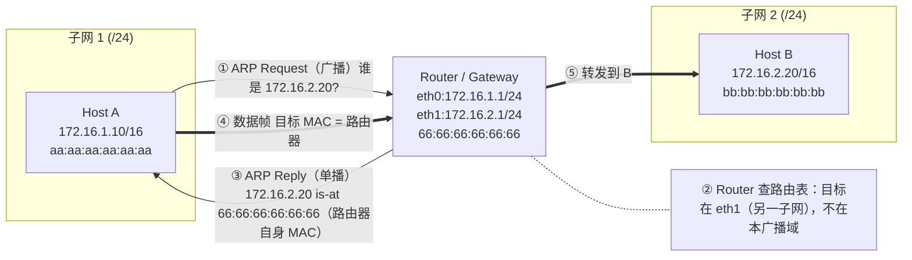
```mermaid
flowchart LR
    subgraph S1["子网 1 (/24)"]
        A["Host A<br/>172.16.1.10/16<br/>aa:aa:aa:aa:aa:aa"]
    end
    subgraph S2["子网 2 (/24)"]
        B["Host B<br/>172.16.2.20/16<br/>bb:bb:bb:bb:bb:bb"]
    end
    R["Router / Gateway<br/>eth0:172.16.1.1/24<br/>eth1:172.16.2.1/24<br/>66:66:66:66:66:66"]
    A -->|"① ARP Request（广播）谁是 172.16.2.20?"| R
    R -->|"③ ARP Reply（单播）172.16.2.20 is-at 66:66:66:66:66:66（路由器自身 MAC）"| A
    A ==>|"④ 数据帧 目标 MAC = 路由器"| R
    R ==>|"⑤ 转发到 B"| B
    Rn["② Router 查路由表：目标在 eth1（另一子网），不在本广播域"]
    R -.- Rn
```

#### 配置方法（Linux/Cisco）

```bash
# Linux: 启用代理 ARP (per-interface)
sysctl -w net.ipv4.conf.eth0.proxy_arp=1

# 写入配置持久化 (/etc/sysctl.conf 或 /etc/sysctl.d/*.conf):
# net.ipv4.conf.eth0.proxy_arp = 1

# Cisco IOS:
interface GigabitEthernet0/1
 ip proxy-arp    # 启用；默认状态依平台、版本和接口类型而异
 # no ip proxy-arp  # 关闭
```

#### 安全约束（RFC 1027 §2.4 Sanity checks）

| 约束条件          | 规则                                             | 违反后果           |
| ------------- | ---------------------------------------------- | -------------- |
| **同物理网络检查**   | 源和目标经同一物理接口可达时**不得**代答（原文 must not）            | 可能导致 ARP 环路    |
| **跨 IP 网络检查** | 源和目标属于不同 IP network 时**通常不应**代答（原文 should not） | 可能绕过安全策略/防火墙   |
| **广播地址检查**    | **绝不**代答广播地址（255.255.255.255 等）                | “切尔诺贝利效应”/广播风暴 |

⚠️ **生产环境注意**：无明确需求时宜关闭 Proxy ARP；PPP、VPN、无线隔离和特定迁移/路由场景仍可能需要它。启用时应限制接口与路由范围，并落实上述 sanity checks。

---

## 🚀 ARP 协议的应用场景

### 场景 1：同网段直接通信（最基本用途）

这是 ARP 最原始、最常用的功能：

```text
Host A (192.168.1.10) ──── ping ────► Host B (192.168.1.20)

流程:
1. A 分别将目的地址和本机地址与 255.255.255.0 按位与
   → 两者结果都是 192.168.1.0 → 同网段!
   → 需要通过 ARP 获取 B 的 MAC

2. A 发送 ARP Request: "谁是 192.168.1.20?"

3. B 应答 ARP Reply: "我是 192.168.1.20, MAC=bb:bb:bb:bb:bb:bb"

4. A 用学到的 MAC 封装以太网帧, 直接投递给 B
```

### 场景 2：默认网关 MAC 解析（跨网段通信的前提）

当访问外部网络时，虽然最终目标不在本地，但发送第一跳以太网帧前仍然需要知道默认网关的 MAC：

```text
Host (192.168.1.100) → 访问 203.0.113.10 (RFC 5737 TEST-NET-3 示例地址)

判断: 203.0.113.10 不在 192.168.1.0/24
      → 需要发给默认网关 192.168.1.1

ARP 流程:
1. "谁是 192.168.1.1?" (默认网关)
2. 网关回复: MAC = 11:22:33:44:55:66
3. 数据帧目标 MAC = 11:22:33:44:55:66
4. 网关收到后根据路由表继续转发...
```

**查看默认网关的 ARP 条目**：

```bash
# 先查看默认路由，确认网关地址和出口接口
ip -4 route show default
# 示例输出: default via 192.168.1.1 dev eth0

# 再精确查询该网关的邻居项（按实际输出替换地址和接口）
ip neigh show to 192.168.1.1 dev eth0
```

### 场景 3：地址冲突检测（RFC 5227 ACD）

每当设备接入网络时，都需要确保自己的 IP 地址不会与其他设备冲突。完整流程是 **ARP Probe → ANNOUNCE_WAIT → ARP Announcement**，而不是只发一次免费 ARP：

| 触发时机          | 具体场景                                          |
| ------------- | --------------------------------------------- |
| **DHCP 分配后**  | DHCP Server 分配地址后，客户端应进行冲突检测（部分 DHCP 实现会代为检测） |
| **手动配置 IP 时** | 管理员输入固定 IP 后立即反馈是否有冲突                         |
| **设备唤醒恢复时**   | 从睡眠/休眠唤醒，重新接入网络                               |
| **网络切换时**     | 有线↔无线切换、漫游到新的 AP                              |
| **虚拟机启动时**    | VM 创建/克隆后首次获得 IP 地址                           |

**实战抓包**：

```bash
# 仅匹配 Ethernet/IPv4 的 RFC 5227 Request 型 Announcement
# ar_pro=IPv4, hln=6, pln=4, op=Request, spa=tpa, 目的 MAC 为广播
sudo tcpdump -i eth0 -nn -e \
  'arp and arp[2:2] = 0x0800 and arp[4] = 6 and arp[5] = 4 \
   and arp[6:2] = 1 and arp[14:4] = arp[24:4] and ether broadcast'

# 仅匹配 Ethernet/IPv4 ARP Probe: Request 且 spa=0.0.0.0
sudo tcpdump -i eth0 -nn -e \
  'arp and arp[2:2] = 0x0800 and arp[4] = 6 and arp[5] = 4 \
   and arp[6:2] = 1 and arp[14:4] = 0'
```

### 场景 4：高可用与负载均衡（VRRP / CARP / HSRP）

在高可用架构中，多个节点共享同一个 **虚拟 IP（VIP）**，当主节点故障时 VIP 自动漂移到备用节点：

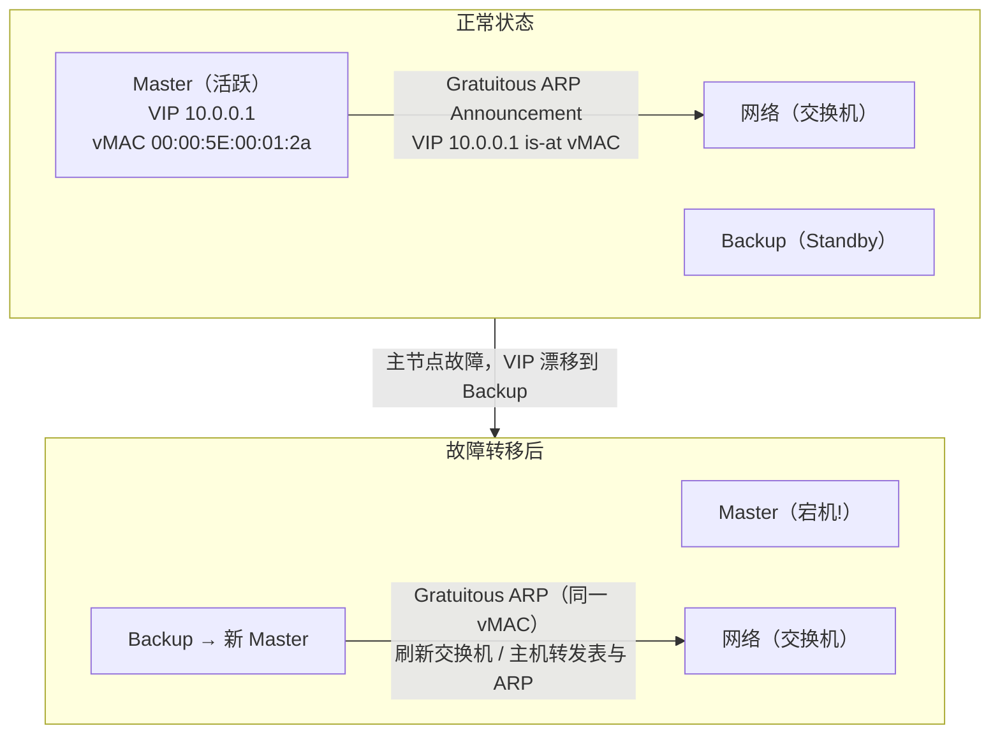
```mermaid
flowchart TB
    subgraph N["正常状态"]
        direction LR
        M["Master（活跃）<br/>VIP 10.0.0.1<br/>vMAC 00:00:5E:00:01:2a"]
        BK["Backup（Standby）"]
        NET["网络（交换机）"]
        M -->|"Gratuitous ARP Announcement<br/>VIP 10.0.0.1 is-at vMAC"| NET
    end
    subgraph F["故障转移后"]
        direction LR
        MD["Master（宕机!）"]
        NM["Backup → 新 Master"]
        NET2["网络（交换机）"]
        NM -->|"Gratuitous ARP（同一 vMAC）<br/>刷新交换机 / 主机转发表与 ARP"| NET2
    end
    N -->|"主节点故障，VIP 漂移到 Backup"| F
```

### 场景 5：网络设备发现与连通性检测

```text
用途示例:

1. 设备发现/资产盘点:
   对本地网段执行主动 ARP 扫描并汇总响应, 可获得在线设备的 IP-MAC 对照表
   (仅查看本机缓存通常只能看到近期解析或通信过的邻居)
   (常用于内网资产管理工具)

2. 故障排查:
   ping 不通时检查 ARP 缓存:
   · 如果 ARP 缓存中有记录但 ping 不通 → 可能是防火墙/ICMP 被禁
   · 如果 ARP 缓存中显示 INCOMPLETE → 对方没开机或网络不通
   · 如果 ARP 缓存中被替换成异常 MAC → 可能遭受 ARP 欺骗!

3. 双网卡绑定/桥接模式:
   Linux bond/bridge 模式下, 需要正确处理 ARP 以避免 MAC 漂移
```

---

## 🛡️ ARP 攻击与防御：从欺骗到中间人攻击

### ARP 欺骗攻击原理（ARP Spoofing / Cache Poisoning）

ARP 协议有一个重要的**安全局限**：

**信任但不验证（Trust without Verification）**

按 RFC 826 给出的接收算法：若缓存中已有发送者 IP 的表项，收到相同 `ar_spa` 的 ARP 报文后会用 `ar_sha` **覆盖更新**；若本机是 `ar_tpa` 指定的目标且尚无表项，还会**新建**映射。

全程不验证发送者是否真的拥有相应 IP——这正是欺骗能得手的根因。现代实现（如 Linux 默认 `arp_accept=0`）可能对学习条件施加额外限制。

这个特性使得攻击者可以**主动注入虚假的 ARP 报文**（常见为未请求的 Reply），优先污染受害者**已有**的缓存表项；也可在目标主机上写入新的错误映射。

#### 攻击流程详解（中间人攻击 MITM）

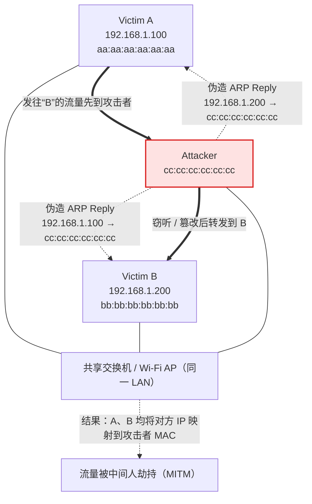
```mermaid
flowchart TB
    A["Victim A<br/>192.168.1.100<br/>aa:aa:aa:aa:aa:aa"]
    B["Victim B<br/>192.168.1.200<br/>bb:bb:bb:bb:bb:bb"]
    ATK["Attacker<br/>cc:cc:cc:cc:cc:cc"]
    SW["共享交换机 / Wi-Fi AP（同一 LAN）"]
    A --- SW
    B --- SW
    ATK --- SW
    ATK -.->|"伪造 ARP Reply<br/>192.168.1.200 → cc:cc:cc:cc:cc:cc"| A
    ATK -.->|"伪造 ARP Reply<br/>192.168.1.100 → cc:cc:cc:cc:cc:cc"| B
    A ==>|"发往“B”的流量先到攻击者"| ATK
    ATK ==>|"窃听 / 篡改后转发到 B"| B
    SW -.->|"结果：A、B 均将对方 IP 映射到攻击者 MAC"| RES["流量被中间人劫持（MITM）"]
    classDef red fill:#fee2e2,stroke:#dc2626,stroke-width:2px;
    class ATK red;
```

### 常见攻击工具

| 工具名称                     | 功能特点                                     | 平台                  |
| ------------------------ | ---------------------------------------- | ------------------- |
| **arpspoof** (dsniff 套件) | 经典 ARP 欺骗工具，简单易用                         | Linux               |
| **Ettercap**             | 图形化中间人攻击套件，支持插件扩展                        | Linux/Windows/macOS |
| **Bettercap**            | 现代、强大的网络攻击框架（Go 语言编写），支持 ARP/DNS/NDP 等欺骗 | 跨平台                 |
| **Cain & Abel**          | Windows 下经典的多功能渗透测试工具                    | Windows             |
| **Scapy**                | Python 库，可自定义构造 ARP 报文                   | 跨平台（Python）         |

### 攻击检测方法

#### 1. 检查 ARP 缓存异常

```bash
# 方法 1: 观察关键 IP 的 MAC 是否异常或频繁变化
ip neigh show

# 方法 2: 对比多台机器的 ARP 缓存
# 在同一二层域、同一时刻且预期为稳定单一邻居时:
# 同一 IP 在不同主机上对应不同 MAC 值得调查
# 需先排除 Proxy ARP、高可用切换、迁移等合法场景

# 方法 3: 使用 arpwatch 自动监控 ARP 变化
# 安装: apt install arpwatch (Ubuntu/Debian)
# arpwatch 可记录 ARP 映射变化；邮件告警和日志位置取决于发行版配置
# systemd 系统可先查看: journalctl -u arpwatch

# 日志示例 (正常):
# hostname: ip address (MAC address) interface [new|old]

# 日志示例 (异常 - flip flop):
# hostname: ip address (MAC_A) → (MAC_B) on eth0  # MAC 反复变化!
```

#### 2. tcpdump/Wireshark 抓包分析

```bash
# 抓取全部 Ethernet/IPv4 ARP Reply
# 此过滤器本身无法判断 Reply 是否对应未决 Request，需结合时序分析
sudo tcpdump -i eth0 -nn -e 'arp and arp[6:2] = 2'

# 分析重点:
# 1. 是否有大量来自同一 MAC 的 ARP Reply?
# 2. Reply 中的 IP-MAC 映射是否合理?
# 3. 关键 IP 的 MAC 是否异常或频繁变化?
```

#### 3. 不要误用这两个 sysctl 当「ARP 欺骗检测」

```bash
# log_martians: 记录源地址非法的 IP 包 (martian), 与 ARP 欺骗无关
# sysctl net.ipv4.conf.all.log_martians=1

# arp_notify: 本机地址增删/变更时主动发免费 ARP, 用于通知邻居, 不是攻击检测开关
# sysctl net.ipv4.conf.all.arp_notify=1

# ARP 异常检测请用上文的 arpwatch / tcpdump / 多机缓存对比
```

### 防御方案

#### 方案 1：静态 ARP 绑定

最简单粗暴但有效的方案：手动将关键 IP-MAC 关系写入静态表。

```bash
# Linux: 新建或替换静态邻居条目
sudo ip neigh replace 192.168.1.1 lladdr 11:22:33:44:55:66 dev eth0 nud permanent

# 或使用传统命令
sudo arp -s 192.168.1.1 11:22:33:44:55:66

# 验证
ip neigh show
# 192.168.1.1 dev eth0 lladdr 11:22:33:44:55:66 PERMANENT
#                                              ^^^^^^^^^^
#                                           永久条目, 不会被动态覆盖

# 批量绑定脚本示例 (适合小型网络):
#!/bin/bash
# bind_arp.sh
declare -A BINDINGS=(
  ["192.168.1.1"]="11:22:33:44:55:66"  # 网关
  ["192.168.1.2"]="AA:BB:CC:DD:EE:FF"  # DNS 服务器
  ["192.168.1.3"]="33:44:55:66:77:88"  # 文件服务器
)

for ip in "${!BINDINGS[@]}"; do
  mac="${BINDINGS[$ip]}"
  ip neigh replace "$ip" lladdr "$mac" dev eth0 nud permanent
  echo "Bound $ip → $mac"
done
```

| 优点                       | 缺点            |
| ------------------------ | ------------- |
| 实现简单，立竿见效                | 大型网络管理成本高     |
| 可防止该主机的指定邻居项被普通动态 ARP 覆盖 | 设备变更需同步更新所有主机 |
| 无需额外硬件/软件                | 无法防范未知设备的攻击   |

#### 方案 2：DAI 动态 ARP 检测（企业级首选）

**Dynamic ARP Inspection (DAI)** 是一种 Layer 2 安全机制，工作在**交换机**上，通过验证每个 ARP 包的合法性来阻止欺骗攻击。

##### DAI 的工作原理

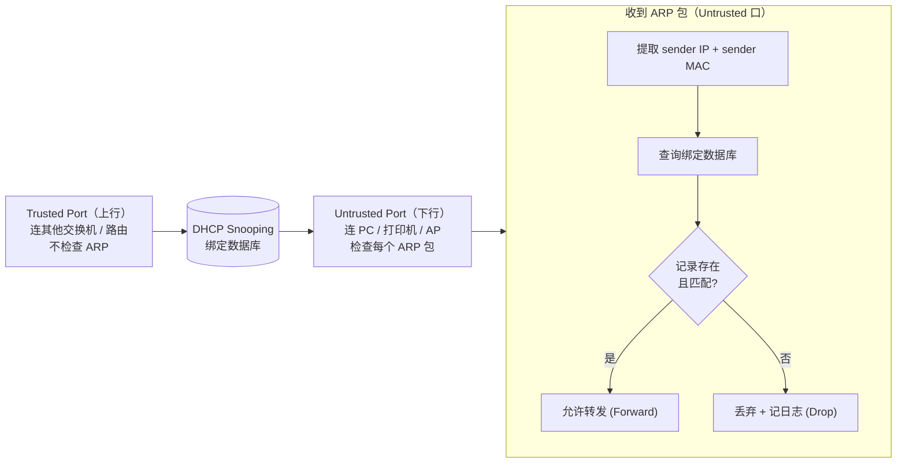
```mermaid
flowchart LR
    T["Trusted Port（上行）<br/>连其他交换机 / 路由<br/>不检查 ARP"]
    DB[("DHCP Snooping<br/>绑定数据库")]
    U["Untrusted Port（下行）<br/>连 PC / 打印机 / AP<br/>检查每个 ARP 包"]
    T --> DB
    DB --> U
    subgraph CHECK["收到 ARP 包（Untrusted 口）"]
        direction TB
        E["提取 sender IP + sender MAC"]
        Q["查询绑定数据库"]
        M{"记录存在<br/>且匹配?"}
        E --> Q --> M
        M -->|"是"| OK["允许转发 (Forward)"]
        M -->|"否"| DROP["丢弃 + 记日志 (Drop)"]
    end
    U --> CHECK
```

##### Trusted / Untrusted 端口

| 端口类型                | DAI 处理行为           | 适用场景                       |
| ------------------- | ------------------ | -------------------------- |
| **Trusted（受信任）**    | **不检查** ARP 包，直接转发 | 连接其他交换机、路由器、DHCP 服务器的上行端口  |
| **Untrusted（非受信任）** | **严格验证** ARP 包合法性  | 连接 PC、打印机、无线 AP 等终端设备的接入端口 |

💡 **设计原则**：多数终端侧威胁来自接入口，但受信任上联、恶意 AP 或被攻陷的网络设备也可能成为攻击源。Trusted 端口会绕过检查，因此信任边界应最小化并定期审计。

##### Cisco 交换机 DAI 配置实例

```cisco
! ============================================
! Step 1: 先启用 DHCP Snooping (DAI 依赖其绑定数据库)
! ============================================

Switch(config)# ip dhcp snooping
Switch(config)# ip dhcp snooping vlan 10,20,30
! 对指定 VLAN 启用 DHCP Snooping
! 接入端口默认 untrusted (不信任客户端侧的 DHCP Offer/ACK)

Switch(config)# interface gigabitethernet 0/1
Switch(config-if)# ip dhcp snooping trust
! 仅上行口设为 trusted (连接 DHCP 服务器 / 上层交换机的端口)

Switch(config)# interface range gigabitethernet 0/2-24
Switch(config-if-range)# ip dhcp snooping limit rate 15
! 接入端口限速: 每秒最多 15 个 DHCP 包 (防 DHCP 泛洪)


! ============================================
! Step 2: 启用 Dynamic ARP Inspection (DAI)
! ============================================

Switch(config)# ip arp inspection vlan 10,20,30
! 对指定 VLAN 启用 DAI

! 设置受信任端口 (通常是上联端口)
Switch(config)# interface gigabitethernet 0/1
Switch(config-if)# ip arp inspection trust
! 此端口不进行 ARP 检查 (连接上层交换机/路由器)

! 可选: 启用以太网头与 ARP 头的 MAC 一致性校验
Switch(config)# ip arp inspection validate src-mac dst-mac
! src-mac :  检查 ARP 包中的 Ethernet 源 MAC == ARP sender MAC
! dst-mac :  检查 ARP 包中的 Ethernet 目标 MAC (仅对 Reply 有效)

! 不要未经验证就追加 ip 校验:
! Cisco 的 ip 校验会把 sender IP 0.0.0.0 视为无效,
! 而 RFC 5227 ARP Probe 正常使用 0.0.0.0。
! 如需启用, 应先查阅具体平台/版本文档, 确认是否支持 allow-zeros
! 或使用 ARP ACL 放行合法 Probe。


! ============================================
! Step 3: 验证配置效果
! ============================================

! 查看 VLAN 的 DAI 状态
Switch# show ip arp inspection vlan 10

! 查看接口的信任状态
Switch# show ip arp inspection interfaces gi 0/2

! 查看 DAI 统计 (转发的包 vs 丢弃的包)
Switch# show ip arp inspection statistics vlan 10
```

**静态 IP 主机注意**：DHCP Snooping 数据库不会自动产生静态地址绑定。对静态地址主机，应按具体 Cisco 平台配置 ARP ACL（`arp access-list` 并通过 `ip arp inspection filter ... vlan ...` 应用）或其他受支持的静态绑定机制，否则 DAI 可能丢弃合法 ARP 报文。

```cisco
! 示例：为 VLAN 10 的静态主机建立 ARP ACL
Switch(config)# arp access-list STATIC_HOSTS
Switch(config-arp-nacl)# permit ip host 192.168.1.10 mac host aabb.ccdd.eeff
Switch(config-arp-nacl)# exit
Switch(config)# ip arp inspection filter STATIC_HOSTS vlan 10
```

**DAI 统计输出示意（字段随平台/版本而异）**：

```text
Vlan      Forwarded        Dropped     DHCP Drops     ACL Drops
----      ---------        -------     ----------     ----------
10              150            47           47            0
                                          ^^^^
                                    大量丢弃 = 需调查攻击或配置错误

Vlan   DHCP Permits    ACL Permits   Source MAC Failures
----   ------------    -----------   -------------------
10             103             0                    5
                                                ^^^^^^
                                          源 MAC 不匹配的次数

Vlan   Dest MAC Failures   IP Validation Failures
----   -----------------   ----------------------
10                  0                        42
                                        ^^^^^^
                                   IP 地址无效的次数
```

#### 方案 3：DHCP Snooping + DAI 组合拳

DAI 通常与 DHCP Snooping **配合使用**形成完整的二层防护体系：

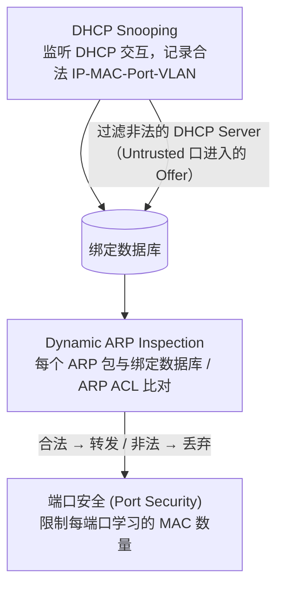
```mermaid
flowchart TB
    DHCP["DHCP Snooping<br/>监听 DHCP 交互，记录合法 IP-MAC-Port-VLAN"]
    DB[("绑定数据库")]
    DAI["Dynamic ARP Inspection<br/>每个 ARP 包与绑定数据库 / ARP ACL 比对"]
    PS["端口安全 (Port Security)<br/>限制每端口学习的 MAC 数量"]
    DHCP --> DB
    DHCP -->|"过滤非法的 DHCP Server（Untrusted 口进入的 Offer）"| DB
    DB --> DAI
    DAI -->|"合法 → 转发 / 非法 → 丢弃"| PS
```

#### 方案 4：802.1X 网络准入控制

对于更高安全要求的场景，可以使用 802.1X 进行**基于身份的网络准入控制**：

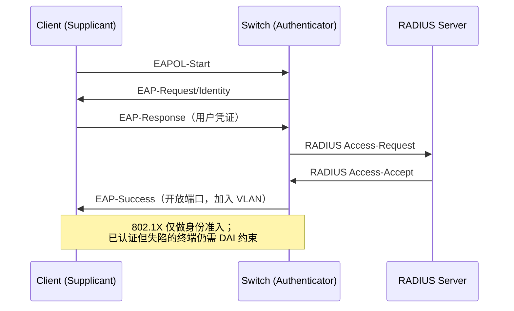
```mermaid
sequenceDiagram
    participant C as Client (Supplicant)
    participant S as Switch (Authenticator)
    participant R as RADIUS Server
    C->>S: EAPOL-Start
    S->>C: EAP-Request/Identity
    C->>S: EAP-Response（用户凭证）
    S->>R: RADIUS Access-Request
    R->>S: RADIUS Access-Accept
    S->>C: EAP-Success（开放端口，加入 VLAN）
    Note over C,S: 802.1X 仅做身份准入；<br/>已认证但失陷的终端仍需 DAI 约束
```

### 防御方案对比总结

| 方案                      | 部署复杂度 | 成本 | 与 ARP 防护的关系        | 适用场景           |
| ----------------------- | ----- | -- | ------------------ | -------------- |
| **静态 ARP 绑定**           | 低     | 低  | 直接保护指定邻居项          | 小型网络 / 关键服务器   |
| **DAI**                 | 中     | 中  | 直接检查接入口 ARP        | 支持 DAI 的企业交换网络 |
| **DHCP Snooping + DAI** | 中     | 中  | 为动态地址提供绑定依据并检查 ARP | 以 DHCP 为主的企业网络 |
| **802.1X 网络准入**         | 高     | 高  | 身份准入，间接补充          | 需要认证接入的网络      |
| **arpwatch 监控**         | 低     | 低  | 只检测和告警，不主动阻断       | 辅助监控           |

---

## 🌐 IPv6 时代的邻居发现：NDP 协议原理（RFC 4861）

IPv6 **没有 ARP**。地址解析、邻居状态跟踪、路由器发现、前缀/MTU 发现、重复地址检测等职责，统一由 **NDP（Neighbor Discovery Protocol，邻居发现协议）** 承担，定义于 **RFC 4861**（2007-09，Internet Standard，Obsoletes RFC 2461）。

### 为什么 IPv6 不再使用 ARP？

ARP 是为 IPv4 设计的「独立协议」，直接封装在以太网帧里（EtherType `0x0806`），无法被 IPv6 复用：

```text
原因 1: IPv6 废除了链路层广播
━━━━━━━━━━━━━━━━━━━━━━━━━━━
- IPv6 只有单播 / 组播 / 任意播, 没有广播地址
- ARP 的「广播 Request」在 IPv6 链路层无处安放
- NDP 改用「被请求节点组播 (Solicited-Node Multicast)」精确投递

原因 2: 协议分层与扩展头
━━━━━━━━━━━━━━━━━━━━━━━━━━━
- ARP 游离于 IP 之外, 不携带 IPv6 扩展头
- NDP 是 IPv6 原生的一部分, 承载于 ICMPv6 (Next Header = 58)
  可随 IPv6 一起利用扩展头、IPsec 等机制

原因 3: 功能需求远超地址解析
━━━━━━━━━━━━━━━━━━━━━━━━━━━
- IPv6 主打 SLAAC 无状态地址自动配置, 需要:
  · 路由器发现 (Router Discovery)
  · 前缀发现 (Prefix Discovery)
  · 重复地址检测 (DAD)
  · 链路参数发现 (MTU / 跳数限制)
- 这些 ARP 一个都不具备, 必须另起炉灶
```

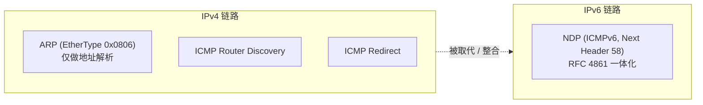
```mermaid
flowchart LR
    subgraph IPV4["IPv4 链路"]
        ARP["ARP (EtherType 0x0806)<br/>仅做地址解析"]
        ICMPRD["ICMP Router Discovery"]
        ICMPRed["ICMP Redirect"]
    end
    subgraph IPV6["IPv6 链路"]
        NDP["NDP (ICMPv6, Next Header 58)<br/>RFC 4861 一体化"]
    end
    IPV4 -.->|"被取代 / 整合"| IPV6
```

⚠️ **关键事实**：在 IPv4/IPv6 双栈网络中，ARP 与 NDP **并行工作、互不干扰**——访问 IPv4 目标走 ARP，访问 IPv6 目标走 NDP。部署 IPv6 即意味着启用 NDP，没有「切换」步骤。

### NDP 的定位与 RFC 体系

NDP 工作在链路层与网络层之间，所有消息封装在 **ICMPv6** 中（IPv6 Next Header = 58，IPv6 EtherType `0x86DD`）。

**一条贯穿全文的安全红线**：RFC 4861 要求所有 NDP 报文的 **IPv6 Hop Limit 必须等于 255**，接收方 MUST 丢弃 Hop Limit ≠ 255 的 NDP 报文。

这保证了 NDP 消息只能由本地链路上的节点产生，无法从远端伪造注入 —— 而 ARP 连「Hop Limit」的概念都不存在，这是两者安全基线的根本差距。

| 项目            | 值                                                                                                                                                                                                                 |
| ------------- | ----------------------------------------------------------------------------------------------------------------------------------------------------------------------------------------------------------------- |
| **核心 RFC**    | RFC 4861（2007-09，Internet Standard；Obsoletes RFC 2461）                                                                                                                                                            |
| **作者**        | T. Narten, E. Nordmark, W. Simpson, H. Soliman                                                                                                                                                                    |
| **承载协议**      | ICMPv6（Next Header = 58）                                                                                                                                                                                          |
| **Hop Limit** | 必须为 255（本地链路限定）                                                                                                                                                                                                   |
| **相关规范**      | RFC 4862（SLAAC 无状态地址自动配置，Updates 4861）、RFC 3971（SEND 安全邻居发现）、RFC 4389（ND Proxy 代理邻居发现，对应 Proxy ARP）、RFC 3122（IND 反向邻居发现，对应 InARP）、RFC 6106（RA 携带 RDNSS/DNSSL）、RFC 4429（Optimistic DAD）、RFC 6980（IPv6 分片对 NDP 的影响） |

### 五种 ICMPv6 消息类型

NDP 用 5 种 ICMPv6 报文类型，一次性覆盖 IPv4 中 ARP + ICMP Router Discovery + ICMP Redirect 的全部职责：

| 类型           | 名称                           | ICMPv6 Type | 作用                        |
| ------------ | ---------------------------- | ----------- | ------------------------- |
| **RS**       | Router Solicitation（路由器请求）   | 133         | 主机主动寻找链路上的路由器             |
| **RA**       | Router Advertisement（路由器通告）  | 134         | 路由器定期/响应通告前缀、默认路由、MTU 等   |
| **NS**       | Neighbor Solicitation（邻居请求）  | 135         | 解析邻居链路层地址 / 验证可达性 / 做 DAD |
| **NA**       | Neighbor Advertisement（邻居通告） | 136         | 响应 NS / 主动宣告地址变化          |
| **Redirect** | Redirect（重定向）                | 137         | 路由器告知主机更优下一跳              |

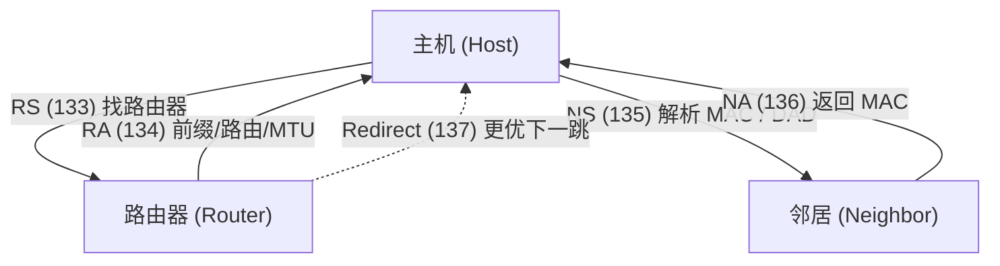
```mermaid
flowchart TB
    H["主机 (Host)"]
    R["路由器 (Router)"]
    N["邻居 (Neighbor)"]
    H -->|"RS (133) 找路由器"| R
    R -->|"RA (134) 前缀/路由/MTU"| H
    H -->|"NS (135) 解析 MAC / DAD"| N
    N -->|"NA (136) 返回 MAC"| H
    R -.->|"Redirect (137) 更优下一跳"| H
```

### 报文格式详解（NS 与 NA）

#### A. Neighbor Solicitation（NS，Type 135）


```mermaid
flowchart LR
    T["Type = 135 (1字节)"]
    C["Code = 0 (1字节)"]
    CK["Checksum (2字节)"]
    RSV["Reserved (4字节)"]
    TA["Target Address (16字节, 目标 IPv6)"]
    OPT["Options: SLLA (源链路层地址)"]
    T --> C --> CK --> RSV --> TA --> OPT
```

| 字段                 | 大小       | 说明                                                                              |
| ------------------ | -------- | ------------------------------------------------------------------------------- |
| **Type**           | 8 bits   | 135                                                                             |
| **Code**           | 8 bits   | 0                                                                               |
| **Checksum**       | 16 bits  | ICMPv6 校验和（覆盖 IPv6 伪头部）                                                         |
| **Reserved**       | 32 bits  | 保留，置 0                                                                          |
| **Target Address** | 128 bits | 目标 IPv6 地址（**不能是组播地址**）                                                         |
| **Options**        | 可变       | **SLLA**（Source Link-Layer Address）：发送者 MAC。源地址为未指定地址 `::`（DAD 场景）时 MUST NOT 携带 |

**发送场景**：解析地址时发往**组播**；验证已有邻居可达性时发往**单播**。

#### B. Neighbor Advertisement（NA，Type 136）


```mermaid
flowchart LR
    T["Type = 136 (1字节)"]
    C["Code = 0 (1字节)"]
    CK["Checksum (2字节)"]
    F["R/S/O (3 bits) + Reserved (29 bits)"]
    TA["Target Address (16字节)"]
    OPT["Options: TLLA (目标链路层地址)"]
    T --> C --> CK --> F --> TA --> OPT
```

NA 多了 **3 个标志位**，这是 ARP Reply 完全没有的能力：

| 标志                | 名称    | 含义                                                                |
| ----------------- | ----- | ----------------------------------------------------------------- |
| **R (Router)**    | 路由器标志 | 置位表示发送者是路由器。NUD 用它检测「路由器变主机」                                      |
| **S (Solicited)** | 被请求标志 | 置位表示本 NA 是对某 NS 的响应，用作 NUD 可达性确认；**组播/非请求单播 NA 中 MUST NOT 置位**    |
| **O (Override)**  | 覆盖标志  | 置位表示应**覆盖**已有缓存中的链路层地址；不置位则仅在缓存中尚无链路层地址时更新。任意播/代理场景 SHOULD NOT 置位 |

| 字段                 | 大小       | 说明                                                                                      |
| ------------------ | -------- | --------------------------------------------------------------------------------------- |
| **Target Address** | 128 bits | 被请求 NS 中的目标地址；非请求 NA 时为「链路层地址已变化」的地址（**不能是组播**）                                         |
| **Options**        | 可变       | **TLLA**（Target Link-Layer Address）：发送者 MAC。响应组播 NS **必须**携带（否则会陷入 NS 无限递归）；响应单播 NS 可省略 |

#### C. 链路层地址选项（SLLA / TLLA）

NDP 把 MAC 地址放在**可选项**里，而非固定字段——这意味着 NDP 不绑定 48 位以太网 MAC，可适配任意链路层：

```text
0                   1                   2
0 1 2 3 4 5 6 7 8 9 0 1 2 3 4 5 6 7 8 9 0 1 2 3 4 5
+-+-+-+-+-+-+-+-+-+-+-+-+-+-+-+-+-+-+-+-+-+-+-+-+-+-+
| Type (1=SLLA,2=TLLA) | Length (单位: 8 字节)     |
+-+-+-+-+-+-+-+-+-+-+-+-+-+-+-+-+-+-+-+-+-+-+-+-+-+-+
| Link-Layer Address (如 6 字节 MAC + 2 字节填充)   |
+-+-+-+-+-+-+-+-+-+-+-+-+-+-+-+-+-+-+-+-+-+-+-+-+-+-+
```

💡 **对比要点**：ARP 把 `ar_hln/ar_pln` 写死在固定字段（以太网即 6/4），而 NDP 用「Type-Length-Value」风格的可选项承载链路层地址，天然支持非以太网链路、也便于扩展新选项（如 RDNSS、CGA 等）。

### 地址解析流程：组播取代广播

假设主机 A（`fe80::a`）想向主机 B（`fe80::1`）发包，但不知道 B 的 MAC。

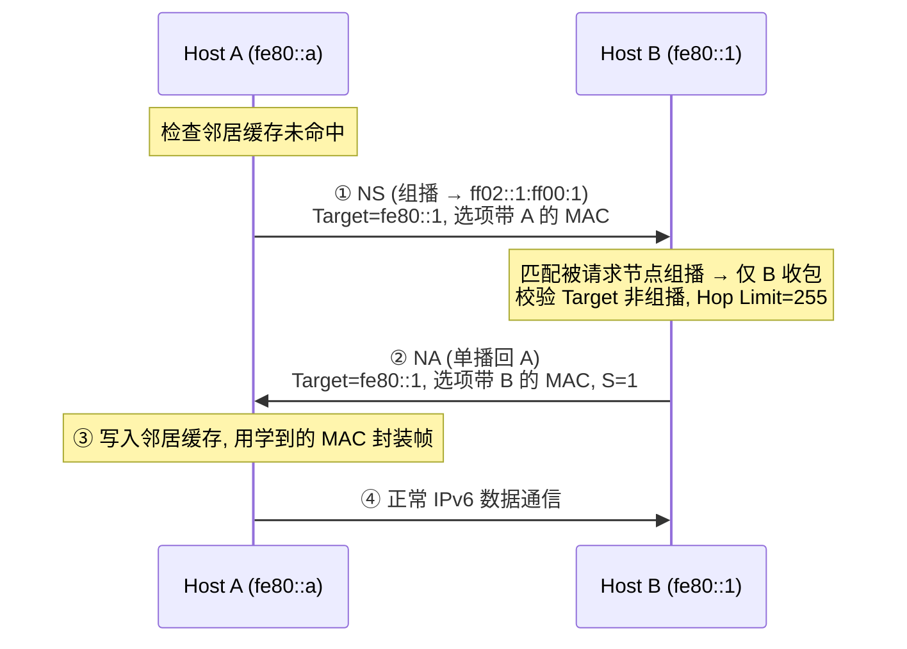
```mermaid
sequenceDiagram
    participant A as Host A (fe80::a)
    participant B as Host B (fe80::1)
    Note over A: 检查邻居缓存未命中
    A->>B: ① NS (组播 → ff02::1:ff00:1)<br/>Target=fe80::1, 选项带 A 的 MAC
    Note over B: 匹配被请求节点组播 → 仅 B 收包<br/>校验 Target 非组播, Hop Limit=255
    B->>A: ② NA (单播回 A)<br/>Target=fe80::1, 选项带 B 的 MAC, S=1
    Note over A: ③ 写入邻居缓存, 用学到的 MAC 封装帧
    A->>B: ④ 正常 IPv6 数据通信
```

被请求节点组播地址（Solicited-Node Multicast）是关键优化：

```text
构造规则:
  地址 = FF02:0:0:0:0:1:FFXX:XXXX
        └─ 固定前缀 ─┘  └─ 取目标 IPv6 的最后 24 位 ─┘

例: 目标 fe80::1
  → 最后 24 位 = 00:00:01
  → 被请求节点组播 = ff02::1:ff00:1

效果:
  ✅ 只有「目标地址最后 24 位相同」的极小子集节点加入该组
  ✅ 解析请求不再打扰全网, 仅目标主机响应
  ✅ 相比 ARP 广播 (FF:FF:FF:FF:FF:FF 打扰所有节点), 显著降噪
```

📊 **效率对比**：ARP 广播让**同一广播域所有主机**都要中断处理；NDP 组播只唤醒与目标的最后 24 位匹配的少数节点。在大规模二层域中，这是 NDP 相对 ARP 的核心可扩展性优势。

### DAD：重复地址检测（Duplicate Address Detection）

IPv6 没有「免费 ARP」概念，地址冲突检测由 NDP 的 NS 原生承担（RFC 4861 §5.4 / RFC 4862）：

```text
流程:
1. 节点为某接口配置 (SLAAC/DHCPv6/手动) 一个「 tentative (暂定) 」地址
2. 加入该地址对应的被请求节点组播 (ff02::1:ffXX:XXXX)
3. 发送 NS:
   · 源地址 = :: (未指定地址, 避免污染他人缓存, 思路同 RFC 5227 的 Probe)
   · 目标地址 = 自己的 tentative 地址
   · 目的 = 该地址的被请求节点组播
4. 等待窗口内若收到:
   · 任意 NA (Target = 该地址) 或
   · 他人 NS (Target = 该地址)
   → 判定冲突 ❌, 该地址不可用
5. 无响应 → 地址转为「 preferred / 可用 」
```

💡 **与 ARP ACD 的对应关系**：IPv4 用 RFC 5227 的 ARP Probe（spa=0.0.0.0）/ Announcement 实现；IPv6 用 NDP NS（源 `::`）实现。思路一致——先探测、再声明。

但 DAD 是 IPv6 协议栈的**强制内建**步骤，而 ARP 侧的 ACD 只是可选扩展——这是两者成熟度的一大差别。

### NUD：邻居不可达检测（Neighbor Unreachability Detection）

ARP 几乎没有主动的可达性确认（靠上层 TCP 超时被动发现）。NDP 内建 **NUD**，用明确的状态机主动探测：

| 状态             | 含义                        |
| -------------- | ------------------------- |
| **INCOMPLETE** | 已发 NS，等待 NA（相当于 ARP 的解析中） |
| **REACHABLE**  | 最近确认过可达                   |
| **STALE**      | 映射仍可用，但已超过确认期，需验证         |
| **DELAY**      | 已用 STALE 映射发包，等待上层可达性确认   |
| **PROBE**      | 主动发 NS 探测，等待响应            |

**可达性确认来源**：

- **上层可达性确认（upper-layer reachability confirmation）**：如 TCP 收到对端 ACK、连接持续推进，反向证明邻居可达
- **NA 的 S 标志**：收到「被请求的」NA 即确认
- **主动探测**：STALE→DELAY→PROBE 后，若仍无确认，条目失效

🤝 **设计哲学**：NDP 把「邻居是否还活着」从「上层协议猜」升级为「协议栈主动管」，在路由器和移动节点场景下显著提升丢包恢复速度。

### 路由器 / 前缀 / 参数发现与 SLAAC

这是 ARP 完全不具备的「超能力」。路由器通过 **RA（Type 134）** 周期性或在收到 RS 后立即通告：

| RA 携带的能力              | 说明                                            |
| --------------------- | --------------------------------------------- |
| **默认路由器**             | Router Lifetime 字段；为 0 表示不可作默认路由              |
| **前缀信息（Prefix Info）** | 哪些前缀 on-link（L 标志）；是否用于 SLAAC（A 标志）；Valid / Preferred Lifetime（两个独立的 32 位字段） |
| **链路 MTU**            | 链路层 MTU（可变 MTU 链路 SHOULD 发送）                  |
| **Cur Hop Limit**     | 建议的 IPv6 跳数限制                                 |
| **M / O 标志**          | M=1 用 DHCPv6 获取地址；O=1 用 DHCPv6 获取其他配置（DNS 等）  |
| **RDNSS / DNSSL**     | 通过 RA 直接下发 DNS 服务器 / 搜索域（RFC 6106，免 DHCPv6）   |

```text
SLAAC (无状态地址自动配置, RFC 4862) 简化流程:
1. 主机收到 RA, 拿到 on-link 前缀 (如 2001:db8:1:2::/64)
2. 主机用自己的接口标识符 (EUI-64 或 RFC 7217 稳定隐私地址) 拼出地址
3. 对每个候选地址执行 DAD
4. DAD 通过 → 地址可用, 无需任何 DHCP 服务器
```

⚠️ **IPv4 对照**：IPv4 的主机号要么手动配、要么靠 DHCPv4 + Option 3（路由器）+ Option 6（DNS）。NDP 把这些「分散在不同协议里」的信息，统一收进 RA/RS 一对消息，实现真正的即插即用。

### 安全增强：SEND 与 NDP 防护

NDP 默认仍是明文、无认证，**同样面临欺骗/中间人风险**（只是攻击面从 ARP 变成 ICMPv6）。但它的 ICMPv6 骨架为安全留下了协议级接口：

| 机制                      | RFC      | 说明                                               |
| ----------------------- | -------- | ------------------------------------------------ |
| **Hop Limit = 255 强校验** | RFC 4861 | 防远端伪造 NDP（ARP 无此保护）                              |
| **SEND（安全邻居发现）**        | RFC 3971 | 用 CGA（密码学生成地址）+ RSA 签名 + Nonce 对 NDP 报文做源认证，防御欺骗 |
| **RA Guard**            | RFC 6105 | 交换机拦截非授权端口的 RA，防恶意路由器/重定向攻击                      |
| **NDP 监控（ndpmon）**      | 社区       | 类似 arpwatch，监控 ND 变化告警                           |

```text
SEND 核心思路 (RFC 3971):
  · CGA: 地址的最后 64 位由公钥哈希派生, 攻击者无法伪造「属于他人」的地址
  · 每个 NDP 报文用私钥签名 (选项 Type 11/12/13/14 = CGA / RSA 签名 / 时间戳 / Nonce)
  · 接收方验证签名 → 确认「这个 IPv6 确实属于这个公钥持有者」

现实:
  ✅ SEND 在协议层面彻底解决 NDP 欺骗
  ⚠️ 部署成本高 (需 PKI / 证书), 普及率有限
  → 生产常用 RA Guard + 类似 DAI 的「NDP Inspection」做二层防护
```

⚠️ **重要提醒**：IPv6 还有自己的「代理 ARP」等价物——**ND Proxy（RFC 4389）**，用于链路层无法桥接时跨网段代理邻居发现；以及 **IND（反向邻居发现，RFC 3122）** 对应 IPv4 的 InARP。理解 ARP 生态，能 1:1 映射到 NDP 生态。

### 用 tcpdump / ndp 观察 NDP

```bash
# 抓取全部 ICMPv6 (含 NDP); NDP 消息的 ICMPv6 type 为 133~137
sudo tcpdump -i eth0 -nn icmp6

# 只看 NS (type 135)
sudo tcpdump -i eth0 -nn 'icmp6 and ip6[40] == 135'

# 只看 NA (type 136)
sudo tcpdump -i eth0 -nn 'icmp6 and ip6[40] == 136'

# macOS / BSD: 查看邻居缓存 (类似 Linux 的 ip neigh)
ndp -a            # 列出所有邻居
ndp -an           # 数字形式
```

**抓包结果示例**：

```text
# NS (组播解析): 源 = 本机地址 fe80::a（仅 DAD 的 NS 才用 ::）, 目的 = 被请求节点组播, Target = 待解析地址
12:34:56.1  fe80::a > ff02::1:ff00:1: ICMP6, neighbor solicitation, who has fe80::1, length 32

# NA (单播回): Target = fe80::1, TLLA 选项携带 B 的 MAC（tcpdump 默认不显示 MAC，加 -vv 可见 "destination link-address option"）
12:34:56.2  fe80::1 > fe80::a: ICMP6, neighbor advertisement, tgt is fe80::1, length 32
```

---

## ⚔️ ARP vs NDP：能力对比

把两种协议放在一起，差异一目了然：

| 维度               | **ARP（IPv4，RFC 826）**                        | **NDP（IPv6，RFC 4861）**                            |
| ---------------- | -------------------------------------------- | ------------------------------------------------- |
| **承载方式**         | 独立协议，直接封装在以太网帧（EtherType `0x0806`）           | 承载于 ICMPv6（IPv6 Next Header 58）                   |
| **消息类型**         | 仅 Request(1) / Reply(2)（+ 已淘汰的 RARP/InARP 等） | 5 种：RS(133)/RA(134)/NS(135)/NA(136)/Redirect(137) |
| **地址解析机制**       | **广播** FF:FF:FF:FF:FF:FF，打扰全网                | **被请求节点组播** ff02::1:ffXX:XXXX，仅目标响应               |
| **链路层地址承载**      | 固定字段（ar_sha/tha），绑死以太网 6 字节                  | **TLV 可选项**（SLLA/TLLA），适配任意链路层                    |
| **路由器发现**        | 协议自身无（IPv4 另有 RFC 1256 ICMP Router Discovery，但极少部署；实际靠静态配置 / DHCPv4 Option 3）                  | **内置**（RS/RA）                                     |
| **前缀发现**         | 无                                            | **内置**（RA Prefix Info）                            |
| **MTU / 跳数发现**   | 无                                            | **内置**（RA MTU / Cur Hop Limit）                    |
| **地址自动配置**       | 无内建机制（依赖 DHCPv4 / 手动；RFC 3927 仅限链路本地）                              | **SLAAC 无状态自动配置**（RFC 4862）                       |
| **重复地址检测（DAD）**  | 可选扩展（RFC 5227 ACD）                           | **协议栈强制内建**                                       |
| **邻居不可达检测（NUD）** | 弱（被动，靠上层超时）                                  | **主动状态机**（INCOMPLETE→…→PROBE）                     |
| **重定向**          | ICMP Redirect（独立协议）                          | **NDP Redirect**（一体化）                             |
| **安全基线**         | 无认证；无 Hop Limit 概念                           | Hop Limit=255 强校验（防远端伪造）                          |
| **防欺骗扩展**        | 无原生（靠 DAI/静态绑定/802.1X）                       | **SEND（RFC 3971，CGA+签名）**；RA Guard                |
| **代理等价物**        | Proxy ARP（RFC 1027）                          | ND Proxy（RFC 4389）                                |
| **反向解析等价物**      | InARP（RFC 2390）                              | IND（RFC 3122）                                     |
| **协议状态**         | STD 37（Internet Standard）                    | Internet Standard（Obsoletes 2461）                 |

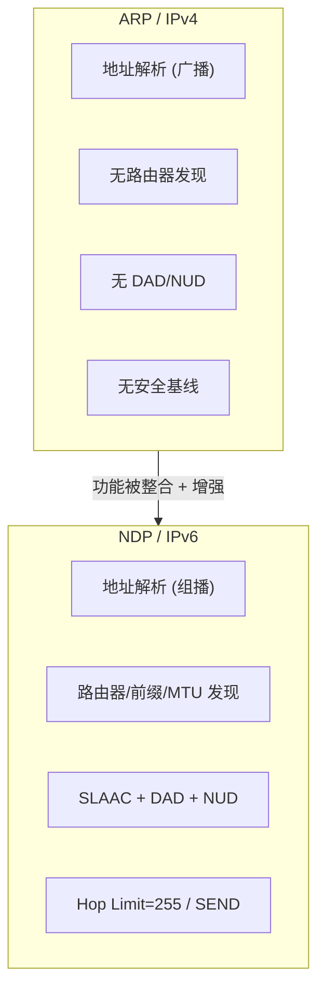
```mermaid
flowchart TB
    subgraph A["ARP / IPv4"]
        direction LR
        A1["地址解析 (广播)"]
        A2["无路由器发现"]
        A3["无 DAD/NUD"]
        A4["无安全基线"]
    end
    subgraph N["NDP / IPv6"]
        direction LR
        N1["地址解析 (组播)"]
        N2["路由器/前缀/MTU 发现"]
        N3["SLAAC + DAD + NUD"]
        N4["Hop Limit=255 / SEND"]
    end
    A -->|"功能被整合 + 增强"| N
```

🤝 **总结差异**：ARP 是 IPv4 时代一个「只管把 IP 翻译成 MAC」的轻量补丁；NDP 是 IPv6 链路层的「智能中枢」——它把地址解析、路由器/前缀发现、参数发现、地址自动配置、冲突检测、可达性检测、重定向**整合进一个 ICMPv6 协议族**，并用组播取代广播、用可选项取代固定字段、用强制 DAD/NUD 提升健壮性、用 Hop Limit=255 与 SEND 留出安全纵深。

---

## 🎯 总结

今天我们从 **RFC 官方规范出发**，系统地梳理了 ARP 协议的核心知识：

**📖 诞生的背景**：

- 网络分层模型中 IP 地址（逻辑位置）与 MAC 地址（本链路接口标识）的天然断层
- ARP 采用“按需查询 + 本地缓存”的设计解决动态地址映射问题

**📋 协议定义（RFC 826）**：

- 9 个字段的报文结构（Hardware Type / Protocol Type / Opcode ...）
- 基本地址解析使用 REQUEST（1）和 REPLY（2）；广播/单播是传统流程的常见形式，并非操作码固有属性
- **关键特性**：RFC 826 给出的接收算法允许更新已有表项、在本机为目标时新建映射，但不验证发送者身份

**⚙️ 工作原理**：

- 传统 ARP 请求-应答流程（广播 Request → 单播 Reply）
- ARP 缓存表机制（REACHABLE / STALE / FAILED 等状态）
- **RFC 5227 ACD**：ARP Probe → ANNOUNCE_WAIT → ARP Announcement（传统免费 ARP）→ 持续冲突检测/防御
- **代理 ARP（Proxy ARP，RFC 1027）**：透明子网网关，使跨子网通信对主机透明
- **RFC 1122**：主机须刷新过期 ARP、防止 ARP flood，并宜暂存未解析完成的待发包

**🎯 主要应用场景**：

- 同网段直接通信 / 默认网关解析 / 地址冲突检测
- 高可用架构（VRRP/CARP/HSRP 的 VIP 漂移通知）
- 网络设备发现 / 连通性检测 / 故障排查

**🛡️ 攻击与防御**：

- ARP 欺骗利用“信任但不验证”的安全局限实施**中间人攻击（MITM）**
- **检测方法**：arpwatch 监控、tcpdump 抓包分析、缓存对比
- **企业级防御方案**：
  - 静态绑定（简单但难维护）
  - **DAI 动态 ARP 检测**（推荐，配合 DHCP Snooping）
  - 802.1X 网络准入（身份控制的补充措施，不能替代 DAI）

**🌐 IPv6 的进化：NDP（RFC 4861）**：

- IPv6 废除广播、不再使用 ARP；地址解析、路由器/前缀发现、MTU 发现、SLAAC、DAD、NUD、重定向**统一由 NDP 承担**
- NDP 承载于 ICMPv6（Next Header 58），用**被请求节点组播**取代广播，显著降低链路噪声
- 安全基线更强：Hop Limit=255 强校验 + **SEND（RFC 3971）** 密码学源认证；生产常用 **RA Guard** 兜底
- 能力差异详见上文「**ARP vs NDP：能力对比**」一节

⚠️ **核心启示**：ARP 与 NDP 都**不是「默认即安全」**——两者均不提供无条件可信的发送者认证。IPv4 高风险共享二层网络应组合 DAI、静态绑定、网络分段、监控与端到端加密；IPv6 则应启用 RA Guard、NDP Inspection，并在具备 PKI 支撑时部署 SEND。

💬 **聊聊你的实战**：你踩过 ARP 欺骗的坑吗？或者正在用 NDP / SLAAC 做 IPv6 落地？欢迎在评论区分享你的场景与排障故事，也欢迎把本文转发给正在学网络的同事。

---

## 参考资源

- **RFC 826** - An Ethernet Address Resolution Protocol（ARP 协议官方定义，STD 37）
- **RFC 5227** - IPv4 Address Conflict Detection（Updates 826；Probe / Announcement / 持续检测）
- **RFC 1027** - Using ARP to Implement Transparent Subnet Gateways（代理 ARP；§2.4 安全约束）
- **RFC 5494** - IANA Allocation Guidelines for the Address Resolution Protocol (ARP)（Updates 826）
- **RFC 2390** - Inverse Address Resolution Protocol（InARP，对应 Opcode 8/9）
- **RFC 1256** - ICMP Router Discovery Messages（IPv4 的路由器发现，NDP RS/RA 的前身；实际部署很少）
- **RFC 1122** - Requirements for Internet Hosts -- Communication Layers（§2.3.2 ARP 主机要求）
- **RFC 5737** - IPv4 Address Blocks Reserved for Documentation（TEST-NET-3 `203.0.113.0/24`，文中跨网段示例所用地址）
- **RFC 4861** - Neighbor Discovery for IP version 6（IPv6 侧用 NDP，不用 ARP；Obsoletes 2461）
- **RFC 4862** - IPv6 Stateless Address Autoconfiguration（SLAAC，Updates 4861）
- **RFC 3971** - SEcure Neighbor Discovery (SEND)（CGA + 签名，防御 NDP 欺骗）
- **RFC 4389** - Neighbor Discovery Proxy（ND Proxy，对应 IPv4 Proxy ARP）
- **RFC 3122** - Inverse Neighbor Discovery (IND)（对应 IPv4 InARP）
- **RFC 6106** - DNS Configuration options for IPv6 Router Advertisements（RDNSS/DNSSL）
- **RFC 4429** - Optimistic Duplicate Address Check for IPv6（Optimistic DAD）
- **RFC 3927** - Dynamic Configuration of IPv4 Link-Local Addresses（APIPA `169.254/16`；其冲突检测流程后被 RFC 5227 提取为通用 ACD）
- **RFC 4443** - ICMPv6 (ICMP for IPv6)，NDP 的承载协议
- **RFC 6105** - IPv6 Router Advertisement Guard（RA Guard，交换机拦截非授权端口 RA）
- **RFC 6980** - Security Implications of IPv6 Fragmentation with IPv6 Neighbor Discovery（分片对 NDP 的影响）
- **RFC 7217** - A Method for Generating Semantically Opaque Interface Identifiers with IPv6 SLAAC（稳定隐私地址接口标识符）
- **IANA ARP Parameters** - <https://www.iana.org/assignments/arp-parameters/>
- **Wireshark 官方文档** - <https://wiki.wireshark.org/ARP>
- **Linux man pages** - `man 7 arp`, `man 8 ip-neighbour`
- **Cisco DAI 配置指南** - Configuring Dynamic ARP Inspection

**本文首发于公众号「Artificer老王的学习笔记」，转载请注明出处。**
