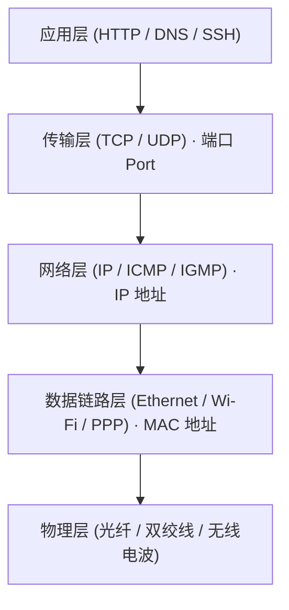
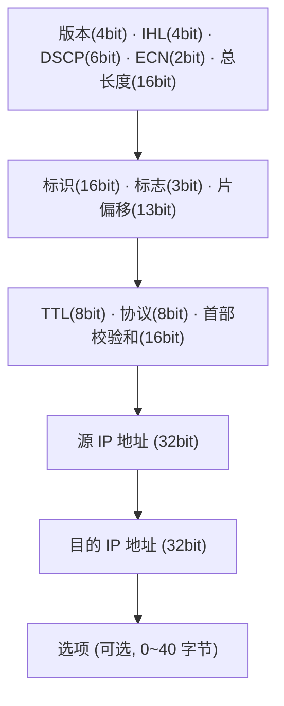
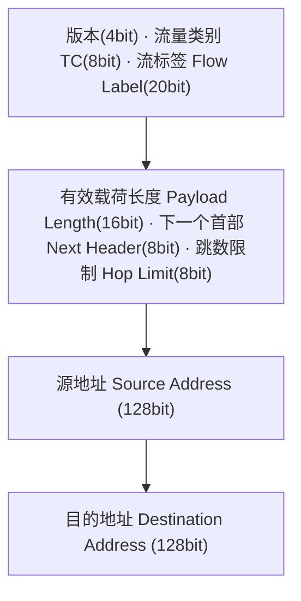
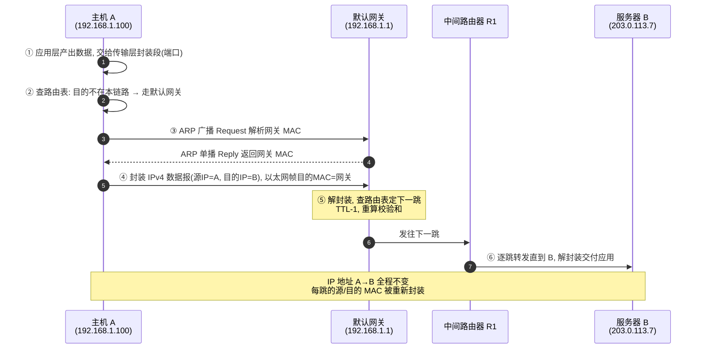
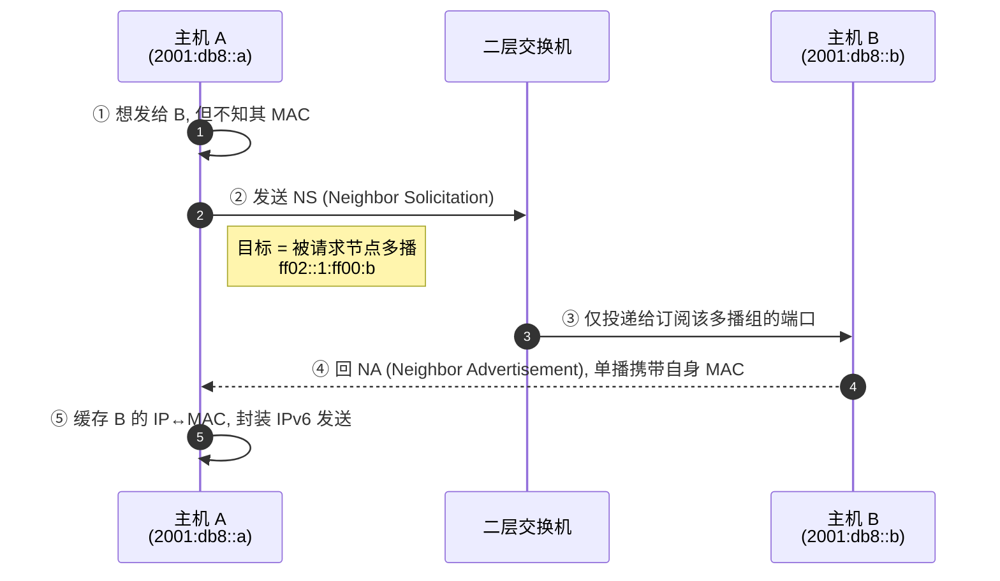
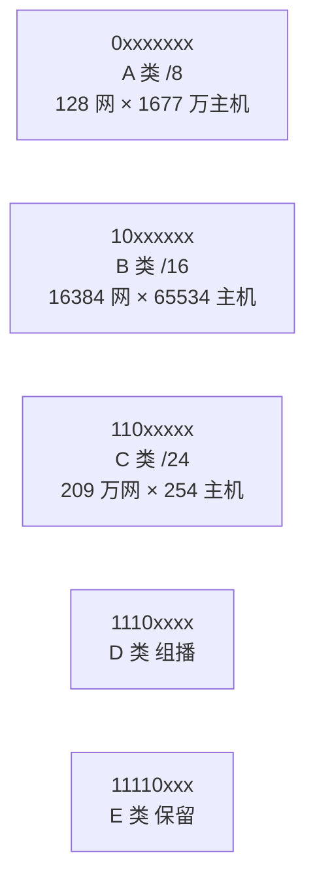
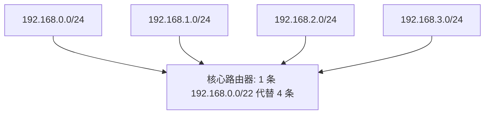
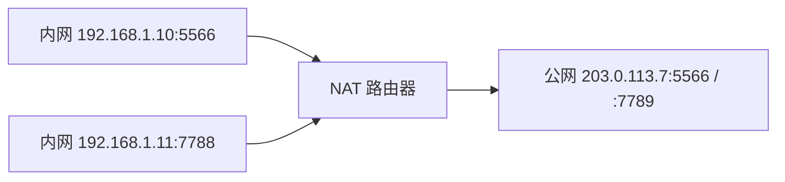
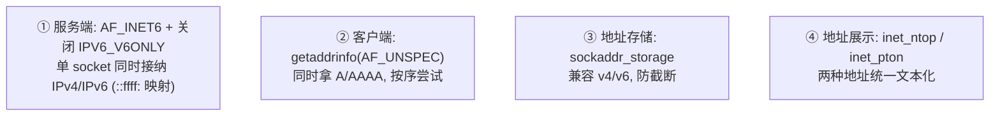
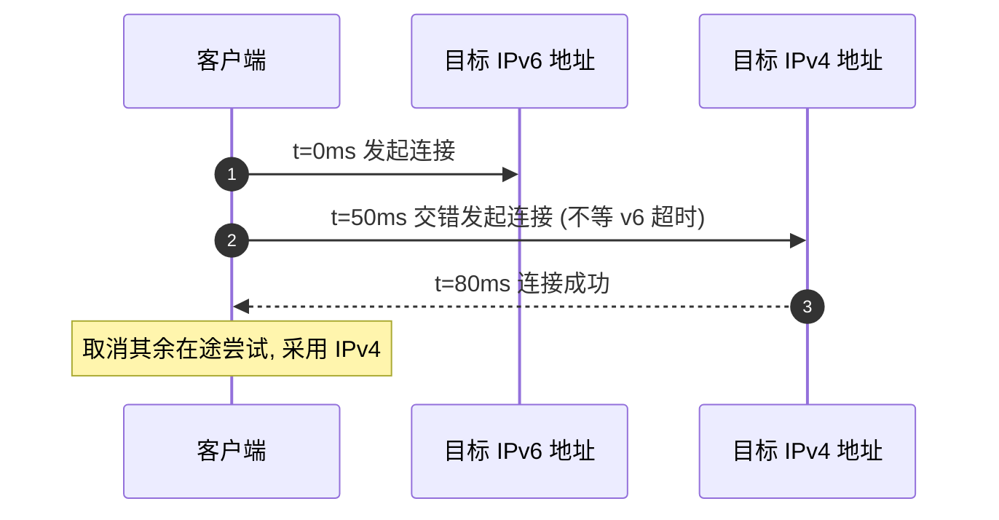

## IPv4/IPv6 的定义、原理、网段划分与双栈兼容

<p align="center"><strong>作者：</strong>Artificer老王 &nbsp;&nbsp;|&nbsp;&nbsp; <strong>更新时间：</strong>2026-07-19 &nbsp;&nbsp;|&nbsp;&nbsp; <strong>阅读时长：</strong>约 35 分钟</p>

---

你每天上网冲浪、刷视频、远程办公，数据在成千上万台设备之间穿梭而不丢失。

但你有没有认真想过：

**一个数据包从你的手机飞到千里之外的服务器，中间经过几十台路由器，它是怎么"认路"的？**  
**为什么我们一边用着 IPv4，一边又说 IPv6 是未来？两者到底差在哪？**  
**当年"32 位地址够用"的自信，是怎么被现实打脸的？**  
**今天写一套网络服务，要怎样才能同时对 IPv4 和 IPv6 用户都"来者不拒"？**

---

## IP 在网络分层中的定位

IP（Internet Protocol，网际协议）是 TCP/IP 协议族中 **网络层（第 3 层）** 的核心，负责把数据报从源主机 **尽力而为（best-effort）** 地转发到目的主机，不保证可靠、不保证顺序、不保证不重复。



IP 的核心职责:

1. **编址 (Addressing)**：给每个接口分配唯一（或至少路由可达）的 IP 地址
2. **封装 (Encapsulation)**：把上层段 (segment) 封装成 IP 数据报 (datagram)
3. **路由 (Routing)**：每一跳根据目的 IP 查路由表决定下一跳
4. **分片 (Fragmentation)**：当数据报超过链路 MTU 时进行分片（IPv4；IPv6 基本不）

---

## IPv4 协议的定义

### 什么是 IPv4

**IPv4（Internet Protocol version 4）** 由 **RFC 791（1981 年 9 月）** 正式定义，使用 **32 位（4 字节）地址**，理论上可提供约 42.9 亿（2³²）个地址。

它把数据封装成 **IP 数据报（datagram）**，每个数据报独立路由。

IPv4 地址通常写成点分十进制，例如 `192.168.1.100`、`203.0.113.7`。

### IPv4 数据报格式

IPv4 头部**最小 20 字节**（无选项时），长度可变（含选项最长 60 字节）：



#### 关键字段说明

| 字段 | 大小 | 作用 |
|------|------|------|
| **版本 Version** | 4 bits | 恒为 `4`（IPv4） |
| **首部长度 IHL** | 4 bits | 以 4 字节为单位，最小 5（=20 字节），含选项时更大 |
| **区分服务 DSCP / ECN** | 8 bits | QoS 标记（DSCP 6 位）+ 显式拥塞通知（ECN 2 位） |
| **总长度 Total Length** | 16 bits | 整个数据报的字节数（首部 + 数据），故 IPv4 数据报最大 65535 字节 |
| **标识 / 标志 / 片偏移** | 32 bits | 用于**分片与重组**；3 位标志中 DF=不分片、MF=还有后续分片 |
| **TTL** | 8 bits | 生存时间，每经一跳减 1，减到 0 丢弃，防止环路死包 |
| **协议 Protocol** | 8 bits | 指示上层协议（取自 IANA 协议号注册表）：`1`=ICMP、`6`=TCP、`17`=UDP 等；同一注册表中 `58`=ICMPv6 用于 IPv6 的 Next Header |
| **首部校验和** | 16 bits | **仅**校验 IP 首部（每跳因 TTL/分片变化需重算）；数据部分由上层校验 |
| **源 / 目的地址** | 各 32 bits | 端到端地址，是路由决策的唯一依据 |

> ⚠️ **IPv4 没有"传输层端口"字段**：端口在 TCP/UDP 首部里。IP 只负责"把数据报送到目的主机"，至于交给主机的哪个进程，由传输层决定。

---

## IPv6 协议的定义

### 为什么需要 IPv6

IPv4 的 32 位地址在 1990 年代就被预测会耗尽（"IPv4 地址耗尽"是 IPv6 诞生的最大动因）。

**IPv6（Internet Protocol version 6）** 最早由 **RFC 1883（1995 年）** 定义，后经 **RFC 2460（1998 年）** 修订，最终由 **RFC 8200（2017 年，Internet Standard）** 取代，使用 **128 位地址**，地址空间约为 3.4×10³⁸，足以给"地球上每粒沙子分配一个地址"。

### IPv6 数据报格式

IPv6 做了一个重要简化：**固定 40 字节基本首部 + 可选的扩展首部**，把分片、选项等"非常规"功能移到扩展首部，使路由器处理更快。



注意：

- 没有 IHL（固定 40 字节，无需指示长度）
- 没有首部校验和（链路层与上层已有校验，去掉它让转发更快）
- 没有分片字段（分片改由"分片扩展首部"承载，且只由源端做）
- 没有 Options（选项移入扩展首部，Next Header 链式指向它们）

#### IPv6 地址的表示法

128 位地址写成 **8 组冒号分隔的十六进制**，每组 4 位十六进制数：

```text
完整形式:
  2001:0db8:0000:0000:0000:ff00:0042:8329

压缩规则:
  1) 每组前导 0 可省略:  2001:db8:0:0:0:ff00:42:8329
  2) 连续全 0 组可用 "::" 代替一次（只能出现一次）:
                         2001:db8::ff00:42:8329

特殊地址:
  ::1             → 环回 (loopback), 等同 IPv4 的 127.0.0.1
  ::              → 未指定地址 (unspecified), 等同 0.0.0.0
  fe80::/10       → 链路本地地址 (仅本链路有效, 类似 169.254.0.0/16)
  fc00::/7        → 唯一本地地址 ULA (私网, 类似 RFC 1918)
  ff00::/8        → 组播 (IPv6 已取消广播, 用组播代替)
  ::ffff:192.0.2.1→ IPv4 映射地址 (用于双栈过渡, 见后文)
```

### IPv4 与 IPv6 主要区别

| 维度 | IPv4 | IPv6 |
|------|------|------|
| **RFC** | RFC 791（1981，Internet Std / STD 5） | RFC 8200（2017，Internet Std，取代 2460） |
| **地址长度** | 32 位（约 43 亿） | 128 位（约 3.4×10³⁸） |
| **基本首部** | 20~60 字节，可变 | 固定 40 字节 |
| **首部校验和** | 有（每跳重算） | 无（依赖上层/链路层） |
| **分片** | 路由器/源端都可分片 | 仅**源端**分片（路径 MTU 发现 PMTUD） |
| **地址配置** | 手动 / DHCP | 无状态自动配置 SLAAC（RFC 4862）+ DHCPv6 |
| **地址解析** | **ARP**（广播，RFC 826） | **NDP**（组播 + ICMPv6，RFC 4861） |
| **广播** | 支持 | **取消**（用组播/任播代替） |
| **校验范围** | IP 首部校验 | 端到端靠上层；设计上将 **IPsec** 作为安全基础（初版强制，后由 RFC 6434 调整为推荐） |
| **QoS** | ToS / DSCP | 流量类别 TC + 流标签 Flow Label |

---

## 工作原理：数据报如何在网络中流动

下面用 **UML 顺序图**展示两种最典型的场景：IPv4 的跨网转发，以及 IPv6 用 NDP 替代 ARP 的邻居发现。

### 场景一：IPv4 数据报的跨网转发

假设主机 A（`192.168.1.100`）要给服务器 B（`203.0.113.7`）发送数据，二者不在同一网段。

注意 **IP 地址端到端不变，而链路层 MAC 每跳都在变**。



**关键点**：

- **端到端 IP 不变**：从 A 到 B，源 IP 始终是 A、目的 IP 始终是 B。
- **逐跳改写 MAC**：数据链路层的源/目的 MAC 每经过一台路由器就被重写（因为"下一跳"在变）。
- **TTL 防环**：每跳 TTL 减 1，归零即丢弃，避免数据报在路由环路里无限循环。
- **分片**：若数据报超过出接口的 MTU 且 DF=0，路由器会分片；IPv4 允许中间路由器分片，而 IPv6 不允许。

### 场景二：IPv6 用 NDP 完成邻居发现（替代 ARP）

IPv6 **没有 ARP**。地址解析由 **NDP（Neighbor Discovery Protocol，RFC 4861）** 通过 **ICMPv6** 完成，使用**组播**而非广播，更高效也更有层次。



NDP 的 5 种 ICMPv6 报文（RFC 4861）：

- **RS (133) Router Solicitation**：主机请求路由器发 RA
- **RA (134) Router Advertisement**：路由器通告前缀 / 跳数 / MTU 等
- **NS (135) Neighbor Solicitation**：地址解析 / 重复地址检测（DAD）
- **NA (136) Neighbor Advertisement**：宣告自己的 MAC / 通告
- **Redirect (137)**：告知主机"去某目的有更优下一跳"

> 💡 **NDP 一举多得**：它同时承担了 IPv4 世界中 ARP（地址解析）、ICMP 重定向（Redirect）、以及 DHCP 部分能力（RA 下发前缀并配合 SLAAC 自动配置地址）。这也是 IPv6 "即插即用"的基础。

---

## IPv4 网段划分及其历史背景

"网段划分"本质上是**如何把 32 位地址空间切成可路由、可聚合的网络块**。它的演进是一部"先粗放、后精细、再被 NAT 续命、最终被 IPv6 终结"的历史。

### 第一阶段：分类编址（Classful，1981 起）

早期 Internet 规模很小，RFC 790（1981）和 RFC 791 采用了**分类编址**：按地址首位固定划分 A/B/C/D/E 五类，每类带**默认子网掩码**。



设计初衷：A 类给超大型机构（如大学、军队），B 类给中大型组织，C 类给小型网络。

### 问题暴露：地址浪费与路由表爆炸

分类编址很快暴露致命缺陷：

```text
矛盾 1: 地址严重浪费 (粒度太粗)
━━━━━━━━━━━━━━━━━━━━━━━━━━━━━━━━━━
· 一个需要 300 台主机的小公司, 只能申请 B 类 (/16)
  → 白白浪费 65000+ 个地址
· 很多 A 类地址被早期机构"圈地"占用, 实际用不掉
· 1990 年代起, 可用 IPv4 地址肉眼可见地走向枯竭

矛盾 2: 路由表膨胀 (无法聚合)
━━━━━━━━━━━━━━━━━━━━━━━━━━━━━━━━━━
· C 类网有 200 多万个, 若每个都全网通告
  → 核心路由器路由表爆炸
· 分类边界固定, 无法把多个小网聚成一个大前缀
```

> 历史注脚：**"IPv4 地址耗尽"并非突然发生**。1990 年代 IETF 就预测 32 位空间不够，先后提出 **CIDR（1993）**、**NAT（1994）**、**私有地址（RFC 1918, 1996）** 等"续命"手段，把真正的耗尽推到了 2011 年前后（IANA 分配完最后 /8 块）。而根本解药是 IPv6。

### 第二阶段：CIDR 与 VLSM（1993，无类域间路由）

**CIDR（Classless Inter-Domain Routing）** 由 **RFC 1517 / 1518 / 1519（1993，后由 RFC 4632 取代）** 定义，核心思想：

- **取消类别边界**：网络号不再拘泥于 /8、/16、/24，而是任意长度的前缀，如 `/22`、`/19`。
- **VLSM（变长子网掩码）**：同一组织内可对已分到的块再做**更细的子网划分**，按需分配。
- **路由聚合（Route Aggregation / Supernetting）**：把多个连续前缀合并成一条摘要路由（summary route），大幅压缩核心路由表。

**CIDR 表示法（斜杠记法）**：`192.168.0.0/22` 表示前 22 位为网络号、后 10 位为主机位，主机数 = 2^(32−22) − 2 = 1022 台（减网络号与广播地址）。

**路由聚合示例**：连续的 4 个 `/24` 聚合成一条 `/22` 摘要路由，核心路由器用 1 条路由代替 4 条。



### 第三阶段：子网划分（Subnetting）与掩码计算

在一个组织拿到一个 CIDR 块后，**子网划分**是把这块地址再切分给不同部门/楼层的常用手段。

划分由子网掩码（subnet mask）表达。

#### 子网掩码与按位计算

子网掩码是 32 位值，**网络位全 1、主机位全 0**。

把 IP 与掩码做**按位与**，得到网络号。

```text
例: 把 192.168.1.0/24 划分为 4 个子网

原网段: 192.168.1.0/24
  二进制: 11000000.10101000.00000001.00000000
  掩码:   11111111.11111111.11111111.00000000  (/24)

借 2 位主机位作子网位 → 新掩码 /26
  掩码:   11111111.11111111.11111111.11000000  (/26)

4 个子网 (每个 62 台可用主机):
  子网 0: 192.168.1.0   /26  (主机 192.168.1.1   ~ 192.168.1.62,  广播 .63)
  子网 1: 192.168.1.64  /26  (主机 192.168.1.65  ~ 192.168.1.126, 广播 .127)
  子网 2: 192.168.1.128 /26  (主机 192.168.1.129 ~ 192.168.1.190, 广播 .191)
  子网 3: 192.168.1.192 /26  (主机 192.168.1.193 ~ 192.168.1.254, 广播 .255)

判断两台主机是否同子网:
  主机 X: 192.168.1.70  →  IP & /26 = 192.168.1.64  (子网 1)
  主机 Y: 192.168.1.130 →  IP & /26 = 192.168.1.128 (子网 2)
  → 不同子网, 通信需经路由器 (默认网关)
```

#### 计算速查（常用前缀）

| 前缀 | 掩码 | 主机位 | 可用主机数 | 说明 |
|------|------|--------|-----------|------|
| /24 | 255.255.255.0 | 8 | 254 | 典型办公网段 |
| /25 | 255.255.255.128 | 7 | 126 | 半段 |
| /26 | 255.255.255.192 | 6 | 62 | 4 个子网（上例） |
| /27 | 255.255.255.224 | 5 | 30 | 小型 VLAN |
| /30 | 255.255.255.252 | 2 | 2 | 点对点链路（仅 2 个可用地址） |
| /32 | 255.255.255.255 | 0 | 1 | 单主机/主机路由 |

> 可用主机数 = `2^主机位 - 2`（减网络号与广播地址）。**/31 是个例外**：RFC 3021 允许在点到点链路用 /31（无广播，两个地址全可用）。

### 第四阶段：NAT 与私有地址（续命手段）

为了延缓耗尽，RFC 1918（1996）划出三段**私有地址**，配合 **NAT（Network Address Translation，RFC 1631，1994）**，让内网成千上万台设备共用一个公网 IP 上网。

**RFC 1918 私有地址**：`10.0.0.0/8`（A 类私有，超大内网）、`172.16.0.0/12`（16 个 B 类块）、`192.168.0.0/16`（256 个 C 类，家庭/企业常用）。

**NAT 工作示意**（家庭路由器，用端口区分不同内网主机，即 NAPT）：



> ⚠️ NAT 是"权宜之计"，它破坏了端到端透明性（P2P、入站服务需端口映射），也增加了连接跟踪开销。它把 IPv4 的寿命延长了二十年，但无法从根本上解决地址空间不足——这就是为什么 IPv6 才是终局方案。

---

## 编写网络服务或应用时如何同时兼容 IPv4 和 IPv6

今天现实网络是 **IPv4 与 IPv6 长期共存**。

写服务时若只支持 `AF_INET`（IPv4），会拒绝 IPv6-only 用户；若只支持 `AF_INET6`，又可能漏掉纯 IPv4 环境。

**双栈兼容（Dual-stack）** 是工程上的标准答案。

### 核心原则：不要硬编码地址族

最常见的错误是写死 `AF_INET`：

```c
/* ❌ 反例：只支持 IPv4，IPv6 用户直接连不上 */
int fd = socket(AF_INET, SOCK_STREAM, 0);
struct sockaddr_in sa;
sa.sin_family = AF_INET;
sa.sin_addr.s_addr = INADDR_ANY;   // 只监听 IPv4
```

正确做法是遵循下面三条：



### 服务端：一个套接字监听双栈

在 Linux/macOS/BSD 上，创建 `AF_INET6` 套接字并显式设置 `IPV6_V6ONLY = 0`（注意：**BSD/macOS 内核默认该项为 1，即 v6-only；Linux 默认则为 0**，但显式置 0 可保证跨平台一致），再 `bind` 到 `::`（IPv6 通配地址），即可同时接受 IPv4 与 IPv6 连接。

```c
/* dual_stack_server.c — 同时监听 IPv4 与 IPv6 的最小 TCP 服务端 */
#include <stdio.h>
#include <string.h>
#include <unistd.h>
#include <arpa/inet.h>
#include <sys/socket.h>
#include <netinet/in.h>

int main(void) {
    int srv = socket(AF_INET6, SOCK_STREAM, 0);
    if (srv < 0) { perror("socket"); return 1; }

    /* 关键: 关闭 IPV6_V6ONLY, 让 IPv6 套接字同时收 IPv4 连接 */
    int off = 0;
    if (setsockopt(srv, IPPROTO_IPV6, IPV6_V6ONLY, &off, sizeof(off)) < 0) {
        perror("setsockopt IPV6_V6ONLY");
        /* 某些系统不支持关闭, 此时需分别创建 AF_INET 与 AF_INET6 两个 socket */
    }

    int yes = 1;
    setsockopt(srv, SOL_SOCKET, SO_REUSEADDR, &yes, sizeof(yes));

    struct sockaddr_in6 addr;
    memset(&addr, 0, sizeof(addr));
    addr.sin6_family = AF_INET6;
    addr.sin6_port   = htons(8080);
    addr.sin6_addr   = in6addr_any;   /* "::" 通配地址 */

    if (bind(srv, (struct sockaddr *)&addr, sizeof(addr)) < 0) {
        perror("bind"); return 1;
    }
    listen(srv, 16);

    printf("listening on [::]:8080 (dual stack)\n");

    while (1) {
        struct sockaddr_storage peer;       /* 足够大, 兼容 v4/v6 */
        socklen_t len = sizeof(peer);
        int c = accept(srv, (struct sockaddr *)&peer, &len);
        if (c < 0) continue;

        char buf[INET6_ADDRSTRLEN];
        if (peer.ss_family == AF_INET6) {
            struct sockaddr_in6 *p = (struct sockaddr_in6 *)&peer;
            inet_ntop(AF_INET6, &p->sin6_addr, buf, sizeof(buf));
        } else {
            struct sockaddr_in *p = (struct sockaddr_in *)&peer;
            inet_ntop(AF_INET, &p->sin_addr, buf, sizeof(buf));
        }
        printf("accepted from %s (family=%d)\n", buf, peer.ss_family);
        /* 实际服务中: 把 c 交给线程/事件循环处理 */
        close(c);
    }
}
```

> 注意 `peer.ss_family` 的值：IPv6 客户端连接进来时 `ss_family == AF_INET6`；**IPv4 客户端连接进来时 `ss_family` 也是 `AF_INET6`，但其地址是 `::ffff:192.0.2.1` 这样的"IPv4 映射地址"**。应用层若要区分协议族，检查地址是否落在 `::ffff:0:0/96` 即可。

### 客户端：用 getaddrinfo 自动适配

客户端不应假设目标只解析出 IPv4。用 `getaddrinfo(..., AF_UNSPEC, ...)` 一次性拿到所有地址族的结果，再依次尝试（这就是 **Happy Eyeballs** 的雏形）。

```c
/* dual_stack_client.c — 用 getaddrinfo 自动兼容 IPv4/IPv6 */
#include <stdio.h>
#include <string.h>
#include <unistd.h>
#include <arpa/inet.h>
#include <sys/socket.h>
#include <netdb.h>

int connect_to(const char *host, const char *port) {
    struct addrinfo hints, *res, *p;
    memset(&hints, 0, sizeof(hints));
    hints.ai_family   = AF_UNSPEC;    /* ✅ 关键: 不限定地址族, v4/v6 都要 */
    hints.ai_socktype = SOCK_STREAM;

    if (getaddrinfo(host, port, &hints, &res) != 0) {
        perror("getaddrinfo"); return -1;
    }

    int fd = -1;
    for (p = res; p != NULL; p = p->ai_next) {
        fd = socket(p->ai_family, p->ai_socktype, p->ai_protocol);
        if (fd < 0) continue;
        if (connect(fd, p->ai_addr, p->ai_addrlen) == 0) {
            break;          /* 连上就用这个地址 */
        }
        close(fd); fd = -1; /* 失败换下一个 (可能是另一地址族) */
    }
    freeaddrinfo(res);
    return fd;   /* 成功返回已连接 fd, 否则 -1 */
}

int main(void) {
    int fd = connect_to("example.com", "80");
    if (fd >= 0) { printf("connected (dual stack ready)\n"); close(fd); }
    return 0;
}
```

### Happy Eyeballs：让"同时试两个栈"更快更顺

**Happy Eyeballs（RFC 8305）** 是浏览器等客户端的最佳实践：当目标同时有 A（IPv4）与 AAAA（IPv6）记录时，不要"死等"一个栈超时再试另一个，而是**交错（interleave）发起连接**——先试 IPv6，短暂延迟后并行试 IPv4，谁先连上用谁，并把结果用于后续"预热的地址排序"。这既保证在纯 IPv4 网络下不因 IPv6 超时而卡顿，又优先享受 IPv6。



### Python 示例（更贴近应用开发）

Python 的 `socket` 同样遵循上述原则：服务端用 `AF_INET6` + `IPV6_V6ONLY=0`，客户端用 `getaddrinfo(..., AF_UNSPEC)`。

```python
# dual_stack_demo.py
import socket

# ---- 服务端: 一个 socket 同时接 IPv4/IPv6 ----
def serve(host="::", port=8080):
    srv = socket.socket(socket.AF_INET6, socket.SOCK_STREAM)
    srv.setsockopt(socket.IPPROTO_IPV6, socket.IPV6_V6ONLY, 0)
    srv.setsockopt(socket.SOL_SOCKET, socket.SO_REUSEADDR, 1)
    srv.bind((host, port))
    srv.listen(16)
    print(f"listening on [{host}]:{port} (dual stack)")
    while True:
        conn, addr = srv.accept()
        # IPv4 客户端 addr 形如 ("::ffff:192.0.2.1", port, ..., ...)
        print("accepted from", addr[0])
        conn.close()

# ---- 客户端: 用 getaddrinfo 自动适配两栈 ----
def connect(host="example.com", port=80, timeout=5.0):
    for info in socket.getaddrinfo(host, port, socket.AF_UNSPEC, socket.SOCK_STREAM):
        af, socktype, proto, _canon, sa = info
        try:
            s = socket.socket(af, socktype, proto)
            s.settimeout(timeout)
            s.connect(sa)
            return s          # 连上即返回
        except OSError:
            continue
    raise RuntimeError("无法连接到目标 (IPv4/IPv6 均失败)")

if __name__ == "__main__":
    connect()
```

### 双栈兼容最佳实践清单

| 实践 | 说明 |
|------|------|
| **服务端用 `AF_INET6` + 关 `IPV6_V6ONLY`** | 单套接字同时接纳 IPv4/IPv6（注意 BSD/macOS 默认值差异） |
| **客户端用 `getaddrinfo(AF_UNSPEC)`** | 不写死地址族，按 DNS 返回自适应 |
| **地址存储用 `sockaddr_storage`** | 统一大结构体，避免用小的 v4 结构体（16 字节）截断更长的 v6 地址（28 字节） |
| **文本化用 `inet_ntop` / `inet_pton`** | 取代已废弃的 `inet_ntoa`（仅支持 v4） |
| **识别映射地址 `::ffff:/96`** | 区分"经双栈 socket 进来的 IPv4 连接" |
| **实现 Happy Eyeballs（客户端）** | 两栈交错尝试，避免单栈超时导致卡顿 |
| **数据库/日志存文本地址** | 用 `VARCHAR(45)` 容纳最长 IPv6 文本（`inet_ntop` 结果） |
| **防火墙/ACL 同时覆盖两栈** | 别只配 IPv4 规则漏掉 IPv6 入口 |
| **必要时显式双 socket** | 当系统不支持关 `IPV6_V6ONLY` 时，分别建 v4/v6 监听并共用同一 `accept` 事件循环 |

> 📌 **什么时候需要两个独立 socket？** 若操作系统/容器环境强制 `IPV6_V6ONLY=1` 且不允许关闭（极少数加固场景），就创建 `AF_INET` 与 `AF_INET6` 两个监听 socket，放进同一个 `epoll`/`select` 循环统一 `accept` 即可，逻辑上等价于双栈。

---

## 总结

今天我们沿着 **"是什么 → 怎么工作 → 为什么这样演进 → 怎么写好代码"** 的链路，系统梳理了 IP 协议：

**📖 协议定义**：
- **IPv4**（RFC 791）：32 位地址、可变长 20~60 字节首部、有首部校验和、允许中间路由器分片、用 **ARP** 做地址解析。
- **IPv6**（RFC 8200）：128 位地址、固定 40 字节基本首部、无首部校验和、仅源端分片、用 **NDP/ICMPv6** 做邻居发现与自动配置，原生取消广播。

**⚙️ 工作原理**：
- IPv4 跨网转发：**端到端 IP 不变、逐跳改写 MAC、TTL 防环**。
- IPv6 用 NDP 以**组播**替代广播完成地址解析，并顺带承担重定向、前缀下发（SLAAC）等职责。

**🕰 网段划分的历史背景**：
- 从 **分类编址（A/B/C，1981）** 的粗放与浪费，到 **CIDR/VLSM（1993）** 的无类、可聚合、可细分；
- 用 **子网掩码按位与**切分网段，按 `/26`、`/27` 等前缀精细分配；
- 用 **私有地址 + NAT（1994/1996）** 续命，最终由 **IPv6** 从根本上解决地址耗尽。

**🛠 双栈兼容开发**：
- 服务端：`AF_INET6` + 关闭 `IPV6_V6ONLY`，一个 socket 同时接两栈；
- 客户端：`getaddrinfo(AF_UNSPEC)` 自适应，并配合 **Happy Eyeballs（RFC 8305）**；
- 统一用 `sockaddr_storage` / `inet_ntop`，并记得防火墙、日志、ACL 都要"两栈并重"。

> ⚠️ **核心启示**：IP 协议的设计史，就是一部"在有限地址空间中不断妥协、又不断被现实倒逼升级"的历史。今天写网络程序，把"双栈兼容"作为默认起点，比事后补救成本低得多。

---

## 参考资源

- **RFC 791** - Internet Protocol（IPv4 官方定义，1981）
- **RFC 8200** - IP Version 6 (IPv6) Specification（取代 RFC 2460，2017，Internet Standard）
- **RFC 1883** - Internet Protocol, Version 6 (IPv6) Specification（IPv6 最初版本，1995）
- **RFC 2460** - Internet Protocol, Version 6 (IPv6) Specification（历史版本，1998）
- **RFC 1517 / 1518 / 1519** - Classless Inter-Domain Routing (CIDR，1993；后被 RFC 4632 取代)
- **RFC 4632** - Classless Inter-domain Routing (CIDR): The Internet Address Assignment and Aggregation Plan
- **RFC 1918** - Address Allocation for Private Internets（私有地址）
- **RFC 1631** - The IP Network Address Translator (NAT)
- **RFC 3021** - Using 31-Bit Prefixes on IPv4 Point-to-Point Links
- **RFC 4861** - Neighbor Discovery for IP version 6 (NDP，IPv6 替代 ARP)
- **RFC 4862** - IPv6 Stateless Address Autoconfiguration (SLAAC)
- **RFC 8305** - Happy Eyeballs Version 2（双栈客户端连接排序最佳实践）
- **RFC 4291** - IP Version 6 Addressing Architecture（IPv6 地址架构，含 ::ffff: 映射地址）
- **Linux man pages** - `man 7 ip`, `man 7 ipv6`, `man 3 getaddrinfo`, `man 3 inet_ntop`

**本文首发于公众号「Artificer老王的学习笔记」，转载请注明出处。**
