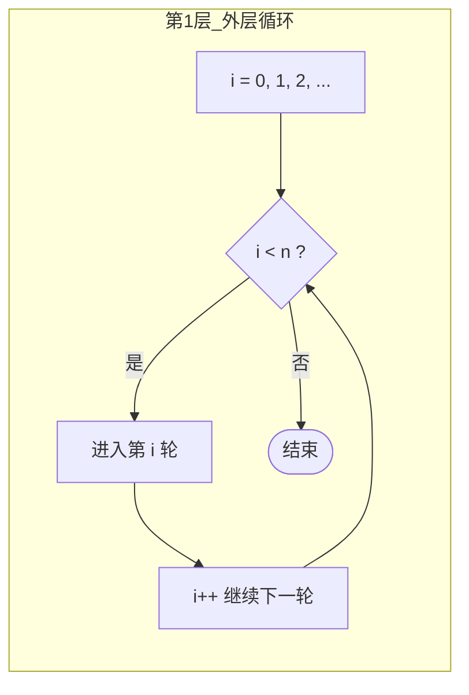
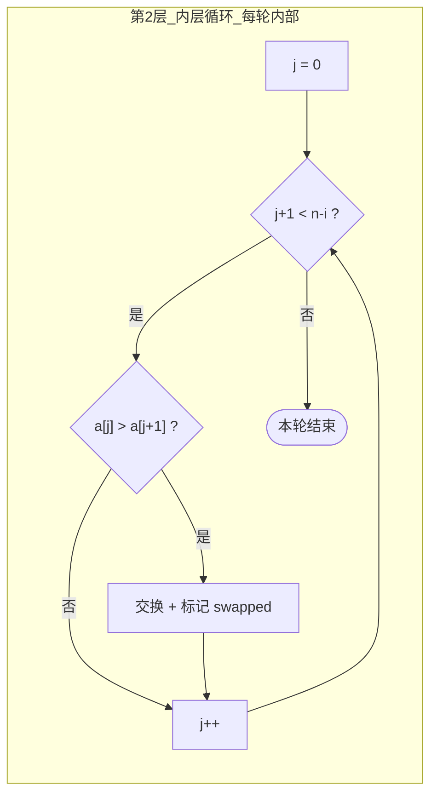
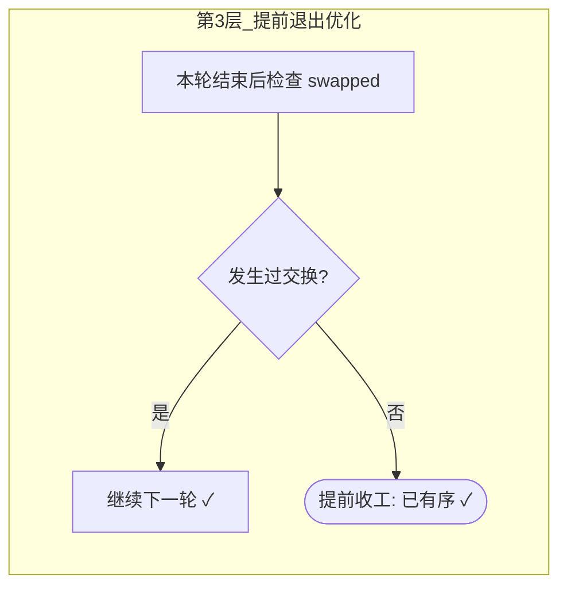

## C++ 排序算法实践：冒泡排序——相邻比较，大数后移

作者：Artificer老王  |  更新时间：2026-08-01  |  阅读时长：约 12 分钟

你第一次学排序，大概率是被冒泡排序领进门的。

它慢得离谱、工程里几乎没人用，却偏偏是算法课的第一课。

为什么？因为它**最符合人的直觉**：把**较大的元素**像**水底气泡上浮**一样，**每次和相邻的数比较、逆序就交换，一步步挪到数组末尾**，**最大的先到位、次大的跟着到位……全部浮完就排好了**。

看一遍就能复述，写一遍就能跑通。

---

## 🧠 它是什么

### 核心思想

**冒泡排序（Bubble Sort）** 是一种最基础的**比较排序**。

其工作原理就是反复遍历数组，每次比较相邻的两个元素，如果顺序不对就交换，直到整个数组有序。

每一轮遍历，当前未排好序部分里**最大的元素**会像气泡一样，一步步冒到它该在的位置。

它有以下三个特性：

- **原地排序（in-place）**：不需要额外开一个同规模数组。
- **稳定排序（stable）**：相等元素不交换，相对次序保持不变。
- **时间复杂度 O(n²)**：慢，这是它最大的短板。

### 伪代码

通过下面的伪代码先熟悉下冒泡排序的实现原理。

```text
算法 BubbleSort(A):
    输入: 数组 A[0..n-1]
    输出: 原地有序的 A
    for i = 0 to n-1:
        swapped = false
        for j = 0 to n-i-2:          // 已就位的 n-i 个不用再比
            if A[j] > A[j+1]:
                交换 A[j], A[j+1]
                swapped = true
        if swapped == false:          // 本轮无交换 → 已经有序
            break
```

核心就两层循环 + 一个 `swapped` 标志：**外层控制轮数，内层做相邻比较与交换，整轮没交换就提前收工**。

下面用流程图把这段伪代码拆开来看。

### 工作原理流程图

把上面的伪代码拆成三层，一层套一层：



外层骨架控制总共跑多少轮。

每轮开始时，数组末尾已经有 i 个元素坐稳了，不用再碰它们。



中间这层是干活的主力：从左到右扫描未排序部分，相邻两个逆序就换。

一轮跑下来，最大的那个自然被推到了最右边。



最后一层是最常见的优化：如果整整一轮都没交换过一次，说明数组已经有序了，没必要再跑后面的轮次，直接收工。

三张图拼起来就是完整算法：**外层控制轮数 → 内层做相邻比较交换 → 每轮结束检查是否可提前退出**。

### 逐趟演示

光看逻辑不够直观，下面用真实程序跑一遍 `[5, 3, 8, 4, 2]`，每轮把本轮最大的元素冒到末尾（用 `[x]` 标出已经坐稳的位置）：

```
初始  :  5   3   8   4   2
第 1 轮:  3   5   4   2  [8]      ← 8 最大，冒到末尾
第 2 轮:  3   4   2  [5] [8]      ← 5 冒到倒数第二
第 3 轮:  3   2  [4] [5] [8]      ← 4 落位
第 4 轮:  2  [3] [4] [5] [8]      ← 2 和 3 交换后也落位
第 5 轮: [2] [3] [4] [5] [8]      ← 本轮无交换，提前结束
```

注意最后一行：第 5 轮进入后内层循环范围为空（0 次比较），`swapped` 仍为 false，说明数组已经有序，于是直接收工。这个提前退出就是冒泡排序最常见的优化点，后面讲复杂度时会看到它的价值。

### 稳定性证明

前面给了一个标签叫稳定排序，这里补一个直观例子说明原因。

假设数组里有两组相等的元素，用下标区分它们：

```
初始:  [3a, 2, 3b, 1]     （3a 在 3b 前面）
```

冒泡排序的比较条件是严格大于（`>`），不是大于等于（`>=`）。所以当 3a 和 3b 相邻时：

```
比较 3a 和 3b:  3 > 3 为假 → 不交换 → 3a 仍然在 3b 前面
```

**只有严格逆序才触发交换，相等时不动** -- 这就是稳定性的来源。

如果你把比较条件从 `>` 改成 `>=`，稳定性就被破坏了，这是一个常见面试的问题（可以记录一下）。

---

## 🎯 能解决什么问题

### 适用场景

冒泡排序解决的是最朴素的问题：**把一个无序序列变成有序序列**。

它真正适合的场景其实不多，主要是代价低、好处大的几种：

| 场景 | 为什么适合 |
|------|-----------|
| **教学与算法入门** | 逻辑直白，是理解比较排序、稳定性、原地排序这些概念的最佳起点 |
| **几乎有序的小规模数据** | 如果数据本来就接近有序，提前退出优化能让它逼近 O(n)，比动规模子更划算 |
| **代码体积 / 实现成本极度敏感的环境** | 比如某些嵌入式裸机、笔试手写、面试白板 -- 三五行就能写完，不依赖任何库 |
| **需要稳定排序且数据量极小** | 它是稳定排序，且实现简单，数据量个位数时完全够用 |

📌 只有数据量很小或几乎已经有序时，才轮得到冒泡排序出场。

### 局限性

好处说完了，现在再泼冷水 -- **生产环境基本不该用冒泡排序**。

| 局限 | 说明 |
| --- | --- |
| **时间复杂度高** | 平均 / 最坏都是 O(n²)，数据量翻 10 倍，耗时翻约 100 倍 |
| **大量无效往返** | 最小的元素每次只能往前挪一格，排在末尾的最小值要 n-1 轮才能归位 |
| **缓存不友好** | 虽然顺序访问，但 O(n²) 的总操作量摆在那，大数组下完全跑不动 |
| **没有利用分治 / 局部性** | 比起快排、归并、堆排，它没有一次处理一大片的能力 |

什么时候**明确别用**：

- 数据量上千：直接用 `std::sort`（introsort，平均 O(n log n)）。
- 追求性能的关键路径：冒泡排序在任何规模下都不是最优解。
- 需要原地但又要快：选堆排序（O(n log n) 且原地）。

它的价值在理解，而不在使用。

---

## 💻 C++ 实现与复杂度分析

### 完整 C++ 实现

正式可编译的完整代码在 `src/cpp/algorithm/bubble_sort.cpp`（含逐轮演示与三个测试场景）。

排序核心函数如下：

```cpp
// 标准冒泡排序（带提前退出优化），原地排序
void bubbleSort(std::vector<int>& arr) {
    const size_t n = arr.size();
    for (size_t i = 0; i < n; ++i) {
        bool swapped = false;                 // 本轮是否发生过交换
        for (size_t j = 0; j + 1 < n - i; ++j) {
            if (arr[j] > arr[j + 1]) {        // 逆序 → 交换
                std::swap(arr[j], arr[j + 1]);
                swapped = true;
            }
        }
        if (!swapped) break;                  // 已有序，提前结束
    }
}
```

💡 内层循环的条件是 `j + 1 < n - i`，意味着 j 最大取到 `n - i - 2`，最后一次比较的是下标 `n - i - 2` 和 `n - i - 1` 这一对。也就是说，每轮结束后末尾有 i 个元素不再参与比较 -- 这是冒泡排序能少做一点活的关键。

### 时间复杂度怎么算

分析任何算法的复杂度，都可以按照下面的思路进行：

1. **找基本操作**：选一个随数据规模 n 增长且主导耗时的操作。排序里通常是一次比较（或一次交换）。
2. **数执行次数**：把基本操作的执行次数表示成关于 n 的函数 T(n)。
3. **取量级**：去掉常数系数和低阶项，用大 O 表示法只保留增长最快的那一项。

下面按照这个思路对冒泡排序的复杂度进行分析。

冒泡排序的基本操作是一次相邻比较。

- **内层循环**：第 i 轮（从 0 数起）比较 `n - 1 - i` 次。因为 j 从 0 跑到 `n - i - 2`，共 `n - i - 1` 次比较。
- **外层循环**最多跑 n 轮，所以总比较次数（最坏情况，没有提前退出）为：

```text
T(n) = (n-1) + (n-2) + (n-3) + ... + 1 + 0
     = n(n-1) / 2
     ≈ n² / 2
```

这是等差数列求和：首项 n-1、末项 0、项数 n，和 = n(首项+末项)/2 = n(n-1)/2。

`n²/2` 去掉常数系数 `1/2`，主导项是 `n²`，所以**时间复杂度是 O(n²)**。

按场景细分：

| 情况 | 比较次数 | 交换次数 | 时间复杂度 |
| --- | --- | --- | --- |
| 最好（已有序，带优化） | n-1 | 0 | **O(n)** |
| 最坏（完全逆序） | n(n-1)/2 | n(n-1)/2 | O(n²) |
| 平均（随机数据） | ≈ n²/4* | ≈ n²/4* | O(n²) |

注：平均情况的 n²/4 是一个近似值。精确的期望比较次数取决于输入分布；对于均匀随机排列且带提前退出的冒泡排序，实际期望值在 O(n²) 量级但系数小于 1/2。记住量级即可，不需要背精确系数。

- **最好情况 O(n)**：数组已经有序，第一轮做完 n-1 次比较后发现 `swapped == false`，直接 `break`，只跑了一轮。这就是提前退出优化的意义。
- **最坏 O(n²)**：完全逆序时每次比较都触发交换，提前退出永远用不上，老老实实跑满 n(n-1)/2 次比较。
- **平均 O(n²)**：随机数据下平均需要约 n/2 轮，每轮的工作量递减，总工作量仍在 O(n²) 量级。

### 空间复杂度怎么算

看额外开的内存是不是随 n 增长：

- 排序在原数组上原地完成，只用了 `i`、`j`、`swapped`、交换用的临时变量这几个**与 n 无关的标量**。
- 这些变量的空间是常数，不随数据规模变化。

所以**空间复杂度是 O(1)** -- 这也是原地排序的准确含义。

经过上述分析可以得出冒泡排序的复杂度为：**时间 O(n²)（最好 O(n)）、空间 O(1)、稳定、原地**。

---

## 📌 总结

- **冒泡排序是什么**：反复相邻比较、逆序就交换，每轮把最大元素冒到末尾，直到整体有序。
- **解决什么问题 / 用在哪**：把无序变有序，适合教学、几乎有序的小数据、极致简单的手写场景。
- **局限**：O(n²) 太慢，生产环境尽量别用，上千规模的排序直接上 `std::sort`就可以了。
- **复杂度怎么算**：找基本操作（比较）→ 数次数（等差数列求和 ∑(n-1-i) = n(n-1)/2）→ 去系数留主项得 O(n²)；空间只看额外变量，与 n 无关 → O(1)。

---

**完整可运行示例代码**：本文所有代码均已上传至 GitHub 仓库（os-artificer/ebooks）位于 `src/cpp/algorithm/` 目录。

文中的代码片段为**说明原理的伪代码**，正式可编译版本请查看 `src/cpp/algorithm/` 下对应的 `.cpp` 文件。

本文首发于公众号 **Artificer老王的学习笔记**，转载请注明出处。
