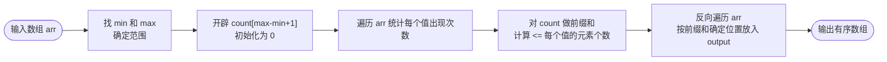
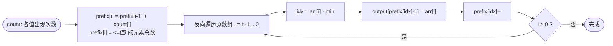

## C++ 排序算法实践：计数排序——不比较，直接数

作者：Artificer老王  |  更新时间：2026-08-01  |  阅读时长：约 11 分钟

假设你要给一个班级的考试成绩排名，分数范围是 0 到 100 分。

你不需要两两比较谁高谁低，只需要数一下：有几个 0 分、几个 1 分……几个 100 分，然后按顺序把分数"倒出来"就行了。

 这就是**计数排序（Counting Sort）**的思路：不通过元素之间的比较来确定顺序，而是统计每个值出现的次数，再根据计数结果直接输出有序序列。它是**非比较排序**的代表，当数据范围有限时可以做到真正的 O(n) 时间复杂度。

---

## 🧠 它是什么

### 核心思想

**先扫描一遍找出数据范围，开一个计数数组统计每个值出现的次数，然后通过前缀和计算每个元素的最终位置，反向遍历原数组把元素放到正确位置。**

"数数就行了，不用比。" —— 计数排序完全跳出了"比较-交换"的框架，用空间换时间。

### 为什么能突破 O(n log n)

基于比较的排序算法有一个理论下界：**O(n log n)**。

这是因为 n 个元素有 n! 种排列，每次比较只能排除一半的可能性，至少需要 log₂(n!) = O(n log n) 次比较。

但计数排序**不做比较**，所以不受这个下界约束。

代价是需要额外的计数数组，且数据范围不能太大。

### 伪代码

```cpp
// 仅为示意
function countingSort(arr):
    // Step 1: 找范围
    minVal = min(arr), maxVal = max(arr)
    k = maxVal - minVal + 1

    // Step 2: 计数
    count[k] = {0}
    for each x in arr:
        count[x - minVal]++

    // Step 3: 前缀和
    for i = 1 to k-1:
        count[i] += count[i - 1]

    // Step 4: 反向放置（保证稳定）
    for i = n-1 downto 0:
        idx = arr[i] - minVal
        output[count[idx] - 1] = arr[i]
        count[idx]--

    return output
```

下面用流程图拆解这四步的核心流程。

### 工作原理流程图

对应伪代码的整体流程：



前缀和与稳定放置：



### 逐步演示

用 `[4, 2, 2, 8, 3, 3, 1]` 跑一遍：

```
初始数组: [4, 2, 2, 8, 3, 3, 1]
数据范围: [1, 8] -> 计数数组大小 = 8

Step 1 - 计数数组 (下标+1 为实际值):
  [1]:1  [2]:2  [3]:2  [4]:1  [8]:1

Step 2 - 前缀和数组 (表示 <= 该值的元素个数):
  [1]:1  [2]:3  [3]:5  [4]:6  [8]:7

Step 3 - 输出数组: [1, 2, 2, 3, 3, 4, 8]
```

前缀和的含义：`prefix[2]=3` 表示值 <= 2 的元素有 3 个，所以最后一个 2 应该放在位置 2（下标 2）。

反向遍历保证了相同值的元素保持原始相对顺序。

---

## 🎯 能解决什么问题

### 适用场景

| 场景 | 为什么适合 |
|------|-----------|
| **整数排序且范围小** | 如年龄(1-100)、成绩(0-100)、考试编号等 |
| **作为基数排序的子过程** | 基数排序每一位就是用计数排序实现的 |
| **需要稳定线性时间排序** | 某些实时系统对延迟敏感 |

### 局限性

| 局限 | 说明 |
|------|------|
| **只适用于整数**（或可映射到整数） | 浮点数/字符串无法直接使用 |
| **数据范围不能太大** | 如果 max-min >> n，空间浪费严重 |
| **不是原地排序** | 需要额外 O(k) 的计数数组（k=数据范围） |
| **不适合通用场景** | 范围未知或范围很大时不如快排 |

### 稳定性

计数排序是**稳定的**。

关键在于：
1. 使用前缀和确定位置（而非简单重复输出）
2. **反向遍历**原数组（从右往左）

程序验证：

```
原始: (2,a) (3,x) (2,b) (1,y) (3,z)
排序后: (1,y) (2,a) (2,b) (3,x) (3,z)
```

(2,a) 在 (2,b) 前，(3,x) 在 (3,z) 前 —— 相等值的相对顺序完美保持。

---

## 💻 C++ 实现与复杂度分析

### 时间复杂度怎么算

按以下步骤进行分析与计算：

| 步骤 | 操作 | 复杂度 |
|------|------|--------|
| 找到 min/max | 遍历一次 | O(n) |
| 计数 | 遍历一次 | O(n) |
| 前缀和 | 遍历计数数组 | O(k) |
| 反向放置 | 遍历一次 | O(n) |

总计 = **O(n + k)**，其中 n 是元素个数，k 是数据范围。

| 情况 | 时间复杂度 | 条件 |
|------|-----------|------|
| 一般 | **O(n + k)** | 总是如此 |
| 当 k = O(n) 时 | **O(n)** | 数据范围与规模同阶 |
| 当 k >> n 时 | **O(k)** | 被 range 主导，退化为低效 |

这就是为什么说计数排序适合"范围小的整数"。

如果数据是 `[1, 1000000]`，要开一个百万大小的数组就不划算了。

### 空间复杂度

计数数组 size = k，输出数组 size = n → **O(n + k)**

📌 小结算法：**时间 O(n+k)、空间 O(n+k)、稳定、非比较类、仅适用于范围有限的整数**。

---

## 📌 总结

- **是什么**：统计每个值出现的次数，通过前缀和计算位置，直接输出有序序列。完全不依赖元素间的比较。
- **解决什么 / 用在哪**：小范围整数排序；基数排序的子过程；需要稳定线性时间的场景。
- **局限**：只适用于整数；数据范围大时空间浪费严重；不适合通用排序。
- **复杂度怎么算**：四步各 O(n) 或 O(k)，总计 O(n+k)。当 k=O(n) 时达到线性时间 O(n)，突破了比较排序 O(n log n) 的下界。空间 O(n+k)。

---

**完整可运行示例代码**：本文所有代码均已上传至 GitHub 仓库（os-artificer/ebooks）位于 `src/cpp/algorithm/` 目录。

文中的代码片段为**说明原理的伪代码**，正式可编译版本请查看 `src/cpp/algorithm/` 下对应的 `.cpp` 文件。

本文首发于公众号 **Artificer老王的学习笔记**，转载请注明出处。
