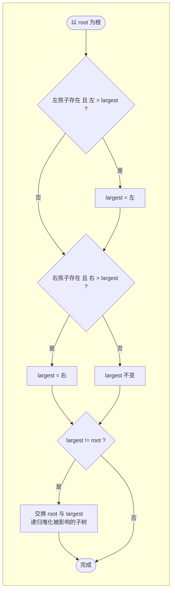
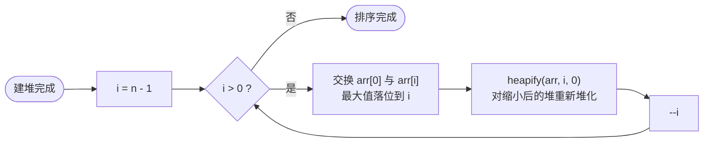

## C++ 排序算法实践：堆排序——建堆弹出，原地有序

作者：Artificer老王  |  更新时间：2026-08-01  |  阅读时长：约 12 分钟

想象一下比赛颁奖的流程。

先把所有选手的成绩建成一个排行榜（建堆），然后反复做一件事——把第一名请到领奖台（交换到末尾），剩下的人重新调整排名（堆化），再请新的第一名... 直到所有人都领完奖。

**堆排序（Heap Sort）** 利用的就是这个原理。

先把数组建成一个大顶堆（父节点 >= 子节点），然后把堆顶（当前最大值）交换到数组末尾，缩小堆范围重新堆化，重复直到堆中只剩一个元素。

它是 J.W.J. Williams 在 1964 年发明的，也是唯一一个同时达到 O(n log n) 和 O(1) 空间的比较类排序算法。

---

## 🧠 它是什么

### 核心思想

先建一个能快速找到最大值的结构，然后不断摘除最大值。
 
 堆排序的关键数据结构是**二叉堆**（Binary Heap），一种用数组模拟的完全二叉树。

### 二叉堆的性质

对于下标从 0 开始的数组：
- 父节点下标 `i` 的左孩子 = `2i + 1`
- 父节点下标 `i` 的右孩子 = `2i + 2`
- 孩子节点下标 `j` 的父节点 = `(j - 1) / 2`

大顶堆性质：每个节点的值 >= 它的左右孩子的值。因此**根节点（下标 0）一定是整个堆的最大值**。

### 伪代码

```cpp
// 仅为示意
function heapify(arr, n, root):
    largest = root
    left = 2 * root + 1
    right = 2 * root + 2
    if left < n and arr[left] > arr[largest]:
        largest = left
    if right < n and arr[right] > arr[largest]:
        largest = right
    if largest != root:
        swap(arr[root], arr[largest])
        heapify(arr, n, largest)   // 递归堆化受影响的子树

function heapSort(arr, n):
    // 第一步：建堆
    for i = n/2 - 1 downto 0:
        heapify(arr, n, i)
    // 第二步：逐次弹出
    for i = n-1 downto 1:
        swap(arr[0], arr[i])      // 最大值到末尾
        heapify(arr, i, 0)        // 重新堆化
```

下面用流程图拆解这段伪代码的建堆、堆化和排序主循环。

### 工作原理流程图

对应伪代码的建堆过程（从最后一个非叶子节点开始自底向上）：

```mermaid
flowchart LR
    A([开始建堆]) --> B[i = n/2 - 1<br/>最后一个非叶子节点]
    B --> C{i >= 0 ?}
    C -->|否| D([建堆完成])
    C -->|是| E[heapify(arr, n, i)<br/>以 i 为根堆化]
    E --> F[--i]
    F --> C
```

堆化（sift down，下沉操作）：



排序主循环：



### 逐趟演示

用 `[9, 4, 7, 1, 3, 6, 8, 2, 5]`（n=9）跑一遍：

```
初始数组: [9, 4, 7, 1, 3, 6, 8, 2, 5]

--- 第一步: 建堆 ---
建堆完成(大顶堆): [9, 5, 8, 4, 3, 6, 7, 2, 1]
  (此时根节点 9 是最大值)

--- 第二步: 逐次弹出 ---
弹出 9 到位置 8, 堆=[8,5,7,4,3,6,1,2] 已排=[9]
弹出 8 到位置 7, 堆=[7,5,6,4,3,2,1]   已排=[8,9]
弹出 7 到位置 6, 堆=[6,5,2,4,3,1]     已排=[7,8,9]
弹出 6 到位置 5, 堆=[5,4,2,1,3]       已排=[6,7,8,9]
弹出 5 到位置 4, 堆=[4,3,2,1]         已排=[5,6,7,8,9]
弹出 4 到位置 3, 堆=[3,1,2]           已排=[4,5,6,7,8,9]
弹出 3 到位置 2, 堆=[2,1]             已排=[3,4,5,6,7,8,9]
弹出 2 到位置 1, 堆=[1]               已排=[2,3,4,5,6,7,8,9]

最终结果: [1, 2, 3, 4, 5, 6, 7, 8, 9]
总比较: 31 | 总交换: 21
```

每轮把当前最大值从堆顶"弹"到数组末尾，堆的范围缩小一位。

整个过程不需要任何额外数组。

---

## 🎯 能解决什么问题

### 适用场景

| 场景 | 为什么适合 |
|------|-----------|
| **空间严格受限** | O(1) 额外空间，不像归并要 O(n) |
| **需要保证 O(n log n) 上界** | 不会像快排那样退化到 O(n²) |
| **实时系统/嵌入式** | 无递归（可写成迭代版本）、性能可预测 |
| **求 Top K 问题** | 只需建堆 + 弹出 K 次，不需要全排序 |

### 局限性

| 局限 | 说明 |
|------|------|
| **不稳定** | 堆化时的长距离交换破坏相等元素的顺序 |
| **常数因子较大** | 实际速度通常不如快排（尤其是缓存不友好） |
| **不是自适应的** | 对近有序的数据没有优化，始终 O(n log n) |

### 与快排/归并的横向对比

| 特征 | 快速排序 | 归并排序 | 堆排序 |
|------|---------|---------|--------|
| 平均时间 | O(n log n) | O(n log n) | O(n log n) |
| 最坏时间 | O(n²) | O(n log n) | **O(n log n)** |
| 空间 | O(log n) 栈 | O(n) 数组 | **O(1)** |
| 稳定 | 否 | 是 | 否 |
| 缓存友好 | 高 | 中 | 低（跳跃访问） |
| 实际速度 | 最快 | 中等 | 较慢 |

堆排序的独特价值：**O(n log n) + O(1) 空间** 这个组合只有它能做到（在比较类排序中）。

---

## 💻 C++ 实现与复杂度分析

### 时间复杂度怎么算

**建堆的时间复杂度：O(n)**

这不是显而易见的。

虽然单次 heapify 是 O(log n)，但不同层的节点数不同：
- 底层节点多但 heapify 路径短（几乎不做事）
- 顶层节点少但路径长

精确计算：∑(n/2^(h+1)) × O(h) = O(n)。

这是一个经典的结论：建堆是线性时间。

**排序阶段的时间复杂度：O(n log n)**

循环 n-1 次，每次 heapify 最多 O(log n)（堆的高度），总计： **O(n log n)**。

由于建堆 O(n) 被 O(n log n) 吞没，总复杂度 = **O(n log n)**。

而且这个复杂度是**固定的**。

不管输入是什么分布，堆排序都是 O(n log n)。

程序验证：

| 输入 | 比较 | 交换 |
|------|------|------|
| 一般乱序（9 个元素） | 31 | 21 |
| 已有序（5 个元素） | 12 | 10 |

| 情况 | 时间复杂度 |
|------|-----------|
| 最好 | **O(n log n)** |
| 最坏 | **O(n log n)** |
| 平均 | **O(n log n)** |

### 空间复杂度怎么算

如果 heapify 用递归实现，栈空间 O(log n)。

改成迭代版本后，只用几个标量变量 → **O(1)**。

📌 小结算法：**时间 O(n log n)（三档一致）、空间 O(1)、不稳定、原地、最坏情况仍保证 O(n log n)**。

---

## 📌 总结

- **是什么**：先建大顶堆（线性时间），再反复将堆顶（最大值）交换到末尾并重新堆化。
- **解决什么 / 用在哪**：空间受限场景的 O(n log n) 排序，Top K 问题，嵌入式/实时系统的可靠选择。
- **局限**：不稳定，缓存不友好导致实际速度不如快排，对近有序数据没有优化。
- **复杂度怎么算**：建堆 O(n)（精确推导，非直觉的线性），排序阶段 n 轮 × 每次 O(log n) 堆化 = O(n log n)。三档一致，不会退化。

---

**完整可运行示例代码**：本文所有代码均已上传至 GitHub 仓库（os-artificer/ebooks）位于 `src/cpp/algorithm/` 目录。

文中的代码片段为**说明原理的伪代码**，正式可编译版本请查看 `src/cpp/algorithm/` 下对应的 `.cpp` 文件。

本文首发于公众号 **Artificer老王的学习笔记**，转载请注明出处。
