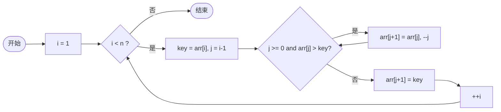
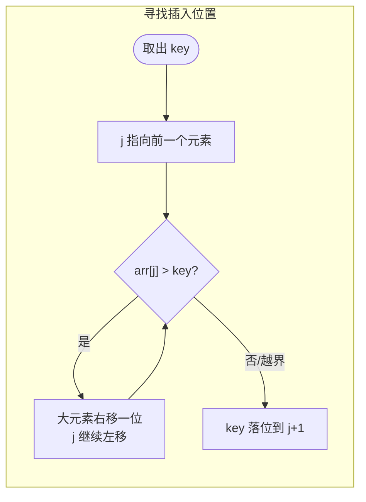

## C++ 排序算法实践：插入排序——像整理扑克牌一样逐张归位

作者：Artificer老王  |  更新时间：2026-08-01  |  阅读时长：约 11 分钟

你打扑克牌的时候是怎么理牌的？

摸一张，拿在手里，往已有的牌里插到一个合适的位置。

再摸一张，再插进去…… 不需要扫全场，只需要跟手里已有的几张比一比就能找到位置。

这就是**插入排序（Insertion Sort）** 的核心思想。

把数组分成"已排序区"和"未排序区"，每次取未排序区的第一个元素，在已排序区里找到合适的位置插进去。

它是唯一一个在"数据几乎有序"时能跑到 O(n) 的简单排序算法。

---

## 🧠 它是什么

### 核心思想

**维护一个已排序的前缀，每次取下一个新元素，通过不断与前面的元素比较并右移，腾出空位后把自己插进去。**

像整理扑克牌：手里的牌永远是有序的，新来的牌只需往后找自己的位置。 

插入排序的本质就是维护一个动态增长的有序序列。

### 伪代码

```cpp
// 仅为示意
for i = 1 to n-1:
    key = arr[i]
    j = i - 1
    while j >= 0 and arr[j] > key:
        arr[j + 1] = arr[j]
        j = j - 1
    arr[j + 1] = key
```

注意 `while` 条件用的是 `>`（严格大于），这是稳定性的来源。

下面用流程图拆解这段伪代码。

### 工作原理流程图

整体骨架（对应伪代码的外层 for 循环）：



内层"寻找插入位置"的过程：



### 逐趟演示

用 `[5, 3, 8, 4, 2]` 跑一遍，看每张"新牌"如何插入：

```
初始数组: [5, 3, 8, 4, 2]

第 1 趟 (插入 3): 已排序 [3,5] | 未排序 [8,4,2]
       取出 3，5 比 3 大所以右移，3 落位到位置 0

第 2 趟 (插入 8): 已排序 [3,5,8] | 未排序 [4,2]
       取出 8，8 已经比 5 大，直接落在位置 2，不用移动

第 3 趟 (插入 4): 已排序 [3,4,5,8] | 未排序 [2]
       取出 4，5 和 8 都比 4 大依次右移，4 落位到位置 1

第 4 趟 (插入 2): 已排序 [2,3,4,5,8] | 未排序 []
       取出 2，3/4/5/8 都比 2 大全部右移，2 落位到位置 0

最终结果: [2, 3, 4, 5, 8]
```

注意第 2 趟：8 不需要任何移动就直接落位了。

这就是插入排序的优势所在——**如果新元素已经在正确位置附近，工作量很小**。

---

## 🎯 能解决什么问题

### 适用场景

| 场景 | 为什么适合 |
|------|-----------|
| **小规模数据（n < 50）** | 常数因子极小，实际运行往往比递归的快排还快 |
| **几乎有序的数据** | 最佳情况 O(n)，已有顺序越多越快 |
| **在线排序** | 数据流式到达，每来一个就能插入已有序的部分 |
| **作为其他算法的子过程** | 快排小区间优化、希尔排序的增量=1 阶段都用到它 |

### 局限性

| 局限 | 说明 |
|------|------|
| **平均/最坏 O(n²)** | 逆序时每个元素都要移到最前面，退化为平方级 |
| **大量数据时不适用** | n 超过几千就应该考虑更高效的算法 |

### 与其他算法的对比

| 特征 | 冒泡排序 | 选择排序 | 插入排序 |
|------|---------|---------|---------|
| 最好情况 | O(n)（带优化） | O(n²) | **O(n)** |
| 最坏情况 | O(n²) | O(n²) | O(n²) |
| 稳定 | 稳定 | 不稳定 | **稳定** |
| 每轮操作 | 多次相邻交换 | 最多 1 次交换 | 多次移动 |
| 对近有序敏感 | 是（可提前退出） | 否 | **非常敏感** |

### 稳定性证明

插入排序是稳定的。

因为内层循环的条件是 `arr[j] > key`（严格大于），遇到相等的元素就停止移动，不会越过相等元素。

程序输出验证：

```
原始: (3,a) (2,x) (2,y) (1,b)
排序后: (1,b) (2,x) (2,y) (3,a)
```

(2,x) 仍然在 (2,y) 前面，相对顺序保持不变。

---

## 💻 C++ 实现与复杂度分析

### 通用 C++ 模板实现

插入排序只依赖比较运算符 `>` 和 `std::move`，适用于任意可比较且可移动类型：

```cpp
#include <utility>   // std::move
#include <vector>

template <typename T>
void insertionSort(std::vector<T>& arr) {
    int n = static_cast<int>(arr.size());
    for (int i = 1; i < n; ++i) {
        T key = std::move(arr[i]);
        int j = i - 1;
        while (j >= 0 && arr[j] > key) {
            arr[j + 1] = std::move(arr[j]);
            --j;
        }
        arr[j + 1] = std::move(key);
    }
}
```

### 时间复杂度怎么算

**基本操作是比较**（`arr[j] > key`）和**移动**（赋值操作）。

按以下三种情况分析：

**最好情况（已有序）：**

每轮只需 1 次比较（key 直接比前一个大），内层 while 不进入。共 n-1 轮，总计 **n-1 次比较**。

加上取 key 和落位的赋值，总工作量与 n 成正比 → **O(n)**。

程序验证：已有序 `[1,2,3,4,5]` 只需 4 次比较、8 次移动。

**最坏情况（完全逆序）：**

第 i 轮（i 从 1 到 n-1）需要 i 次比较和 i+2 次移动（取 key + i 次右移 + 落位）。

总比较 = 1 + 2 + ... + (n-1) = n(n-1)/2 → **O(n²)**

总移动 = 3 + 4 + ... + (n+1) = n(n-1)/2 + 2(n-1) → **O(n²)**

程序验证：逆序 `[5,4,3,2,1]` 需要 10 次比较、18 次移动。

**平均情况（随机排列）：**

期望比较次数约为 n²/4，期望移动次数约为 n²/4 → **O(n²)**

| 情况 | 比较次数 | 移动次数 | 时间复杂度 |
|------|---------|---------|-----------|
| 最好（已有序） | n-1 | 2(n-1) | **O(n)** |
| 最坏（逆序） | n(n-1)/2 | ~n²/2 | **O(n²)** |
| 平均（随机） | ≈ n²/4* | ≈ n²/4* | **O(n²)** |

注：平均值为近似值，精确期望取决于输入分布，记住 O(n²) 量级即可。

### 空间复杂度怎么算

只用 `key`、`j` 几个标量，额外空间与 n 无关 → **O(1)**，原地排序。

📌 小结算法：**时间 O(n²)（最好 O(n)）、空间 O(1)、稳定、原地、对近有序极度友好**。

---

## 📌 总结

- **是什么**：维护已排序前缀，每次取下一个元素通过比较+右移找到合适位置插入。
- **怎么演示**：用两张分层流程图看清骨架+内层插入过程；用 `[5,3,8,4,2]` 的逐趟输出看到"大元素右移腾位、key 落位"的核心动作。
- **解决什么 / 用在哪**：把无序变有序；特别适合小数据和几乎有序的场景；是快排小区间优化的标配子算法。
- **局限**：逆序时退化到 O(n²)；大规模数据需要更高效的算法。
- **复杂度怎么算**：最好 O(n)（已有序，每轮只比 1 次）；最坏/平均 O(n²)（等差数列求和）；空间 O(1)。严格大于保证稳定性。
- **系列定位**：三大简单排序中最实用的一个。下一篇希尔排序就是它的升级版——通过分组插入突破 O(n²) 的天花板。

---

**完整可运行示例代码**：本文所有代码均已上传至 GitHub 仓库（os-artificer/ebooks）位于 `src/cpp/algorithm/` 目录。

文中的代码片段为**说明原理的伪代码**，正式可编译版本请查看 `src/cpp/algorithm/` 下对应的 `.cpp` 文件。

本文首发于公众号 **Artificer老王的学习笔记**，转载请注明出处。
