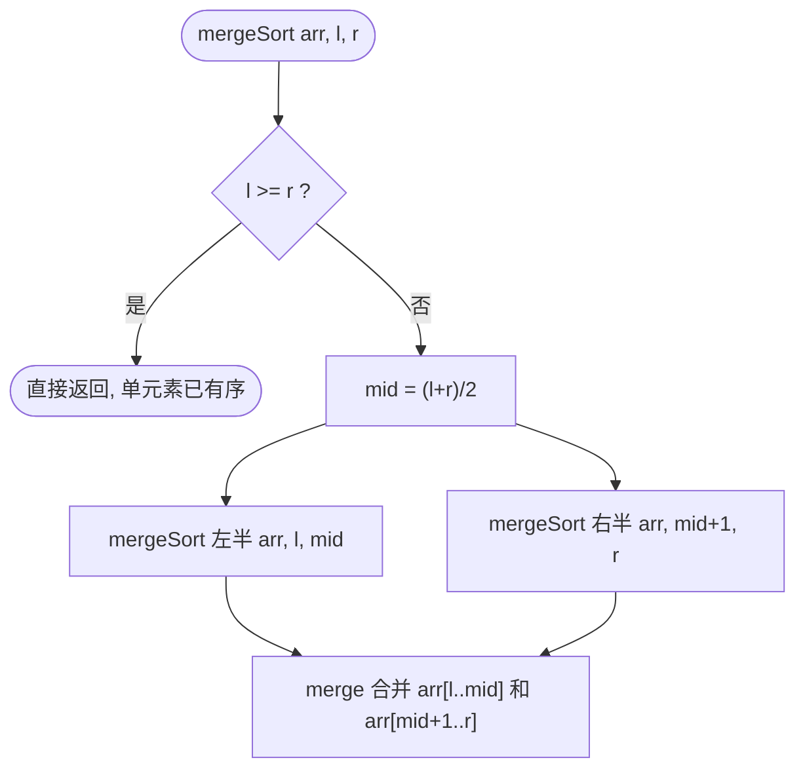
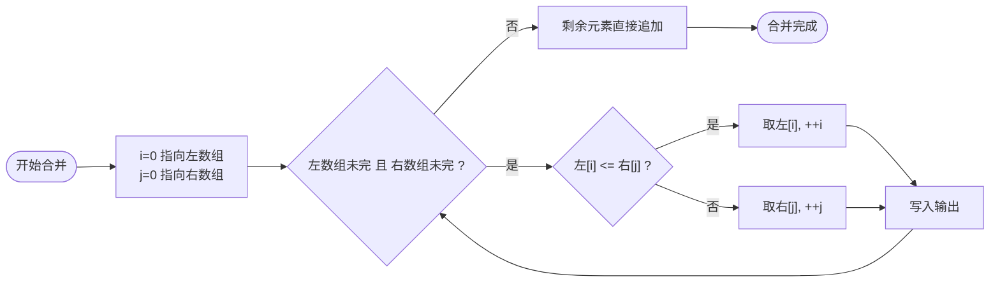

## C++ 排序算法实践：归并排序——分而治之，有序合并

作者：Artificer老王  |  更新时间：2026-08-01  |  阅读时长：约 13 分钟

假设你要把两摞已经各自排好序的扑克牌合并成一摞有序的，怎么做？

很简单：每次看两张顶牌，选小的那张翻到新摞里。

重复这个过程直到两摞都空了为止，新摞自然就是有序的。

**归并排序（Merge Sort）** 就是这个思路的递归版：先把数组一分为二，分别排序，再把两个有序的半数组合并。

它是最经典的"分治法"（Divide and Conquer）排序算法，由 John von Neumann 在 1945 年提出。

---

## 🧠 它是什么

### 核心思想

递归地把数组从中间切开，对左右两半分别排序，然后把两个有序子数组合并成一个。

分解直到只剩一个元素（天然有序），然后自底向上逐层合并。

分治法的标准范式：先拆到不能再拆，再按规则合并（两个有序序列合并很简单）。

### 伪代码

```cpp
// 仅为示意
function mergeSort(arr, left, right):
    if left >= right: return
    mid = (left + right) / 2
    mergeSort(arr, left, mid)       // 排序左半
    mergeSort(arr, mid+1, right)    // 排序右半
    merge(arr, left, mid, right)    // 合并

function merge(arr, left, mid, right):
    复制 arr[left..mid] 到 leftArr
    复制 arr[mid+1..right] 到 rightArr
    i = j = 0, k = left
    while 左右数组都没取完:
        if leftArr[i] <= rightArr[j]:
            arr[k++] = leftArr[i++]
        else:
            arr[k++] = rightArr[j++]
    把剩余元素追加到 arr
```

下面用流程图拆解这段伪代码的分治递归结构与合并过程。

### 工作原理流程图

对应伪代码的分治递归结构：



合并两个有序子数组：



### 分治演示

用 `[38, 27, 43, 3, 9, 82, 10]` 跑一遍完整的分解与合并过程：

```
初始数组: [38, 27, 43, 3, 9, 82, 10]

分解 [0..6] -> [0..3] + [4..6]                            ← 第一层拆分
  分解 [0..3] -> [0..1] + [2..3]                          ← 第二层拆分
    分解 [0..1] -> [0..0] + [1..1]                        ← 到达基例
    合并 [0..0] + [1..1]: [38] + [27] -> [27,38]          ← 开始回溯合并
    分解 [2..3] -> [2..2] + [3..3]                        ← 到达基例
    合并 [2..2] + [3..3]: [43] + [3] -> [3,43]            ← 合并
  合并 [0..1] + [2..3]: [27,38] + [3,43] -> [3,27,38,43]  ← 合并左半区

  分解 [4..6] -> [4..5] + [6..6]                          ← 第二层拆分
    分解 [4..5] -> [4..4] + [5..5]                        ← 到达基例
    合并 [4..4] + [5..5]: [9] + [82] -> [9,82]            ← 合并
  合并 [4..5] + [6..6]: [9,82] + [10] -> [9,10,82]        ← 合并右半区

合并 [0..3] + [4..6]: [3,27,38,43] + [9,10,82] -> [3,9,10,27,38,43,82]  ← 最终合并

最终结果:  [3, 9, 10, 27, 38, 43, 82]
总比较次数: 14
```

注意观察：每次合并的两个子数组都是**各自有序**的，所以合并过程只需要线性扫描。

---

## 🎯 能解决什么问题

### 适用场景

| 场景 | 为什么适合 |
|------|-----------|
| **大数据量排序** | 稳定的 O(n log n)，不依赖数据分布 |
| **外部排序** | 数据量大到无法全部装入内存时，可以分段归并（数据库常用） |
| **稳定排序需求** | 需要保持相等元素原始顺序的场景（如按多级关键字排序） |
| **链表排序** | 归并排序对链表很友好，不需要随机访问 |

### 局限性

| 局限 | 说明 |
|------|------|
| **空间 O(n)** | 需要额外的辅助数组做合并，不是原地排序 |
| **常数因子较大** | 实际运行速度通常比快排慢一些（数据拷贝开销） |
| **对小数据过重** | n 很小时递归和数组拷贝的开销占比高 |

### 稳定性

归并排序是**稳定的**。

在合并过程中，当左右两边当前元素相等时，优先取左边（`left[i] <= right[j]`），这样相等元素的相对顺序不会改变。

---

## 💻 C++ 实现与复杂度分析

### 通用 C++ 模板实现

归并排序只依赖比较运算符 `<=`，适用于任意可比较类型。合并过程需要临时数组，空间 O(n)：

```cpp
#include <utility>   // std::move
#include <vector>

template <typename T>
void merge(std::vector<T>& arr, int left, int mid, int right) {
    std::vector<T> leftArr(arr.begin() + left, arr.begin() + mid + 1);
    std::vector<T> rightArr(arr.begin() + mid + 1, arr.begin() + right + 1);

    int i = 0, j = 0, k = left;
    while (i < static_cast<int>(leftArr.size()) &&
           j < static_cast<int>(rightArr.size())) {
        if (leftArr[i] <= rightArr[j])        // <= 保证稳定性
            arr[k++] = std::move(leftArr[i++]);
        else
            arr[k++] = std::move(rightArr[j++]);
    }
    while (i < static_cast<int>(leftArr.size()))
        arr[k++] = std::move(leftArr[i++]);
    while (j < static_cast<int>(rightArr.size()))
        arr[k++] = std::move(rightArr[j++]);
}

template <typename T>
void mergeSortImpl(std::vector<T>& arr, int left, int right) {
    if (left >= right) return;
    int mid = left + (right - left) / 2;
    mergeSortImpl(arr, left, mid);
    mergeSortImpl(arr, mid + 1, right);
    merge(arr, left, mid, right);
}

// 包装函数
template <typename T>
void mergeSort(std::vector<T>& arr) {
    if (!arr.empty())
        mergeSortImpl(arr, 0, static_cast<int>(arr.size()) - 1);
}
```

### 时间复杂度怎么算

用**递归树分析法**：

每一层的工作量是 O(n)（每个元素在该层恰好参与一次合并）。

递归树的高度是多少？

每次把问题规模减半，直到 size=1 → 高度 = log₂n。

总工作量 = 每层工作量 × 层数 = **O(n) × O(log n) = O(n log n)**

这个复杂度是**固定的**，不受输入数据影响。

程序验证：

| 输入 | 比较次数 |
|------|---------|
| 一般乱序 `[38,27,43,3,9,82,10]` | 14 |
| 已有序 `[1,2,3,4,5,6,7]` | 11 |
| 完全逆序 `[7,6,5,4,3,2,1]` | 9 |

三种情况的比较次数都在同一量级（n log n 的常数倍附近），不会像冒泡、选择那样出现数量级的差异。

| 情况 | 时间复杂度 |
|------|-----------|
| 最好 | **O(n log n)** |
| 最坏 | **O(n log n)** |
| 平均 | **O(n log n)** |

三种情况完全一致，这是归并排序的一大优势（性能可预测）。

### 空间复杂度怎么算

合并步骤需要临时数组存储左右两部分。

最大额外空间 = 整个数组的副本 → **O(n)**。

如果用链表实现，可以在合并时通过修改指针完成，空间可以降到 O(1)。

但数组版本的标准实现需要 O(n)。

📌 小结算法：**时间 O(n log n)（三档一致）、空间 O(n)、稳定、非原地、分治经典范式**。

---

## 📌 总结

- **是什么**：递归二分数组，分别排序后合并；分治法的教科书级应用。
- **解决什么 / 用在哪**：大数据量稳定排序；外部排序的基础；链表排序的首选。
- **局限**：需要 O(n) 额外空间；对小数据有过度设计之嫌；实际速度略逊于快排。
- **复杂度怎么算**：递归树分析 —— 每层 O(n)、共 log₂n 层 → O(n log n)。三档一致，性能可预测。空间 O(n) 用于辅助合并数组。

---

**完整可运行示例代码**：本文所有代码均已上传至 GitHub 仓库（os-artificer/ebooks）位于 `src/cpp/algorithm/` 目录。

文中的代码片段为**说明原理的伪代码**，正式可编译版本请查看 `src/cpp/algorithm/` 下对应的 `.cpp` 文件。

本文首发于公众号 **Artificer老王的学习笔记**，转载请注明出处。
