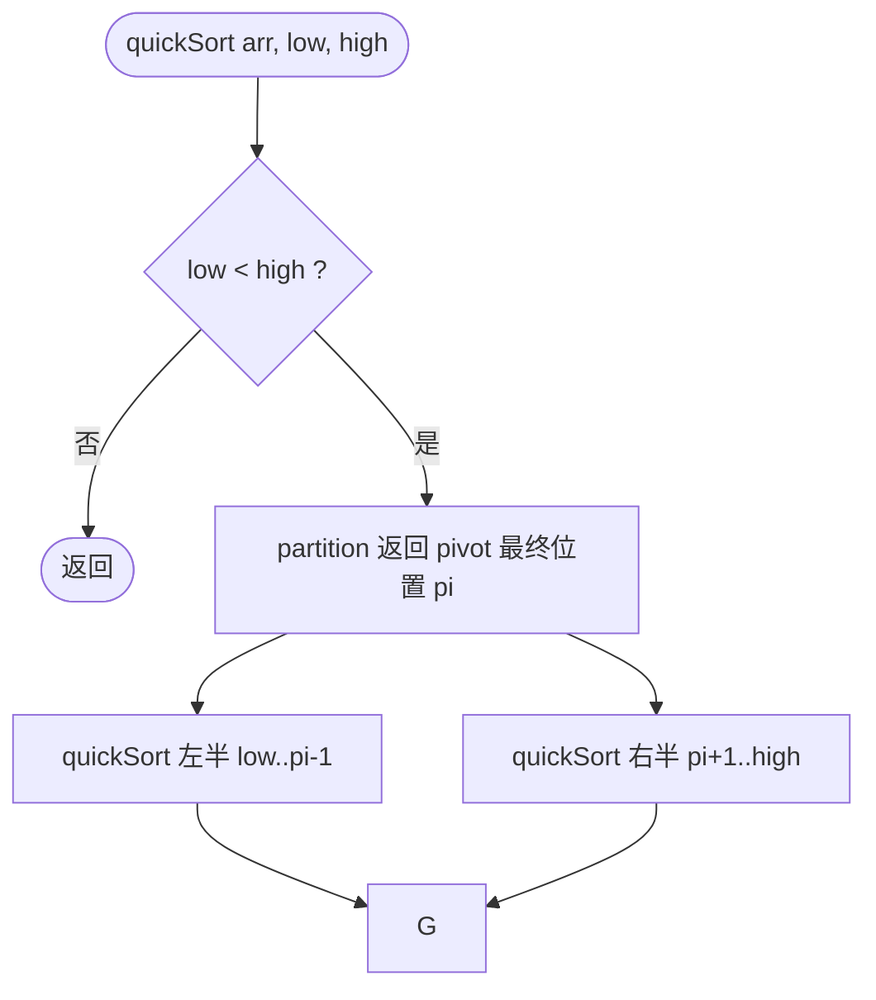
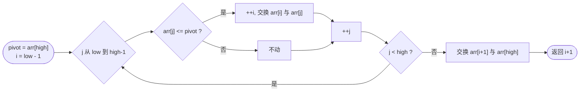

## C++ 排序算法实践：快速排序——选基准，分区，递归征服

作者：Artificer老王  |  更新时间：2026-08-01  |  阅读时长：约 13 分钟

你组织活动分组的时候有没有用过这招：随便找个人站出来当基准，比他瘦的站左边，比他胖的站右边，然后对左右两组重复同样的操作... 几轮下来所有人就按体重排好了。

这个思路就是**快速排序（Quick Sort）** ：选一个基准值（pivot），把数组分成"小于等于 pivot"和"大于 pivot"的两部分，然后对两部分递归排序。

它由 Tony Hoare 在 1960 年发明，是目前实践中使用最广泛的通用排序算法。

C++ 的 `std::sort`、Java 的 `Arrays.sort()` 底层都是它的变种。

---

## 🧠 它是什么

### 核心思想

选一个 pivot，通过一趟扫描把数组分成两部分：左边 <= pivot，右边 > pivot。

然后对左右两部分递归执行同样的操作。

"选个代表，小的站左边大的站右边，然后各组自己再选代表继续分。" 

快速排序的核心操作叫"分区（Partitioning）"，整个算法就是不断分区。

### 为什么快

和归并排序对比：

| 特征 | 归并排序 | 快速排序 |
|------|---------|---------|
| 策略 | 先分后合（一定均分） | 先分区后递归（不一定均分） |
| 递归方向 | 自顶向下分解，自底向上合并 | 自顶向下分区，每步确定一个元素位置 |
| 额外空间 | O(n) 辅助数组 | **O(log n) 递归栈**（原地分区） |
| 核心操作 | 合并两个有序数组 | 单趟分区 |

快速排序的优势在于**分区是原地的**（不需要额外数组），而且如果 pivot 选得好，每轮都能把问题规模大致减半。

### 伪代码

```cpp
// 仅为示意
function partition(arr, low, high):
    pivot = arr[high]          // 选最后一个做 pivot
    i = low - 1
    for j = low to high - 1:
        if arr[j] <= pivot:
            i++
            swap(arr[i], arr[j])
    swap(arr[i + 1], arr[high])
    return i + 1               // pivot 的最终位置

function quickSort(arr, low, high):
    if low < high:
        pi = partition(arr, low, high)
        quickSort(arr, low, pi - 1)
        quickSort(arr, pi + 1, high)
```

下面用流程图拆解这段伪代码的递归分区结构。

### 工作原理流程图

对应伪代码的整体骨架：



Lomuto 分区方案（选最右元素为 pivot）：



### 分区演示

用 `[10, 7, 8, 9, 1, 5]` 跑一遍 Lomuto 分区方案：

```
初始数组: [10, 7, 8, 9, 1, 5]

分区 [0..5], pivot=5
  -> pivot 5 落位 1: [1] [5] [8,9,10,7]
左半区 [0..0] | 右半区 [2..5]

  分区 [2..5], pivot=7
    -> pivot 7 落位 2: [] [7] [9,10,8]
  左半区 [2..1] | 右半区 [3..5]

    分区 [3..5], pivot=8
      -> pivot 8 落位 3: [] [8] [10,9]
    左半区 [3..2] | 右半区 [4..5]

      分区 [4..5], pivot=9
        -> pivot 9 落位 4: [] [9] [10]
      左半区 [4..3] | 右半区 [5..5]

最终结果: [1, 5, 7, 8, 9, 10]
总比较: 11 | 总交换: 5
```

每一步确定一个 pivot 的最终位置，这就是"快速"的含义——每轮至少让一个元素到位。

---

## 🎯 能解决什么问题

### 适用场景

| 场景 | 为什么适合 |
|------|-----------|
| **通用排序首选** | 平均 O(n log n) 常数因子小，实际最快 |
| **内存受限环境** | 原地排序，只需 O(log n) 栈空间 |
| **缓存友好** | 顺序访问模式，CPU 缓存命中率高 |

### 局限性

| 局限 | 说明 |
|------|------|
| **不稳定** | 分区的交换操作会跨越相等元素 |
| **最坏 O(n²)** | 已有序或逆序数据 + Lomuto 方案会退化 |
| **依赖 pivot 选择** | pivot 选不好会导致严重不平衡 |

### 最坏情况与优化

程序验证了 Lomuto 方案的最坏情况。

验证程序位于 `src/cpp/algorithm/quick_sort.cpp`（编译命令 `make bin/quick_sort`）。

使用三组数据样本：一般乱序 `[10,7,8,9,1,5]`、已有序 `[1,2,3,4,5]`、完全逆序 `[5,4,3,2,1]`。

以下数据均来自程序实际输出：

| 输入 | 比较 | 交换 |
|------|------|------|
| 一般乱序 | 11 | 5 |
| 已有序（Lomuto 最坏） | 10 | 4 |
| 完全逆序 | 10 | 4 |

看起来数字差不多？那是因为 n=6 太小了。

当 n=10000 时：
- 最坏情况比较 ≈ n²/2 = 5000 万次
- 平均情况比较 ≈ n log n ≈ 13 万次

差距是百倍级的！

工程上常用的优化手段可参考如下：

| 优化方法 | 解决什么问题 |
|---------|------------|
| **随机化 pivot** | `swap(arr[rand()], arr[high])`，避免恶意输入触发最坏情况 |
| **三数取中** | 取首/中/末的中位数做 pivot，更稳健 |
| **小区间插入排序** | 当子数组长度 < 16 时切换到插入排序，减少递归开销 |
| **三路分区** | 把数组分成 < pivot / = pivot / > pivot 三段，处理大量重复元素 |

C++ `std::sort` 通常结合了内省排序（Introsort）：快排 + 堆排序兜底（防止退化）+ 插入排序收尾。

---

## 💻 C++ 实现与复杂度分析

### 时间复杂度怎么算

**基本操作是比较**（`arr[j] <= pivot`）。

关键在于**分区是否均衡**：

**最好情况（每次 pivot 都在中位数位置）：**
每轮把问题分成大致相等的两半。递归树高度 = log₂n，每层工作量 O(n)。
总计 **O(n log n)**。

**最坏情况（每次 pivot 都是最小或最大）：**
比如已有序数组 + Lomuto 选最后一个做 pivot：每次只减少一个元素。递归树高度 = n，第 i 层工作量 = n-i。
总计 = n + (n-1) + ... + 1 = **O(n²)**。

**平均情况（pivot 期望落在中间某个位置）：**
数学期望可以证明为 **O(n log n)**。且常数因子比归并排序小，所以实际运行更快。

| 情况 | 时间复杂度 | 条件 |
|------|-----------|------|
| 最好 | **O(n log n)** | 每次均匀分区 |
| 最坏 | **O(n²)** | 每次极不均匀分区（如已有序 + Lomuto） |
| 平均 | **O(n log n)** | 随机输入 |

### 空间复杂度怎么算

分区本身是原地的（O(1) 额外空间）。但递归调用需要栈空间：
- 最好/平均：递归深度 O(log n) → **O(log n)**
- 最坏：递归深度 O(n) → **O(n)**

📌 小结算法：**时间平均 O(n log n)（最坏 O(n²)）、空间 O(log n) 栈、不稳定、原地分区、实践中最快的通用排序**。

---

## 📌 总结

- **是什么**：选 pivot 分区成大小两半，递归处理。核心操作是一趟原地分区。
- **解决什么 / 用在哪**：通用排序的事实标准；`std::sort` 的核心；缓存友好的原地排序。
- **局限**：不稳定；最坏退化为 O(n²)；pivot 选择敏感。
- **复杂度怎么算**：取决于分区质量。均衡时递归树高 log₂n → O(n log n)；极端不均衡时退化为 O(n²)。空间是递归栈 O(log n)~O(n)。

---

**完整可运行示例代码**：本文所有代码均已上传至 GitHub 仓库（os-artificer/ebooks）位于 `src/cpp/algorithm/` 目录。

文中的代码片段为**说明原理的伪代码**，正式可编译版本请查看 `src/cpp/algorithm/` 下对应的 `.cpp` 文件。

本文首发于公众号 **Artificer老王的学习笔记**，转载请注明出处。
