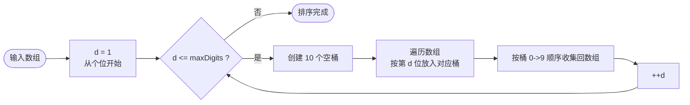
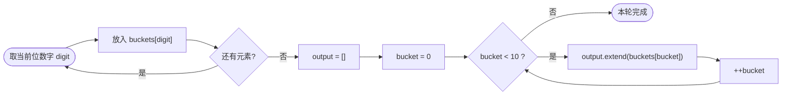

## C++ 排序算法实践：基数排序——逐位分配，按位收集

作者：Artificer老王  |  更新时间：2026-08-01  |  阅读时长：约 11 分钟

现在你要给一堆身份证号进行排序，如何做呢？

不需要两两比较大小，只需要这么做。

先按最后一位数字分组（0~9 共 10 组），组内保持原始顺序收集回来。

再按倒数第二位分组... 一直处理到最高位。

整个过程下来，号码就全局有序了。

**基数排序（Radix Sort）** 就是这个思路：从最低位到最高位，每一轮用稳定的"分配-收集"过程按当前位处理。它属于非比较排序，每一轮通常用计数排序作为内层稳定排序。对于固定位宽的整数，时间复杂度可以达到 O(d × n)，d 是位数。

---

## 🧠 它是什么

### 核心思想

**按位处理：从最低位（LSD）到最高位，每一轮根据当前位的值把元素分配到 0~9 号桶中，然后按桶号顺序收集回来。经过 d 轮（d=最大位数）后，数组全局有序。**

像邮局分拣信件：先按最后一位邮编分，再按倒数第二位... 最后按第一位。

关键在于**每轮必须使用稳定排序**，否则低位排好的顺序会被高位打乱。

### 为什么从低位开始（LSD）

这是最常见的基数排序变体（LSD Radix Sort）。

从低位到高位处理的理由：

1. **低位先排好，高位后来覆盖**：高位相同时，低位已经决定了正确顺序
2. **不需要比较位数长短**：短位数自然在高位上补 0，不影响排序
3. **每轮逻辑一致**：都是"按当前位分配-收集"

另一种变体 MSD（从高位开始）也可以，但处理起来更复杂（需要对每个桶递归执行基数排序）。

### 伪代码

```cpp
// 仅为示意
function radixSort(arr):
    maxDigits = 最大元素的位数
    for d = 1 to maxDigits:           // 从个位到最高位
        创建 10 个空桶 buckets[0..9]
        for each x in arr:
            digit = getDigit(x, d)     // 取第 d 位数字
            buckets[digit].append(x)
        // 按 0->9 顺序收集
        arr = concat(buckets[0..9])
    return arr
```

`getDigit(x, d)` 的实现：`(x / 10^(d-1)) % 10`。

下面用流程图拆解逐位处理的主循环与单轮分配收集。

### 工作原理流程图

对应伪代码的主循环（逐位处理）：



单轮分配-收集：



### 逐轮演示

用 `[170, 45, 75, 90, 802, 24, 2, 66]` 跑一遍 LSD 基数排序（最大 802 有 3 位，共 3 轮）：

```
初始数组: [170, 45, 75, 90, 802, 24, 2, 66]
最大位数: 3

--- 第 1 轮（个位）---
  分配: 桶0:[170,90] | 桶2:[802,2] | 桶4:[24] | 桶5:[45,75] | 桶6:[66]
  收集: [170, 90, 802, 2, 24, 45, 75, 66]

--- 第 2 轮（十位）---
  分配: 桶0:[802,2] | 桶2:[24] | 桶4:[45] | 桶6:[66] | 桶7:[170,75] | 桶9:[90]
  收集: [802, 2, 24, 45, 66, 170, 75, 90]

--- 第 3 轮（百位）---
  分配: 桶0:[2,24,45,66,75,90] | 桶1:[170] | 桶8:[802]
  收集: [2, 24, 45, 66, 75, 90, 170, 802]

最终结果: [2, 24, 45, 66, 75, 90, 170, 802]
```

注意观察：每轮结束后数组并不是全局有序的（比如第 1 轮后 170 排到了最前面），但经过所有位数处理后最终有序。

这就是"低位到高位"策略的工作方式——每次只排一位，多轮叠加后自然归位。

---

## 🎯 能解决什么问题

### 适用场景

| 场景 | 为什么适合 |
|------|-----------|
| **固定位宽整数排序** | 如 32 位 int、64 位 long、电话号码、身份证号 |
| **字符串排序** | 可按字符逐位处理（ASCII/Unicode） |
| **大数据量但位数少** | 如 n=100 万但数值 < 10000（4 位），只需 4 轮 |
| **需要稳定线性时间** | 某些数据库索引构建场景 |

### 局限性

| 局限 | 说明 |
|------|------|
| **只适用于可按位分解的类型** | 浮点数需要特殊处理（IEEE 754 位模式） |
| **位数 d 不能太大** | 如果 d 很大（如 64 位随机整数），可能不如快排 |
| **不是原地排序** | 需要 10 个桶的额外空间 |
| **不支持自定义比较器** | 只能按"位"的自然顺序排 |

### 稳定性

基数排序是**稳定的**，前提是每轮的内层排序（分配-收集）是稳定的。

在我们的实现中，同一位值相同的元素会按原始顺序进入桶，再按桶号顺序依次收集——整个过程保持了元素的相对顺序。

程序验证：

```
原始: (170,a) (45,x) (75,y) (90,b) (802,c) (24,z) (2,d) (66,w)
排序后: (2,d) (24,z) (45,x) (66,w) (75,y) (90,b) (170,a) (802,c)
```

这个例子中所有待排序的 key 都不同，没有碰上相等的情况。

如果扩展测试加入相同 key 的元素，它们的 tag 顺序（即原始顺序）会保持不变——这正是稳定排序的含义。

---

## 💻 C++ 实现与复杂度分析

**程序验证**：完整可编译源码位于 `src/cpp/algorithm/radix_sort.cpp`，编译命令 `make bin/radix_sort`。

以下数据均来自程序实际运行输出，使用两组测试数据：

- 演示数据：`[170, 45, 75, 90, 802, 24, 2, 66]`（共 3 位，3 轮）
- 较大数据集：`[329, 457, 657, 839, 436, 720, 355]`

### 时间复杂度怎么算

设 n = 元素个数，d = 最大位数，k = 基数（十进制 k=10）。

每一轮的操作：
- 分配：遍历 n 个元素 → O(n)
- 收集：遍历 10 个桶 → O(k)（k 是常数 10）
- 单轮总计：O(n)

共 d 轮 → **O(d × (n + k)) = O(d × n)**（因为 k=10 是常数）

| 情况 | 时间复杂度 |
|------|-----------|
| 一般 | **O(d × n)** |
| 当 d 是常数时（如 int32 最多 10 位） | **O(n)** |
| 当 d ~ log_n(U)（U=值域上限） | **O(n log_n U)** |

拿具体数字感受一下：如果 n=100 万，int32 最多 10 位，基数排序约 1000 万次操作。

同样的数据快排约 2000 万次比较（n log n）。

在这个量级上基数排序往往更快。

### 空间复杂度

10 个桶 + 存放所有元素的副本 → **O(n + k) = O(n)**（k=10 是常数）

---

## 📌 总结

- **是什么**：从最低位到最高位，每轮按当前位做稳定的分配-收集。d 轮后全局有序。
- **解决什么 / 用在哪**：固定位宽整数/字符串的大规模排序；电话号码、ID 排序等场景；需要稳定线性时间时。
- **局限**：只适用于可按位分解的类型；位数太多时不如快排；需要额外桶空间。
- **复杂度怎么算**：d 轮 × 每轮 O(n) = O(d×n)。当 d 是常数（如 int32 最多 10 位）时等价于 O(n)。突破了比较排序下界。空间 O(n)。

---

**完整可运行示例代码**：本文所有代码均已上传至 GitHub 仓库（os-artificer/ebooks）位于 `src/cpp/algorithm/` 目录。

文中的代码片段为**说明原理的伪代码**，正式可编译版本请查看 `src/cpp/algorithm/` 下对应的 `.cpp` 文件。

本文首发于公众号 **Artificer老王的学习笔记**，转载请注明出处。
