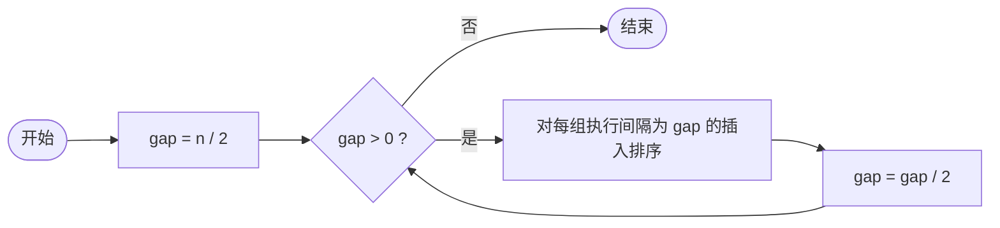

## C++ 排序算法实践：希尔排序——分组插入，逐步逼近有序

作者：Artificer老王  |  更新时间：2026-08-01  |  阅读时长：约 12 分钟

插入排序有个明显的短板：如果最小的元素排在数组末尾（比如 `[9,8,7,6,5,4,3,2,1]` 里的那个 1），它只能一步一步往前挪，每轮只走一步，要挪 n-1 步才能到位。这就像一条单行道堵车，每次只能前进一格。

**希尔排序（Shell Sort）** 的思路很巧妙：既然一步太慢，那就跨步走。先把距离远的元素先排个大概，缩小步长再细排，最后步长为 1 时做一次完整的插入排序收尾。它是第一个突破 O(n²) 的排序算法，由 Donald Shell 在 1959 年提出。

---

## 🧠 它是什么

### 核心思想

**按递减的增量序列（gap）把数组分成若干组，每组内部做插入排序；gap 逐渐缩小到 1，最后做一次标准插入排序完成最终排序。**

"先粗调再精调：远距离的元素先归位到大致正确的区域，近距离的细节最后处理。" —— 希尔排序本质上是**分组的插入排序**，通过 gap 控制分组的粒度。

### 伪代码

```cpp
// 仅为示意
gap = n / 2
while gap > 0:
    for i = gap to n-1:
        temp = arr[i]
        j = i
        while j >= gap and arr[j - gap] > temp:
            arr[j] = arr[j - gap]
            j = j - gap
        arr[j] = temp
    gap = gap / 2
```

和普通插入排序的区别只有两点：内层循环的步长从 1 变成了 gap；外层多了一层 gap 递减。下面用流程图拆解。

### 为什么分组插入更快

普通插入排序中，元素每次只能移动 1 个位置。希尔排序中，当 gap 很大时，元素一次可以跨越很远：

- gap = n/2 时，相距 n/2 的两个元素可以直接比较和交换
- gap = n/4 时，相距 n/4 的元素可以调整
- ...
- gap = 1 时，退化为普通插入排序，但此时数组已经"基本有序"

"基本有序"正是插入排序的最佳工况（接近 O(n)），所以最后一轮虽然看起来是 O(n²) 的插入排序，实际上跑得飞快。

### 工作原理流程图

对应上面伪代码的整体骨架：



组内插入排序（间隔为 gap）：

```mermaid
flowchart LR
    A([i 从 gap 到 n-1]) --> B["temp = arr[i], j = i"]
    B --> C{j >= gap ?}
    C -->|否| D["arr[j] = temp"]
    D --> E[++i]
    E --> A
    C -->|是| F{arr[j-gap] > temp ?}
    F -->|是| G["arr[j] = arr[j-gap]<br/>j -= gap"]
    G --> C
    F -->|否| D
```

### 逐趟演示

用 `[9, 5, 8, 3, 7, 4, 2, 6, 1]`（n=9）跑一遍 Shell 原始增量序列（gap = 4, 2, 1）：

```
初始数组: [9, 5, 8, 3, 7, 4, 2, 6, 1]

--- 当前增量 gap = 4 ---
gap=4 后: [1, 4, 2, 3, 7, 5, 8, 6, 9]
  分组: (9,7,1) -> [1,7,9]   (5,4) -> [4,5]   (8,2) -> [2,8]   (3,6) -> [3,6]

--- 当前增量 gap = 2 ---
gap=2 后: [1, 3, 2, 4, 7, 5, 8, 6, 9]
  分组: (1,2,7,8) -> [1,2,7,8]   (3,4,5,6) -> [3,4,5,6]   (9) -> [9]

--- 当前增量 gap = 1 ---
gap=1 后: [1, 2, 3, 4, 5, 6, 7, 8, 9]
  退化为标准插入排序，但此时数组已基本有序，很快完成

最终结果: [1, 2, 3, 4, 5, 6, 7, 8, 9]
```

可以看到 gap=4 这一轮就把 1 从末尾搬到了开头（跨越 8 个位置），而普通插入排序需要 8 轮才能做到。

---

## 🎯 能解决什么问题

### 适用场景

| 场景 | 为什么适合 |
|------|-----------|
| **中等规模数据（n < 10000）** | 实际表现优于 O(n log n) 的算法（常数因子小） |
| **嵌入式系统** | 代码简单、不需要递归（无栈溢出风险）、内存占用可控 |
| **作为通用排序的实现** | glibc 的 `qsort()` 在某些情况下会用类似策略 |

### 局限性

| 局限 | 说明 |
|------|------|
| **不稳定** | 相同 gap 的分组插入可能导致相等元素跨组移动 |
| **复杂度依赖增量序列** | 不同 gap 序列性能差异很大，没有统一的最优解 |
| **不如快排/归并稳定** | 大数据量下 O(n log n) 算法更可靠 |

### 增量序列的选择

Shell 原始序列（n/2, n/4, ..., 1）并不是最优的。几种常见序列对比：

| 增量序列 | 名称 | 最坏复杂度 | 说明 |
|---------|------|-----------|------|
| n/2, n/4, ..., 1 | Shell 原始 | O(n²) | 最简单，但不是最快 |
| 1, 4, 13, 40, ... (3^k-1)/2 | Knuth | O(n^1.5) | 常用改进版 |
| 1, 5, 19, 41, 109, ... | Sedgewick | O(n^1.25) | 实践中表现很好 |
| 动态计算 | Ciura | ~O(n log n) | 基于实验的最优序列之一 |

工程上一般用 Knuth 或 Sedgewick 序列就够了，不必追求理论最优。

---

## 💻 C++ 实现与复杂度分析

### 时间复杂度怎么算

希尔排序的复杂度分析**依赖于增量序列**，没有一个统一的公式。这里给出 Shell 原始序列的分析思路：

**gap 序列长度**：n/2 折半到 1，共 O(log n) 个不同的 gap 值。

**每个 gap 的工作量**：
- gap 较大时，每组元素少，组内插入排序快
- gap 较小时，组数多，但每组已基本有序

对于 Shell 原始序列（n/2, n/4, ..., 1），最坏情况下时间复杂度为 **O(n²)**。使用更好的增量序列（如 Sedgewick）可以降到约 **O(n^1.25)** 甚至更低。

程序验证（n=9）：

| 输入 | 比较 | 移动 |
|------|------|------|
| 已有序 | 20 | 40 |
| 逆序 | 22 | 48 |

注意：即使已有序，希尔排序仍然要做所有 gap 的遍历（只是每轮工作少了），不像纯插入排序那样能提前退出。

| 情况 | 时间复杂度（Shell 原始序列） |
|------|--------------------------|
| 最好 | O(n log n)* |
| 最坏 | O(n²) |
| 平均 | O(n^1.5)* |

\* 注：具体值取决于增量序列，这里给出的是量级估计。

### 空间复杂度怎么算

只用 `gap`、`i`、`j`、`temp` 等标量 → **O(1)**，原地排序。

📌 小结算法：**时间取决于增量序列（Shell 原始序列最坏 O(n²)、Knuth 约 O(n^1.5)）、空间 O(1)、不稳定、原地、突破了简单插入排序的天花板**。

---

## 📌 全文小结

- **是什么**：按递减 gap 分组做插入排序，先粗调后精调，是插入排序的"跨步加速版"。
- **怎么演示**：用两张流程图看清 gap 循环骨架 + 组内间隔插入；用 9 元素数组的逐 gap 输出看到"gap=4 就能把末尾的 1 搬到开头"的跨步效果。
- **解决什么 / 用在哪**：中等规模数据的实用排序；嵌入式环境的首选之一；突破了 O(n²) 天花板。
- **局限**：不稳定；复杂度依赖增量序列的选择；大数据量不如快排/归并。
- **复杂度怎么算**：无统一公式，依赖 gap 序列。Shell 原始序列最坏 O(n²)；好的序列可达 O(n^1.25) 甚至更好。空间恒定 O(1)。
- **系列定位**：最后一个 O(n²) 级别的排序算法。从这里开始，后面的归并、快排、堆排序将进入 O(n log n) 时代。

---

**完整可运行示例代码**：本文所有代码均已上传至 GitHub 仓库（os-artificer/ebooks）位于 `src/cpp/algorithm/` 目录。

文中的代码片段为**说明原理的伪代码**，正式可编译版本请查看 `src/cpp/algorithm/` 下对应的 `.cpp` 文件。

本文首发于公众号 **Artificer老王的学习笔记**，转载请注明出处。
