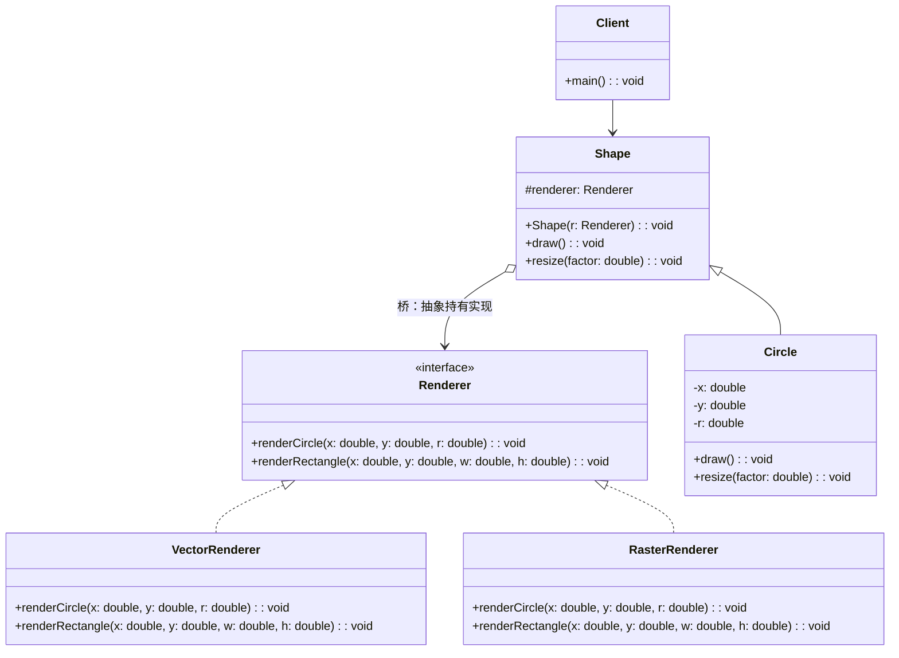
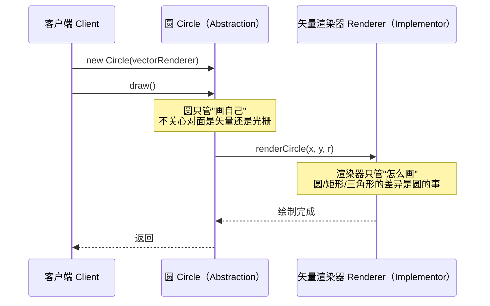

# C++ 桥接模式：定义、结构与实现

作者：Artificer老王 | 更新时间：2026-08-06 | 阅读时长：约 10 分钟

## 📐 桥接模式的定义

桥接模式（Bridge）的 GoF 定义是：将抽象部分与其实现部分分离，使它们可以独立地变化。

这里有两个词得先拆开：一个是"抽象"，一个是"实现"。

桥接里的抽象和实现，跟平时说的"接口和实现"不是一回事，它指的是两条各自会独立变化的维度。

抽象维度是用户能直接操作的高层概念，实现维度是背后真正干活的底层能力。

在图形界面里，抽象维度是按钮、窗口这些控件，实现维度是 Windows、macOS 不同的原生绘制。

在持久化里，抽象维度是文档模型，实现维度是把它存成 JSON 还是存进数据库。

桥接的做法是在抽象和实现之间架一根桥：抽象这一侧持有一个实现接口的引用，调用时把请求转发过去。

这样一来，两个维度各走各的继承链，谁也不绑死谁。

## 🎯 桥接模式用于解决什么问题

最直接的问题叫"类爆炸"，更准确说，是"两个正交维度相乘"带来的类数量失控。

设想一个图形库，要支持多种形状（圆、矩形、三角形），也要支持多种渲染方式（矢量、光栅）。

最朴素的写法是为每一种组合写一个类：圆矢量版、圆光栅版、矩形矢量版、矩形光栅版、三角形矢量版、三角形光栅版。

形状有 S 种、渲染有 R 种，朴素写法就要 S × R 个类。3 种形状配 2 种渲染，是 6 个类；再加一种 SVG 渲染，变成 9 个；再加一种形状，又多 3 个。

每多一种变化，已有代码都得复制粘贴一遍。

比如"怎么画矢量圆"这段逻辑，会散落在圆形矢量类、三角形矢量类、矩形矢量类好几个地方，改一处要改多处。

桥接把这两个维度拆开，各走各的继承链，中间用组合连起来。

形状只需要 S 个类，渲染只需要 R 个类，加起来是 S + R 个。

还是上面那个例子：

| 形状数 S | 渲染数 R | 朴素写法 S×R | 桥接写法 S+R |
|---|---|---|---|
| 3 | 2 | 6 | 5 |
| 3 | 3 | 9 | 6 |
| 4 | 3 | 12 | 7 |

差距随维度增长越来越夸张。少写几个类只是账面好看，桥接真正甩掉的是"每加一个变化就要全量复制"这个包袱。

这个模式盯着的不是"能不能跑"，而是"两个维度都在变的时候，改动怎么圈在局部"。

它和适配器、策略长得很像，但目标不同：适配器是事后给不兼容的接口加转接头，策略是在同一层里换算法，桥接是从设计之初就把抽象和实现两条线分开，让它们各自演化，互不影响。

## 🧩 桥接模式UML 类图

四个角色：Abstraction（抽象）、RefinedAbstraction（细化抽象）、Implementor（实现接口）、ConcreteImplementor（具体实现）。

桥就在 Abstraction 持有 Implementor 的那条组合线上。



`Shape` 是 Abstraction，`Circle` 是 RefinedAbstraction，`Renderer` 是 Implementor，`VectorRenderer` 和 `RasterRenderer` 是 ConcreteImplementor。

`Shape` 里的 `renderer` 成员就是那座桥。

## 🔄 用UML 对象交互图表示工作流程

以"客户端让一个圆用矢量渲染器画出来"为例，看一次调用是怎么穿过桥的。



核心动作只有两步：客户端调用抽象层的方法，抽象层把请求原样转发给桥另一头的实现层。

抽象层不碰实现细节，实现层也不认识抽象层之外的任何东西。

## 💻 用伪代码表示如何将UML 类转变为实现

下面把上面的 UML 类逐个翻译成代码骨架。

代码为说明原理的伪代码，仅为示意，省略头文件与头保护等样板。

对应 UML 类 Renderer（Implementor 接口）：

```cpp
class Renderer {
public:
    virtual void renderCircle(double x, double y, double r) = 0;     // 纯虚，具体实现类完成
    virtual void renderRectangle(double x, double y, double w, double h) = 0;
};
```

对应 UML 类 VectorRenderer / RasterRenderer（ConcreteImplementor）：

```cpp
class VectorRenderer : public Renderer {
public:
    void renderCircle(double x, double y, double r) override {
        // 用矢量指令画圆
    }
    void renderRectangle(double x, double y, double w, double h) override {
        // 用矢量指令画矩形
    }
};

class RasterRenderer : public Renderer {
public:
    void renderCircle(double x, double y, double r) override {
        // 用像素填充画圆
    }
    void renderRectangle(double x, double y, double w, double h) override {
        // 用像素填充画矩形
    }
};
```

对应 UML 类 Shape（Abstraction，持有桥）：

```cpp
class Shape {
protected:
    Renderer* renderer;   // 这就是桥：抽象层握着实现层引用
public:
    Shape(Renderer* r) : renderer(r) {}
    virtual void draw() = 0;          // 由子类实现
    virtual void resize(double factor) = 0;
};
```

对应 UML 类 Circle（RefinedAbstraction，通过桥调用实现）：

```cpp
class Circle : public Shape {
    double x, y, r;
public:
    Circle(double x, double y, double r, Renderer* renderer)
        : Shape(renderer), x(x), y(y), r(r) {}
    void draw() override {
        renderer->renderCircle(x, y, r);   // 过桥，请求转发给实现层
    }
    void resize(double factor) override {
        r *= factor;
    }
};
```

对应 UML 类 Client（组装并触发）：

```cpp
int main() {
    VectorRenderer vector;
    RasterRenderer raster;

    Circle c1(1, 2, 5, &vector);
    c1.draw();                       // 走矢量渲染

    Circle c2(1, 2, 5, &raster);
    c2.draw();                       // 同一个圆，换渲染器即换实现
}
```

把 UML 变成代码，关键就一句：Abstraction 这边别去继承 Implementor，而是握着一个 Implementor 引用，在方法里把调用转出去。新增一种形状，只写一个新的 RefinedAbstraction；新增一种渲染，只写一个新的 ConcreteImplementor。两个维度各加各的，谁也不用动谁。

## 🛠️ 落到工程里要注意的几点

前面的伪代码只画骨架，真写进项目还有几处容易踩坑。

**桥的另一头用智能指针持有。** 在抽象类里用智能指针保存实现对象（共享或独占所有权都行），并且在构造函数里就初始化好。别用裸指针，否则客户端得自己保证实现对象比抽象对象活得久，稍有不慎就是悬垂指针。C++ 没有垃圾回收，所有权得自己讲清楚。

**接口基类的析构函数要声明为虚函数。** 不然通过实现接口指针去销毁具体实现对象时，具体类的析构不会被调用，结果是未定义行为。桥接里抽象层握着的正是实现接口指针，这一点尤为关键。

**派生类覆盖虚函数时显式标注 override。** 这不仅是风格问题，更是让编译器替你核对函数签名有没有写错。

**运行时切换实现，是桥接最实用的地方。** 给抽象类加一个切换实现的方法，同一个形状对象就能在运行时从一种实现切到另一种，两个维度真正各自演化，不必重新构造对象。


---

本文首发于公众号 **Artificer老王的学习笔记**，转载请注明出处。
