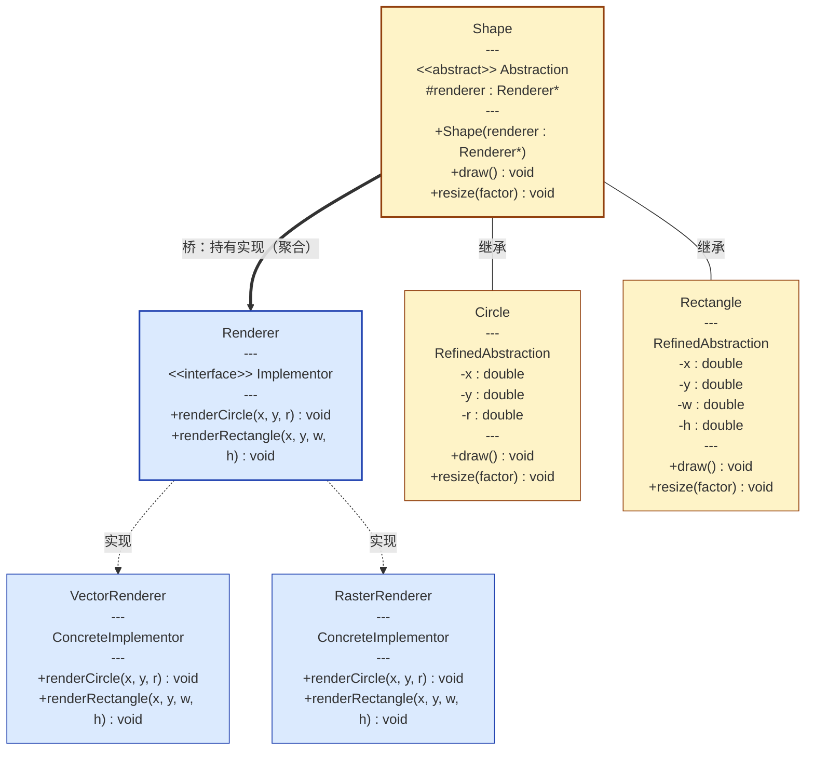
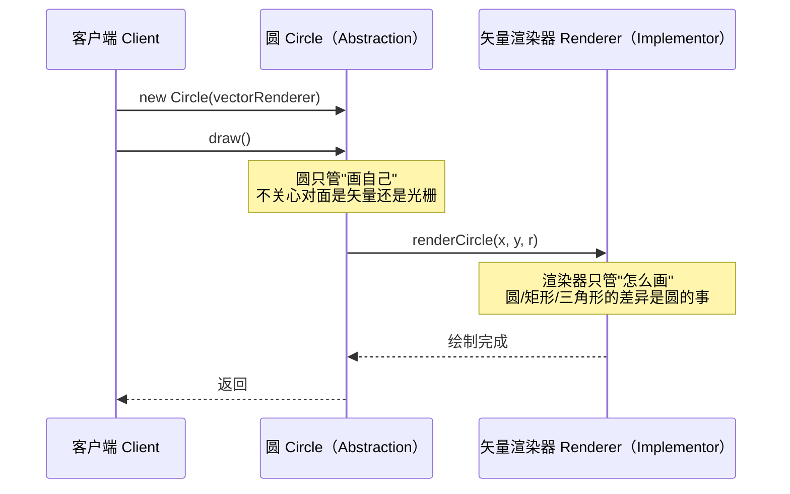

# C++ 桥接模式：定义、结构与实现

作者：Artificer老王 | 更新时间：2026-08-06 | 阅读时长：约 10 分钟

## 📐 桥接模式的定义

桥接模式（Bridge）的 GoF 定义是：将抽象部分与其实现部分分离，使它们可以独立地变化。

这里的"抽象"和"实现"是 GoF 语境下的专用术语，跟平时写代码说的"接口与实现"不是一回事。"抽象维度"是用户能直接操作的高层概念，"实现维度"是背后真正干活的底层能力。

一个系统里如果同时存在这样两个独立变化的维度，桥接模式就是干这个的：让它们各走各的，彼此解耦。

看个经典例子。

GUI图形库：按钮、窗口这些控件就是抽象维度，Windows、macOS 各自不同的原生绘制能力则是实现维度，控件有多少种、平台有多少种，它们互相独立增长。

最朴素的写法是让控件直接去调某个具体平台的 API，于是"按钮"这个类里既装着按钮本身的语义，又绑死了 Windows 的绘制代码，换个 macOS 平台就得写一个全新的 macOS 按钮类。

两个维度一旦被编译期的继承关系绑死，任何一边增加一种变化，另一边都得跟着复制一遍。

桥接的做法是在抽象和实现之间架一根桥。

抽象这一侧不再直接继承某个具体实现，而是持有一个实现接口的引用，需要干活时则把请求转发过去。

控件只认"渲染接口"不认具体平台。

两个维度各自走自己的继承链，谁也不绑死谁。

## 🎯 桥接模式用于解决什么问题

如果不用桥接的话，两个维度就很容易被写死在一起，最直接的后果就是类数量爆炸。

设想一个图形库，要支持圆、矩形、三角形三种形状，也要支持矢量和光栅两种渲染方式。

最朴素的写法是为每一种组合写一个类：圆矢量版、圆光栅版、矩形矢量版、矩形光栅版、三角形矢量版、三角形光栅版。

形状有 S 种、渲染有 R 种，朴素写法就要 S × R 个类。

3 种形状配 2 种渲染是 6 个类，再加一种 SVG 渲染变成 9 个，再加一种形状又多 3 个。

每多一种变化，已有代码都得复制粘贴一遍。

除了类数量膨胀，更隐蔽的代价是同一段逻辑被拆散了。

"怎么画矢量圆"这段逻辑散落在圆形矢量类、三角形矢量类、矩形矢量类好几个地方，若要修改就需要一起改多处代码。

桥接模式则会把这两个维度拆开，形状只需要 S 个类，渲染只需要 R 个类，加起来 S + R 个。

以下则是两种实现方式的对比数据。

| 形状数 S | 渲染数 R | 朴素写法 S×R | 桥接写法 S+R |
|---|---|---|---|
| 3 | 2 | 6 | 5 |
| 3 | 3 | 9 | 6 |
| 4 | 3 | 12 | 7 |

差距随维度增长变得越来越夸张。

少写几个类只是账面好看，实际上桥接真正甩掉的是"每加一个变化就要全量复制"这个包袱。

它和适配器、策略长得很像，但目标不同。

适配器模式是事后给不兼容的接口加转接头。

策略模式是在同一逻辑层面做算法切换。

桥接模式是从设计之初就把抽象和实现两条线分开，让它们各自演化，互不影响，彼此解耦。

## 🧩 桥接模式 UML 类图

桥接模式涉及四个角色：Abstraction（抽象）、RefinedAbstraction（细化抽象）、Implementor（实现接口）、ConcreteImplementor（具体实现）。

桥就在 Abstraction 持有 Implementor 的那条组合线上。

可以通过下面的UML类图来理解桥接模式的结构。



## 🔄 UML 对象交互图：工作流程

以"客户端让一个圆用矢量渲染器画出来"为例，看一次调用是怎么穿过桥的。



核心的动作是：客户端调用抽象层的方法，抽象层把请求原样转发给桥另一头的实现层。抽象层不碰实现细节，实现层也不认识抽象层之外的任何东西。

## 💻 伪代码：将 UML 类转变为实现

下面把 UML 类逐个翻译成代码骨架。

以下代码为说明原理的示意性伪代码，省略头文件与 include guard 等内容。

先看 Renderer，也就是 Implementor 接口：

```cpp
class Renderer {
public:
    virtual void renderCircle(double x, double y, double r) = 0;     // 纯虚，具体实现类完成
    virtual void renderRectangle(double x, double y, double w, double h) = 0;
};
```

VectorRenderer 和 RasterRenderer 是两个 ConcreteImplementor：

```cpp
class VectorRenderer : public Renderer {
public:
    void renderCircle(double x, double y, double r) override {
        // 用矢量指令画圆
    }
    void renderRectangle(double x, double y, double w, double h) override {
        // 用矢量指令画矩形
    }
};

class RasterRenderer : public Renderer {
public:
    void renderCircle(double x, double y, double r) override {
        // 用像素填充画圆
    }
    void renderRectangle(double x, double y, double w, double h) override {
        // 用像素填充画矩形
    }
};
```

Shape 是 Abstraction，它持有桥：

```cpp
class Shape {
protected:
    Renderer* renderer;   // 这就是桥：抽象层握着实现层引用
public:
    Shape(Renderer* r) : renderer(r) {}
    virtual void draw() = 0;          // 由子类实现
    virtual void resize(double factor) = 0;
};
```

Circle 是 RefinedAbstraction，通过桥调用实现：

```cpp
class Circle : public Shape {
    double x, y, r;
public:
    Circle(double x, double y, double r, Renderer* renderer)
        : Shape(renderer), x(x), y(y), r(r) {}
    void draw() override {
        renderer->renderCircle(x, y, r);   // 过桥，请求转发给实现层
    }
    void resize(double factor) override {
        r *= factor;
    }
};
```

Rectangle 同理，只是过桥时调用的是 renderRectangle：

```cpp
class Rectangle : public Shape {
    double x, y, w, h;
public:
    Rectangle(double x, double y, double w, double h, Renderer* renderer)
        : Shape(renderer), x(x), y(y), w(w), h(h) {}
    void draw() override {
        renderer->renderRectangle(x, y, w, h);   // 过桥，请求转发给实现层
    }
    void resize(double factor) override {
        w *= factor; h *= factor;
    }
};
```

最后是 Client，负责组装并触发：

```cpp
int main() {
    VectorRenderer vector;
    RasterRenderer raster;

    Circle c1(1, 2, 5, &vector);
    c1.draw();                       // 走矢量渲染

    Circle c2(1, 2, 5, &raster);
    c2.draw();                       // 同一个圆，换渲染器即换实现
}
```

翻译成代码之后，桥接模式的结构就一句话：Abstraction 不继承 Implementor，而是在自己内部持有一个 Implementor 引用，调用时把请求转发过去。以后加一种新形状，只需要从 Abstraction 派生一个新类；加一种新渲染，只需要从 Implementor 派生一个新类。两条继承链各自演进，互不干扰。

## 🛠️ 落到工程里要注意的几点

前面的伪代码只画骨架，真写进项目还有几处容易踩坑。

**桥的另一头用智能指针持有。** 在抽象类里用智能指针保存实现对象，共享或独占所有权都行，并且在构造函数里就初始化好。别用裸指针，否则客户端得自己保证实现对象比抽象对象活得久，稍有不慎就是悬垂指针。C++ 没有垃圾回收，所有权得自己讲清楚。

**接口基类的析构函数要声明为虚函数。** 否则通过实现接口指针去销毁具体实现对象时，具体类的析构不会被调用，结果是未定义行为。桥接里抽象层握着的正是实现接口指针，这一点尤为关键。

**派生类覆盖虚函数时显式标注 override。** 这不仅是风格问题，更是让编译器替你核对函数签名有没有写错。

**运行时切换实现，是桥接最实用的地方。** 给抽象类加一个切换实现的方法，同一个形状对象就能在运行时从一种实现切到另一种，两个维度真正各自演化，不必重新构造对象。


---

本文首发于公众号 **Artificer老王的学习笔记**，转载请注明出处。
