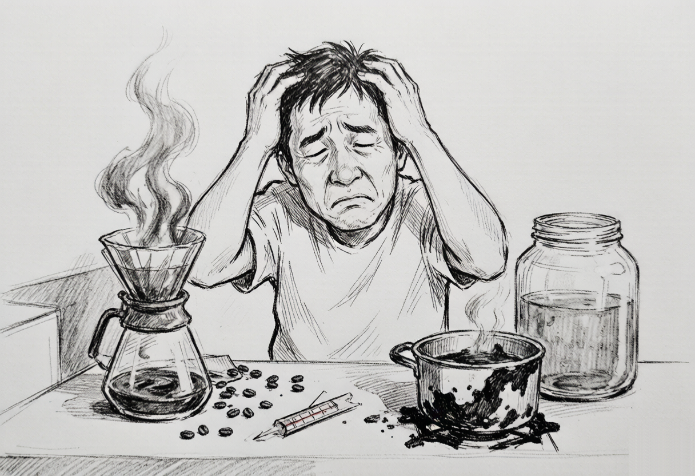
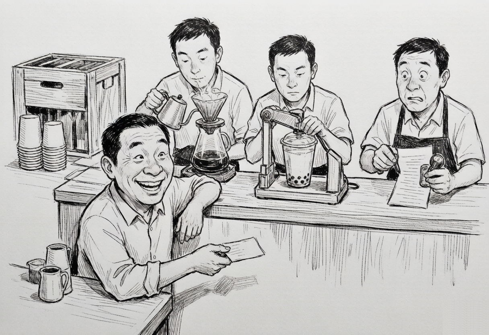
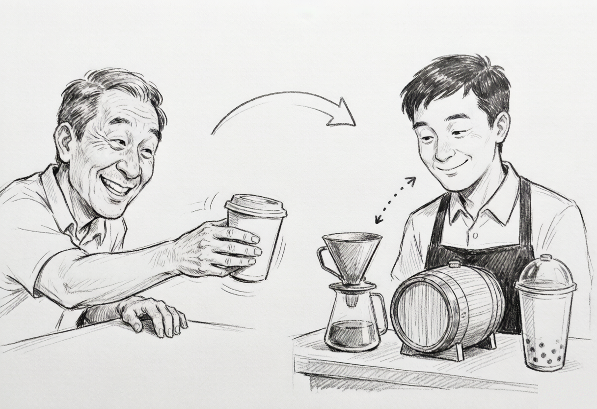
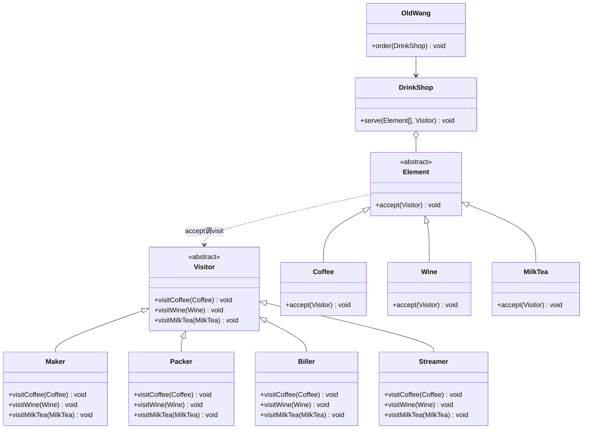
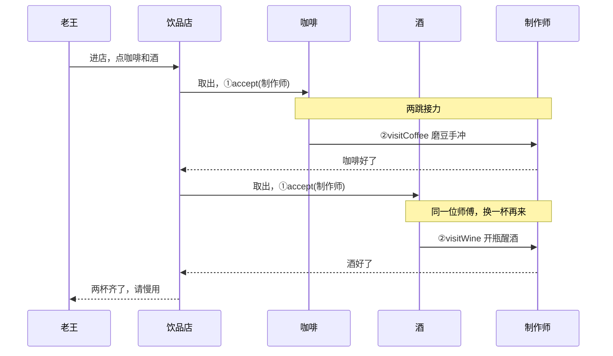

# 老王喝饮料记：一个故事讲透访问者模式

## 老王的三杯水

老王这人没别的爱好，就好喝。

早上一杯咖啡，提神；下午一杯奶茶，续命；晚上二两小酒，解乏。用他的话说，人生三大乐事，全在杯子里。

喝了十几年，老王一直就这么喝着，挺滋润。直到某个周末，他刷到一个视频：《手把手教你自制手冲咖啡，省钱又有格调》。

老王心动了：对啊，为什么要去店里买？自己做，不香吗？

他还不知道，这个念头会给他带来多大的麻烦。

## 第一幕：自己动手，样样稀松

老王的第一步是自制咖啡。他下单了磨豆机、滤杯、分享壶、温度计、电子秤，快递箱子在门口堆成小山。说明书上写水温 92 度，他举着温度计守在水壶旁边，像给婴儿试奶。折腾四十分钟，咖啡端上桌，喝一口，又酸又涩。拉花就更别提了，奶泡倒下去，浮上来一坨抽象派作品。儿子路过看了一眼：爸，你冲的是咖啡还是中药？

第二步是酿酒。网购酒曲，糯米蒸熟，拌匀入坛，密封发酵。说明书说三个月开封。老王等了九十天，开坛那天气势如虹，凑近一闻，脸色骤变：是醋。整整一坛，上好的米醋。

第三步是奶茶。煮红茶、热牛奶、搓珍珠。前两样还算顺利，珍珠是重灾区：木薯粉揉成团，搓成小圆子，下锅煮了俩小时，捞出来的时候，得到了一锅焦糖浆糊。糊在锅底的那一层，后来用钢丝球刷了三天。



## 第二幕：真正的噩梦是维护

手艺差还能练，接下来这件事才让老王彻底崩溃。

有天他要出门野餐，想把三样饮料统统打包带走。本以为就是装个袋子的事，一研究才发现，连打包都得分成三套手艺来学：咖啡要学纸杯怎么封、防烫杯套怎么装；酒要学木盒怎么钉、泡沫怎么塞；奶茶要学封口机怎么用。

过了两天，他想给饮料拍照发朋友圈，一琢磨又是三套学问：咖啡要俯拍拉花，酒要侧拍挂杯，奶茶要四十五度角拍分层。

又过一周，儿子说：爸，现在流行气泡水，你也试试？老王眼前一黑。每加一种新饮料，他都得从头到尾学一门新手艺；每加一种新玩法，三样饮料又得挨个重新学一遍。

老王瘫在沙发上，越想越不对劲。制作三套、打包三套、拍照三套，九门手艺全压在他一个人身上，拆都拆不开。他忽然回过味来：问题不在手笨，做不好还能练；根子在于他把饮料和处置饮料的手艺绑死在了一起。饮料没几样，手艺一大把，全焊在一块，动一样就得连累一大片。

## 第三幕：去店里买，只带一张嘴

老王想通了：从此只去店里买。

他琢磨了一下店里的门道。咖啡、酒、奶茶这三样东西，十几年不变，这叫**元素稳定**；变得快的从来是服务花样，今天现做，明天打包，后天开发票报销，这叫**操作易变**。店里的做法是把这两件事拆开来管。

老王进店只做一个动作：把点的东西往柜台上一放，说一句"给，你处理吧"。剩下的全归店里的各位师傅。

**制作师**接过去，低头一看是咖啡，转身磨豆、手冲；一看是酒，开瓶、醒酒、加冰；一看是奶茶，摇杯、加珍珠。同一位师傅，对每一样东西各有一套对应手法。

**打包员**接过去，咖啡装纸杯配杯套，酒进木盒塞泡沫，奶茶上封口机压膜。

**开票员**接过去，咖啡开餐饮服务票，酒先核验年龄再开酒类销售票，奶茶开饮品票。

上个月店里还来了个新花样，新招了一位**直播带货员**，举着老王的咖啡喊"家人们看这个拉花"。这门新手艺上岗，咖啡的配方、酒的配方、奶茶的配方，一个字都不用改。

老王一拍大腿，明白了：这就是访问者模式。东西（元素）保持不变，手艺（操作）装在一个个独立的师傅（访问者）身上，想加新手艺就新招一位师傅，谁也不用改行。



## 第四幕：两跳接力，一看就会

回家路上，老王把这个模式在脑子里过了一遍，发现说到底就一个动作，分两步走。

第一跳，老王把咖啡递过去，说"我接受你的服务"。行话叫 **accept**：东西主动把自己交出去。

第二跳，师傅低头一看，哦，是咖啡，转身走向手冲台。行话叫 **visit**：师傅根据手里具体是啥，选用对应的手法。

为什么要两跳？因为老王递出去的那一刻，在师傅眼里那只是一杯"喝的"，具体是咖啡是酒还是奶茶，要接过来低头看一眼才能确定。这一接一看，就知道该走哪套手法了。三套手法各对各的，不至于把咖啡塞进奶茶封口机。

这两跳，就是**双重分派**。



用伪代码画一下，就这么点东西（仅为示意）：

```text
// 饮料：只管一件事，把自己交出去
咖啡.接受(师傅)  =>  师傅.处理咖啡(咖啡)   // 转身去手冲台
酒.接受(师傅)    =>  师傅.处理酒(酒)       // 转身去醒酒
奶茶.接受(师傅)  =>  师傅.处理奶茶(奶茶)   // 转身去摇杯
```

新增一门手艺，等于店里多招一位师傅：

```text
直播带货员.处理咖啡(咖啡)  =>  喊"家人们看这个拉花"
直播带货员.处理酒(酒)      =>  喊"这是八二年的……"
直播带货员.处理奶茶(奶茶)  =>  喊"珍珠加双份"
```

饮料的配方，零改动。

## 第四幕续：老王画了两张图

到了家，老王把这个模式正式画了两张图，算是理清了。

第一张是组织架构。老王自己只管进店点单。饮品店管着各种饮料，饮料只认一个动作：把自己交给师傅。师傅呢，对每样饮料各有一套 `visit` 手法。制作师、打包员、开票员、直播带货员，都是师傅的具体分身。饮料和师傅之间就一条虚线：`accept` 一喊，`visit` 就跟上。



故事角色和模式角色一一对应：

| 故事角色 | 模式角色 | 干什么 |
|---|---|---|
| 老王 | Client | 进店点单，发起流程 |
| 饮品店 | ObjectStructure | 管饮料，派师傅 |
| 咖啡 / 酒 / 奶茶 | ConcreteElement | 只会 accept，把自己交出去 |
| 制作师 / 打包员 / 开票员 / 直播带货员 | ConcreteVisitor | 对每样饮料各一套 visit 手法 |

第二张是交互顺序图。老王点了一杯咖啡和一杯酒，同一个制作师接手两样东西，每次都是两跳接力：先 accept 递过去，再 visit 低头看、转身干活。



同一个制作师，接到咖啡走手冲台，接到酒走醒酒器。关键就在 accept 那一递："我是谁"的信息顺着这一递，落到了对应的 visit 手法里，不至于走错工位。

## 第五幕：什么时候别学店里这套

老王后来也琢磨明白了，店里这套玩法有个死穴：菜单不能乱加。

假如老板心血来潮上架气泡水，四位师傅全得跟着忙一轮：制作师得学气泡水怎么充气，打包员得学气泡水带气怎么封口才不炸，开票员得查气泡水开什么票，直播带货员也得给气泡水编一套新说辞。谁要是漏学了一门，顾客点气泡水的时候就没人接得住，当场出岔子。好在代码世界比店里靠谱：Visitor 基类声明了几个 visit 方法，每个具体访问者就得老老实实实现几个，漏一个编译器直接报错，蒙混不过去。

所以老王总结了两句话。

**东西常年不变、玩法三天两头换**，学店里，把手艺交给访问者。编译器的语法树几十年就那几十种节点，可代码检查、格式化、静态分析的新花样天天出，所以编译器最喜欢用访问者模式。

**玩法没几种、东西天天上新**，别学，老老实实让每样东西自己会处理自己。新来一样东西自带手艺，谁也不麻烦谁。

## 尾声

现在的老王，依然是早咖啡、下午奶茶、晚小酒。不一样的是，他的磨豆机挂在闲鱼上卖掉了，酒坛子腌上了咸菜，钢丝球也光荣退休。

有人问他：你怎么什么手艺都不会，还天天有喝的？

老王晃了晃手里的奶茶：我不用会，店里有人会。我只管递过去，说一句"你处理吧"。
