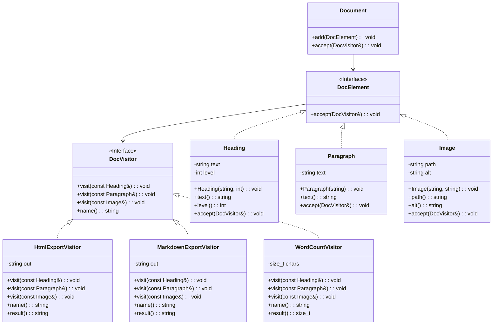
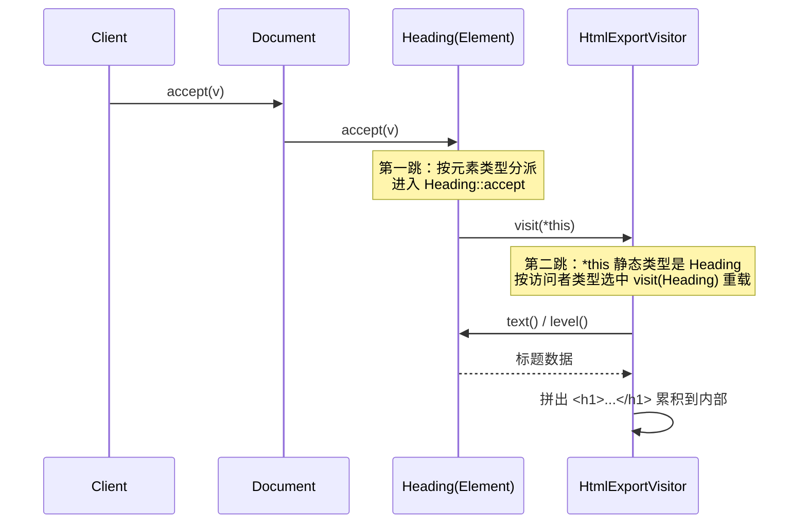

## C++ 设计模式实践：访问者模式，如何批量给旧类加功能却不动它们

作者：Artificer老王  |  更新时间：2026-08-04  |  阅读时长：约 15 分钟

现在你手里有一组稳定的数据结构：文档的标题、段落、图片，编译器里的各种语法树节点，图形场景里的圆、矩形、多边形。

但是对它们的操作需求却总是在变化：今天要导出 HTML，明天要导出 Markdown，后天要统计字数，大后天还要加个导出 PDF。

加功能本身没什么问题，但加完之后，这些元素类就变得越来越胖、越来越不稳定。

因为每加一种操作，就得给**每一个**元素类都添一个新方法。

更麻烦的是同一操作的逻辑要在 N 个元素类里都实现一遍。

想看看"HTML 导出"整体长什么样，就得翻遍标题、段落、图片、表格等所有元素类。

经过几轮变更之后，元素类也会变得越来越重，本该只管"我是什么内容"，结果还要管"我该怎么做"。

最终，HTML 语法、Markdown 语法、统计规则全堆在它身上。

**访问者模式（Visitor Pattern）** 就是专门解决这种问题的。

---

## 🕳️ 先看问题：把操作塞进元素类

假设一份文档由标题、段落、图片三种元素组成，现在要支持导出 HTML、导出 Markdown、统计字数。

最直接的写法，是在元素基类里为每种操作都声明一个虚函数。

```cpp
// 反面教材：每加一种操作，就要改所有元素类
class DocElement {
public:
    virtual ~DocElement() = default;
    virtual std::string toHtml() const = 0;      // 操作1
    virtual std::string toMarkdown() const = 0;  // 操作2
    virtual size_t wordCount() const = 0;        // 操作3
    // 明天要加导出 PDF？拼写检查？又得回到这里加虚函数，
    // 然后 Heading / Paragraph / Image 全部跟着改一遍
};

class Heading : public DocElement {
    std::string _text; int _level;
public:
    std::string toHtml() const override { /* 拼 <h1>... */ }
    std::string toMarkdown() const override { /* 拼 # ... */ }
    size_t wordCount() const override { /* ... */ }
};
// Paragraph、Image 各有一份一模一样的"三件套"……
```

问题在哪儿？

- **加一个新操作，得动一堆老代码**：比如要支持导出 PDF，你得先去基类加一个虚函数，再把 `Heading`、`Paragraph`、`Image` 每一个都改一遍。改动面铺得太大，漏改一个编译期还看不出来。
- **元素类被塞进了它本不该管的事**：`Heading` 本来只该关心"我是几级标题、文字是什么"，现在却背着 HTML 标签怎么写、Markdown 怎么拼、字数怎么数，职责越来越臃肿。
- **同一种操作的逻辑散得到处都是**：想完整看一遍"Markdown 导出"到底做了什么，得在 N 个元素类之间来回翻，这段规则没有一个能一口气读完的落点。
- **操作没法单独测**：想验证"字数统计"对不对，先得搭起一整棵文档树，再间接从每个元素里把统计逻辑逼出来，测试成本被抬高了一大截。

问题的本质：**一组稳定的元素结构，被"会不断变动的操作"反复入侵**。

---

## 🧩 访问者模式是什么

### 核心思想

访问者模式要做的就是把对元素内容的操作从元素中解耦出去。

元素负责提供内容。

访问者负责提供对元素内容的操作。

仅依赖接口进行交互，两者解耦，各司其职。

对比一下：

| 做法        | 本质               | 加新操作的代价          | 加新元素的代价           |
| --------- | ---------------- | --------------- | ---------------- |
| 操作塞进元素类   | 每个元素类背 N 个操作方法   | 改基类 + N 个元素类    | 加一个元素类（自带所有操作）    |
| 访问者模式     | 操作封装成独立访问者类      | 只加一个访问者类，元素不动   | 改所有访问者（各加一个重载）   |

注意最后一列，这是访问者模式的**代价**。

它用"加元素的麻烦"换来"加操作的自由"。

因此这个模式有个明确的适用前提：**元素类型集合要稳定**。

### 访问者模式的五个核心角色

访问者模式角色比策略模式多两个，但分工很清晰：

- **Element（元素接口）**：声明 `accept(DocVisitor&)`，是元素对外的唯一"接待窗口"。
- **ConcreteElement（具体元素）**：标题、段落、图片等，实现 `accept`，里面只有一行 `v.visit(*this)`，把自己交回去。
- **Visitor（访问者接口）**：为**每一种**具体元素声明一个 `visit` 重载，这是一份完整的"操作清单"。
- **ConcreteVisitor（具体访问者）**：实现一整套 `visit`，完成一种具体操作：HTML 导出、Markdown 导出、字数统计，各是一个访问者。
- **ObjectStructure（对象结构）**：持有元素集合（文档、树、图），负责遍历并挨个调用元素的 `accept`。

### 关键机制：双重分派

访问者模式的技术核心叫**双重分派（Double Dispatch）**，理解它才算真正懂了这个模式。

C++ 的虚函数是**单分派**：一次虚调用只能按**一个对象**的运行时类型选函数。

但访问者要解决的问题是"对某个元素执行某个操作"，这里有两个独立的维度需要同时确定：一个是**元素的运行时类型**（标题？段落？图片？），另一个是**操作的运行时类型**（HTML 导出？Markdown 导出？字数统计？）。

单分派一次虚调用只能锁定其中一个维度，另一个维度就丢了。

访问者的办法是用两次虚调用接力，把两个维度分别锁定：

1. **第一跳**：`element->accept(v)`，按**元素**的运行时类型，进到对应 `ConcreteElement::accept`；
2. **第二跳**：`v.visit(*this)`，在 `accept` 里 `*this` 的静态类型已确定（比如就是 `Heading`），编译器据此选准 `visit` 重载，再按**访问者**的运行时类型落到具体实现。

两跳之后，"哪种元素 × 哪种操作"的交叉点就精确定位到了。

---

## 🗺️ UML 类关系图

下面是访问者模式的结构类图。

`Document`（ObjectStructure）持有 `DocElement`（Element）集合，三个具体元素各自实现 `accept`，三个具体访问者各自实现一整套 `visit` 重载。



再看一张时序图，看清"双重分派"这两跳是怎么接力的，以一个标题元素接受 HTML 导出访问者为例：



两张图配合着看：类图是"静态结构"，谁实现谁、谁持有谁；时序图是"动态行为"，一次 `accept` 如何通过两跳，把"标题 × HTML导出"这个组合精确定位到 `HtmlExportVisitor::visit(Heading)` 上。

---

## 🎯 能解决什么问题

### 加新操作不动元素类，符合开闭原则（对"操作"维度）

设想现在要加一种新操作，比如把整篇文档导出成纯文本。

如果没有访问者，你得回过头去给 `Heading`、`Paragraph`、`Image` 每一个元素类都补一个 `toPlainText()` 方法，原本运行得好好的类全得重新编译、重新测试。

访问者把这个方向反过来：新操作只是一个新的 `ConcreteVisitor` 子类，原有的元素类一个字都不用改，新代码和老代码彻底隔离。

这正是开闭原则在"操作"维度上的体现，对扩展开放，对修改关闭。

新增导出格式的成本，只是多写一个类，而不是去动一堆已经稳定的老代码。

### 同一操作的逻辑集中内聚

若把"HTML 导出"写成每个元素类的 `toHtml()` 方法，这段逻辑会被切散在 `Heading`、`Paragraph`、`Image` 等 N 个类里，想看一眼完整的导出规则就得翻遍整个元素体系。

访问者把这件事收拢了。

`HtmlExportVisitor` 一个类就装下了全部导出逻辑，阅读、审查、改 bug 都有唯一的落点，不用在元素类之间跳来跳去。

### 相关操作聚成一族，便于复用与测试

每个访问者都是自包含的对象，不依赖元素类的内部实现，只要造几个元素喂进去就能单独跑单测，不必为了测导出规则而搭起整棵文档树。

同一个 `HtmlExportVisitor`，报告、邮件模板、帮助文档都能直接复用，导出逻辑只写一遍，处处调用。

### 访问者可以携带状态，边遍历边累积

访问者本身是个有状态的对象，可以在遍历过程中把中间结果记在自己身上，比如累计字数、收集目录、拼接最终输出串，走完一遍树后一次性取出。

这种"边走边攒"的能力，塞进元素类去写很难干净实现，因为元素类只知道自己那一点，没有贯穿整次遍历的上下文。

---

## 🌐 典型应用场景

访问者模式适用于"元素类型集合**稳定**，但对它们的**操作经常增加**"的场景。

| 场景         | 元素集合（稳定）           | 访问者（常加的操作）                    |
| ---------- | ------------------ | ----------------------------- |
| **编译器 AST** | 声明 / 表达式 / 语句等语法节点  | 类型检查 / 求值 / 代码生成 / 美化打印        |
| **文档 / 报表** | 标题 / 段落 / 图片 / 表格   | 导出 HTML / 导出 Markdown / 导出 PDF / 字数统计 |
| **图形场景**   | 圆 / 矩形 / 多边形        | 求面积 / 求周长 / 碰撞检测 / 序列化        |
| **文件系统**   | 文件 / 目录            | 算总大小 / 按名搜索 / 打包压缩 / 权限审计     |
| **配置对象树**  | 节 / 项 / 列表          | 校验 / 导出 JSON / 生成配置文档         |

📌 **判断要不要用访问者模式，可以试着问自己三个问题**：

1. **元素类型集合是否稳定**？这是前提中的前提。访问者用"加操作的自由"换"加元素的麻烦"：每加一种新元素，所有访问者都要补一个 `visit` 重载。元素三天两头加新类型，访问者就是灾难，别用。
2. **是否经常要加新操作**？操作基本固定的话，直接写进元素类就好，犯不着绕一圈。
3. **是否想让操作集中、保持元素类干净**？当操作逻辑散在 N 个元素类里、你想按"操作"为单位通读、测试、复用时，访问者的价值最大。

三问里"元素稳定 + 操作常加 + 想集中"都满足，才适合用访问者模式。

---

## 💻 C++ 实现实践

### 场景设定：文档的多格式导出

我们用一份简单文档做演示，文档由标题、段落、图片组成，要支持三种操作：导出 HTML、导出 Markdown、统计字数。

我们把每种操作封装成一个访问者，元素只留 `accept` 入口，`Document` 负责遍历派发。

接口与角色：

| 角色                                        | 类型      | 说明                                       |
| ----------------------------------------- | ------- | ---------------------------------------- |
| **DocVisitor**（Visitor）                  | 接口      | 为每种元素备一个 `visit` 重载 + `name()`            |
| **HtmlExport / MarkdownExport / WordCount**（ConcreteVisitor） | 具体访问者 | 三种操作，各自实现一整套 `visit`，结果累积在内部            |
| **DocElement**（Element）                   | 接口      | 只声明 `accept(DocVisitor&)`                 |
| **Heading / Paragraph / Image**（ConcreteElement） | 具体元素  | 各自存内容、暴露只读 getter，`accept` 里一行 `v.visit(*this)` |
| **Document**（ObjectStructure）             | 对象结构    | 持有元素集合，遍历并挨个 `accept`                     |

### 伪代码骨架

先看骨架，理解结构：

```cpp
// ---- 访问者接口：为每种元素声明一个 visit 重载 ----
class DocVisitor {
public:
    virtual void visit(const Heading&) = 0;
    virtual void visit(const Paragraph&) = 0;
    virtual void visit(const Image&) = 0;
};

// ---- 元素接口：只留一个 accept 入口 ----
class DocElement {
public:
    virtual void accept(DocVisitor& v) const = 0;
};

// ---- 具体元素：accept 里只有一行，把自己交给 visitor ----
class Heading : public DocElement {
public:
    void accept(DocVisitor& v) const override { v.visit(*this); }  // 双重分派第二跳
};

// ---- 具体访问者：实现一整套 visit，完成一种操作 ----
class HtmlExportVisitor : public DocVisitor {
public:
    void visit(const Heading& e) override { /* 拼 <h1>... */ }
    void visit(const Paragraph& e) override { /* 拼 <p>... */ }
    void visit(const Image& e) override { /* 拼 ... */ }
};
```

核心模式就这几行：**Element 只留 accept 入口、Visitor 按元素类型备齐重载、ConcreteElement 在 accept 里把自己递回去**。

### 关键实现决策

在写完整代码之前，有几个工程决策值得展开讲。

**🔧 决策：visit 怎么"认出"具体元素类型？**

- **每种元素一个 visit 重载（经典做法）**：`accept` 里 `v.visit(*this)`，`*this` 的静态类型已知，编译器在编译期选准重载。类型安全、无 RTTI 开销。本文示例采用这种。
- **单个 visit + dynamic_cast**：`Visitor` 只声明一个 `visit(DocElement&)`，内部用 `dynamic_cast` 挨个试探类型。省掉了重载清单，但引入 RTTI 开销，而且"漏处理某类型"只能靠运行时兜底，编译器不帮你查。除非元素类型极多，不建议。

**🔧 决策：访问者的结果怎么拿出来？**

- **状态累积在访问者内部**：`visit` 过程中把结果写进成员变量，遍历完调 `result()` 取。本文示例采用这种，HTML 串、字数都攒在访问者身上。适合"遍历一遍出一个总结果"。
- **visit 直接返回值**：每个 `visit` 返回该元素的结果，由 ObjectStructure 负责汇总。适合元素间结果互相独立的场景，但 ObjectStructure 得懂"怎么合并"，耦合略升。

**🔧 决策：元素要暴露多少内部状态给访问者？**

访问者要干活，就得拿到元素的内部数据（`text`/`level`/`path`）。

- **公共 getter（推荐）**：元素只暴露访问者真正需要的只读接口。本文示例采用这种。
- **friend 授权**：把具体访问者声明为元素的友元，直接摸私有成员。能访问不打算公开的状态，但耦合最强，访问者每多一个，friend 清单就长一行，封装漏成筛子。原则：**能 getter 就别 friend**。

**🔧 决策：对象结构怎么遍历？**

- **线性集合（本文示例）**：`Document` 一个循环挨个 `accept`，最简单。
- **递归结构（树/图）**：Composite 场景下，节点的 `accept` 先把访问者派给孩子、再处理自己（或反过来），访问者不关心树怎么走。目录树算总大小就是这类。
- **顺序敏感的场景**：正文按文档顺序正序遍历；若操作是"生成目录"，可能要两遍，先收集标题，再输出正文。遍历策略归 ObjectStructure 管，不归访问者。

### 完整代码

完整可编译代码在 `src/cpp/design-mode/visitor_demo.cpp`，核心结构如下：

```cpp
#include <cstddef>
#include <iostream>
#include <memory>
#include <string>
#include <vector>

// ---- 前向声明具体元素（Visitor 接口要按类型备齐重载）----
class Heading;
class Paragraph;
class Image;

// ---- Visitor 接口：为每一种具体元素声明一个 visit 重载 ----
class DocVisitor {
public:
    virtual ~DocVisitor() = default;
    virtual void visit(const Heading& e) = 0;
    virtual void visit(const Paragraph& e) = 0;
    virtual void visit(const Image& e) = 0;
    virtual std::string name() const = 0;
};

// ---- Element 接口：只留一个 accept 入口 ----
class DocElement {
public:
    virtual ~DocElement() = default;
    virtual void accept(DocVisitor& v) const = 0;
};

// ---- ConcreteElement：标题 ----
class Heading : public DocElement {
    std::string _text;
    int _level;
public:
    Heading(std::string text, int level) : _text(std::move(text)), _level(level) {}
    const std::string& text() const { return _text; }
    int level() const { return _level; }
    void accept(DocVisitor& v) const override { v.visit(*this); }   // 双重分派第二跳
};

// ---- ConcreteElement：段落 ----
class Paragraph : public DocElement {
    std::string _text;
public:
    explicit Paragraph(std::string text) : _text(std::move(text)) {}
    const std::string& text() const { return _text; }
    void accept(DocVisitor& v) const override { v.visit(*this); }
};

// ---- ConcreteElement：图片 ----
class Image : public DocElement {
    std::string _path;
    std::string _alt;
public:
    Image(std::string path, std::string alt)
        : _path(std::move(path)), _alt(std::move(alt)) {}
    const std::string& path() const { return _path; }
    const std::string& alt() const { return _alt; }
    void accept(DocVisitor& v) const override { v.visit(*this); }
};

// ---- ConcreteVisitor：HTML 导出（结果累积在内部）----
class HtmlExportVisitor : public DocVisitor {
    std::string _out;
public:
    void visit(const Heading& e) override {
        _out += "<h" + std::to_string(e.level()) + ">" + e.text()
              + "</h" + std::to_string(e.level()) + ">\n";
    }
    void visit(const Paragraph& e) override {
        _out += "<p>" + e.text() + "</p>\n";
    }
    void visit(const Image& e) override {
        _out += "\n";
    }
    std::string name() const override { return "HTML导出"; }
    std::string result() const { return _out; }
};

// ---- ConcreteVisitor：Markdown 导出 ----
class MarkdownExportVisitor : public DocVisitor {
    std::string _out;
public:
    void visit(const Heading& e) override {
        _out += std::string(static_cast<size_t>(e.level()), '#') + " " + e.text() + "\n\n";
    }
    void visit(const Paragraph& e) override {
        _out += e.text() + "\n\n";
    }
    void visit(const Image& e) override {
        _out += " + ")\n\n";
    }
    std::string name() const override { return "Markdown导出"; }
    std::string result() const { return _out; }
};

// 按 UTF-8 码点计数（跳过续字节），中文按 1 字计
static size_t utf8Len(const std::string& s) {
    size_t n = 0;
    for (unsigned char c : s)
        if ((c & 0xC0) != 0x80) ++n;
    return n;
}

// ---- ConcreteVisitor：字数统计 ----
class WordCountVisitor : public DocVisitor {
    size_t _chars = 0;
public:
    void visit(const Heading& e) override { _chars += utf8Len(e.text()); }
    void visit(const Paragraph& e) override { _chars += utf8Len(e.text()); }
    void visit(const Image& e) override { _chars += utf8Len(e.alt()); }
    std::string name() const override { return "字数统计"; }
    size_t result() const { return _chars; }
};

// ---- ObjectStructure：文档，持有元素集合并挨个派发 visitor ----
class Document {
    std::vector<std::unique_ptr<DocElement>> _elements;
public:
    void add(std::unique_ptr<DocElement> e) { _elements.push_back(std::move(e)); }
    void accept(DocVisitor& v) const {
        std::cout << "--- " << v.name() << " ---\n";
        for (const auto& e : _elements)
            e->accept(v);   // 双重分派第一跳：按元素类型进 accept
    }
};

int main() {
    Document doc;
    doc.add(std::make_unique<Heading>("C++ 设计模式", 1));
    doc.add(std::make_unique<Paragraph>("访问者模式把操作从元素里搬出去。"));
    doc.add(std::make_unique<Image>("uml.png", "类图"));

    HtmlExportVisitor html;
    doc.accept(html);
    std::cout << html.result() << "\n";

    MarkdownExportVisitor md;
    doc.accept(md);
    std::cout << md.result() << "\n";

    WordCountVisitor wc;
    doc.accept(wc);
    std::cout << "总字符数: " << wc.result() << "\n";

    return 0;
}
```

运行输出：

```
--- HTML导出 ---
<h1>C++ 设计模式</h1>
<p>访问者模式把操作从元素里搬出去。</p>


--- Markdown导出 ---
# C++ 设计模式

访问者模式把操作从元素里搬出去。


--- 字数统计 ---
总字符数: 26
```

同一份文档、同一套元素，只是换了访问者，得到的操作结果就完全不同。

新增一个"导出 PDF"的操作，只需加一个 `ConcreteVisitor`，`Heading`/`Paragraph`/`Image` 一行不用改，这就是"把操作从数据结构里搬出去"的具体效果。

---

## 🚀 进阶：现代 C++ 的改进方向

上面的实现是经典写法（双接口 + 虚函数双重分派），稳妥但模板量不小。

访问者在 C++ 里还有几条更现代的路。

### 用 std::variant + std::visit 替代双接口（C++17）

当元素集合在编译期已知且稳定时，经典访问者可以整个换成 `std::variant` 装元素 + `std::visit` 分派，无继承、无虚函数、无堆分配，这是今天 C++ 社区写"访问者"的主流写法：

```cpp
struct Heading   { std::string text; int level; };
struct Paragraph { std::string text; };
struct Image     { std::string path; std::string alt; };
using DocNode = std::variant<Heading, Paragraph, Image>;

std::string toHtml(const DocNode& e) {
    return std::visit([](const auto& el) -> std::string {
        using T = std::decay_t<decltype(el)>;
        if constexpr (std::is_same_v<T, Heading>)
            return "<h" + std::to_string(el.level) + ">" + el.text
                 + "</h" + std::to_string(el.level) + ">";
        else if constexpr (std::is_same_v<T, Paragraph>)
            return "<p>" + el.text + "</p>";
        else
            return "";
    }, e);
}
```

好处：零虚函数、零继承、值语义，编译器能内联。

`std::visit` 还有一个安全特性：**用显式重载集（每个类型各写一个 `operator()`）时，会在编译期检查你是否漏处理了某个类型**，漏一个直接编译报错。上面的泛型 lambda 有 `else` 兜底，不会报错，但也意味着新类型会静默落入默认分支。

代价：元素集合编译期固定，加新元素要改 `using` 那一行和所有处理点。用显式重载集的话，编译器会逐个报出漏改位置，这个"代价"其实是安全带；用泛型 lambda 则需自行留意新类型落入 `else` 分支。

### 访问者与"策略"的边界

- **策略（Strategy）**：同一个 Context，换**一整个算法**；一次调用、一次分派。
- **访问者（Visitor）**：一组**不同类型**的元素，同一个操作要对每种类型给出**不同实现**；`accept`→`visit` 两次分派，解决"操作 × 类型"的二维组合。

心法口诀：策略是**换一把刀**；访问者是**一把刀要能切 N 种料、每种料切法不同，还随时能添新刀**。

### 访问者与"迭代器"的边界

两者常一起出现，但管的事不同：

- **迭代器（Iterator）**：管"怎么挨个拿到元素"：遍历顺序。
- **访问者（Visitor）**：管"拿到元素后做什么"：操作本身。

两者是天然搭档：迭代器负责走，访问者负责干。

### 递归结构：与组合模式搭档

当元素本身是树（目录树、AST、组织架构），让 Composite 节点的 `accept` 先把访问者派发给子节点，访问者就自然获得了"巡访整棵树"的能力：

```cpp
// 目录节点的 accept：先让孩子接待，再轮到自己
void accept(DocVisitor& v) const override {
    for (const auto& child : _children)
        child->accept(v);   // 递归巡访子树
    v.visit(*this);
}
```

编译器对 AST 做类型检查、代码生成，靠的就是"组合 + 访问者"这对老搭档。

---

## 📌 总结

访问者不是在"加功能"，而是在重新分配责任。

它把"操作"这件事从元素类手里解耦出来，集中到独立的访问者类里，代价是元素种类被冻结。

所以这个模式真正要你拍板的只有一件事：你的系统里，到底是元素稳定、操作常变，还是反过来？

如果是前者，访问者是你盟友，每加一种导出、统计、校验都只是多写一个类，老代码纹丝不动。

如果是后者，元素类型三天两头新增，那访问者会让你每加一种类型，就得给所有访问者各补一个 `visit` 重载，这时候别硬上，把操作留在元素类反而更省心。

现代 C++ 还有更轻的选择：元素集合在编译期就固定时，直接用 `std::variant` + `std::visit`，不用虚函数、不用继承，用显式重载集写分支时，漏掉一个编译器还会替你报错。

访问者解决的是"双分派"这个本质难题，但实现它不一定非得走经典面向对象那套。看清你卡在哪一维，再决定用哪种写法。

---

**完整可运行示例代码**：本文所有代码均已上传至 GitHub 仓库（os-artificer/ebooks）位于 `src/cpp/design-mode/` 目录。

文中的代码片段为**说明原理的伪代码**，正式可编译版本请查看 `src/cpp/design-mode/` 下对应的 `.cpp` 文件。

本文首发于公众号 **Artificer老王的学习笔记**，转载请注明出处。
