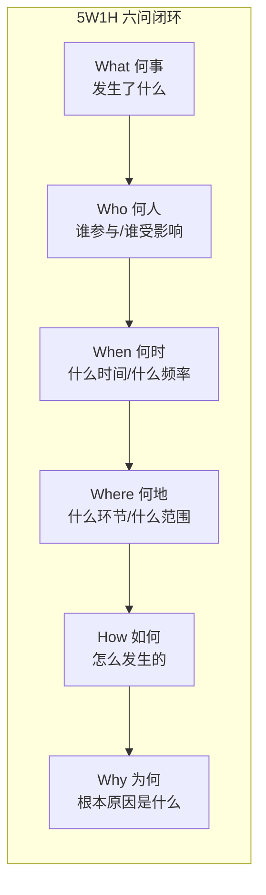
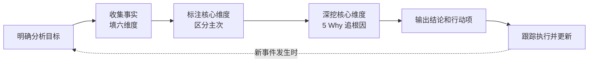

## 5W1H 分析法：六个问题拆解一切复杂局面

作者：Artificer老王  |  更新时间：2026-08-02  |  阅读时长：约 15 分钟

你有没有过这种经历：

老板甩过来一句"这个项目怎么又延期了"，你张嘴想解释，却发现脑子里一团乱麻，不知道从哪儿说起。

或者团队开会讨论一个新方案，吵了两个小时，最后发现大家连"到底要解决什么问题"都没对齐。

又或者线上出了故障，你盯着监控面板上那条飙升的曲线，手忙脚乱地猜原因，试了一个方案不行又换另一个，折腾半天才发现一开始就找错了方向。

这些场景有个共同点：不是你能力不够，而是你在动手解决之前，少了一步"把问题拆清楚"。

**5W1H 分析法**就是用来干这件事的。

它不替你解决问题，但它给你六个问题，逼你在动手之前先把"发生了什么、涉及谁、什么时候、在哪儿、为什么、怎么干的"想明白，让你在一个结构化的框架里定义问题，而不是凭感觉乱抓。

---

## 🔍 5W1H 是什么

### 定义

**5W1H 是一种结构化的问题分析框架，通过六个基本问题（Who 何人、What 何事、When 何时、Where 何地、Why 为何、How 如何）对问题或事件进行全方位拆解，帮助你完整定义问题边界、厘清因果关系，为后续分析和决策提供清晰的事实基础。**

| 维度 | 英文    | 核心问题            | 拆解方向    |
| -- | ----- | --------------- | ------- |
| 何人 | Who   | 谁参与了？谁受影响？谁负责？  | 识别利益相关方 |
| 何事 | What  | 发生了什么？具体是什么问题？  | 描述事件本身  |
| 何时 | When  | 什么时候发生的？什么频率？   | 定位时间规律  |
| 何地 | Where | 在哪儿发生的？什么环节？    | 锁定问题范围  |
| 为何 | Why   | 为什么会发生？根本原因是什么？ | 追溯因果链   |
| 如何 | How   | 怎么发生的？过程是什么？    | 还原事件过程  |

三个要点：

- **六个维度缺一不可**：跳过任何一个都可能导致分析盲区。比如你搞清楚了 What 和 Why，却忽略了 Who，最后方案落地时发现没人负责，等于白分析。
- **先描述事实，再追溯原因**：前四个 W（Who/What/When/Where）是"发生了什么"的事实层面，How 是"怎么发生的"过程层面，最后 Why 才是"为什么发生"的原因层面。顺序不能反，先有事实再谈原因。
- **每个维度的答案要具体**：不要写"系统出了问题"（太模糊），要写"支付接口在 14:30-15:00 期间出现偶发超时，影响约 200 笔交易"。

### 六问结构图

5W1H 的精髓在于用六个问题围成一个完整的分析闭环：

这张图想说的就一件事：**六个问题要完整走一遍，从"是什么"到"为什么"层层递进，不能跳步。**

### 它从哪来

5W1H 的源头可以追溯到 1902 年，英国作家 Rudyard Kipling 在《大象的孩子》中写了一首小诗，叫"六个忠实的仆人"：

> I keep six honest serving-men  
>   
> (They taught me all I knew);  
>   
> Their names are What and Where and When  
>   
> And How and Why and Who.

这六个"仆人"后来被新闻学借用，成了新闻报道的经典框架（新闻五要素 + How）。

再后来被质量管理领域吸收，出现在 Ishikawa（石川馨）的因果图（鱼骨图）方法论中，成为质量管理和故障分析的标配工具。

从新闻报道到质量管理，再到项目管理、需求分析、故障复盘，5W1H 的应用范围越来越广。

原因很简单：**任何需要"搞清楚到底发生了什么"的场景，都需要先回答这六个基本问题。**

---

## 🎯 5W1H 能解决什么问题

先明确一件事：**5W1H 不直接解决问题，它给你的是解决问题的起点，一张"事实清单"。**

它的价值在于帮你把模糊的"感觉有问题"变成清晰的"问题到底是什么"，避免在没搞清楚状况之前就急着开药方。

5W1H 能帮你解决的问题大概有这么几类：

### 1. 故障复盘和根因分析

线上出了故障，最怕的其实不是故障本身，而是修完之后不知道为什么坏的，下次还犯，这才最要命。

5W1H 强制你在复盘时把六个维度都走一遍：什么时候开始超时的（When），哪个接口（Where/What），影响了多少用户（Who），怎么触发的（How），根本原因是什么（Why）。

这样复盘出来的结论才靠谱，而不是"加了个缓存就好了"这种知其然不知其所以然的结论。

### 2. 需求澄清和边界定义

产品经理提了个需求："给系统加一个消息通知功能"。

这句话信息量约等于零。

通知什么？谁收？什么时候发？通过什么渠道？为什么要做这个功能？怎么衡量效果？

如果不在开工前用 5W1H 把这些问题问清楚，开发到一半才发现理解偏差，返工成本远高于多花半小时对齐需求。

### 3. 项目启动的问题对齐

团队接到一个新项目，每个人对"要做什么"的理解可能完全不同。

开发觉得是技术重构，产品觉得是功能迭代，老板觉得是用户增长。

5W1H 给所有人一个共同的问题清单：先别吵方案，先回答"我们在解决什么问题（What），为谁解决（Who），什么时候要（When），在什么范围内做（Where），为什么做（Why），怎么做（How）"。

把这几个问题对齐了，后面的方案讨论才有意义。

### 4. 决策前的信息收集

做一个重要决策之前，你需要知道什么？

5W1H 帮你梳理信息需求：这个决策涉及哪些人（Who），具体要决定什么（What），时间窗口是什么（When），影响范围多大（Where），为什么要现在做这个决策（Why），有哪些可选路径（How）。

信息收集有了方向，不会东一榔头西一棒子。

### 5. 个人复盘和成长

5W1H 不只给团队用。

个人做阶段性复盘时同样适用：

- What：我这段时间做了什么？产出了什么？
- Who：我和谁协作了？谁帮了我？我帮了谁？
- When：时间花在哪了？哪些事情占了最多时间？
- Where：在哪些方面有进步？哪些方面停滞了？
- How：我是怎么做的？方法对不对？
- Why：为什么有些事做得好，有些事做得不好？

下面这张表把 5W1H 能解决的问题类型做个汇总：

| 问题类型 | 典型场景          | 5W1H 提供什么    |
| ---- | ------------- | ------------ |
| 故障复盘 | 线上故障、生产事故     | 完整的事件时间线和因果链 |
| 需求澄清 | 产品需求评审、技术方案设计 | 需求边界和关键约束清单  |
| 项目对齐 | 项目启动会、跨团队协作   | 共同的问题定义和目标共识 |
| 决策准备 | 技术选型、方案评审     | 结构化的信息收集框架   |
| 个人复盘 | 周报、月度总结、绩效回顾  | 全面的自我审视维度    |

---

## 🤔 什么时候该用 5W1H

这是最实际的问题。

面对一个具体场景，你怎么判断"这个该用 5W1H"还是"该用别的分析方法"？

### 判断标准：三个信号

如果一个场景同时满足以下三个条件，5W1H 就是一个合适的切入点：

**信号一：问题描述模糊，各方理解不一致。**

如果大家对"问题是什么"本身就存在分歧，不要急着讨论解决方案。

先用 5W1H 把事实层面的事情理清楚，把"到底发生了什么"对齐了再说。

如果你的问题已经非常清晰，比如"这个接口返回 500，错误日志是 NullPointerException"，直接去查代码就行，不需要套框架。

**信号二：需要还原事件全貌，不能只看局部。**

故障复盘、事故调查这类场景，最怕"盲人摸象"。

每个人只看到事件的一个侧面，拼不出完整全貌。

5W1H 的六个维度强制你从六个角度审视同一个事件，避免只看到一面就下结论。

**信号三：需要区分"事实"和"推断"。**

很多人在分析问题时习惯直接跳到"原因"和"方案"，跳过了"事实"这一步。

5W1H 的前四个 W（Who/What/When/Where）都是事实层面的，先把这些搞清楚，再谈 How（过程）和 Why（原因），能有效减少"先有结论再找证据"的认知偏差。

### 5W1H 不适合的场景

反过来，以下场景就不要硬套 5W1H：

| 不适合的场景     | 为什么不适合           | 更合适的方法       |
| ---------- | ---------------- | ------------ |
| 纯技术 bug 修复 | 原因明确，直接定位代码      | 调试、日志分析      |
| 创意头脑风暴     | 需要发散思维，不需要结构化拆解  | 自由联想、SCAMPER |
| 紧急故障响应     | 需要快速止血，没时间做完整分析  | 应急预案、SOP     |
| 纯数据探索      | 没有明确事件需要还原       | 数据分析、统计挖掘    |
| 战略方向选择     | 需要评估内外部环境，不是还原事件 | SWOT 分析      |

### 5W1H 与其他分析框架的关系

5W1H 不是万能的，它和其他分析框架是互补关系。

根据问题的侧重点选择合适的工具：

| 框架    | 侧重点       | 适合的场景     | 与 5W1H 的关系                |
| ----- | --------- | --------- | ------------------------- |
| 5W1H  | 事件还原和问题定义 | 故障复盘、需求澄清 | 基础框架，先做                   |
| SWOT  | 内部+外部综合盘点 | 决策前的局势摸底  | 5W1H 搞清"是什么"，SWOT 搞清"怎么办" |
| 鱼骨图   | 原因分类和归因   | 质量问题的根因分析 | 5W1H 的 Why 维度的深化工具        |
| 5 Why | 因果链深挖     | 单一问题的根因追溯 | 5W1H 的 Why 维度的纵向延伸        |
| PDCA  | 执行和改进闭环   | 持续改进流程    | 5W1H 是 PDCA 的 Plan 阶段工具   |

一个常见的组合用法：先用 5W1H 把"发生了什么"搞清楚，再用鱼骨图或 5 Why 深挖"为什么会发生"，最后用 PDCA 把改进措施落地并持续跟踪。

---

## ⚠️ 5W1H 的局限性

5W1H 好用，但别神化它。

用错了场景或用得太机械，反而会浪费时间。

它本身就存在以下几个问题（可能还有其他的，但这里只说明几种最突出的）。

### 1. 容易变成"填表游戏"

5W1H 的六个问题看起来简单，填起来也容易。

但填完不等于分析完。

很多人把六个问题填完就觉得"搞定了"，其实只是把已知信息重新排列了一遍，并没有产生新的认知。

**怎么应对呢？**

每个维度填完后，追问一句"然后呢？"。

如果答案只是重复了一遍已知事实，说明这个维度的分析还没有到位，需要继续深挖。

### 2. 六个维度看似平等，实际权重不同

不同场景下，六个维度的重要性差异很大。

故障复盘时，Why 是核心，Who 可能只是辅助信息。

需求澄清时，What 和 Who 是核心，When 可能只是约束条件。

如果不分主次地六个维度均匀发力，会在不重要的维度上浪费时间。

**怎么应对呢？**

根据场景给六个维度标注优先级。

核心维度（通常 2-3 个）深挖，辅助维度简单带过。

比如故障复盘的核心维度是 What/When/Why，需求澄清的核心维度是 What/Who/How。

### 3. 只做事实描述，不做优先级排序

5W1H 的产出是"事实清单"，不是"优先级清单"。

它告诉你"发生了什么"，但不告诉你"哪个最该先解决"。

如果六个维度各发现一堆问题，你需要额外的方法（比如影响程度评估、紧急重要矩阵）来做排序。

**怎么应对呢？**

5W1H 之后接一轮优先级排序。

给每个发现的问题标注紧急程度和影响程度，先处理高紧急高影响的。

### 4. Why 维度容易浅尝辄止

5W1H 的六个维度里，Why 是最难的。

因为"为什么"可以一直问下去，问到什么程度才算够没有明确标准。

常见的情况是：问到第一个"原因"就停了，没有继续往下追问根因。

比如"接口超时了"，Why 的第一层答案是"数据库查询慢"，很多人就停在这里了。

但继续往下问。

为什么数据库查询慢？因为缺索引。

为什么缺索引？因为建表时没考虑这个查询模式。

为什么没考虑？因为缺少数据库设计评审流程。

到这里才是可落地的根因。

**怎么应对呢？**

Why 维度搭配 5 Why 方法，连续追问至少 3-5 次"为什么"，直到找到流程或制度层面的根因，而不是停在技术层面的表象。

### 5. 适合"事后"不适合"事前"

5W1H 天然适合分析"已经发生的事"，因为事件已经发生了，你要做的是还原。

但对于"还没发生的事"（比如规划一个新项目），5W1H 的六个维度中有几个会变成"猜测"而非"事实"。

比如 When（什么时候做）和 How（怎么做）在项目启动前都是未知的，填进去的是计划而非事实，后续可能跟实际差很远。

**怎么应对呢？**

事前使用时，把 5W1H 当作"规划框架"而非"分析框架"，填的是假设和计划。

执行过程中要持续更新，把"计划"逐步替换为"实际"。

### 局限性速查表

| 局限     | 具体表现       | 应对方法           |
| ------ | ---------- | -------------- |
| 填表游戏   | 填完即结束，无新认知 | 每个维度追问"然后呢"    |
| 权重不分   | 六维度均匀发力    | 按场景标注核心维度和辅助维度 |
| 无优先级   | 只有事实清单，无排序 | 补一轮影响程度评估      |
| Why 太浅 | 停在第一层原因    | 搭配 5 Why 连续追问  |
| 事后导向   | 事前使用变成猜测   | 当规划框架用，执行中持续更新 |

---

## 🛠️ 如何运用 5W1H

完整的 5W1H 分析不止"问六个问题填六个格子"，它是一套多步骤的流程。

下面是标准流程（可以参考使用）。

### 第一步：明确分析目标

5W1H 必须有一个明确的分析目标。

不要写"分析一下这次故障"，要写"分析 8 月 1 日支付接口超时故障的完整过程和根因"。

目标越具体，分析越聚焦。

❌ 错误示例："对这次事故的 5W1H 分析"（太宽泛，什么都往里塞）

✅ 正确示例："对 8 月 1 日 14:30-15:00 支付接口偶发超时导致 200 笔交易失败的 5W1H 分析"

### 第二步：收集事实，填六维度

这一步是体力活。

从监控、日志、用户反馈、团队访谈等渠道收集信息，然后分类填入六个维度。

**事实层面的四个维度（Who/What/When/Where）：**

- **What**：发生了什么事件？影响是什么？量级多大？
- **Who**：谁发现了问题？谁受影响？谁参与了处理？
- **When**：什么时间开始的？持续多久？什么频率？之前有没有发生过？
- **Where**：在哪个环节出的？哪个服务/模块？影响范围多大？

**过程和原因层面的两个维度（How/Why）：**

- **How**：事件是怎么发生的？触发条件是什么？演变过程是什么？
- **Why**：为什么会发生？直接原因是什么？根因是什么？

填写时的注意事项：

- **每个维度要具体**，不要写"系统出了问题"，要写"支付接口 P99 延迟从 200ms 飙升到 5000ms"
- **区分事实和推断**，事实用肯定句，推断用"推测/可能"标注
- **标注信息来源**，来自监控日志还是用户反馈还是人工推断

### 第三步：标注核心维度

填完六个维度后，根据本次分析的目标，标注哪些是核心维度。

核心维度需要深挖，辅助维度简单确认即可。

| 场景   | 核心维度              | 辅助维度               |
| ---- | ----------------- | ------------------ |
| 故障复盘 | What / When / Why | Who / Where / How  |
| 需求澄清 | What / Who / How  | When / Where / Why |
| 项目对齐 | What / Why / How  | Who / When / Where |
| 决策准备 | What / Why / How  | Who / When / Where |

### 第四步：深挖核心维度

对核心维度做深入分析：

- **What 维度**：补充影响量级、严重程度、波及范围
- **When 维度**：寻找时间规律（是否周期性出现？是否与某次发布时间吻合？）
- **Why 维度**：用 5 Why 法连续追问，从表象追到根因

这一步是 5W1H 最有价值的环节，前面三步都是为这一步做准备。

### 第五步：输出结论和行动项

把分析结果整理成结论和可执行的行动项。

每条行动项应该能回答：

- 做什么（具体措施）
- 谁来做（责任人）
- 什么时候完成（时间节点）
- 怎么衡量效果（验收标准）

到这一步，5W1H 分析才真正落地为可执行的改进方案。

### 完整流程图

注意最后的虚线回环：5W1H 不是一次性的工作，新的事件发生时需要重新分析，同时要跟踪上次行动项的执行效果。

---

## 📋 实战案例：线上支付接口偶发超时的故障复盘

来看一个完整案例，把上面的流程走一遍。

### 背景

8 月 1 日下午，运维收到告警：支付接口 P99 延迟从正常的 200ms 飙升到 5000ms，持续约 30 分钟。

期间约 200 笔交易超时失败，用户投诉电话被打爆。

故障已临时处理（扩容了数据库连接池），但根因还没查清楚。

团队决定用 5W1H 做一次正式复盘。

### 第一步：明确分析目标

**分析目标：8 月 1 日 14:30-15:00 支付接口偶发超时导致 200 笔交易失败的完整过程复盘和根因分析。**

### 第二步：收集事实，填六维度

经过日志排查、监控回放和团队访谈，整理出以下信息：

**What（何事）：**

- 支付接口 P99 延迟从 200ms 飙升到 5000ms
- 14:30 开始，15:00 结束，持续约 30 分钟
- 约 200 笔交易超时失败（占同期交易量的 12%）
- 临时扩容数据库连接池后恢复

**Who（何人）：**

- 发现者：运维监控告警系统（14:32 触发告警）
- 影响方：约 200 名支付用户
- 处理者：运维小王（扩容操作）、后端老李（日志排查）
- 决策者：技术总监老张（决定先扩容止血再查根因）

**When（何时）：**

- 首次出现：14:30
- 告警触发：14:32
- 扩容操作：14:45
- 恢复正常：15:00
- 历史对比：过去 30 天未出现过类似延迟
- 关联事件：14:25 有一次营销活动配置上线

**Where（何地）：**

- 出问题的环节：支付服务的数据库查询层
- 具体模块：订单查询接口（payment-service → order-db）
- 影响范围：仅支付链路，其他服务正常
- 集群：生产环境 K8s 集群，payment-service pod

**How（如何）：**

- 触发过程：营销活动上线 → 新增了一个"全量用户优惠券查询"逻辑 → 每笔支付请求都触发一次全表扫描 → 数据库连接池耗尽 → 接口排队等待连接 → 延迟飙升
- 演变过程：14:30 连接池开始紧张 → 14:32 告警触发 → 14:40 连接池耗尽 → 14:45 手动扩容 3 倍 → 15:00 恢复

**Why（为何）：**

- 直接原因：数据库连接池被全表扫描查询耗尽
- 触发原因：营销活动的新查询逻辑没有走索引，每次都是全表扫描
- 设计原因：营销活动配置上线前没有做数据库查询评审
- 根本原因：缺少 SQL 变更评审流程，代码合并只看功能不看性能

### 第三步：标注核心维度

本次分析目标是"复盘和根因分析"，核心维度是 What / When / Why，辅助维度是 Who / Where / How。

| 维度    | 定位    | 说明           |
| ----- | ----- | ------------ |
| What  | 🔴 核心 | 需要精确量化影响     |
| When  | 🔴 核心 | 需要找时间规律和关联事件 |
| Why   | 🔴 核心 | 需要从表象追到根因    |
| Who   | 🟡 辅助 | 确认责任人链路即可    |
| Where | 🟡 辅助 | 确认问题范围即可     |
| How   | 🟡 辅助 | 还原触发过程即可     |

### 第四步：深挖核心维度

**What 深挖：**

- 影响量级：200 笔失败交易，按客单价 150 元算，直接损失约 3 万元
- 严重程度：P1 级故障（核心业务受损但未完全中断）
- 波及范围：仅支付链路，未影响登录、浏览、搜索等其他功能

**When 深挖：**

- 时间规律：非周期性，首次出现
- 关联事件：14:25 营销活动上线，14:30 开始超时，时间高度吻合
- 排除项：当天没有其他发布、没有数据库维护、没有流量突增

**Why 深挖（5 Why 追问）：**

1. 为什么接口超时？→ 数据库连接池耗尽
2. 为什么连接池耗尽？→ 大量全表扫描查询长时间占用连接
3. 为什么会有全表扫描？→ 营销活动的新查询逻辑没有走索引
4. 为什么没走索引？→ 查询条件用了函数包装（`WHERE DATE_FORMAT(create_time, '%Y%m%d') = ...`），索引失效
5. 为什么这种代码能上线？→ 缺少 SQL 评审流程，Code Review 只看功能正确性，不看查询性能

到这里才是可落地的根因：**缺少 SQL 变更的性能评审环节**。

### 第五步：输出结论和行动项

| 优先级 | 行动项                                 | 责任人    | 时间       | 验收标准              |
| --- | ----------------------------------- | ------ | -------- | ----------------- |
| P0  | 修复营销查询的索引失效问题（改为范围查询）               | 后端老李   | 8 月 2 日  | EXPLAIN 确认走索引     |
| P0  | 给 order-db 所有高频查询补上慢查询监控            | 运维小王   | 8 月 3 日  | 慢查询告警阈值 500ms     |
| P1  | 建立 SQL 变更评审流程（DDL + 慢查询 EXPLAIN 检查） | 技术总监老张 | 8 月 7 日  | 流程文档发布，纳入 CI      |
| P1  | 在 CI 流水线加 SQL 静态检查（索引使用分析）          | 后端老李   | 8 月 10 日 | PR 中自动标注全表扫描      |
| P2  | 补充连接池耗尽的自动告警和自动扩容策略                 | 运维小王   | 8 月 14 日 | 连接池使用率 > 80% 自动告警 |
| P2  | 对 200 笔失败交易做补偿（退款+优惠券）              | 运营团队   | 8 月 2 日  | 用户投诉清零            |

### 案例复盘

这个案例走完了 5W1H 从"事实收集"到"行动项落地"的完整链路。

几个关键点：

- **前四个 W 是事实基础**。没有 What/When/Where/Who 的精确事实，后面的 Why 就是空中楼阁。很多人复盘失败不是因为分析能力不够，而是事实收集阶段就漏了关键信息。
- **How 是过程还原**。搞清楚"事件是怎么一步步发生的"，比直接猜原因靠谱得多。过程清楚了，原因往往就浮出水面了。
- **Why 是核心但别浅尝辄止**。5 Why 连续追问，从"连接池耗尽"一路追到"缺少 SQL 评审流程"，每深一层就离可落地的改进措施近一步。停在第一层只能治标，追到第五层才能治本。
- **核心维度要深挖，辅助维度简单带过**。本次复盘的核心是 Why（根因），Who 和 Where 确认清楚就够了，不用花同样多的时间。

---

## 📌 总结

- **5W1H 是什么**：一个通过 Who/What/When/Where/Why/How 六个维度拆解问题的结构化分析框架，帮你把模糊的"感觉有问题"变成清晰的"问题到底是什么"。核心逻辑是从事实（四个 W）到过程（How）再到原因（Why），层层递进。
- **能解决什么**：故障复盘和根因分析、需求澄清和边界定义、项目启动的问题对齐、决策前的信息收集、个人复盘和成长。注意它提供的是"事实清单"，不是解决方案。
- **什么时候用**：当问题描述模糊且各方理解不一致、需要还原事件全貌、需要区分事实和推断时。纯技术 bug 修复、创意头脑风暴、紧急故障响应等场景不适合。
- **局限性**：容易变成填表游戏、六维度权重不分、不做优先级排序、Why 容易浅尝辄止、偏事后分析。应对方法分别是追问"然后呢"、按场景标注核心维度、补一轮影响评估、搭配 5 Why 追问、事前当规划框架用。
- **怎么用**：五步走，明确分析目标 → 收集事实填六维度 → 标注核心维度区分主次 → 深挖核心维度（5 Why 追根因）→ 输出结论和行动项。关键在第四步，把核心维度从表象追到根因，从"看到了什么"跳到"该改什么"。
- **与其他框架的关系**：5W1H 搞清"是什么"，鱼骨图搞清"为什么会有这些原因"，5 Why 是 Why 维度的纵向延伸，SWOT 评估"当前局势怎么办"，PDCA 把改进措施落地为持续闭环。先用 5W1H 定义问题，再用其他工具深入分析，是常见的组合打法。

5W1H 不是万能药，它是起手式。

它帮你把问题定义清楚，但解决问题需要的判断力、执行力和跟进能力，还是得靠你自己。

六个问题问完，答案摊在桌面上，接下来的路就好走多了。

---

本文首发于公众号 **Artificer老王的学习笔记**，转载请注明出处。
