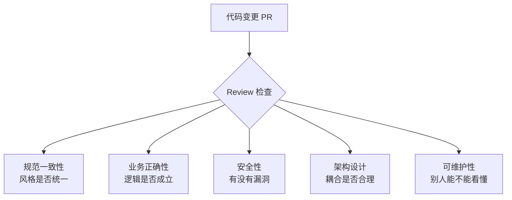

## Code Review 实践指南：对事不对人，让代码评审真正有效

作者：Artificer老王  |  更新时间：2026-08-03  |  阅读时长：约 18 分钟

周一早上，后端开发小陈提交了一个用户注册接口的 PR，三百多行代码，涉及参数校验、数据库写入、消息队列推送。

reviewer 老周扫了一眼，写了句 "LGTM"（Looks Good To Me），点了通过。

两周后线上出了事。

注册接口被注入了一条恶意数据，数据库写脏了，消息队列狂推了八千条重复消息，下游消费者直接被打爆。

复盘的时候翻到那个 PR，发现代码里有三个问题。

SQL 语句用的字符串拼接、消息推送没做幂等、参数校验漏了邮箱格式。

任何一个被指出来，都不至于上线。

老周说："我当时看了一眼，觉得逻辑大概没问题，就过了。"

再看另外一个案例。

reviewer 把每个缩进、每个命名都挑一遍，语气还冲。

"你这变量名起的什么玩意？"

"为什么不加注释？你是给自己看的？"

"这种低级错误也犯？"

看到这些消息后提 PR 的人心态炸了。

“行行行，你厉害，你说的都对，改完行了吧。”

下次再提 PR，能躲就躲，能合就合，代码质量没提升，团队氛围倒是搞差了。

这两种情况，一个太松，一个太碎。

其实问题都出在同一个地方。

都没搞清楚 Code Review 到底在 review 什么，以及怎么 review 才真正有效。

---

## 🔍 Code Review 到底在 Review 什么

### 定义

**Code Review（代码评审）是团队协作中由代码作者以外的成员对代码变更进行审查的实践，目的是在代码合入主干之前发现逻辑错误、安全风险、设计缺陷和可维护性问题，同时通过评审过程中的交流促进团队编码风格和知识经验的对齐。**

最最最最核心的关键在于：**Code Review 检查的是代码，不是写代码的人。**

但话说回来，既然有人参与其中，就不可能完全脱离"人"这个因素。

代码是人写的，review 是人做的，反馈也是人接的。

因此 Code Review 的过程中要对事要足够的严谨，对人要足够的尊重。

虽然你可能确实很牛，但是请牢记：Code Review 不是你秀优越感的地方。

Code Review 的目的，是让被 review 的人把注意力放在代码上，而不是放在自我防卫上。

说"对事不对人"容易，做到很难。

难在哪？难在沟通方式。

同样一个问题，"这段逻辑跟需求文档不一致，看看是不是漏了"和"你怎么连需求都没看清楚就写了？"

说的是同一件事，但接收者的感受完全不同。

前者会去看需求文档，后者会进入防御状态。

因此 Code Review 实践中要用两条腿走路。

一条是技术审查能力，看代码能不能发现问题。

另一条是沟通表达能力，发现问题后要考虑怎么说出来对方才能听得进去。

两条腿都得有，缺一条都走不稳。

### 关注维度图

Code Review 的检查范围可以拆成五个维度，每个维度回答一个核心问题：



五个维度不是并列的，有优先级。

**业务正确性和安全性是硬伤，必须拦住。**

**架构设计影响长远，要认真看。**

**规范一致性和可维护性属于质量提升，可以提建议但不必每次都卡。**

### 对事不对人的底层逻辑

"对事不对人"这句话在 Code Review 里有具体的操作含义：

| 维度   | 对事                       | 对人                 |
| ---- | ------------------------ | ------------------ |
| 描述问题 | "这段代码在第 42 行有空指针风险"      | "你怎么又没判空？"         |
| 提出建议 | "这里用参数化查询会更安全"           | "你不知道 SQL 拼接会注入吗？" |
| 表达期望 | "这个 PR 需要补充单元测试"         | "你能不能上点心？"         |
| 讨论方案 | "方案 A 和方案 B 各有利弊，你倾向哪个？" | "你选的方案不行，换一个"      |

区别在哪？

对事的表达聚焦于**代码本身的事实**（哪一行、什么问题、什么风险）。

对人的表达夹杂了**对作者能力或态度的评价**（你怎么、你能不能、你不知道、你问问谁谁谁、你看谁怎么怎么样）。

人是会带情绪的。

被评价能力的时候，本能反应是防御，而不是反思代码。

Code Review 要有效，就得让被 review 的人把注意力放在代码上，而不是放在自我防卫上。

这就是"对事不对人"的实操含义：**把你发现的问题用客观事实描述出来，不加对人的判断。**

---

## 🎯 能解决什么问题

| 问题场景                | 没有 CR 会怎样      | 有了 CR 会怎样           |
| ------------------- | -------------- | ------------------- |
| 逻辑漏洞（边界条件没处理）       | 上线后偶发崩溃，排查花半天  | review 时发现，改完再上线    |
| 安全风险（SQL 拼接、敏感信息泄露） | 被人利用，出安全事故     | review 时拦住，从源头杜绝    |
| 魔法数字和硬编码            | 后续维护改一个数字要全局搜索 | review 时指出，抽成常量     |
| 过度耦合的设计             | 改一个功能牵连三个模块    | review 时讨论方案，控制耦合范围 |
| 缺少测试                | 回归测试全靠手工，漏了就出事 | review 时要求补测试       |
| 团队风格不统一             | 每个人写的代码像不同项目   | review 逐步拉齐风格       |
| 知识孤岛                | 核心逻辑只有作者懂      | review 过程中知识自然扩散    |

注意看这张表，CR 解决的不只是"找 bug"。

**找 bug 是最低层价值，更高层的价值在于架构把关、知识共享和团队风格统一。**

**很多团队把 CR 用成了"查错工具"，这就浪费了一大半作用。**

---

## 🤔 什么时候做 Code Review

### 合适的时机

- **每次代码合入主干之前**：这是 CR 的标准时机。代码一旦进了主干，影响面就大了，再发现问题修复成本也高了。
- **PR 提交后 4 小时内开始**：及时响应是 CR 效率的关键。拖两天再 review，写代码的人上下文都忘光了，沟通成本翻倍。
- **功能开发到可测试状态**：不需要等整个功能全做完，一个可独立测试的子功能就可以提 PR 做 review，保持小步提交。

### 不适合用 CR 替代的场景

| 场景       | 为什么不适合           | 应该怎么做                 |
| -------- | ---------------- | --------------------- |
| 大规模架构重构  | 改动量大，review 很难看全 | 先做设计评审，方案定好再写代码       |
| 探索性技术验证  | 代码可能随时推翻         | 验证完确定方向后再 review      |
| 紧急线上故障修复 | 时间不允许走完整流程       | 修完上线后补 review，把问题记录下来 |
| 自动生成的代码  | 不是人写的，review 没意义 | review 生成器的配置和模板      |

CR 是代码合入前的质量关卡，但它替代不了前期的设计评审和后期的测试验证。

**它是一道防线，不是唯一防线。**

---

## ⚠️ 常见误区与陷阱

### 误区一：把 CR 当形式走过场

"LGTM" 式 review 等于没 review。

原因要么是 reviewer 没时间仔细看，要么是不想"得罪人"。

但 CR 走过场的危害比不做还大：给了虚假的安全感，出了问题还多了一份"已 review"的责任记录。

**应对方法**

建立 review 检查清单，reviewer 需要逐项确认。

对超过一定规模（比如 400 行）的 PR，要求至少两人 review。

### 误区二：纠结鸡毛蒜皮，忽略核心逻辑

花五分钟争论变量名用 `userInfo` 还是 `user_info`，却没花三十秒看一眼 SQL 语句是不是拼接的。

这种 review 看起来很认真，实际上把精力花在了低价值的地方。

**应对方法**

规范层面的问题交给 Lint 工具自动检查，人工 review 的精力放在业务逻辑、安全风险和架构设计上。

### 误区三：用攻击性语言提问题

这是技术人最容易犯的错。

两种杀伤力巨大的句式，看看你说过（或听过）没有？

**祈使句**："把这里改掉。""加个注释。""重新写。"

祈使句的潜台词是"你在下位，我在上位"，是一种命令。

在技术团队里，大家职级可能差不多，突然来一句祈使句，对方的感受是"你凭什么命令我"。

**反问句**："你不知道这里要判空吗？""这种写法没问题你不觉得吗？""为什么要用这个方法？"

反问句的潜台词是"你应该知道但你没做到"，是一种质疑。

被质疑的人第一反应不是反思代码，而是找理由为自己辩护。

两种句式都有个共同的特点：**把焦点从代码转移到了人身上。** 

一旦焦点转移，讨论就变成了辩论，辩论就变成了情绪对抗。

**应对方法**

把祈使句改成陈述句或疑问句，把反问句改成中性提问。

后面有一张话术对照表，也未必都对，参考着实践就可以。

### 误区四：PR 太大，review 不过来

一个 PR 两千行，reviewer 打开一看，心态直接崩了。

人的注意力是有限的，研究表明，一次 review 超过 400 行代码，发现问题的概率会急剧下降。

reviewer 要么草草扫一遍点通过，要么拖几天不看。

**应对方法**

控制 PR 规模。每次提交建议不超过 300 到 400 行。

大改动拆成多个小 PR，分批次提交。

如果一个功能确实很大，按模块或层级拆分，每个 PR 聚焦一个独立的子功能。

### 误区五：所有问题一视同仁

有些问题不改就没法上线（比如 SQL 注入），有些问题改了更好但不改也没事（比如变量名不够语义化）。

如果不区分优先级，被 review 的人看到一长串意见，可能先挑容易的改（改变量名），把重要的（补测试、修逻辑）放后面，甚至遗漏。

**应对方法**

每条意见标注级别。

| 级别            | 含义          | 示例                |
| ------------- | ----------- | ----------------- |
| 🔴 Blocking   | 必须修改，不改不能合入 | SQL 注入风险、空指针、逻辑错误 |
| 🟡 Suggestion | 建议修改，改了更好   | 命名优化、提取公共方法、补充注释  |
| 🔵 Nitpick    | 可选修改，纯属个人偏好 | 缩进风格、括号位置、注释措辞    |

标注级别的好处：被 review 的人知道哪些必须先改，哪些可以后面再说，不会眉毛胡子一把抓。

---

## 🛠️ 怎么做：检查清单与沟通技巧

### Review 检查清单

拿到一个 PR，按以下顺序检查。

总体原则是先看大局再看细节，先看逻辑再看格式。

#### 第一步：看大局

打开 PR 先别急着逐行看。

花两分钟搞清楚以下几个问题：

- 这个 PR 做了什么？（看标题和描述）
- 为什么做？（看关联的需求或 issue）
- 怎么做的？（快速浏览文件列表和主要改动）

搞清楚这几点，再开始逐行 review。

不了解意图就开始挑毛病，容易提出跟需求无关的意见。

#### 第二步：逐维度检查

| 维度       | 检查内容                    | 常见问题                               |
| -------- | ----------------------- | ---------------------------------- |
| **代码规范** | 命名风格、文件组织、导入顺序是否跟团队规范一致 | 变量名风格混用（驼峰和下划线混搭）、魔法数字、未使用的导入      |
| **业务逻辑** | 代码是否正确实现了需求，边界条件是否处理    | 空指针、数组越界、负数处理、并发竞态、事务边界不清          |
| **安全性**  | 是否存在注入、泄露、越权等风险         | SQL 拼接、XSS、硬编码密钥/密码、敏感信息记日志、权限校验缺失 |
| **架构设计** | 改动是否符合现有架构，是否引入不必要的耦合   | 跨层调用、循环依赖、上帝类膨胀、接口职责不清             |
| **可维护性** | 代码是否可读、可测试、可扩展          | 缺少注释、注释与代码不一致、无单元测试、方法过长、圈复杂度过高    |

每个维度应关注的重点如下：

**代码规范**：这一层主要靠工具。团队的 Lint 规则配置好之后，格式问题、未使用变量、缺少分号之类的自动就能拦住。人工 review 在规范层面重点看的是**命名是否语义清晰**和**文件组织是否合理**，而不是缩进用几个空格。

**业务逻辑**：这是 review 的核心。重点看边界条件：空值怎么处理？数组为空怎么办？负数进来会不会出问题？并发场景下有没有竞态？事务边界画对了吗？这些地方出问题往往不是逻辑写错了，而是**没想到某种输入情况**。

**安全性**：安全问题的特点是"平时没事，出事就是大事"。重点查：SQL 语句是不是拼接的？用户输入有没有过滤？密码、密钥、Token 有没有硬编码在代码里？异常信息有没有把堆栈直接返回给用户？日志里有没有打印敏感数据？权限校验有没有遗漏？

**架构设计**：看改动是否跟现有架构一致。比如项目是分层架构，那业务逻辑就不应该出现在 Controller 里。如果改动引入了对其他模块的直接依赖，要问一下：这个依赖是必要的，还是可以通过接口抽象解耦？

**可维护性**：最基本的一条：**注释是否与代码匹配**。改了代码但忘了改注释，比没有注释还误导人。其次看方法长度和圈复杂度，一个方法超过 80 行或者嵌套超过 4 层，就该考虑拆分了。最后看有没有测试，核心逻辑有没有被测试覆盖。

#### 第三步：魔法数字和硬编码专项

这一项单独拎出来强调，因为太常见了。

```java
// 反面示例
if (user.getStatus() == 3) {
    Thread.sleep(5000);
    retryCount = 3;
}

// 正面示例
if (user.getStatus() == UserStatus.LOCKED.getCode()) {
    Thread.sleep(RETRY_INTERVAL_MS);
    retryCount = MAX_RETRY_COUNT;
}
```

反面示例的代码能跑，但没人知道 `3` 是什么状态，`5000` 毫秒是怎么定的，`3` 次重试的依据是什么。

三个月后改需求，谁也不敢动这些数字，因为不知道改了会影响什么。

review 的时候遇到魔法数字，直接指出来：**"这里的 3 和 5000 建议抽成常量，加上命名说明含义。"**

### PR 规模控制

| PR 行数      | Review 质量     | 建议   |
| ---------- | ------------- | ---- |
| < 100 行    | 逐行看，问题发现率高    | 理想状态 |
| 100-300 行  | 能仔细看完         | 正常范围 |
| 300-400 行  | 需要分块看，注意力开始下降 | 上限   |
| 400-1000 行 | 草草扫一遍，容易漏     | 拆分   |
| > 1000 行   | 基本等于没 review  | 必须拆分 |

拆分策略：

- 按功能模块拆：一个 PR 只做一个子功能
- 按层级拆：先提数据层改动，再提业务逻辑，最后提接口层
- 先提基础设施改动（新增工具类、配置文件），再提使用这些基础设施的业务代码

### 自动化工具搭配

人工 review 的精力有限，能交给工具的就不要自己看。

| 检查项     | 工具                               | 说明                 |
| ------- | -------------------------------- | ------------------ |
| 代码格式    | ESLint / Prettier / clang-format | 配置团队规范，CI 自动拦截     |
| 静态分析    | SonarQube / CodeQL               | 检测潜在 bug、安全漏洞、代码异味 |
| 安全扫描    | Snyk / Dependabot                | 依赖漏洞、已知 CVE 检测     |
| 单元测试覆盖率 | JaCoCo / Istanbul                | CI 中设置覆盖率门槛        |
| 类型检查    | TypeScript / mypy                | 编译期拦截类型错误          |


**工具能发现的，就不要让人看了；人看的，应该是工具发现不了的。** 

逻辑对不对、设计合不合理、命名清不清晰，这些是需要人判断的，交给工具也没用。

### 沟通话术对照表

这是整篇文章里最重要的部分。

技术实力大家基本都差不多，但是沟通能力和表达能力的差距就很大了。

同样一个问题，换个说法，效果会天差地别。

| 场景     | 攻击性表达（避免）        | 建设性表达（推荐）                                        |
| ------ | ---------------- | ------------------------------------------------ |
| 指出逻辑错误 | "你这逻辑根本跑不通"      | "第 42 行的循环条件，当 list 为空时会跳过处理，跟需求里的'空列表返回默认值'不一致" |
| 指出安全风险 | "SQL 拼接你不知道会注入？" | "这里的 SQL 用了字符串拼接，建议改成参数化查询，参考第 88 行的写法"          |
| 要求加注释  | "加个注释这么难？"       | "这段逻辑比较复杂，加几行注释说明意图会更清晰"                         |
| 建议换方案  | "你这方案不行"         | "方案 A 和方案 B 都能实现，A 更简单但扩展性差一些，你倾向哪个？"            |
| 要求补测试  | "核心逻辑没测试你敢提？"    | "这个方法没有对应的单元测试，建议补一下边界条件的用例"                     |
| 指出命名问题 | "这变量名起的什么玩意"     | "`data` 这个命名太泛了，改成 `userProfileList` 会更明确"       |
| 指出魔法数字 | "这 3 是什么意思谁知道"   | "这里的 3 建议抽成常量，加上命名说明含义，比如 `MAX_RETRY_COUNT`"     |
| 要求拆分方法 | "这方法太长了谁看得完"     | "这个方法有 120 行，建议按职责拆成三个方法，可读性会好很多"                |

规律总结：

- **描述事实，不加评价**："第 42 行有空指针风险"是事实，"你怎么又没判空"是评价。
- **用"建议"代替"必须"**（除非真的是 Blocking 问题）："建议改成参数化查询"比"必须改"更容易接受。
- **给方向，不给命令**："参考第 88 行的写法"比"照着改"更有帮助。
- **提问代替反问**："你这里用 ArrayList 的考虑是什么？"比"为什么不用 LinkedList？"更让人愿意回答。

这套话术的目的只有一个：把沟通的焦点始终锚定在代码上。

**你讨论的是代码的问题，跟人的能力无关。**

---

## 📋 实战案例：一个用户注册接口的 Code Review

### 场景背景

后端开发小陈提交了一个用户注册接口的 PR，reviewer 是技术负责人老周。

PR 描述：新增用户注册接口，支持邮箱注册，包含参数校验、数据库写入、欢迎邮件发送。

代码主要部分（Java，仅为示意）：

```java
public class UserService {

    public boolean register(String email, String password) {
        // 参数校验
        if (email == null || password == null) {
            return false;
        }

        // 检查邮箱是否已注册
        String sql = "SELECT * FROM users WHERE email = '" + email + "'";
        List<User> existing = jdbcTemplate.query(sql, new UserRowMapper());
        if (!existing.isEmpty()) {
            return false;
        }

        // 密码加密并存储
        String encryptedPwd = MD5.encrypt(password);
        String insertSql = "INSERT INTO users (email, password, status) VALUES ('"
            + email + "', '" + encryptedPwd + "', 1)";
        jdbcTemplate.execute(insertSql);

        // 发送欢迎邮件
        sendWelcomeEmail(email);

        return true;
    }

    private void sendWelcomeEmail(String email) {
        // 发送邮件
        MailSender.send("smtp.company.com", 587, "noreply@company.com",
            "password123", email, "欢迎注册", "欢迎加入！");
    }
}
```

### Review 过程

老周拿到 PR 后的 review 记录：

---

**🔴 Blocking-1：SQL 注入风险（第 12 行、第 20 行）**

> 第 12 行和第 20 行的 SQL 使用了字符串拼接，存在注入风险。如果 email 参数中包含单引号或其他特殊字符，可以构造恶意 SQL。建议改成参数化查询：
>
> ```java
> // 查询
> String sql = "SELECT * FROM users WHERE email = ?";
> List<User> existing = jdbcTemplate.query(sql, new Object[]{email}, new UserRowMapper());
>
> // 插入
> String insertSql = "INSERT INTO users (email, password, status) VALUES (?, ?, ?)";
> jdbcTemplate.update(insertSql, email, encryptedPwd, 1);
> ```

---

**🔴 Blocking-2：密码使用 MD5 加密（第 17 行）**

> MD5 已被证明不安全，存在彩虹表攻击风险。建议使用 BCrypt 或 Argon2，并加随机盐。可以参考项目中 `AuthUtils.hashPassword()` 方法，已经封装好了。

---

**🔴 Blocking-3：硬编码敏感信息（第 28-29 行）**

> `sendWelcomeEmail` 方法中，SMTP 服务器地址、账号名、密码都硬编码在代码里。`"password123"` 这种明文密码出现在源码中是严重的安全隐患，代码一旦泄露密码就暴露了。建议所有邮件配置放到配置文件或环境变量中，通过 `@Value` 注入。

---

**🟡 Suggestion-1：参数校验不完整（第 8-10 行）**

> 目前的校验只判断了 null，没有校验格式。空字符串、非法邮箱格式（比如 "abc"）都能通过。建议补充：
>
> - email 用正则或 `@Email` 注解校验格式
> - password 校验长度和复杂度（至少 8 位，包含字母和数字）

---

**🟡 Suggestion-2：缺少事务管理**

> `register` 方法中有数据库写入和邮件发送两个操作。如果邮件发送失败，用户已经写入数据库了，但没收到欢迎邮件。建议加事务管理，或者把邮件发送改成异步消息队列，解耦主流程。

---

**🟡 Suggestion-3：缺少单元测试**

> 核心逻辑没有对应的单元测试。建议补充以下用例：
>
> - 正常注册（合法邮箱+合法密码）
> - 邮箱已注册（应返回 false）
> - 邮箱格式非法（应返回 false）
> - 密码为空（应返回 false）

---

**🟡 Suggestion-4：魔法数字（第 20 行）**

> 第 20 行的 `1` 是用户状态码，建议抽成常量或枚举，比如 `UserStatus.ACTIVE.getCode()`。否则三个月后没人记得 `1` 代表什么状态。

---

**🔵 Nitpick-1：方法职责过多**

> `register` 方法同时做了参数校验、查重、加密、存储、发邮件五件事，建议按职责拆分。不过这个可以放到后续重构中处理，不阻塞本次合入。

---

### Review 结果

老周在 PR 中留了 3 个 Blocking、4 个 Suggestion、1 个 Nitpick，整体沟通语气保持客观，每条意见都给了具体位置和修改建议。

小陈收到 review 后的反应：先看 🔴 Blocking 的三条，SQL 注入和硬编码密码确实是自己疏忽了，MD5 是图省事用了旧工具类。三个 Blocking 全部修了。🟡 Suggestion 里邮箱格式校验和单元测试这次补上，事务管理跟架构改动有关，跟老周讨论后决定放到下一个迭代。🔵 Nitpick 记到技术债列表里，后续重构时处理。

改完后小陈更新了 PR，老周复核确认 Blocking 全部修复，点了通过。

### 这个案例说明了什么

1. **review 顺序是先看安全再看逻辑最后看规范**：老周先拦住了 SQL 注入和硬编码密码，这些是上线就会出事的。参数校验和测试是 Suggestion，不卡但建议改。方法拆分是 Nitpick，记到技术债后面再说。
2. **每条意见都给了具体位置和修改建议**：光说"这里有问题"没用，要告诉你在哪一行、什么问题、怎么改。被 review 的人改起来才有方向。
3. **沟通语气全程客观**：没有"你怎么""为什么不"这类表达。每条意见都是"代码中的事实+建议"，焦点始终在代码上。
4. **不是所有问题都要这次改完**：Blocking 必须改，Suggestion 看情况，Nitpick 可以后面再说。分清主次，避免 review 变成无止境的改改改。

---

## 📌 总结

Code Review 表面上审的是代码，实际上考验的是团队的沟通文化。

技术问题好发现，沟通方式难把握。

一个团队 review 做得好不好，不看出了多少条意见，看的是提意见的人和接意见的人，是不是都在讨论代码，而不是在较劲谁对谁错。

把焦点放在代码上，把尊重留给写代码的人。

这才是"对事不对人"真正该有的样子。

---

本文首发于公众号 **Artificer老王的学习笔记**，转载请注明出处。
