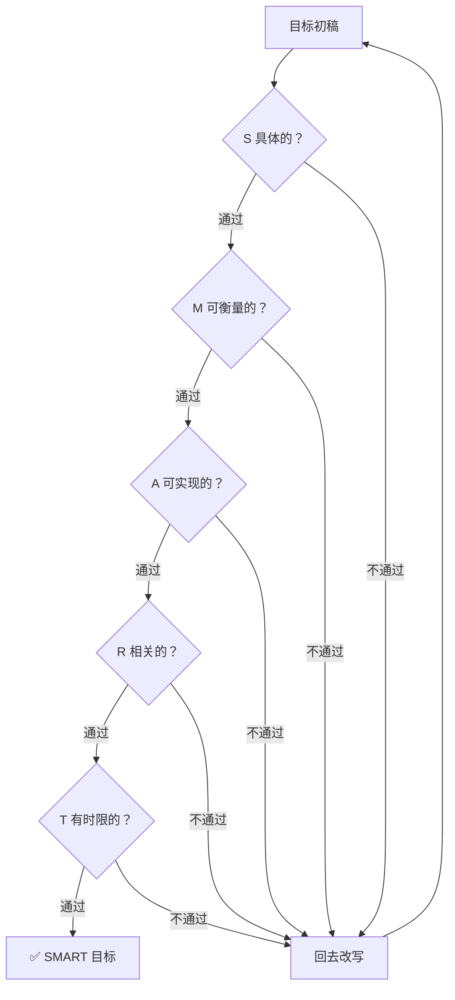

## SMART 方法：五个标准把模糊愿望变成可执行目标

作者：Artificer老王  |  更新时间：2026-08-02  |  阅读时长：约 15 分钟

季度规划会上，研发负责人老张在白板上写下 Q3 目标：

> 提升系统性能  
> 优化用户体验  
> 减少线上故障  
> 推进技术架构升级

底下的人面面相觑。

"提升系统性能"提升多少？哪个接口？到什么水平算达标？

"优化用户体验"优化哪块体验？怎么衡量？用户满意度问卷还是转化率？

"减少线上故障"减到多少？P0 还是 P1？跟上个季度比还是跟行业比？

没人能回答。

于是大家各凭理解去干，季度末一复盘，每个人都说自己"做了"，但没人说得清"做到了没有"。

这种场景在技术团队里太常见了。

不是团队不努力，是目标本身写得太模糊，模糊到没法执行、没法跟踪、没法评估。

**SMART 方法**就是用来解决这个问题的。

它不替你决定目标该是什么，但它给你五个标准，逼你在定目标时把"具体做什么、怎么衡量、能不能做到、跟什么相关、什么时候完成"想清楚，让每个目标都有明确的边界和验收条件。

---

## 🔍 SMART 是什么

### 定义

**SMART 是一种目标设定框架，通过五个标准（Specific 具体的、Measurable 可衡量的、Achievable 可实现的、Relevant 相关的、Time-bound 有时限的）检验目标的质量，确保每个目标都足够清晰、可跟踪、可评估，从而把模糊的愿望转化为可执行的计划。**

| 标准   | 英文         | 核心问题                 | 检验方向   |
| ---- | ---------- | -------------------- | ------ |
| 具体的  | Specific   | 目标到底要做什么？谁负责？在哪个范围？  | 消除歧义   |
| 可衡量的 | Measurable | 怎么判断做到了？用什么指标？达标线在哪？ | 定义验收标准 |
| 可实现的 | Achievable | 以现有资源和能力能做到吗？难在哪？    | 评估可行性  |
| 相关的  | Relevant   | 这个目标跟业务目标/团队使命有什么关系？ | 确认方向正确 |
| 有时限的 | Time-bound | 什么时候完成？有没有中间检查点？     | 设定时间约束 |

三个要点：

- **五个标准是"与"关系**：一个目标必须同时满足五个标准才算合格。满足四个不行，漏掉任何一个都会让目标在执行时出问题。比如"具体、可衡量、可实现、有时限"但"不相关"，结果就是完美地做了一件不该做的事。
- **五个标准的顺序有讲究**：先想清楚做什么（S），再想怎么衡量做到没有（M），再评估能不能做到（A），再确认该不该做（R），最后定什么时候完成（T）。跳步容易返工。
- **每个标准都要能验证**：不是自己觉得"差不多就行"，而是换一个人来看你的目标描述，能判断出是否达标。如果你的目标只有你自己能看懂，说明还不够 SMART。

### 五维过滤图

SMART 的精髓在于把目标当作"待检验品"，依次通过五个过滤器的检验，全部通过才算合格：

这张图想说的就一件事：**五个标准是逐个关卡，任何一个不过关就要打回重写，不能凑合。**

### 它从哪来

SMART 的概念最早出现在 1981 年，George T. Doran 在《Management Review》上发表了一篇文章，标题是"There's a S.M.A.R.T. way to write management's goals and objectives"。

Doran 当时的原版定义跟现在略有不同：他的 A 是 Assignable（可分配的），R 是 Realistic（现实的）。

后来在实践中逐渐演变，A 变成了 Achievable（可实现的），R 变成了 Relevant（相关的），形成了今天最通用的版本。

SMART 的思想源头可以追溯到 Peter Drucker 在 1954 年提出的目标管理理论（Management by Objectives, MBO）。

Drucker 认为，目标应该是具体的、可衡量的、有时间约束的，只不过他没有把它浓缩成一个缩写词。

从企业管理到项目管理，再到绩效考核、OKR 制定、个人发展规划，SMART 的应用范围越来越广。

原因很简单：**任何需要"把目标说清楚让别人能执行"的场景，都需要一套检验目标质量的标准。**

---

## 🎯 SMART 能解决什么问题

先明确一件事：**SMART 不替你决定目标该是什么，它给你的是检验目标质量的标准。**

它的价值在于帮你把"感觉挺有道理但说不清楚"的目标，变成"拿出去就能执行和跟踪"的目标。

SMART 能帮你解决的问题大概有这么几类：

### 1. 季度/项目目标的制定

技术团队最常见的场景：季度规划会上定目标。

如果目标写成"提升代码质量"或"优化系统性能"，执行时就会出现每个人理解都不一样的问题。

开发觉得代码质量是指圈复杂度，测试觉得是指 bug 率，产品觉得是指用户感知到的流畅度。

SMART 强制你把"提升代码质量"变成"将核心模块的单元测试覆盖率从 40% 提升到 80%，12 月 31 日前完成"这样的表述，歧义就没空间了。

### 2. 绩效目标的设定

个人绩效考核最怕的是"说了跟没说一样"。

"提升技术能力"是一个典型的无效绩效目标。

提升什么技术能力？怎么衡量？什么时候验收？

用 SMART 改写：在 Q3 内独立完成一个微服务拆分项目，服务从单体拆为 3 个独立服务，接口 P99 延迟降低 30%，通过代码评审和性能测试验收。

这样到季度末，做到没有一目了然。

### 3. 需求验收标准的定义

产品经理提需求，开发问"做到什么程度算完成"，产品说"差不多就行"。

这种模糊的验收标准是扯皮的根源。

用 SMART 把验收标准写清楚：首页加载时间从 3.2 秒降到 1.5 秒以内（可衡量），通过 Lighthouse 性能评分 90+ 验证（具体的），在下个版本发布时上线（有时限的），基于现有 CDN 和懒加载方案可实现（可实现的），直接影响用户留存率（相关的）。

需求评审时对照这五条，达成一致，后面就不会来回扯。

### 4. 技术方案的可行性评估

技术方案评审时，经常遇到"方案看起来很好但不确定能不能落地"的情况。

SMART 帮你从可行性角度拆解：这个方案要做什么（S），怎么验证效果（M），以现有团队的技术栈和时间能不能做到（A），跟当前业务优先级是否匹配（R），什么时候能上线（T）。

五个维度过了一遍，方案的可行性就清晰了，不会出现"方案通过了但执行时发现根本做不了"的尴尬。

### 5. 团队目标的对齐和拆解

大目标定下来后，需要拆解到团队和个人。

如果大目标本身就不清晰，拆解到下面只会更乱。

SMART 先把大目标写清楚，再按团队职能拆解。比如"Q3 将系统可用性从 99.9% 提升到 99.95%"这个大目标，可以拆成：运维负责监控覆盖率和故障响应时间，开发负责减少导致故障的代码缺陷，DBA 负责数据库高可用方案。

每个子目标都过一遍 SMART，确保可执行。

下面这张表把 SMART 能解决的问题类型做个汇总：

| 问题类型 | 典型场景         | SMART 提供什么     |
| ---- | ------------ | -------------- |
| 目标制定 | 季度规划、项目立项    | 五维度检验，消除歧义     |
| 绩效管理 | 个人 OKR、季度考核  | 可衡量、可验收的目标描述   |
| 需求验收 | 需求评审、上线标准    | 明确的验收标准和达标线    |
| 方案评估 | 技术评审、可行性分析   | 可行性和相关性的结构化检查  |
| 目标拆解 | 大目标拆子目标、团队分工 | 每层目标都有清晰边界和责任人 |

---

## 🤔 什么时候该用 SMART

这是最实际的问题。

面对一个具体场景，你怎么判断"这个该用 SMART"还是"该用别的方法"？

如果一个场景同时满足以下三个条件，SMART 就是一个合适的切入点：

**信号一：目标需要被别人执行或评估。**

如果你是自己给自己定个计划，模糊一点也无所谓，反正自己心里有数。

但一旦目标需要交给团队执行，或者需要被上级评估，模糊就是灾难。

每个人对"提升性能"的理解可能完全不同，执行出来的东西南辕北辙。

SMART 适合的就是这种"目标需要从一个人传递到另一个人"的场景。

**信号二：目标需要可跟踪和可验收。**

有些目标定完就完了，中间不跟踪，事后不验收。

这种目标定不定都一样。

但如果你需要在执行过程中跟踪进度，在结束时判断"做到没有"，就需要目标本身具备可衡量性（M）和有时限性（T）。

SMART 正好管这个。

**信号三：目标的表述还存在歧义。**

如果你能拿目标描述去问三个不同的人，得到三种不同的理解，说明这个目标还不够 SMART。

反过来，如果目标已经非常清晰，换谁来读理解都一样，说明已经达标了，不需要再套 SMART 框架。

### SMART 不适合的场景

反过来，以下场景就不要硬套 SMART：

| 不适合的场景   | 为什么不适合             | 更合适的方法      |
| -------- | ------------------ | ----------- |
| 纯探索性研究   | 不知道终点在哪，无法定义"做到"   | 假设驱动、里程碑法   |
| 紧急故障响应   | 需要即时行动，没时间定目标      | 应急预案、SOP    |
| 创意头脑风暴   | 需要发散，过早约束会扼杀创意     | 自由发散、延迟评判   |
| 高度不确定环境  | 条件变化太快，目标刚定就过时     | 敏捷迭代、滚动规划   |
| 个人学习意愿表达 | 学习方向本身就是模糊的，需要保留弹性 | 方向性描述+阶段性检查 |

### SMART 与其他分析框架的关系

SMART 不是万能的，它和其他框架是互补关系。

根据场景选择合适的工具：

| 框架    | 侧重点       | 适合的场景       | 与 SMART 的关系                  |
| ----- | --------- | ----------- | ---------------------------- |
| SMART | 目标质量检验    | 任何需要设定目标的场景 | 基础框架，先过 SMART 检验             |
| OKR   | 目标对齐和结果跟踪 | 团队/组织级目标管理  | OKR 的 Objective 用 SMART 检验质量 |
| KPI   | 绩效考核和量化管理 | 长期稳定的指标管理   | KPI 的制定标准就是 SMART            |
| SWOT  | 内部+外部综合盘点 | 决策前的局势摸底    | SWOT 分析完之后用 SMART 落地目标       |
| PDCA  | 执行和改进闭环   | 持续改进流程      | SMART 是 PDCA 的 Plan 阶段工具     |

一个常见的组合用法：先用 SWOT 做局势分析确定方向，再用 SMART 把方向转化为具体目标，用 OKR 做目标对齐和跟踪，最后用 PDCA 在执行中持续改进。

---

## ⚠️ SMART 的局限性

SMART 好用，但它也不是万能的。

用错了场景或用得太机械，反而会让目标设定变成形式主义的文字游戏。

它本身就存在以下几个问题（可能还有其他的，但这里只说明几种最突出的）。

### 1. 容易变成"文字游戏"

SMART 的五个标准看起来不难，操作起来也容易。

但改写目标的过程容易陷入"抠字眼"。

花两小时讨论"提升"和"优化"哪个词更 Specific，却忘了问"这个目标到底值不值得做"。

目标表述完美了，方向可能是错的。

**怎么应对呢？**

先确认方向再抠表述。

在过 SMART 五维度之前，先问一句"为什么要做这个目标"。

如果回答不上来，SMART 改写得再漂亮也没用。

方向对了，再用 SMART 精细化。

方向没定，先做 SWOT 或业务分析。

### 2. "可实现"和"有时限"容易打架

Achievable 和 Time-bound 之间存在天然张力。

时限压得紧，目标就变得不那么"可实现"。

把时限放宽，目标倒是"可实现"了，但可能失去了紧迫感。

常见的情况是：为了让目标看起来"有挑战性"，把时限压得很紧，结果执行时发现根本做不完，要么降标准要么延期，目标形同虚设。

**怎么应对呢？**

定时间线时参考历史数据。

上次类似的工作花了多长时间？这次有什么不同？有没有可以并行的部分？

如果历史数据不够，先定一个初步时限，在执行第一个里程碑后根据实际进度校准。

不要一开始就把时限焊死。

### 3. 不适合探索性和创新型目标

SMART 的五个标准都隐含一个前提：你知道终点在哪。

Specific 要求你描述清楚"做什么"，Measurable 要求你定义"怎么算做到"，Time-bound 要求你给出"什么时候完成"。

但探索性工作（比如"研究某项新技术是否适合我们的场景"）的终点本身就是未知的。

你可能研究一周就得出结论"不适合"，也可能研究三个月才发现一个意想不到的应用方向。

硬给这类目标套 SMART，要么把目标写得很假（"在 3 个月内完成新技术的全面评估"），要么把探索过程压缩成机械的交付物清单。

**怎么应对呢？**

探索性目标用里程碑法替代 SMART。

不定义"最终做到什么"，而是定义"第一阶段探索什么，什么时候检查点，根据检查结果决定下一步"。

保留灵活性，同时有节奏感。

### 4. Relevant 维度最关键但最容易被跳过

五个维度里，Specific、Measurable、Achievable、Time-bound 都比较容易检验，唯独 Relevant 最难。

因为"相关"是一个主观判断。

目标跟什么相关？跟公司战略？跟团队 OKR？跟个人成长？跟用户价值？

很多人在过 SMART 检查时，前四个维度认认真真过，到 Relevant 时写一句"与团队目标一致"就糊弄过去了。

结果就是完美地做了一件不该做的事。

**怎么应对呢？**

Relevant 维度要具体写"跟什么相关"。

不要写"与公司战略一致"，要写"支撑公司 Q3 的用户留存提升目标，预计贡献留存率提升 0.5 个百分点"。

关联越具体，越容易在执行中保持聚焦。

### 5. 只管"目标好不好"不管"目标对不对"

SMART 是一个"质量检验"工具，不是"方向决策"工具。

它能帮你把一个目标写得更清晰、更可执行，但如果一开始选错了目标，SMART 只会让你在错误的方向上走得更高效。

这就像 GPS 导航：SMART 能帮你把路线规划得很精确，但如果目的地设错了，开得越快离目的地越远。

**怎么应对呢？**

在用 SMART 之前，先花时间确认"这个目标值不值得做"。

可以用 SWOT 分析局势，可以用 5W1H 定义问题，可以用业务数据分析 ROI。

确认方向后再用 SMART 落地。

### 局限性速查表

| 局限           | 具体表现           | 应对方法             |
| ------------ | -------------- | ---------------- |
| 文字游戏         | 花太多时间抠措辞       | 先确认方向再抠表述        |
| 可实现与有时限矛盾    | 时限太紧做不完，太松没紧迫感 | 参考历史数据，里程碑后校准    |
| 不适合探索性目标     | 终点未知，无法定义"做到"  | 用里程碑法替代          |
| Relevant 被跳过 | 最关键的维度最容易被糊弄   | 具体写出跟什么相关        |
| 只管质量不管方向     | 目标写得好但方向可能错    | 先决策方向再用 SMART 落地 |

---

## 🛠️ 如何运用 SMART

完整的 SMART 目标设定不止"把目标改写得好看一点"，它是一套多步骤的流程。

下面是标准流程（可以参考使用）。

### 第一步：明确目标领域

SMART 必须有一个明确的目标领域。

不要写"用 SMART 方法制定 Q3 目标"，要写"用 SMART 方法制定 Q3 技术团队的 API 性能优化目标"。

领域越具体，后面改写越聚焦。

❌ 错误示例："给团队定一下季度的 SMART 目标"（太宽泛，什么都往里塞）

✅ 正确示例："给 Q3 技术团队制定 API 网关 P99 延迟优化的 SMART 目标"

### 第二步：写出初版目标

用最朴素的语言把目标写出来，不用管措辞好不好。

这一步的目的是把脑子里的想法落到纸面上，让大家有一个讨论的基础。

初版目标通常是模糊的，没关系，后面会改。

比如初版可能是："把接口性能提上去"或者"减少用户投诉"。

### 第三步：逐条过 SMART 五维度

拿初版目标，依次对照五个标准检验：

- **S 具体的**：目标里有没有说清楚做什么、谁负责、在哪个范围？如果换一个人来读，能准确理解吗？
- **M 可衡量的**：怎么判断做到了？有没有量化指标？达标线在哪？
- **A 可实现的**：以现有的人力、技术、时间，能做到吗？有什么风险？需要什么前置条件？
- **R 相关的**：这个目标跟什么业务目标或团队使命相关？做这件事的价值是什么？
- **T 有时限的**：什么时候完成？有没有中间检查点？

每个维度给一个判断：✅ 已达标 / ❌ 未达标 / ⚠️ 部分达标。

### 第四步：改写不达标的目标

针对未达标或部分达标的维度，补充信息，改写目标。

改写时遵循一个原则：**每改一版，重新过一遍五维度。** 

因为修一个维度可能会影响另一个维度。

比如你把"提升性能"改具体了（S），可能发现"可衡量"（M）也需要同步补充指标。你加了量化指标（M），可能发现"可实现"（A）需要重新评估。

反复几轮，直到五个维度全部达标。

### 第五步：输出目标清单和跟踪计划

把改写好的目标整理成清单，同时制定跟踪计划：

| 目标           | 负责人    | 验收标准       | 截止日期   | 中间检查点   |
| ------------ | ------ | ---------- | ------ | ------- |
| （SMART 目标描述） | （具体到人） | （量化指标+达标线） | （具体日期） | （里程碑日期） |

到这一步，SMART 目标才真正落地为可执行、可跟踪的计划。

### 完整流程图

注意最后的虚线回环：目标不是定完就锁死的。执行过程中如果发现环境变了或目标方向偏了，要回到第一步重新审视。

---

## 📋 实战案例：技术团队制定 Q3 季度目标

来看一个完整案例，把上面的流程走一遍。

### 背景

技术团队负责人老张在 Q3 规划会上写下四个目标：

1. 提升系统性能
2. 优化用户体验
3. 减少线上故障
4. 推进技术架构升级

团队成员看了之后反应：

- 开发小李："性能要提升到多少？哪些接口优先？"
- 运维小王："故障减少到什么程度？P0 还是 P1 都算？"
- 产品小赵："用户体验优化哪块？首页加载还是支付流程？"
- 架构师老周："架构升级升到什么程度？微服务拆分还是只是容器化？"

老张答不上来。

他意识到，这些目标写得太模糊，没法执行。于是用 SMART 方法逐条改写。

### 第一步：明确目标领域

**目标领域：Q3 技术团队四个方向的目标制定。**

- 方向一：API 网关性能优化（对应"提升系统性能"）
- 方向二：支付链路体验优化（对应"优化用户体验"）
- 方向三：系统稳定性提升（对应"减少线上故障"）
- 方向四：核心服务容器化改造（对应"推进技术架构升级"）

### 第二步：写出初版目标

初版目标就是老张在白板上写的原话：

1. 提升系统性能
2. 优化用户体验
3. 减少线上故障
4. 推进技术架构升级

### 第三步：逐条过 SMART 五维度

**目标一："提升系统性能"**

| 维度     | 判断 | 问题                        |
| ------ | -- | ------------------------- |
| S 具体的  | ❌  | 提升哪个系统的什么性能？CPU？内存？延迟？吞吐？ |
| M 可衡量的 | ❌  | 提升多少？从多少到多少？              |
| A 可实现的 | ⚠️ | 没有评估过现有瓶颈和优化空间            |
| R 相关的  | ⚠️ | 没说跟什么业务目标相关               |
| T 有时限的 | ❌  | 什么时候完成？                   |

**目标二："优化用户体验"**

| 维度     | 判断 | 问题                      |
| ------ | -- | ----------------------- |
| S 具体的  | ❌  | 哪个产品？哪个功能模块？什么体验？       |
| M 可衡量的 | ❌  | 怎么衡量"优化了"？满意度？转化率？加载时间？ |
| A 可实现的 | ⚠️ | 没有评估过需要多少设计和开发工作量       |
| R 相关的  | ⚠️ | 没说优化体验跟什么业务指标挂钩         |
| T 有时限的 | ❌  | 什么时候上线？                 |

**目标三："减少线上故障"**

| 维度     | 判断 | 问题               |
| ------ | -- | ---------------- |
| S 具体的  | ❌  | 减少什么级别的故障？哪个服务的？ |
| M 可衡量的 | ⚠️ | "减少"是定性描述，没有量化   |
| A 可实现的 | ⚠️ | 没有评估现有故障的主要成因    |
| R 相关的  | ✅  | 减少故障显然跟业务稳定相关    |
| T 有时限的 | ❌  | Q3 全季还是某个节点？     |

**目标四："推进技术架构升级"**

| 维度     | 判断 | 问题                           |
| ------ | -- | ---------------------------- |
| S 具体的  | ❌  | "推进"到什么程度？拆微服务？上 K8s？引入消息队列？ |
| M 可衡量的 | ❌  | 怎么算"推进了"？                    |
| A 可实现的 | ⚠️ | 没有评估团队是否有相关经验                |
| R 相关的  | ⚠️ | 架构升级的驱动力是什么？                 |
| T 有时限的 | ❌  | 什么时候完成？                      |

### 第四步：改写不达标的目标

针对每个目标的问题，补充信息，逐条改写。

**目标一改写：API 网关性能优化**

原版："提升系统性能"

改写后：将 API 网关的 P99 延迟从当前 800ms 降至 300ms 以内（S+M），通过优化网关层缓存策略和下游服务连接池配置实现，现有团队 2 人投入可行（A），直接支撑 Q3 用户活跃度增长目标，延迟每降低 100ms 预计提升日活 1.5%（R），10 月 31 日前完成，中间检查点 10 月 15 日评估进度（T）。

**目标二改写：支付链路体验优化**

原版："优化用户体验"

改写后：将支付完成页的平均加载时间从 3.2 秒降至 1.5 秒以内（S+M），通过前端懒加载+CDN 静态资源加速+后端支付接口异步化实现，设计 1 人+开发 2 人投入，参考竞品方案可行（A），直接影响支付转化率，预计每月减少因超时导致的订单流失 8%（R），10 月 15 日前上线，9 月 30 日前完成内测（T）。

**目标三改写：系统稳定性提升**

原版："减少线上故障"

改写后：将 Q3 期间的 P0 级故障数量从 Q2 的 4 次降至 0 次，P1 级故障从 8 次降至 3 次以内（S+M），通过补充核心链路监控告警覆盖、建立故障应急 SOP、每月一次容灾演练实现（A），直接保障 Q3 大促期间系统稳定性（R），Q3 全季跟踪，每月 1 日检查上月数据（T）。

**目标四改写：核心服务容器化改造**

原版："推进技术架构升级"

改写后：将订单服务和支付服务从虚拟机部署迁移到 K8s 容器化部署，实现自动扩缩容和滚动发布（S），迁移成功率 100%，迁移后资源利用率提升 30% 以上（M），团队已有 1 人具备 K8s 生产经验，外部专家支持 2 周，可行（A），支撑 Q4 大促弹性扩容需求，避免重蹈 Q2 流量峰值扩容慢的覆辙（R），10 月 31 日前完成迁移，11 月 7 日前完成全量验证（T）。

### 第五步：输出目标清单和跟踪计划

| 目标                               | 负责人        | 验收标准                     | 截止日期      | 中间检查点      |
| -------------------------------- | ---------- | ------------------------ | --------- | ---------- |
| API 网关 P99 延迟从 800ms 降至 300ms 以内 | 架构师老周      | 监控面板连续 7 天 P99 < 300ms   | 10 月 31 日 | 10 月 15 日  |
| 支付完成页加载时间从 3.2s 降至 1.5s 以内       | 开发小李+设计小赵  | Lighthouse 性能评分 90+，内测通过 | 10 月 15 日 | 9 月 30 日   |
| Q3 P0 故障降至 0 次，P1 故障降至 3 次以内     | 运维小王       | 月度故障统计报表                 | Q3 全季     | 每月 1 日     |
| 订单+支付服务迁移 K8s                    | 架构师老周+运维小王 | 迁移成功率 100%，资源利用率提升 30%+  | 11 月 7 日  | 10 月 20 日  |

### 案例复盘

这个案例走完了 SMART 从"模糊愿望"到"可执行目标"的完整链路。

几个关键点：

- **改写前后的差距是质变**。"提升系统性能"和"P99 延迟从 800ms 降至 300ms 以内"不是同一个目标，前者是愿望，后者是承诺。
- **Relevant 维度是"定心丸"**。每个目标都写了跟什么业务价值相关，执行过程中遇到困难时，团队知道"为什么要咬牙坚持"，而不是"领导让做的"。
- **中间检查点比截止日期更重要**。只定截止日期，到了最后一天才发现来不及，只能延期或降标准。有中间检查点，提前发现问题还有调整空间。
- **"可实现"不是"轻松做到"**。目标是"跳一跳够得着"的难度，不是"站着就能拿到"的难度，也不是"跳断腿也够不着"的难度。参考历史数据和团队能力来定。
- **SMART 是讨论的工具，不是老张一个人的事**。改写过程中，开发说"这个时限不够"，运维说"这个指标测不了"，这些反馈正是 SMART 要暴露的问题。一个人闷头写出来的 SMART 目标，大概率在执行时出问题。

---

## 📌 总结

- **SMART 是什么**：一种通过五个标准（Specific、Measurable、Achievable、Relevant、Time-bound）检验目标质量的框架，帮你把模糊的愿望变成可执行、可跟踪、可评估的目标。核心逻辑是逐个关卡过滤，五个标准全部通过才算合格。
- **能解决什么**：季度/项目目标制定、个人绩效目标设定、需求验收标准定义、技术方案可行性评估、团队目标对齐和拆解。注意它提供的是"目标质量检验标准"，不是目标本身。
- **什么时候用**：当目标需要被别人执行或评估、需要可跟踪和可验收、表述还存在歧义时。纯探索性研究、紧急故障响应、创意头脑风暴等场景不适合。
- **局限性**：容易变成文字游戏、可实现与有时限容易打架、不适合探索性目标、Relevant 维度容易被跳过、只管目标质量不管目标方向。应对方法分别是先确认方向再抠表述、参考历史数据校准时限、用里程碑法替代、具体写出相关性、先决策方向再用 SMART 落地。
- **怎么用**：五步走，明确目标领域 → 写出初版目标 → 逐条过 SMART 五维度 → 改写不达标的目标 → 输出目标清单和跟踪计划。关键在第三步和第四步的反复迭代，改一个维度可能影响其他维度，要重新过一遍。
- **与其他框架的关系**：SWOT 分析局势确定方向，SMART 把方向转化为具体目标，OKR 做目标对齐和跟踪，KPI 做长期指标管理，PDCA 在执行中持续改进。先用 SWOT 或 5W1H 确认"做什么"，再用 SMART 落地"做到什么程度"，是常见的组合打法。

SMART 不是终点，是起点。

它帮你把目标说清楚，但目标执行过程中需要的判断力、执行力和调整能力，还是得靠你和团队。

目标写得再 SMART，不去做也只是白板上的粉笔字。

---

本文首发于公众号 **Artificer老王的学习笔记**，转载请注明出处。
