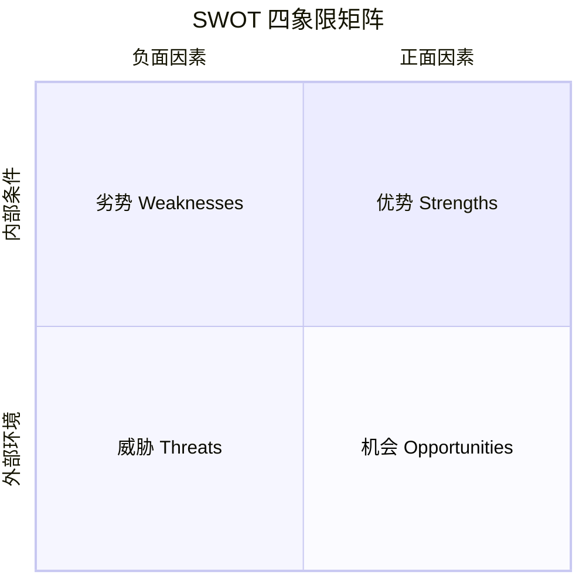
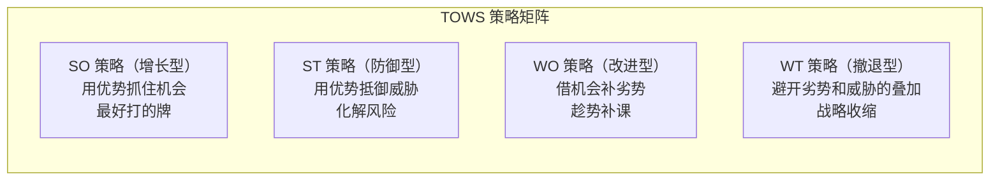
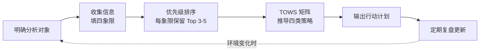

## SWOT 分析法：四个象限看清局势，做出更聪明的决策

作者：Artificer老王  |  更新时间：2026-08-02  |  阅读时长：约 16 分钟

现在你站在一个十字路口，你面临一系列选择。

要不要跳槽？

要不要上线那个新功能？

要不要把项目从单体拆成微服务？

要不要接那个看起来很香但工期很紧的外包？

脑子里一团浆糊。

这边有机会，那边有风险。

自己有优势，但也有短板。

每条路都有一堆理由支持和反对，越想越乱。

这时候你需要一把"梳子"，把脑子里缠成一团的线索按类别梳理清楚，让你一眼看清局势的全貌。

**SWOT 分析法**就是这把梳子。

它不替你做决定，但它能帮你把"我有什么、我缺什么、外界给了什么机会、外界有什么威胁"摊在桌面上，让你在一个结构化的框架里做判断，而不是凭直觉拍脑袋。

---

## 🔍 SWOT 是什么

### 定义

**SWOT 是一种结构化的局势分析框架，通过拆解内部优势（Strengths）、内部劣势（Weaknesses）、外部机会（Opportunities）和外部威胁（Threats）四个维度，帮助你全面审视当前处境，为决策提供系统性的信息输入。**

| 维度 | 英文 | 归属 | 核心问题 |
|------|------|------|---------|
| 优势 | （S）Strengths | 内部 | 我们擅长什么？有什么别人没有的资源？ |
| 劣势 | （W）Weaknesses | 内部 | 我们哪里不如别人？什么在拖后腿？ |
| 机会 | （O）Opportunities | 外部 | 外界正在发生什么对我们有利的变化？ |
| 威胁 | （T）Threats | 外部 | 外界有什么因素可能伤害我们？ |

两点重要说明：

- **内部 vs 外部**：优势和劣势是"你自己的事"，比如技能、资源、团队能力、品牌积累；机会和威胁是"外界的事"，比如市场趋势、政策变化、竞争对手动作、技术浪潮。你能改变内部，但只能应对外部。
- **正面 vs 负面**：优势和机会是"好事"，劣势和威胁是"坏事"。SWOT 不回避负面因素，而是把它们显性化，避免"只看好的一面"的乐观偏差。

### 四象限矩阵

SWOT 的精髓在于把这四个维度放进一个 2×2 的矩阵里，让你同时看到全局：

这张图想说的就一件事：**四个象限要同时看，找到它们之间的交叉点。不能只盯着优势，也不能只盯着风险。**

### 它从哪来

SWOT 诞生于 1960 年代，一般归功于斯坦福研究院的 Albert Humphrey。

他当时在研究为什么企业战略规划经常失败，在研究中他发现一个普遍问题：高管团队讨论战略时，各说各话、没有共同语言，要么过度乐观只谈机会，要么过度悲观只谈风险。

SWOT 的设计初衷就是给团队一个**共同的分析框架**。

所有人都从同样的四个维度切入，用同样的结构表达观点，讨论才有共同基础，不会变成鸡同鸭讲。

经过多年的实践，SWOT 已经从企业战略领域扩散到了个人职业规划、项目管理、产品决策、技术选型甚至个人生活决策中。

原因很简单：**任何需要"在不确定环境中做选择"的场景，都需要先搞清楚"我有什么、面对什么"。**

---

## 🎯 SWOT 能解决什么问题

先明确一件事：**SWOT 不直接给你答案，它给你的是做决策需要的"结构化信息"。** 

它的价值在于帮你看清当前局势的全貌，避免遗漏关键因素。

至于最终做什么，还得你自己判断。

SWOT 能帮你解决的问题大概有这么几类：

### 1. 决策前的局势盘点

做任何重要决策之前，你需要知道"我现在站在哪儿"。

SWOT 强制你从四个维度逐一审视，避免只看到一面而忽略另一面。

比如你要决定是否辞职创业，SWOT 会逼你同时想：我的技术优势是什么？我的资金劣势有多大？市场机会窗口还在不在？竞争威胁有多激烈？别只凭"我技术很牛"就热血上头。

### 2. 战略方向的初步筛选

当你面临多条路可选时，SWOT 帮你快速评估每条路的"适配度"：你的优势是否匹配这条路？你的劣势会不会成为致命瓶颈？这条路的机会和威胁分别是什么？

不需要每条路都做深度可行性研究，先用 SWOT 粗筛一轮，淘汰明显不匹配的，再对剩下的几条做深入分析。

### 3. 团队对齐认知

团队开会讨论战略，最怕的是"各想各的"。

有人只看到机会就喊冲，有人只看到风险就喊停。

SWOT 给所有人一个共同框架：先别急着下结论，每个人都从 S、W、O、T 四个维度列自己的观察，然后汇总到一张表上。

这样讨论的焦点从"要不要做"转移到"我们看到了什么"，减少情绪化争论。

### 4. 风险识别与预判

SWOT 的 Threats 象限专门用来识别外部威胁。

很多项目失败不是因为技术不行，而是因为没提前看到外部风险：竞品突然降价、政策突然收紧、供应链突然断裂。

SWOT 强制你专门花时间想"最坏情况是什么"，而不是只想着最好的剧本。

### 5. 个人职业规划

SWOT 不只给企业用。

个人做职业选择时同样适用：

- Strengths：我的核心技能是什么？什么能力让我有竞争力？
- Weaknesses：我缺什么技能或资源？什么短板在限制我？
- Opportunities：行业趋势在往哪走？哪些新兴领域有红利？
- Threats：我的岗位会不会被自动化？行业是否在萎缩？

下面这张表把 SWOT 能解决的问题类型做个汇总：

| 问题类型 | 典型场景 | SWOT 提供什么 |
|----------|---------|--------------|
| 战略决策 | 进不进新市场、要不要转型 | 四维度局势全貌，避免片面判断 |
| 方向选择 | 技术选型、职业方向、产品路线 | 各方向的适配度粗筛 |
| 团队对齐 | 战略会议、项目启动会 | 共同分析框架，减少各说各话 |
| 风险预判 | 项目立项、投资决策 | 威胁显性化，提前想应对方案 |
| 自我评估 | 职业规划、能力盘点 | 个人优劣势与外部环境交叉分析 |

---

## 🤔 什么时候该用 SWOT

这是最实际的问题。

面对一个具体问题，你怎么判断"这个该用 SWOT"还是"该用别的分析方法"？

### 判断标准：三个信号

如果一个决策场景同时满足以下三个条件，SWOT 就是一个合适的切入点：

**信号一：决策涉及"内部能力"和"外部环境"的交叉。**

如果你的问题纯粹是内部技术问题（比如"这段代码为什么有内存泄漏"），不需要 SWOT，直接调试就行。

如果纯粹是外部信息收集（比如"竞品的价格是多少"），也不需要，去调研就行。

SWOT 适合的是那种"我的能力和外部环境会怎么互动"的决策。

**信号二：信息不全，需要先摸底再深入。**

如果你对局势已经有很清晰的认知，直接做决策就行，不需要套框架。

SWOT 适合的是那种"感觉情况很复杂，但还没理清楚"的阶段。

用它做第一轮梳理，把模糊的直觉变成结构化的清单。

**信号三：需要多方参与讨论，且各方视角不同。**

如果是一个人的简单决策，脑子里过一遍就行。

但如果是团队决策，每个人看到的面不一样，需要统一认知基础，SWOT 的结构化框架就特别有用。

### SWOT 不适合的场景

反过来，以下场景就不要硬套 SWOT：

| 不适合的场景 | 为什么不适合 | 更合适的方法 |
|-------------|------------|------------|
| 纯技术问题排查 | 不涉及外部环境因素 | 直接调试、根因分析 |
| 纯数据驱动的决策 | 有足够数据直接算最优解 | 数据分析、A/B 测试 |
| 紧急故障响应 | 需要快速行动，没时间做分析 | 应急预案、SOP |
| 高度量化的优化问题 | SWOT 是定性分析，精度不够 | 数学建模、线性规划 |
| 单一明确的因果关系 | 原因和结果都很清楚 | 直接解决 |

### SWOT 与其他分析框架的关系

SWOT 不是万能的，它和其他分析框架是互补关系。

根据问题的侧重点选择合适的工具：

| 框架 | 侧重点 | 适合的场景 | 与 SWOT 的关系 |
|------|--------|----------|---------------|
| SWOT | 内部+外部综合盘点 | 决策前的局势摸底 | 基础框架，先做 |
| PEST | 外部宏观环境 | 市场/政策分析 | SWOT 的 O 和 T 可以从 PEST 分析中提取 |
| 波特五力 | 行业竞争结构 | 进入/退出某个行业 | 深化 SWOT 的 Threats 维度 |
| OKR | 目标设定与跟踪 | 执行层面 | SWOT 分析完之后用来落地行动 |
| 商业画布 | 商业模式设计 | 创业/产品设计 | 比 SWOT 更聚焦于商业模式本身 |

一个常见的组合用法：先用 SWOT 做全局盘点，再用 PEST 深挖外部环境，用波特五力分析行业竞争，最后用 OKR 把结论落地为行动计划。

---

## ⚠️ SWOT 的局限性

SWOT 好用，但别神化它。

用错了场景或用得太粗，反而会误导决策。

它本身就存在以下几个问题（可能还有其他的，但这里只说明几种最突出的）。

### 1. 主观性太强，容易自欺欺人

SWOT 的四个象限填什么、怎么填，完全依赖于分析者的认知和判断。

同一家公司，CEO 填的 SWOT 和基层工程师填的可能完全不同。

人天生就有"确认偏差"，倾向于找支持自己预设的证据，而忽略反面信息。

这样就导致想冲的人会把一切都写成机会，想稳的人把一切都写成威胁。

于是 SWOT 变成了"用结构化的方式合理化已经做好的决定"，因此谈不上真正的客观分析了。

**怎么应对呢？**

可以让不同角色、不同层级的人分别做 SWOT，然后交叉对比。

此时分歧最大的地方，往往是最需要深入讨论的地方。

### 2. 没有优先级，四个象限"平等"展示

SWOT 矩阵把 S、W、O、T 放在四个等大的格子里，视觉上暗示它们同等重要。

但现实中，一个致命威胁的权重可能远大于十个无关紧要的优势。

如果不做优先级排序，SWOT 会产生大量"看起来全面但没有重点"的信息。

**怎么应对呢？**

做完 SWOT 后，强制做一轮优先级排序。

每个象限只保留最重要的 3-5 条，其余删掉。

或者在每条后面标注影响程度（高/中/低）。

### 3. 静态快照，不反映动态变化

SWOT 是某一时刻的"截图"。

但市场、技术、竞争格局都在变，今天的优势可能明天就被颠覆，今天的威胁可能下个月就消失了。

如果你做完 SWOT 就把它锁进抽屉，三个月后它的参考价值会大打折扣。

**怎么应对呢？**

把 SWOT 当作活的文档，定期复盘更新。

关键决策点之前，先问一句"上次做的 SWOT 还有效吗？有什么变了？"

### 4. 只罗列不推导，不直接产出策略

SWOT 的产出是一张"因素清单"，不是一套"行动方案"。

很多团队做完 SWOT 就觉得"分析完了"，其实才走了一半。

从"看到了什么"到"该做什么"之间还有一个关键跳跃。

这个跳跃就是 **TOWS 矩阵**：把四个象限两两交叉，推导出具体策略。

后面实战案例会详细演示。

### 5. 容易混淆"内部"和"外部"

实践中最常见的错误是把外部因素错当内部因素，或反过来。

比如"行业人才短缺"，这对你的公司来说是外部威胁，但如果你的团队恰好不受影响，有人就会把它写成"我们没有人才短缺问题"放在优势里。

归属搞错了，后面的策略推导就会跑偏。

**怎么应对呢？**

填每一条时问自己一句："这个因素是我能改变的，还是我只能应对的？"能改变的是内部（S/W），只能应对的是外部（O/T）。

### 局限性速查表

| 局限 | 具体表现 | 应对方法 |
|------|---------|---------|
| 主观性强 | 不同人填出不同 SWOT | 多视角交叉对比 |
| 无优先级 | 四象限等大展示，看不出重点 | 每象限只保留 Top 3-5 |
| 静态快照 | 做完就过时 | 定期复盘更新 |
| 不产策略 | 只罗列因素，不推导行动 | 用 TOWS 矩阵推导策略 |
| 内外混淆 | 因素归属判断错误 | 每条问"能改变 vs 只能应对" |

---

## 🛠️ 如何运用 SWOT

完整的 SWOT 分析不止"画个 2×2 表格填四格"，它是一套多步骤的流程。

下面是标准流程（可以参考使用）。

### 第一步：明确分析对象

SWOT 必须有一个明确的分析对象。

不是"分析一下我们公司"，而是"分析我们公司是否应该进入东南亚市场"。

对象越具体，分析越聚焦。

❌ 错误示例："对公司的 SWOT 分析"（太宽泛，什么都往里塞）

✅ 正确示例："对公司在 2026 年是否应该将主打产品从 toC 转向 toB 的 SWOT 分析"

### 第二步：收集信息，填四象限

这一步是体力活。

从内部和外部两个方向收集信息，然后分类填入四个象限。

**内部因素（S/W）的信息来源：**
- 团队成员的自我评估
- 历史项目复盘数据
- 财务报表、资源清单
- 用户/客户反馈
- 技术审计报告

**外部因素（O/T）的信息来源：**
- 行业报告、市场调研
- 竞品分析
- 政策法规变化
- 技术趋势报告
- 客户需求变化信号

填写时的注意事项：

- **每条要具体**，不要写"技术能力强"，要写"在 Go 高并发服务端有 5 年经验，团队有 3 人精通性能调优"
- **每条可验证**，不要写"市场很大"，要写"目标市场规模约 50 亿，年增长率 15%"
- **每条有归属**，确认它是内部还是外部，不要混淆

### 第三步：优先级排序

填完四象限后，你会发现自己列了二三十条。

太多了。

于是要做一轮残酷的删减：

- 每个象限只保留最重要的 3-5 条
- 对每条标注影响程度：🔴 高影响 / 🟡 中影响 / 🟢 低影响
- 低影响的果断删掉

### 第四步：TOWS 矩阵，从因素到策略

这是最关键的一步，也是很多人跳过的一步。

SWOT 停在"因素清单"，TOWS 把因素两两交叉，推导出四类策略。

四种策略的思路如下：

| 策略类型 | 交叉维度 | 核心思路 | 一句话 |
|----------|---------|---------|--------|
| SO 增长型 | 优势 × 机会 | 用你的强项去抓外部机会 | 乘势而上 |
| ST 防御型 | 优势 × 威胁 | 用你的强项去化解外部威胁 | 以攻为守 |
| WO 改进型 | 劣势 × 机会 | 借外部机会弥补内部短板 | 趁势补课 |
| WT 撤退型 | 劣势 × 威胁 | 劣势遇上威胁时及时收缩 | 认怂保命 |

### 第五步：输出行动计划

把 TOWS 推导出的策略整理成具体的行动计划。

每条策略应该能回答：

- 做什么（具体行动）
- 谁来做（责任人）
- 什么时候做（时间节点）
- 怎么衡量成功（验收标准）

到这一步，SWOT 分析才真正落地为可执行的方案。

### 完整流程图

注意最后的虚线回环：SWOT 不是一次性的工作，环境变了就要重来。

---

## 📋 实战案例：独立开发者要不要把免费工具做成付费 SaaS

来看一个完整案例，把上面的流程走一遍。

### 背景

老张是一个独立开发者，写了一个免费的 Markdown 笔记工具，叫"速记"。

功能简洁、性能不错，靠口碑积累了约 2 万用户。

现在他在犹豫：要不要加一个云同步+协作功能，做成付费 SaaS（每月 19 元）？

### 第一步：明确分析对象

**分析对象：速记工具从免费转向付费 SaaS 模式的可行性。**

### 第二步：收集信息，填四象限

经过调研和自我评估，老张列出了以下因素：

**优势 Strengths（内部正面）：**
- 产品已有 2 万用户，核心功能稳定，口碑好
- 老张本人全栈能力强，前后端都能独立搞定
- 现有代码架构干净，加云同步模块的改造成本可控
- 无融资压力，可以慢节奏迭代，不用急着变现

**劣势 Weaknesses（内部负面）：**
- 一个人开发，带宽有限，加 SaaS 后运维和支持压力会陡增
- 没有运营和营销经验，不知道怎么把免费用户转化为付费用户
- 没有团队，一旦生病或想休息，产品就停摆
- 支付系统、数据安全合规等基础设施为零，需从零搭建

**机会 Opportunities（外部正面）：**
- 远程办公和知识管理工具市场持续增长，用户付费意愿在提升
- Notion、Obsidian 等竞品要么太重要么协作弱，轻量+本地优先的定位有空白
- 国内个人开发者生态在变好，支付、备案等基础设施门槛在降低
- AI 辅助写作是热门方向，可以作为差异化功能切入

**威胁 Threats（外部负面）：**
- 大厂随时可能推类似产品，免费+大流量可以直接碾压
- 数据安全和隐私合规要求越来越严，小团队合规成本高
- 用户对"又一个笔记工具"有审美疲劳，获客成本可能很高
- 经济下行期，用户对订阅制付费更敏感，转化率可能低于预期

### 第三步：优先级排序

删掉影响较低的条目，每象限保留最重要的几条，并标注影响程度：

| 象限 | 保留的关键因素 | 影响 |
|------|--------------|------|
| S | 2 万用户+口碑好；全栈能力强 | 🔴 高 |
| W | 一个人带宽有限；无支付/合规基础设施 | 🔴 高 |
| O | 轻量+本地优先定位有市场空白；AI 辅助写作是热门方向 | 🟡 中 |
| T | 大厂随时可能碾压；合规成本高 | 🔴 高 |

### 第四步：TOWS 矩阵推导策略

**SO 策略（用优势抓机会），乘势而上：**

用现有 2 万用户的口碑基础，加上全栈能力快速开发，率先抢占"轻量+本地优先+AI 辅助"的定位空白。

具体做法：先向现有用户群发问卷，测试付费意愿和期望功能，然后以最小可行版本（MVP）上线云同步+AI 辅助，定价从低开始。

**ST 策略（用优势抵御威胁），以攻为守：**

大厂的优势是流量和资源，但大厂产品往往臃肿、不够灵活。

老张的优势是轻量和快速迭代。策略是：把"轻量、快速、贴近用户"做到极致，建立大厂难以复制的社区粘性。

同时，把数据存储做成本地优先+可选云同步，降低合规风险（用户数据在本地，云同步是可选项）。

**WO 策略（借机会补劣势），趁势补课：**

支付和合规基础设施为零是硬伤，但可以从低风险方案切入：初期用第三方支付平台（如通过应用商店内购或现成的支付 SaaS），不自建支付系统。

合规方面，选择"用户数据本地存储为主"的架构，天然降低数据安全合规的复杂度。

AI 能力先调用第三方 API，不自建模型。

**WT 策略（避开劣势和威胁叠加），认怂保命：**

最坏的情况是：一个人搞 SaaS 运维+合规+支付+客服，同时大厂推出竞品碾压，直接硬扛会崩。

WT 策略是设定一条止损线：如果上线 6 个月付费转化率低于 3%，或出现无法承担的合规要求，就回退到纯免费+开源模式，把云同步功能做成可选插件交给社区维护。

不要赌上全部身家。

### 第五步：输出行动计划

| 优先级 | 行动 | 时间 | 衡量标准 |
|--------|------|------|---------|
| P0 | 向 2 万用户发付费意愿问卷 | 第 1-2 周 | 回收 500+ 份有效问卷 |
| P0 | 确定定价方案和支付方式（第三方） | 第 2-3 周 | 完成支付通道接入 |
| P1 | 开发云同步 MVP（本地优先+可选云同步） | 第 4-8 周 | 内测通过，10 人试用 |
| P1 | 接入 AI 辅助写作 API | 第 6-10 周 | 基础问答+摘要功能可用 |
| P2 | 公测+付费上线 | 第 12 周 | 首月付费转化率 ≥ 5% |
| P2 | 设定止损线并写入计划 | 上线时 | 6 个月转化率 < 3% 则回退 |

### 案例复盘

这个案例走完了 SWOT 从"因素清单"到"行动计划"的完整链路。

这里有几个关键点：

- **SO 策略是最该优先做的**。你的优势和外部机会的交叉点，就是投入产出比最高的方向。
- **WT 策略别觉得消极**。提前想好"最坏情况下怎么撤退"，恰恰是让你敢于往前冲的底气。
- **WO 策略解决"想干但缺能力"的问题**。别等能力补齐了再干，借外部机会的势，用低成本方案快速补课。
- **SWOT 的真正价值在 TOWS**。光列出"优势、劣势、机会、威胁"只是信息整理，把它们两两交叉推导策略，才是分析。

---

## 📌 总结

- **SWOT 是什么**：一个从优势、劣势、机会、威胁四个维度审视局势的结构化分析框架，帮你把模糊直觉变成清晰清单。核心区分是内部（S/W）vs 外部（O/T），正面（S/O）vs 负面（W/T）。

- **能解决什么**：决策前的局势盘点、战略方向的初步筛选、团队认知对齐、风险识别预判、个人职业规划。注意它提供的是"结构化信息输入"，不是直接答案。

- **什么时候用**：当问题涉及内部能力与外部环境的交叉、信息不全需要先摸底、需要多方参与讨论时。纯技术排查、纯数据驱动、紧急故障等场景不适合。

- **局限性**：主观性强、无优先级、静态快照、不直接产策略、容易混淆内外。应对方法分别是多视角交叉、每象限保留 Top 3-5、定期复盘、用 TOWS 推导策略、每条确认归属。

- **怎么用**：五步走，明确分析对象 → 收集信息填四象限 → 优先级排序 → TOWS 矩阵推导策略 → 输出行动计划。关键在第四步 TOWS，把因素两两交叉（SO 乘势而上、ST 以攻为守、WO 趁势补课、WT 认怂保命），从"看到了什么"跳到"该做什么"。

- **实战要点**：分析对象要具体而非泛泛；每条因素要具体、可验证、归属明确；SO 策略优先做（投入产出比最高）；WT 策略提前定（止损线是前进的底气）；SWOT 是活文档，环境变了就更新。

SWOT 不是终点，是起点。

它能帮你看清局势，但走哪条路、走多快、什么时候转向，还是得你自己判断。

框架替代不了判断力，但有了框架，你的判断至少不会漏掉半个象限。

---

本文首发于公众号 **Artificer老王的学习笔记**，转载请注明出处。
